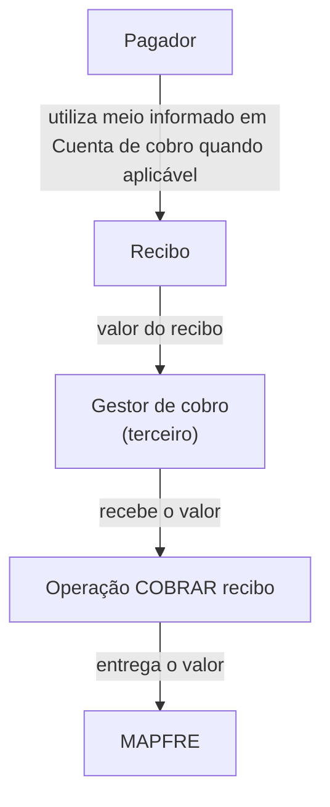
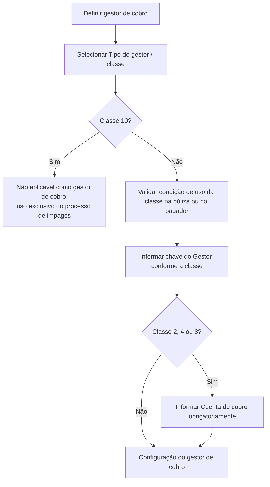

# Gestor de Cobro — Especificação Funcional para Gestão de Cobrança de Recibos

## 1. Metadados do Documento
- **Arquivo de Origem:** Não identificado no conteúdo fornecido
- **Tipo de Documento:** Especificação Técnica
- **Domínio / Sistema:** Gestão de cobrança de recibos MAPFRE
- **Público-Alvo:** Desenvolvedores, Arquitetos, Operação e Negócio
- **Data/Versão Identificada:** Não identificada

---

## 2. Resumo Executivo & Contexto de Negócio

O documento descreve a funcionalidade **Gestor Cobro**, destinada a indicar o gestor de cobrança associado a um recibo. O gestor de cobrança é um terceiro responsável por receber o valor do recibo e entregá-lo à MAPFRE por meio da operação **COBRAR recibo**.

A especificação lista as ações possíveis de criação, modificação e exclusão do gestor de cobrança. O texto fornecido não detalha os fluxos de interface, autorizações, mensagens de erro, contratos de API ou efeitos transacionais dessas ações.

A definição do gestor depende de um **tipo de gestor**, classificado por uma classe numérica. Cada classe determina tanto as condições em que pode ser utilizada em uma apólice quanto a natureza da chave do terceiro que deve ser informada no campo **Gestor**.

Em determinados tipos de gestor, também é obrigatório informar uma **Cuenta de cobro**. Essa propriedade determina o meio de cobrança ou pagamento do pagador que sofrerá o débito dos recibos quando estes entrarem em vigor.

---

## 3. Arquitetura, Componentes & Tecnologias Envolvidas

O conteúdo fornecido não descreve arquitetura de software, microsserviços, tecnologias, bancos de dados, integrações técnicas, URLs, ambientes ou protocolos. A relação funcional explícita envolve o pagador, o gestor de cobrança, a operação **COBRAR recibo** e a MAPFRE.



### Componentes e conceitos identificados

| Componente / Termo | Papel descrito |
| :--- | :--- |
| Gestor de cobro | Terceiro encarregado de receber o valor do recibo e entregá-lo à MAPFRE. |
| Recibo | Documento ou cobrança cujo valor é recebido pelo gestor de cobrança. |
| Operação COBRAR recibo | Operação mencionada como mecanismo pelo qual o gestor entrega o valor à MAPFRE. |
| MAPFRE | Destinatária final do valor do recibo entregue pelo gestor de cobrança. |
| Pagador | Parte para a qual pode ser realizado o débito correspondente aos recibos. |
| Póliza | Elemento cujas características podem condicionar a possibilidade de uso de determinadas classes de gestor. |
| Cuenta de cobro | Meio de cobrança ou pagamento utilizado pelo pagador para o débito dos recibos quando entram em vigor. |

> **Nota de Análise:** O documento não detalha métodos HTTP, contratos JSON, persistência de dados, autenticação, integrações técnicas ou comportamento da operação **COBRAR recibo**.

---

## 4. Regras de Negócio, Especificações Funcionais & Processos

### 4.1 Finalidade do Gestor de Cobrança

1. O **gestor de cobro** é um terceiro.
2. O terceiro gestor de cobrança recebe o valor do recibo.
3. O terceiro gestor de cobrança entrega o valor à MAPFRE.
4. A entrega à MAPFRE é realizada mediante a operação **COBRAR recibo**.

### 4.2 Ações possíveis

O documento lista as seguintes ações possíveis para a funcionalidade Gestor Cobro:

- **CREAR**
- **MODIFICAR**
- **BORRAR**

> **Nota de Análise:** O texto apresenta as ações entre parênteses vazios e não informa pré-condições, permissões, validações, efeitos de negócio ou critérios para criação, modificação e exclusão.

### 4.3 Regra para o campo Tipo de gestor

A propriedade **Tipo de gestor** contém a classificação que determina o tipo de terceiro encarregado da gestão da cobrança dos recibos.

Cada tipo de gestor está associado a uma classe de gestor. A classe define as características que a apólice deve possuir para utilizar aquele tipo de gestor.

### 4.4 Regras de utilização por classe de gestor

- A classe **1 — AGENTE** pode ser utilizada sempre.
- A classe **2 — BANCO** pode ser utilizada quando o pagador possuir conta bancária.
- A classe **3 — COBRADOR** pode ser utilizada quando essa figura estiver definida na companhia.
- A classe **4 — DÉBITO AUTOMÁTICO EN CUENTA** pode ser utilizada quando o pagador possuir conta bancária.
- A classe **5 — GESTOR DIRECTO** pode ser utilizada sempre.
- A classe **6 — GESTOR PILOTO COASEGURO** pode ser utilizada quando a apólice for de cosseguro aceito.
- A classe **7 — OFICINA COMERCIAL** pode ser utilizada sempre.
- A classe **8 — DÉBITO CON TARJETA DE CRÉDITO** pode ser utilizada quando o pagador possuir cartão de crédito.
- A classe **10 — GESTOR DE IMPAGOS** nunca pode ser utilizada como gestor de cobrança, pois é exclusiva do processo de inadimplência.

### 4.5 Regra para o campo Gestor

O campo **Gestor** deve conter a chave do terceiro que atuará como gestor. A chave exigida depende da classe de gestor selecionada.

| Classe | Descrição | Chave que deve ser associada |
| :--- | :--- | :--- |
| 1 | AGENTE | Chave do agente principal da apólice. |
| 2 | BANCO | Entidade junto com a agência bancária do terceiro responsável por cobrar os recibos para a MAPFRE. |
| 3 | COBRADOR | Chave do cobrador que se encarrega de recolher os valores dos recibos. |
| 4 | DÉBITO AUTOMÁTICO EN CUENTA | Entidade junto com a agência bancária do terceiro responsável por cobrar os recibos para a MAPFRE. |
| 5 | GESTOR DIRECTO | Escritório MAPFRE, correspondente ao terceiro nível da estrutura comercial. |
| 6 | GESTOR PILOTO COASEGURO | Entidade seguradora que atua como líder na apólice. |
| 7 | OFICINA COMERCIAL | Escritório MAPFRE, correspondente ao terceiro nível da estrutura comercial. |
| 8 | DÉBITO CON TARJETA DE CRÉDITO | Entidade junto com a agência bancária do terceiro responsável por cobrar os recibos para a MAPFRE. |
| 10 | GESTOR DE IMPAGOS | Não se aplica. |

### 4.6 Regra para o campo Cuenta de cobro

A propriedade **Cuenta de cobro** especifica o meio de cobrança ou pagamento que o pagador utilizará. Esse é o meio ao qual será realizado o débito correspondente aos recibos quando os recibos entrarem em vigor.

A propriedade **Cuenta de cobro** é obrigatória nas seguintes classes de gestor:

- **2 — BANCO**
- **4 — DÉBITO AUTOMÁTICO EN CUENTA**
- **8 — DÉBITO CON TARJETA DE CRÉDITO**



---

## 5. Tabelas de Parâmetros, Ambientes e Estruturas de Dados

### 5.1 Campos funcionais identificados

| Item / Parâmetro | Descrição / Função | Tipo / Valores / Formato | Ambiente / Observações |
| :--- | :--- | :--- | :--- |
| Tipo de gestor | Contém a classificação que determina o tipo de terceiro encarregado da gestão de cobrança dos recibos. | Classes 1, 2, 3, 4, 5, 6, 7, 8 ou 10. | Cada classe possui condições específicas de utilização. |
| Gestor | Informa a chave do terceiro que atuará como gestor de cobrança. | Chave variável conforme a classe selecionada. | A natureza da chave é definida pela classe do gestor. |
| Cuenta de cobro | Especifica o meio de cobrança ou pagamento utilizado pelo pagador para o débito dos recibos quando entram em vigor. | Não especificado. | Obrigatória para as classes 2, 4 e 8. |
| Operação COBRAR recibo | Operação pela qual o gestor entrega à MAPFRE o valor recebido do recibo. | Não especificado. | Não há detalhamento de interface, contrato ou processamento. |

### 5.2 Classes de gestor e condições de utilização

| Item / Parâmetro | Descrição / Função | Tipo / Valores / Formato | Ambiente / Observações |
| :--- | :--- | :--- | :--- |
| Classe 1 | AGENTE | Classe de gestor. | Pode ser utilizada sempre. |
| Classe 2 | BANCO | Classe de gestor. | Pode ser utilizada quando o pagador dispuser de conta bancária. |
| Classe 3 | COBRADOR | Classe de gestor. | Pode ser utilizada quando essa figura estiver definida na companhia. |
| Classe 4 | DÉBITO AUTOMÁTICO EN CUENTA | Classe de gestor. | Pode ser utilizada quando o pagador dispuser de conta bancária. |
| Classe 5 | GESTOR DIRECTO | Classe de gestor. | Pode ser utilizada sempre. |
| Classe 6 | GESTOR PILOTO COASEGURO | Classe de gestor. | Pode ser utilizada quando a apólice for de cosseguro aceito. |
| Classe 7 | OFICINA COMERCIAL | Classe de gestor. | Pode ser utilizada sempre. |
| Classe 8 | DÉBITO CON TARJETA DE CRÉDITO | Classe de gestor. | Pode ser utilizada quando o pagador dispuser de cartão de crédito. |
| Classe 10 | GESTOR DE IMPAGOS | Classe de gestor. | Nunca pode ser utilizada; é exclusiva do processo de inadimplência. |

### 5.3 Obrigatoriedade da Cuenta de cobro

| Item / Parâmetro | Descrição / Função | Tipo / Valores / Formato | Ambiente / Observações |
| :--- | :--- | :--- | :--- |
| Cuenta de cobro para classe 2 | Meio de cobrança ou pagamento do pagador. | Obrigatória. | Classe BANCO. |
| Cuenta de cobro para classe 4 | Meio de cobrança ou pagamento do pagador. | Obrigatória. | Classe DÉBITO AUTOMÁTICO EN CUENTA. |
| Cuenta de cobro para classe 8 | Meio de cobrança ou pagamento do pagador. | Obrigatória. | Classe DÉBITO CON TARJETA DE CRÉDITO. |

---

## 6. Bateria de Perguntas & Respostas para RAG (FAQ Sintético)

### P1: O que é um gestor de cobro no contexto da gestão de recibos?
**R:** Um gestor de cobro é um terceiro encarregado de receber o valor de um recibo e entregá-lo à MAPFRE mediante a operação **COBRAR recibo**.

### P2: Quais ações estão listadas para a funcionalidade Gestor Cobro?
**R:** O documento lista as ações **CREAR**, **MODIFICAR** e **BORRAR**. O conteúdo não detalha os critérios, permissões, validações ou efeitos dessas ações.

### P3: Para que serve o campo Tipo de gestor?
**R:** O campo Tipo de gestor contém a classificação que determina o tipo de terceiro encarregado da gestão da cobrança dos recibos. Cada tipo está associado a uma classe de gestor, e essa classe determina as características que a apólice precisa possuir para utilizar o gestor.

### P4: Quando a classe BANCO pode ser utilizada como gestor de cobrança?
**R:** A classe **2 — BANCO** pode ser utilizada sempre que o pagador dispuser de conta bancária.

### P5: Que chave deve ser informada no campo Gestor para a classe AGENTE?
**R:** Para a classe **1 — AGENTE**, o campo Gestor deve receber a chave do agente principal da apólice.

### P6: Qual chave deve ser associada à classe GESTOR DIRECTO?
**R:** Para a classe **5 — GESTOR DIRECTO**, a chave associada deve ser um escritório MAPFRE correspondente ao terceiro nível da estrutura comercial.

### P7: Em quais classes a Cuenta de cobro é obrigatória?
**R:** A propriedade Cuenta de cobro é obrigatória para as classes **2 — BANCO**, **4 — DÉBITO AUTOMÁTICO EN CUENTA** e **8 — DÉBITO CON TARJETA DE CRÉDITO**.

### P8: O que representa a Cuenta de cobro?
**R:** A Cuenta de cobro especifica o meio de cobrança ou pagamento utilizado pelo pagador. Esse meio recebe o débito correspondente aos recibos quando os recibos entram em vigor.

### P9: A classe GESTOR DE IMPAGOS pode ser selecionada como gestor de cobrança?
**R:** Não. A classe **10 — GESTOR DE IMPAGOS** nunca pode ser utilizada como gestor de cobrança, pois é exclusiva do processo de inadimplência.

### P10: Quando a classe GESTOR PILOTO COASEGURO pode ser utilizada?
**R:** A classe **6 — GESTOR PILOTO COASEGURO** pode ser utilizada sempre que a apólice for de cosseguro aceito. O gestor associado é a entidade seguradora que atua como líder na apólice.

### P11: Qual é a condição de uso da classe COBRADOR?
**R:** A classe **3 — COBRADOR** pode ser utilizada sempre que essa figura estiver definida na companhia. A chave associada deve corresponder ao cobrador encarregado de recolher os valores dos recibos.

### P12: O documento informa como ocorre tecnicamente a operação COBRAR recibo?
**R:** Não. O documento apenas afirma que o gestor de cobrança entrega à MAPFRE o valor do recibo mediante a operação COBRAR recibo; não há detalhamento de interface, métodos, contratos, formatos de dados ou processamento técnico.

---

## 7. Glossário de Termos, Siglas & Conceitos-Chave

- **AGENTE:** Classe 1 de gestor. A chave associada é a do agente principal da apólice.
- **BANCO:** Classe 2 de gestor. Pode ser utilizada quando o pagador possui conta bancária.
- **COBRADOR:** Classe 3 de gestor. Figura encarregada de recolher os valores dos recibos, quando definida na companhia.
- **COBRAR recibo:** Operação mencionada para a entrega à MAPFRE do valor recebido pelo gestor de cobrança.
- **Cuenta de cobro:** Meio de cobrança ou pagamento utilizado pelo pagador para o débito de recibos quando estes entram em vigor.
- **DÉBITO AUTOMÁTICO EN CUENTA:** Classe 4 de gestor, utilizável quando o pagador dispõe de conta bancária.
- **DÉBITO CON TARJETA DE CRÉDITO:** Classe 8 de gestor, utilizável quando o pagador dispõe de cartão de crédito.
- **GESTOR DE IMPAGOS:** Classe 10 exclusiva do processo de inadimplência; não pode ser usada como gestor de cobrança.
- **GESTOR DIRECTO:** Classe 5 de gestor. A chave associada é um escritório MAPFRE do terceiro nível da estrutura comercial.
- **GESTOR PILOTO COASEGURO:** Classe 6 de gestor. A chave associada é a entidade seguradora líder em uma apólice de cosseguro aceito.
- **Gestor de cobro:** Terceiro que recebe o valor do recibo e o entrega à MAPFRE.
- **MAPFRE:** Organização destinatária do valor do recibo entregue pelo gestor de cobrança.
- **OFICINA COMERCIAL:** Classe 7 de gestor. A chave associada é um escritório MAPFRE do terceiro nível da estrutura comercial.
- **Pagador:** Parte cujo meio de cobrança ou pagamento pode ser utilizado para o débito dos recibos.
- **Póliza:** Apólice cujas características podem ser exigidas para utilização de determinadas classes de gestor.

---

## 8. Notas Críticas, Riscos & Limitações

- O documento não identifica arquivo de origem, versão, data, autor ou responsável pela especificação.
- Não há descrição de arquitetura de aplicação, ambientes, URLs, servidores, logs, APIs, integrações, bancos de dados ou mecanismos de autenticação.
- O documento não define o formato, estrutura ou validação técnica da chave do campo **Gestor**.
- O documento não especifica o formato da **Cuenta de cobro**, embora determine sua obrigatoriedade para as classes 2, 4 e 8.
- As ações **CREAR**, **MODIFICAR** e **BORRAR** são listadas sem regras de autorização, pré-condições, pós-condições ou tratamento de erro.
- A operação **COBRAR recibo** é citada, mas seu contrato funcional e técnico não é detalhado.
- A classe **GESTOR DE IMPAGOS** possui restrição explícita: é exclusiva do processo de inadimplência e não deve ser utilizada como gestor de cobrança.

---

## 9. Conteúdo Bruto Estruturado (Referência Fiel)

```text
--- [PÁGINA 1 DE 3] ---

EN CONSTRUCCIÓN
GESTOR COBRO
En que consiste
Permite indicar el gestor de cobro, que es un tercero que se encargará de recibir el importe del recibo
y entregarlo a MAPFRE mediante la operación COBRAR recibo.
Posibles acciones
 CREAR ( )
 MODIFICAR ( )
 BORRAR ( )
Proceso a seguir
A continuación se detalla la información requerida.
Tipo de gestor (   )
Esta propiedad contiene la clasificación que determina el tipo de tercero encargado de la gestión del
cobro de los recibos.
 / 
 RS
Inicio Soluciones APIs Documentación Zeus
ES


--- [PÁGINA 2 DE 3] ---

Cada tipo de gestor tiene asociado un tipo de clase de gestor. Este tipo determina que características
debe tener la póliza para poder utilizarlo como gestor de cobro.
CLASE DESCRIPCIÓN EN QUE CASO PUEDE UTILIZARSE
1 AGENTE Siempre
2 BANCO Siempre que el pagador disponga de cuenta
bancaria
3 COBRADOR Siempre que exista esta figura definida en la
compañía
4 DÉBITO AUTOMÁTICO EN
CUENTA
Siempre que el pagador disponga de cuenta
bancaria
5 GESTOR DIRECTO Siempre
6 GESTOR PILOTO
COASEGURO
Siempre que la póliza sea de coaseguro
aceptado
7 OFICINA COMERCIAL Siempre
8 DÉBITO CON TARJETA DE
CRÉDITO
Siempre que el pagador disponga de una
tarjeta de crédito
10 GESTOR DE IMPAGOS Nunca. Este tipo de exclusivo del proceso de
impagos
Gestor (   )
En este campo se indica la clave del tercero que actuará como gestor atendiendo al tipo de clase de
gestor. Es decir:
CLASE DESCRIPCIÓN CLAVE QUE SE ASOCIA
1 AGENTE clave del agente principal de la póliza
2 BANCO Entidad junto a la oficina bancaria del tercero que
se encarga de cobrar los recibos para MAPFRE


--- [PÁGINA 3 DE 3] ---

CLASE DESCRIPCIÓN CLAVE QUE SE ASOCIA
3 COBRADOR Corresponde a la del cobrador que se encargará
de recolectar los importes de los recibos
4 DÉBITO AUTOMÁTICO
EN CUENTA
Entidad junto a la oficina bancaria del tercero que
se encarga de cobrar los recibos para MAPFRE
5 GESTOR DIRECTO Oficina MAPFRE (tercer nivel de la estructura
comercial)
6 GESTOR PILOTO
COASEGURO
Entidad aseguradora que actúa como líder en la
póliza
7 OFICINA COMERCIAL Oficina MAPFRE (tercer nivel de la estructura
comercial)
8 DÉBITO CON TARJETA
DE CRÉDITO
Entidad junto a la oficina bancaria del tercero que
se encarga de cobrar los recibos para MAPFRE
10 GESTOR DE IMPAGOS No aplica
Cuenta de cobro (   )
En esta propiedad se especifica el medio de cobro o pago que va a utilizar el pagador, al que se le
realizará el cargo correspondiente a los recibos, cuando estos entren en efecto.
Esta propiedad es obligatoria cuando el gestor de cobro es:
CLASE DESCRIPCIÓN
2 BANCO
4 DÉBITO AUTOMÁTICO EN CUENTA
8 DÉBITO CON TARJETA DE CRÉDITO
```
