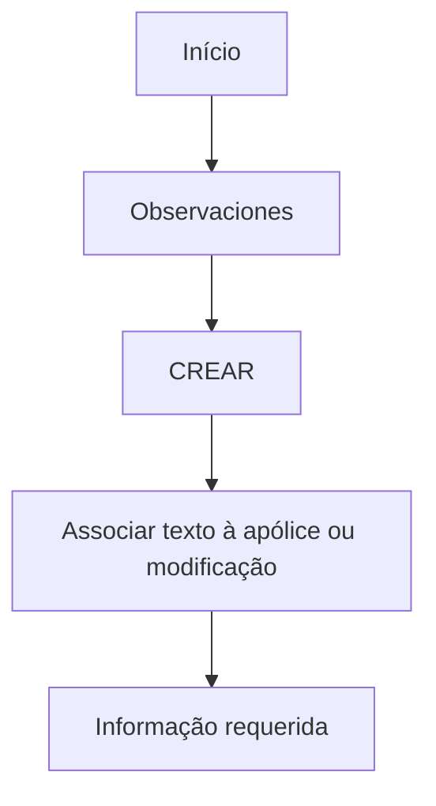

# Observaciones — Inclusão de Comentários em Apólice ou Modificação

## 1. Metadados do Documento
- **Arquivo de Origem:** Não identificado no conteúdo fornecido
- **Tipo de Documento:** Procedimento
- **Domínio / Sistema:** Apólice e modificação; referências a Soluciones, APIs, Documentación e Zeus
- **Público-Alvo:** Usuários responsáveis por criar ou alterar apólices/modificações
- **Data/Versão Identificada:** Não identificada

---

## 2. Resumo Executivo & Contexto de Negócio

O conteúdo descreve a funcionalidade **Observaciones**, destinada à inclusão de comentários associados a uma apólice ou a uma modificação em andamento. A propriedade permite registrar o texto que o usuário deseja vincular ao contexto da apólice ou da modificação.

A ação explicitamente indicada para a funcionalidade é **CREAR**. O documento também informa que existe um processo a seguir e que, em seguida, é detalhada a informação requerida, porém não apresenta o detalhamento completo desse processo no conteúdo fornecido.

O material contém referências de navegação ou contexto para “Inicio”, “Soluciones”, “APIs”, “Documentación” e “Zeus”. Não há descrição suficiente para determinar se esses termos são módulos, menus, sistemas independentes ou ambientes.

Não são especificados contratos de API, métodos HTTP, formatos de payload, validações, limites de tamanho, permissões, persistência ou comportamento de edição/exclusão das observações.

---

## 3. Arquitetura, Componentes & Tecnologias Envolvidas

Os elementos identificados no conteúdo são:

| Componente / Termo | Papel identificado |
| :--- | :--- |
| Observaciones | Propriedade para associar texto a uma apólice ou modificação |
| Apólice | Entidade à qual um comentário pode ser associado |
| Modificação | Entidade ou processo à qual um comentário pode ser associado |
| CREAR | Ação possível explicitamente indicada |
| Soluciones | Referência apresentada no conteúdo, sem detalhamento |
| APIs | Referência apresentada no conteúdo, sem detalhamento |
| Documentación | Referência apresentada no conteúdo, sem detalhamento |
| Zeus | Referência apresentada no conteúdo, sem detalhamento |



> **Nota de Análise:** O diagrama representa somente a sequência mínima inferível do texto. O documento não descreve arquitetura de software, integrações, microsserviços, tecnologias, bancos de dados ou contratos de API.

---

## 4. Regras de Negócio, Especificações Funcionais & Processos

1. A funcionalidade **Observaciones** permite incluir qualquer comentário associado à apólice ou à modificação que está sendo realizada.
2. A propriedade **Observaciones** especifica o texto que se deseja associar à apólice ou à modificação.
3. A ação possível indicada no documento é **CREAR**.
4. O documento menciona um processo a seguir e informa que a informação requerida é detalhada posteriormente.
5. O conteúdo disponibilizado não apresenta os campos requeridos, regras de validação, obrigatoriedade, formato textual, limite de caracteres ou resultado esperado após a criação.

---

## 5. Tabelas de Parâmetros, Ambientes e Estruturas de Dados

| Item / Parâmetro | Descrição / Função | Tipo / Valores / Formato | Ambiente / Observações |
| :--- | :--- | :--- | :--- |
| Observaciones | Permite incluir um comentário associado a uma apólice ou modificação | Texto; formato não especificado | Não são detalhadas validações ou limites |
| CREAR | Ação possível para a funcionalidade Observaciones | Ação | Não são descritas etapas de confirmação ou retorno |
| Apólice | Objeto de negócio que pode receber o texto associado | Não especificado | Pode estar em criação ou modificação |
| Modificação | Contexto de alteração que pode receber o texto associado | Não especificado | Não são descritos tipos de modificação |
| Inicio | Referência apresentada no conteúdo | Não especificado | Possível item de navegação; não confirmado |
| Soluciones | Referência apresentada no conteúdo | Não especificado | Sem detalhamento adicional |
| APIs | Referência apresentada no conteúdo | Não especificado | Não há endpoints, métodos ou contratos |
| Documentación | Referência apresentada no conteúdo | Não especificado | Sem detalhamento adicional |
| Zeus | Referência apresentada no conteúdo | Não especificado | Sem detalhamento adicional |

---

## 6. Bateria de Perguntas & Respostas para RAG (FAQ Sintético)

### P1: Qual é a finalidade da propriedade Observaciones?
**R:** A propriedade **Observaciones** permite incluir qualquer comentário associado à apólice ou à modificação que está sendo realizada.

### P2: Que informação deve ser especificada em Observaciones?
**R:** Em **Observaciones** deve ser especificado o texto que se deseja associar à apólice ou à modificação.

### P3: Qual ação é indicada para a funcionalidade Observaciones?
**R:** A ação indicada no documento para a funcionalidade Observaciones é **CREAR**.

### P4: Observaciones pode ser associada apenas a uma apólice?
**R:** Não. O texto afirma que Observaciones pode ser associada tanto a uma **apólice** quanto a uma **modificação** que esteja sendo realizada.

### P5: O documento informa o formato do texto de Observaciones?
**R:** Não. O documento informa apenas que a propriedade contém o texto a ser associado à apólice ou modificação; não define formato, tamanho máximo ou regras de validação.

### P6: O documento define endpoints ou métodos HTTP para criar Observaciones?
**R:** Não. Apesar de mencionar “APIs”, o conteúdo não detalha endpoints, métodos HTTP, payloads JSON, autenticação ou respostas técnicas.

### P7: Existe um processo para utilizar Observaciones?
**R:** Sim. O texto menciona “Proceso a seguir” e indica que a informação requerida é detalhada a seguir. Entretanto, o conteúdo fornecido não contém as etapas completas do processo.

### P8: O que significa CREAR no contexto apresentado?
**R:** **CREAR** é a ação possível explicitamente listada para a funcionalidade Observaciones. O documento não explica seus campos de entrada, condições de sucesso ou efeitos posteriores.

### P9: O documento descreve permissões para criar comentários?
**R:** Não. Não há informações sobre perfis, papéis, permissões ou controles de acesso para a ação CREAR.

### P10: Zeus é descrito como um sistema integrado à funcionalidade Observaciones?
**R:** Não é possível afirmar isso. “Zeus” aparece como referência no conteúdo, mas não há explicação sobre sua função, integração ou relação técnica com Observaciones.

---

## 7. Glossário de Termos, Siglas & Conceitos-Chave

- **Observaciones:** Propriedade utilizada para especificar o texto associado a uma apólice ou modificação.
- **Apólice:** Entidade de negócio mencionada como destinatária de comentários.
- **Modificação:** Alteração em realização que também pode receber comentários.
- **CREAR:** Ação possível listada para Observaciones.
- **APIs:** Termo apresentado no conteúdo sem especificação de interfaces ou contratos.
- **Zeus:** Termo apresentado no conteúdo sem definição funcional ou técnica.

---

## 8. Notas Críticas, Riscos & Limitações

- O arquivo de origem, data, versão e autoria não foram identificados no conteúdo fornecido.
- Não há detalhamento dos campos necessários para a ação **CREAR**.
- Não há regras de validação, obrigatoriedade, limites de texto, mensagens de erro ou critérios de sucesso.
- Não há descrição de autenticação, autorização, trilha de auditoria ou perfis habilitados.
- As referências a **Soluciones**, **APIs**, **Documentación** e **Zeus** não possuem contexto suficiente para estabelecer relações arquiteturais.
- **Nota de Análise:** O conteúdo lista a funcionalidade Observaciones, porém não detalha métodos HTTP, contratos JSON, persistência de dados ou comportamento operacional após a criação.

---

## 9. Conteúdo Bruto Estruturado (Referência Fiel)

```text
--- [PÁGINA 1 DE 2] ---

EN CONSTRUCCIÓN
OBSERVACIONES
En que consiste
Permite incluir cualquier comentario asociado a la póliza o modificación que se esté realizando.
Posibles acciones
 CREAR ( )
Proceso a seguir
A continuación se detalla la información requerida.
 / 
 RS
Inicio Soluciones APIs Documentación Zeus
ES


--- [PÁGINA 2 DE 2] ---

Observaciones ( )
En esta propiedad se especifica el texto que se quiera asociar a la póliza o modificación.
```
