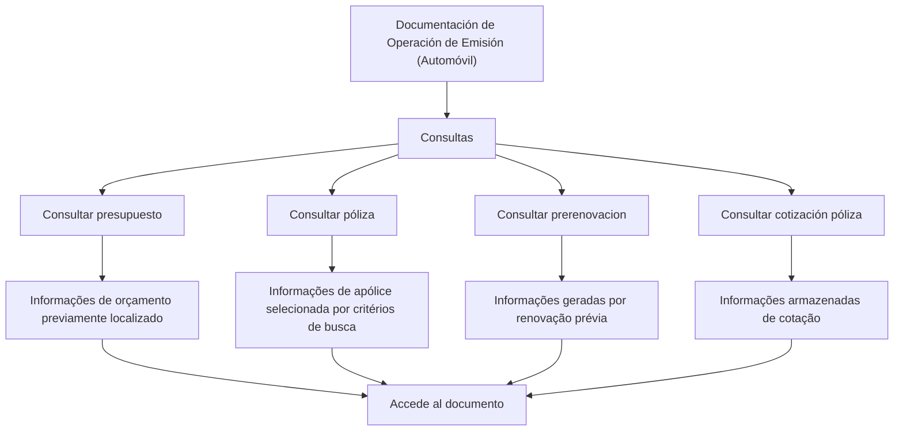

# Documentação de Operação de Emissão (Automóvel) — Consultas

## 1. Metadados do Documento
- **Arquivo de Origem:** Não identificado
- **Tipo de Documento:** Manual Operacional
- **Domínio / Sistema:** Emissão de Automóvel — Consultas
- **Público-Alvo:** Operação, Negócio e usuários responsáveis por consulta de documentos
- **Data/Versão Identificada:** Não identificada

---

## 2. Resumo Executivo & Contexto de Negócio

O documento apresenta opções de consulta relacionadas ao processo de emissão para o domínio de automóvel. O conteúdo está organizado como documentação operacional e descreve quatro tipos de consulta: orçamento, apólice, pré-renovação e cotação de apólice.

Cada opção permite acessar informações previamente registradas, mediante localização ou seleção baseada em critérios de busca. O documento indica repetidamente a ação “Accede al documento”, sugerindo que cada modalidade de consulta direciona para um documento ou detalhe correspondente.

A consulta de orçamento recupera informações de um orçamento previamente localizado. A consulta de apólice disponibiliza dados de uma apólice após seleção por critérios de busca. A consulta de pré-renovação permite acessar informações geradas por uma renovação anterior, enquanto a consulta de cotação de apólice recupera informações armazenadas relativas a uma cotação.

O material não descreve telas, campos de busca, critérios específicos, URLs funcionais, permissões, métodos HTTP, contratos de integração ou regras de validação. Portanto, o escopo disponível limita-se às finalidades declaradas para cada modalidade de consulta.

---

## 3. Arquitetura, Componentes & Tecnologias Envolvidas

O documento cita uma área de documentação para operação de emissão de automóvel e apresenta quatro opções funcionais de consulta:

- **Consultar orçamento**
- **Consultar apólice**
- **Consultar pré-renovação**
- **Consultar cotação de apólice**

Também são exibidos os termos de navegação ou contexto: **Inicio**, **Soluciones**, **APIs**, **Documentación**, **Zeus**, **ES** e **RS**. O material não especifica a função técnica de Zeus, APIs, RS ou Soluciones.



> **Nota de Análise:** O documento apresenta opções funcionais de consulta, mas não detalha os componentes técnicos, APIs, métodos HTTP, contratos JSON, bancos de dados, ambientes ou integrações envolvidos.

---

## 4. Regras de Negócio, Especificações Funcionais & Processos

### 4.1 Consultar orçamento

A opção **CONSULTAR presupuesto** exibe informações relacionadas a um orçamento.

Condições explicitamente descritas:

1. O orçamento deve ser previamente localizado.
2. A localização pode ocorrer mediante distintos critérios de busca.
3. Após a localização do orçamento, o usuário pode acessar o documento correspondente.

### 4.2 Consultar apólice

A opção **CONSULTAR póliza** permite acesso às informações de uma apólice.

Condições explicitamente descritas:

1. A apólice deve ser selecionada previamente.
2. A seleção é facilitada por distintos critérios de busca.
3. Após a seleção, o usuário pode acessar as informações da apólice.
4. O documento indica a ação “Accede al documento”.

### 4.3 Consultar pré-renovação

A opção **CONSULTAR prerenovacion** permite acessar informações que foram geradas por uma renovação anterior.

Condições explicitamente descritas:

1. Deve existir uma renovação prévia.
2. A consulta recupera informações geradas pela renovação anterior.
3. O documento indica a ação “Accede al documento”.

### 4.4 Consultar cotação de apólice

A opção **CONSULTAR cotización póliza** permite acessar informações armazenadas relativas a uma cotação.

Condições explicitamente descritas:

1. Deve existir informação armazenada relativa a uma cotação.
2. A consulta permite o acesso a essa informação armazenada.
3. O documento indica a ação “Accede al documento”.

> **Nota de Análise:** O documento não detalha quais são os critérios de busca, os atributos utilizados para localizar orçamento ou apólice, nem as validações aplicáveis a cada consulta.

---

## 5. Tabelas de Parâmetros, Ambientes e Estruturas de Dados

| Item / Parâmetro | Descrição / Função | Tipo / Valores / Formato | Ambiente / Observações |
| :--- | :--- | :--- | :--- |
| CONSULTAR presupuesto | Mostra informações relacionadas a um orçamento previamente localizado. | Opção de consulta operacional. | A localização ocorre mediante distintos critérios de busca, não detalhados. |
| CONSULTAR póliza | Permite acessar informações de uma apólice. | Opção de consulta operacional. | A seleção prévia é facilitada por distintos critérios de busca, não detalhados. |
| CONSULTAR prerenovacion | Facilita o acesso a informações geradas por uma renovação prévia. | Opção de consulta operacional. | Não há detalhamento dos dados retornados. |
| CONSULTAR cotización póliza | Acessa informação armazenada relativa a uma cotação. | Opção de consulta operacional. | Não há detalhamento dos campos ou critérios de acesso. |
| Accede al documento | Indicação de acesso ao documento associado à consulta. | Ação ou link de navegação. | URL ou destino não identificado. |
| Inicio | Item textual de navegação apresentado no documento. | Navegação. | Função não detalhada. |
| Soluciones | Item textual de navegação apresentado no documento. | Navegação. | Função não detalhada. |
| APIs | Item textual de navegação apresentado no documento. | Navegação. | APIs não são especificadas. |
| Documentación | Item textual de navegação apresentado no documento. | Navegação. | O documento pertence a um contexto de documentação. |
| Zeus | Termo exibido na navegação. | Sistema, módulo ou contexto não identificado. | Sem definição no conteúdo extraído. |
| ES | Sigla exibida na navegação. | Valor textual. | Significado não detalhado. |
| RS | Sigla exibida no documento. | Valor textual. | Significado não detalhado. |

---

## 6. Bateria de Perguntas & Respostas para RAG (FAQ Sintético)

### P1: Quais opções de consulta estão disponíveis na documentação de emissão de automóvel?
**R:** A documentação apresenta quatro opções de consulta: consultar orçamento, consultar apólice, consultar pré-renovação e consultar cotação de apólice.

### P2: O que a opção “CONSULTAR presupuesto” permite consultar?
**R:** A opção “CONSULTAR presupuesto” mostra informações relacionadas a um orçamento previamente localizado mediante distintos critérios de busca.

### P3: É necessário localizar o orçamento antes de realizar a consulta?
**R:** Sim. O documento informa que o orçamento deve estar previamente localizado mediante distintos critérios de busca antes que as informações relacionadas ao orçamento sejam exibidas.

### P4: Qual é a finalidade da opção “CONSULTAR póliza”?
**R:** A opção “CONSULTAR póliza” permite acessar as informações de uma apólice. A seleção da apólice ocorre previamente mediante distintos critérios de busca.

### P5: O documento informa quais critérios de busca devem ser usados para localizar uma apólice?
**R:** Não. O documento menciona que a seleção é facilitada por distintos critérios de busca, mas não identifica quais critérios, campos ou regras de filtragem são utilizados.

### P6: Que informações são acessadas em “CONSULTAR prerenovacion”?
**R:** A opção “CONSULTAR prerenovacion” facilita o acesso às informações que foram geradas por uma renovação prévia.

### P7: O que significa consultar uma cotação de apólice?
**R:** Consultar uma cotação de apólice significa acessar a informação armazenada relativa a uma cotação, conforme descrito na opção “CONSULTAR cotización póliza”.

### P8: O documento descreve APIs ou integrações técnicas para as consultas?
**R:** Não. Embora o termo “APIs” apareça na navegação, o conteúdo não descreve endpoints, métodos HTTP, contratos, autenticação, integrações ou tecnologias utilizadas pelas consultas.

### P9: Existe uma URL documentada para a ação “Accede al documento”?
**R:** Não. O documento apresenta a expressão “Accede al documento”, mas não fornece URL, rota, identificador de documento ou destino navegável no conteúdo extraído.

### P10: O documento especifica os dados retornados por cada modalidade de consulta?
**R:** Não. O documento descreve apenas a finalidade geral de cada consulta e não lista campos, estruturas de dados, formatos de resposta ou atributos retornados.

---

## 7. Glossário de Termos, Siglas & Conceitos-Chave

- **APIs:** Termo exibido no menu de navegação. O documento não apresenta definição ou APIs específicas.
- **CONSULTAR presupuesto:** Consulta de informações relacionadas a um orçamento previamente localizado.
- **CONSULTAR póliza:** Consulta que permite acessar informações de uma apólice previamente selecionada.
- **CONSULTAR prerenovacion:** Consulta de informações geradas por uma renovação anterior.
- **CONSULTAR cotización póliza:** Consulta de informações armazenadas relativas a uma cotação.
- **Documentación:** Contexto de documentação no qual o conteúdo é apresentado.
- **ES:** Sigla exibida na navegação, sem significado definido no conteúdo.
- **RS:** Sigla exibida no documento, sem significado definido no conteúdo.
- **Zeus:** Termo exibido na navegação, sem definição funcional ou técnica no conteúdo extraído.

---

## 8. Notas Críticas, Riscos & Limitações

- O arquivo de origem, a data e a versão do documento não foram identificados.
- O material não especifica critérios de busca para orçamentos ou apólices.
- Não há descrição de campos, filtros, telas, permissões, perfis de acesso ou mensagens de erro.
- Não são informados endpoints, métodos HTTP, contratos de API, autenticação, URLs ou ambientes.
- Os termos **Zeus**, **ES** e **RS** aparecem no conteúdo, mas não possuem definição contextual.
- A ação “Accede al documento” é apresentada sem URL, destino ou instrução operacional detalhada.
- O documento não informa regras de consistência, validações ou restrições para as consultas.
- Não há detalhamento adicional sobre a tecnologia ou a arquitetura que sustenta as funcionalidades apresentadas.

---

## 9. Conteúdo Bruto Estruturado (Referência Fiel)

```text
--- [PÁGINA 1 DE 2] ---

DOCUMENTACIÓN de OPERACIÓN de
EMISIÓN (Automóvil) - CONSULTA
CONSULTAS
Distintas opciones de consulta
CONSULTAR presupuesto
Muestra la información relacionada con un
presupuesto, previamente ubicado mediante
distintos criterios de búsqueda
 Accede al documento
CONSULTAR póliza
Permite el acceso a la información de una
póliza, donde previamente se ha facilitado la
selección mediante distintos criterios de
búsqueda
 Accede al documento
CONSULTAR prerenovacion
Facilita el acceso a la información que ha sido
generada por una renovación previa
CONSULTAR cotización póliza
Accede a la información almacenada relativa
a una cotización
 / 
 RS
Inicio Soluciones APIs Documentación Zeus
ES


--- [PÁGINA 2 DE 2] ---

Accede al documento
  Accede al documento
```
