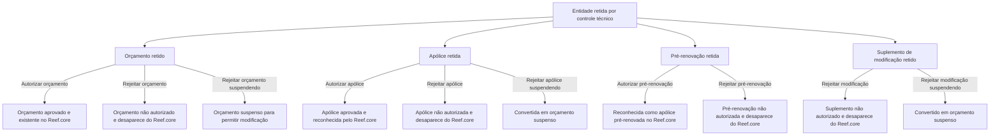

# Documentação de Operação de Emissão (Automóvel) — Controle Técnico no Reef.core

## 1. Metadados do Documento
- **Arquivo de Origem:** Não identificado no conteúdo fornecido
- **Tipo de Documento:** Manual Operacional
- **Domínio / Sistema:** Emissão de Automóvel, Controle Técnico e Reef.core
- **Público-Alvo:** Operação e usuários responsáveis por decisões de controle técnico
- **Data/Versão Identificada:** Não identificada

---

## 2. Resumo Executivo & Contexto de Negócio

O documento descreve operações de autorização e rejeição aplicáveis a entidades de emissão de Automóvel retidas por controle técnico de auditoria. As entidades mencionadas são orçamento, apólice, pré-renovação e suplemento de modificação de apólice.

A autorização remove a retenção por controle técnico e torna a entidade reconhecida ou existente no restante do sistema Reef.core. Para orçamentos, a autorização resulta em orçamento aprovado. Para apólices, a autorização faz com que Reef.core reconheça a entidade como apólice. Para pré-renovações, a autorização faz com que Reef.core reconheça a entidade como apólice pré-renovada.

A rejeição impede a autorização da entidade retida. Dependendo da operação escolhida, a entidade desaparece de Reef.core ou é convertida em orçamento suspenso. A suspensão preserva a oportunidade de alterar a informação que gerou o controle técnico.

O conteúdo fornecido apresenta os efeitos funcionais das decisões operacionais, mas não detalha autenticação, perfis de acesso, métodos HTTP, contratos de API, telas, campos de entrada, persistência de dados, integrações externas ou critérios que disparam o controle técnico.

---

## 3. Arquitetura, Componentes & Tecnologias Envolvidas

O documento cita os seguintes elementos funcionais:

- **Reef.core:** sistema no qual orçamentos, apólices e pré-renovações passam a existir, ser reconhecidos ou desaparecer conforme a decisão de controle técnico.
- **Controle técnico:** condição de retenção aplicada a orçamentos, apólices, pré-renovações e suplementos de modificação.
- **Controle técnico de auditoria:** contexto citado para as operações de autorização e rejeição.
- **Orçamento:** pode ser autorizado, rejeitado com desaparecimento ou rejeitado com suspensão.
- **Apólice:** pode ser autorizada, rejeitada com desaparecimento ou rejeitada com suspensão.
- **Pré-renovação:** pode ser autorizada ou rejeitada com desaparecimento.
- **Suplemento de modificação de apólice:** pode ser rejeitado com desaparecimento ou rejeitado com suspensão.
- **Zeus:** aparece no menu de navegação do conteúdo bruto, sem explicação de papel funcional ou técnico.
- **Soluciones APIs / Documentación:** aparecem no menu de navegação, sem detalhamento adicional.

> **Nota de Análise:** O documento não apresenta arquitetura de software, servidores, banco de dados, microsserviços, tecnologias, URLs operacionais, métodos HTTP ou contratos de integração. O diagrama abaixo representa exclusivamente os fluxos funcionais declarados.



---

## 4. Regras de Negócio, Especificações Funcionais & Processos

### 4.1 Condição de entrada comum
1. A entidade deve estar retida por controle técnico.
2. O documento associa as operações ao contexto de controle técnico de auditoria.
3. A decisão operacional pode ser de autorização, rejeição definitiva ou rejeição com suspensão, conforme o tipo de entidade.

### 4.2 Regras para orçamento

1. **Autorizar orçamento**
   - Um orçamento retido por controle técnico passa a estar aprovado.
   - Após a aprovação, o orçamento existe para o restante do Reef.core.

2. **Rejeitar orçamento**
   - Um orçamento retido por controle técnico não é autorizado.
   - O orçamento desaparece de Reef.core.

3. **Rejeitar orçamento suspendendo**
   - Um orçamento retido por controle técnico não é autorizado.
   - O orçamento passa a converter-se em orçamento suspenso.
   - A suspensão permite modificar a informação que gerou o controle técnico.

### 4.3 Regras para apólice

1. **Autorizar apólice**
   - Uma apólice retida por controle técnico passa a estar aprovada.
   - Reef.core passa a reconhecê-la como apólice.

2. **Rejeitar apólice**
   - Uma apólice retida por controle técnico não é autorizada.
   - A apólice desaparece de Reef.core.

3. **Rejeitar apólice suspendendo**
   - Uma apólice retida por controle técnico não é autorizada.
   - A apólice passa a converter-se em orçamento suspenso.
   - A suspensão permite modificar a informação que gerou o controle técnico.

### 4.4 Regras para pré-renovação

1. **Autorizar pré-renovação**
   - Uma apólice renovada previamente e retida por controle técnico passa a estar aprovada.
   - Reef.core passa a reconhecê-la como apólice pré-renovada.

2. **Rejeitar pré-renovação**
   - Uma renovação prévia de apólice retida por controle técnico não é autorizada.
   - A pré-renovação desaparece de Reef.core.

### 4.5 Regras para suplemento de modificação de apólice

1. **Rejeitar apólice modificação**
   - Um suplemento realizado sobre uma apólice e retido por controle técnico não é autorizado.
   - O suplemento desaparece de Reef.core.

2. **Rejeitar apólice modificação suspendendo**
   - Um suplemento realizado sobre uma apólice e retido por controle técnico não é autorizado.
   - O suplemento passa a converter-se em orçamento suspenso.
   - A suspensão permite modificar a informação que gerou o controle técnico.

> **Nota de Análise:** O documento não descreve uma operação de autorização para suplemento de modificação de apólice. Também não informa se uma entidade suspensa retorna automaticamente ao controle técnico após a alteração das informações.

---

## 5. Tabelas de Parâmetros, Ambientes e Estruturas de Dados

| Item / Parâmetro | Descrição / Função | Tipo / Valores / Formato | Ambiente / Observações |
| :--- | :--- | :--- | :--- |
| Controle técnico | Condição de retenção que antecede as operações documentadas | Estado funcional | Aplicável a orçamento, apólice, pré-renovação e suplemento de modificação |
| Controle técnico de auditoria | Contexto no qual ocorrem operações de autorização e rejeição | Processo funcional | Não há critérios de auditoria detalhados |
| Autorizar orçamento | Aprova orçamento retido e permite sua existência para o restante do Reef.core | Operação | Aplicável a orçamento retido |
| Rejeitar orçamento | Não autoriza orçamento retido e faz o orçamento desaparecer de Reef.core | Operação | Aplicável a orçamento retido |
| Rejeitar orçamento suspendendo | Não autoriza orçamento retido e o converte em orçamento suspenso | Operação | Permite modificar a informação que gerou o controle técnico |
| Autorizar apólice | Aprova apólice retida e permite que Reef.core a reconheça como apólice | Operação | Aplicável a apólice retida |
| Rejeitar apólice | Não autoriza apólice retida e faz a apólice desaparecer de Reef.core | Operação | Aplicável a apólice retida |
| Rejeitar apólice suspendendo | Não autoriza apólice retida e a converte em orçamento suspenso | Operação | Permite modificar a informação que gerou o controle técnico |
| Autorizar pré-renovação | Aprova apólice renovada previamente e faz Reef.core reconhecê-la como apólice pré-renovada | Operação | Aplicável a pré-renovação retida |
| Rejeitar pré-renovação | Não autoriza pré-renovação retida e faz a entidade desaparecer de Reef.core | Operação | Aplicável a renovação prévia de apólice |
| Rejeitar apólice modificação | Não autoriza suplemento de modificação retido e o faz desaparecer de Reef.core | Operação | Aplicável a suplemento de apólice |
| Rejeitar apólice modificação suspendendo | Não autoriza suplemento de modificação retido e o converte em orçamento suspenso | Operação | Permite modificar a informação que gerou o controle técnico |
| Reef.core | Sistema que reconhece, mantém ou deixa de exibir as entidades após a decisão de controle técnico | Sistema corporativo | Não há versão ou ambiente informados |
| Zeus | Item citado no menu de navegação | Termo não detalhado | Função não identificada |
| RS | Sigla exibida junto à operação de rejeitar orçamento | Sigla não definida | Significado não identificado no conteúdo |

---

## 6. Bateria de Perguntas & Respostas para RAG (FAQ Sintético)

### P1: O que ocorre ao autorizar um orçamento retido por controle técnico?
**R:** O orçamento retido por controle técnico passa a estar aprovado. Como consequência, o orçamento passa a existir para o restante do sistema Reef.core.

### P2: Qual é o efeito de rejeitar um orçamento sem suspensão?
**R:** Ao rejeitar um orçamento retido por controle técnico, o orçamento não é autorizado e desaparece de Reef.core.

### P3: Para que serve a operação “RECHAZAR presupuesto suspendiendo”?
**R:** A operação não autoriza o orçamento retido por controle técnico, mas o converte em orçamento suspenso. Essa condição permite modificar a informação que gerou o controle técnico.

### P4: O que acontece quando uma apólice retida por controle técnico é autorizada?
**R:** A apólice passa a estar aprovada. Em seguida, o restante do Reef.core passa a reconhecê-la como apólice.

### P5: Qual é a diferença entre rejeitar uma apólice e rejeitar uma apólice suspendendo?
**R:** A rejeição simples não autoriza a apólice e faz a apólice desaparecer de Reef.core. A rejeição com suspensão também não autoriza a apólice, porém a converte em orçamento suspenso para permitir a alteração da informação que gerou o controle técnico.

### P6: Como uma pré-renovação é autorizada no processo de controle técnico?
**R:** Uma apólice que foi renovada previamente e está retida por controle técnico passa a estar aprovada. Após essa aprovação, Reef.core passa a reconhecê-la como apólice pré-renovada.

### P7: O que ocorre ao rejeitar uma pré-renovação retida por controle técnico?
**R:** A renovação prévia de apólice não é autorizada e desaparece de Reef.core.

### P8: Qual é o tratamento para um suplemento de modificação de apólice rejeitado?
**R:** Quando um suplemento realizado sobre uma apólice está retido por controle técnico e é rejeitado, o suplemento não é autorizado e desaparece de Reef.core.

### P9: O que ocorre quando um suplemento de modificação é rejeitado com suspensão?
**R:** O suplemento de modificação não é autorizado, mas passa a converter-se em orçamento suspenso. A suspensão dá oportunidade para modificar a informação que gerou o controle técnico.

### P10: O documento informa os métodos HTTP ou contratos de API das operações de controle técnico?
**R:** Não. O documento apenas apresenta os nomes das operações e seus efeitos funcionais no Reef.core. Não há detalhamento de métodos HTTP, endpoints, payloads JSON, códigos de resposta ou autenticação.

### P11: O documento explica como identificar a informação que gerou o controle técnico?
**R:** Não. O documento informa que a suspensão permite modificar a informação que gerou o controle técnico, mas não especifica quais campos, regras de validação ou evidências de auditoria causaram a retenção.

### P12: Existe uma operação documentada para autorizar um suplemento de modificação de apólice?
**R:** Não. O conteúdo fornecido documenta apenas a rejeição simples e a rejeição com suspensão para suplemento de modificação de apólice.

---

## 7. Glossário de Termos, Siglas & Conceitos-Chave

- **Apólice:** entidade que, quando retida por controle técnico, pode ser autorizada, rejeitada ou rejeitada com suspensão.
- **Apólice pré-renovada:** classificação pela qual Reef.core reconhece uma apólice renovada previamente após autorização da pré-renovação.
- **Controle técnico:** condição de retenção que exige uma operação de autorização ou rejeição.
- **Controle técnico de auditoria:** contexto de auditoria associado às operações documentadas.
- **Orçamento:** entidade que pode ser aprovada, removida de Reef.core ou convertida em orçamento suspenso.
- **Orçamento suspenso:** estado resultante de operações de rejeição com suspensão; permite modificar a informação que gerou o controle técnico.
- **Pré-renovação:** renovação prévia de uma apólice; pode ser autorizada ou rejeitada.
- **Reef.core:** sistema citado como responsável por reconhecer, manter ou deixar de reconhecer as entidades após as decisões de controle técnico.
- **RS:** sigla exibida no conteúdo bruto sem definição.
- **Suplemento:** modificação realizada sobre uma apólice; no documento, pode ser rejeitado ou rejeitado com suspensão.
- **Zeus:** termo presente na navegação do conteúdo bruto, sem definição funcional ou técnica.

---

## 8. Notas Críticas, Riscos & Limitações

- O conteúdo não identifica o arquivo de origem, versão, data, autor ou responsável pelo processo.
- O conteúdo não define os critérios que fazem uma entidade ficar retida por controle técnico.
- O conteúdo não detalha perfis de acesso, permissões, segregação de funções ou trilha de auditoria das decisões.
- O conteúdo não apresenta URLs, ambientes, servidores, rotas de logs, APIs, métodos HTTP, contratos JSON ou mensagens de erro.
- A expressão **RS** é exibida no conteúdo bruto, mas não possui significado definido.
- A operação **RECHAZAR póliza suspendiendo** declara que uma apólice torna-se um orçamento suspenso; o documento não justifica essa transformação nem descreve o ciclo posterior da entidade.
- O documento informa que a suspensão permite alterar a informação que gerou o controle técnico, mas não especifica quais informações podem ser alteradas, como a alteração é validada ou como uma nova decisão de controle técnico é realizada.
- Não há operação de autorização documentada para suplemento de modificação de apólice.

---

## 9. Conteúdo Bruto Estruturado (Referência Fiel)

```text
--- [PÁGINA 1 DE 2] ---

DOCUMENTACIÓN de OPERACIÓN de
EMISIÓN (Automóvil) - CONTROL TÉCNICO
CONTROL TÉCNICO
Distintas operaciones de autorización y rechazo de controles técnicos
de auditoría
AUTORIZAR presupuesto
Un presupuesto retenido por control técnico
pasa a estar aprobado y por consiguiente,
existe para el resto de Reef.core
 Accede al documento
AUTORIZAR póliza
Una póliza retenida por control técnico pasa a
estar aprobada y por consiguiente, hace que
el resto de Reef.core la reconozca como
póliza
 Accede al documento
AUTORIZAR prerenovación
 RECHAZAR presupuesto
 / 
 RS
Inicio Soluciones APIs Documentación Zeus
ES


--- [PÁGINA 2 DE 2] ---

Una póliza que ha sido renovada previamente
y que está retenida por control técnico pasa a
estar aprobada y por consiguiente, hace que
el resto de Reef.core la reconozca como
póliza prerenovada
 Accede al documento
RECHAZAR presupuesto
Un presupuesto retenido por control técnico
no es autorizado y por consiguiente
desaparece de Reef.core
 Accede al documento
RECHAZAR presupuesto suspendiendo
Un presupuesto retenido por control técnico
no es autorizado y pasa convertirse en un
presupuesto suspendido y así dar la
oportunidad de modificar la información que
generó el control técnico
 Accede al documento
RECHAZAR póliza
Una póliza retenida por control técnico no es
autorizada y por consiguiente desaparece de
Reef.core
 Accede al documento
RECHAZAR póliza suspendiendo
Una póliza retenida por control técnico no es
autorizada y pasa convertirse en un
presupuesto suspendido y así dar la
oportunidad de modificar la información que
generó el control técnico
 Accede al documento
RECHAZAR póliza modificación
Un suplemento realizado a una póliza que
quedó retenido por control técnico no es
autorizado y por consiguiente desaparece de
Reef.core
 Accede al documento
RECHAZAR póliza modificación
suspendiendo
Un suplemento realizado a una póliza que
quedó retenido por control técnico no es
autorizado y pasa convertirse en un
presupuesto suspendido y así dar la
oportunidad de modificar la información que
generó el control técnico
 Accede al documento
RECHAZAR prerenovación
Una renovación previa a una póliza que
quedó retenida por control técnico no es
autorizada y por consiguiente desaparece de
Reef.core
 Accede al documento
```
