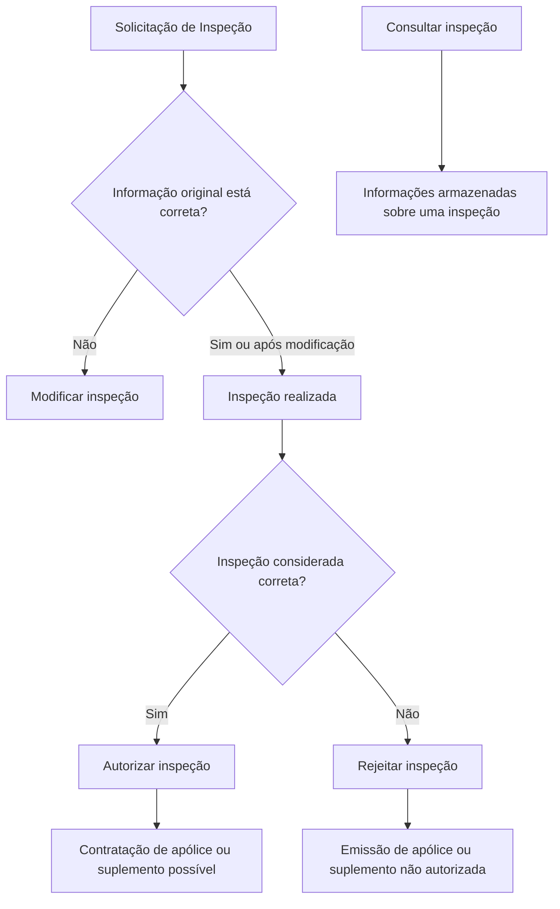

# Documentação de Operação de Emissão (Automóvel) — Inspeção

## 1. Metadados do Documento
- **Arquivo de Origem:** Não identificado
- **Tipo de Documento:** Manual Operacional
- **Domínio / Sistema:** Emissão de Automóvel — Inspeção
- **Público-Alvo:** Operação, Negócio e usuários responsáveis por revisões de riscos
- **Data/Versão Identificada:** Não identificada

---

## 2. Resumo Executivo & Contexto de Negócio

O documento apresenta operações relacionadas às revisões de riscos no contexto de emissão de seguros de automóvel e inspeções. O conteúdo identifica quatro operações: modificar, autorizar, rejeitar e consultar uma inspeção.

A operação de modificação é usada quando a solicitação de inspeção precisa ser atualizada porque a informação original não estava totalmente correta. O documento não detalha campos editáveis, regras de auditoria, responsáveis ou condições técnicas para a atualização.

Após a realização de uma inspeção, a inspeção pode ser autorizada ou rejeitada. A autorização permite a contratação da apólice ou do suplemento; a rejeição impede a emissão da apólice ou do suplemento.

A consulta permite acessar informações armazenadas sobre uma inspeção. A fonte também apresenta referências de navegação para “Inicio”, “Soluciones”, “APIs”, “Documentación”, “Zeus” e “RS”, porém não explica o papel técnico ou funcional dessas referências.

---

## 3. Arquitetura, Componentes & Tecnologias Envolvidas

O documento não descreve arquitetura de software, integrações, microsserviços, tecnologias, contratos de API, métodos HTTP, URLs, ambientes ou mecanismos de persistência.

Os únicos elementos funcionais identificados são o processo de inspeção e as operações de modificação, autorização, rejeição e consulta.



> **Nota de Análise:** O diagrama representa exclusivamente as relações funcionais explicitadas no conteúdo. O documento não informa sistemas responsáveis, transições formais de estado, perfis autorizados ou contratos de integração.

---

## 4. Regras de Negócio, Especificações Funcionais & Processos

### Operação: Modificar inspeção
1. A operação está relacionada à revisão de riscos.
2. A solicitação de inspeção deve ser atualizada quando, por qualquer motivo, a informação original não era totalmente correta.
3. O documento não informa quais dados podem ser modificados.
4. O documento não informa se a modificação exige nova inspeção, aprovação ou trilha de auditoria.

### Operação: Autorizar inspeção
1. A autorização ocorre após a realização da inspeção.
2. A inspeção autorizada é considerada correta.
3. Após a autorização da inspeção, torna-se possível contratar uma apólice ou um suplemento.
4. O documento não define critérios objetivos para considerar uma inspeção correta.

### Operação: Rejeitar inspeção
1. A rejeição ocorre após a realização da inspeção.
2. A inspeção rejeitada é considerada incorreta.
3. Quando uma inspeção é rejeitada, a emissão da apólice ou do suplemento não é autorizada.
4. O documento não informa se uma inspeção rejeitada pode ser modificada, reinspecionada ou submetida novamente.

### Operação: Consultar inspeção
1. A consulta permite acessar as informações armazenadas sobre uma inspeção.
2. O documento não detalha os atributos consultáveis, filtros disponíveis, permissões ou retenção das informações armazenadas.

---

## 5. Tabelas de Parâmetros, Ambientes e Estruturas de Dados

| Item / Parâmetro | Descrição / Função | Tipo / Valores / Formato | Ambiente / Observações |
| :--- | :--- | :--- | :--- |
| Inspeção | Elemento funcional associado à revisão de riscos no processo de emissão de automóvel. | Não especificado | Pode ser modificada, autorizada, rejeitada ou consultada. |
| Solicitação de inspeção | Solicitação cuja informação original pode ser atualizada. | Não especificado | Deve ser modificada se a informação original não estiver totalmente correta. |
| Modificar inspeção | Atualiza a solicitação de inspeção. | Operação | Motivo explícito: informação original não totalmente correta. |
| Autorizar inspeção | Considera a inspeção correta após sua realização. | Operação | Permite contratação de apólice ou suplemento. |
| Rejeitar inspeção | Considera a inspeção incorreta após sua realização. | Operação | Não autoriza emissão de apólice ou suplemento. |
| Consultar inspeção | Acessa informações armazenadas de uma inspeção. | Operação | Campos, filtros e permissões não especificados. |
| Apólice | Artefato cuja contratação ou emissão depende do resultado da inspeção. | Não especificado | Contratação possível após autorização; emissão não autorizada após rejeição. |
| Suplemento | Artefato cuja contratação ou emissão depende do resultado da inspeção. | Não especificado | Contratação possível após autorização; emissão não autorizada após rejeição. |
| Zeus | Referência exibida na navegação do documento. | Não especificado | Não há detalhamento funcional ou técnico. |
| RS | Referência exibida no documento. | Não especificado | Significado não informado. |

---

## 6. Bateria de Perguntas & Respostas para RAG (FAQ Sintético)

### P1: Quando uma solicitação de inspeção deve ser modificada?
**R:** A solicitação de inspeção deve ser modificada quando, por qualquer motivo, a informação original não era totalmente correta.

### P2: O que acontece quando uma inspeção é autorizada?
**R:** Após a realização da inspeção, a autorização indica que a inspeção é considerada correta e torna possível a contratação da apólice ou do suplemento.

### P3: Qual é o impacto de rejeitar uma inspeção?
**R:** Após a realização da inspeção, a rejeição indica que a inspeção não é considerada correta e não autoriza a emissão da apólice ou do suplemento.

### P4: A operação de consulta permite alterar dados da inspeção?
**R:** Não. O documento informa apenas que a operação de consulta permite acessar informações armazenadas sobre uma inspeção. Alterações são associadas à operação “Modificar inspeção”.

### P5: Quais operações de inspeção são apresentadas no documento?
**R:** O documento apresenta quatro operações: modificar inspeção, autorizar inspeção, rejeitar inspeção e consultar inspeção.

### P6: A autorização de uma inspeção ocorre antes ou depois da realização da inspeção?
**R:** A autorização ocorre após a realização da inspeção. Nesse momento, a inspeção é considerada correta.

### P7: O documento define quais campos podem ser alterados em uma solicitação de inspeção?
**R:** Não. O documento informa que a solicitação pode ser atualizada quando a informação original não era totalmente correta, mas não especifica os campos alteráveis.

### P8: O documento apresenta critérios técnicos ou de negócio para decidir se uma inspeção é correta?
**R:** Não. O documento informa os efeitos da autorização e da rejeição, mas não descreve critérios, validações ou evidências necessárias para classificar a inspeção como correta ou incorreta.

### P9: É possível emitir uma apólice ou suplemento após uma inspeção rejeitada?
**R:** Não. O documento informa que a rejeição da inspeção não autoriza a emissão da apólice ou do suplemento.

### P10: Quais informações podem ser recuperadas pela consulta de inspeção?
**R:** A consulta permite acessar informações armazenadas acerca de uma inspeção. O documento não detalha quais dados são armazenados ou exibidos.

---

## 7. Glossário de Termos, Siglas & Conceitos-Chave

- **Inspeção:** Elemento do processo de emissão de automóvel associado a revisões de riscos.
- **Solicitação de inspeção:** Solicitação que pode ser atualizada quando a informação original não está totalmente correta.
- **Apólice:** Artefato cuja contratação pode ser permitida após a autorização da inspeção.
- **Suplemento:** Artefato cuja contratação pode ser permitida após a autorização da inspeção.
- **RS:** Sigla ou referência exibida no documento; significado não definido no conteúdo.
- **Zeus:** Referência de navegação exibida no documento; papel não detalhado.

---

## 8. Notas Críticas, Riscos & Limitações

- O documento não identifica arquivo de origem, data, versão, autoria ou responsável pelo processo.
- Não há detalhamento de arquitetura, APIs, sistemas envolvidos, integrações, URLs, ambientes ou tecnologias.
- Não são informados critérios para autorizar ou rejeitar uma inspeção.
- Não são descritos perfis de acesso, matriz de permissões, trilha de auditoria ou segregação de funções.
- Não há definição dos campos consultáveis ou modificáveis em uma inspeção.
- O documento não esclarece o que ocorre após uma rejeição, incluindo possível reinspeção, correção ou reprocessamento.
- As referências “Zeus” e “RS” não possuem explicação adicional no conteúdo disponível.

---

## 9. Conteúdo Bruto Estruturado (Referência Fiel)

```text
--- [PÁGINA 1 DE 2] ---

DOCUMENTACIÓN de OPERACIÓN de
EMISIÓN (Automóvil) - INSPECCIÓN
INSPECCIÓN
Operaciones relacionadas con las revisiones de riesgos
MODIFICAR inspección
Se actualiza la solicitud de inspección si por
cualquier motivo la información original no era
totalmente correcta
 Accede al documento
AUTORIZAR inspección
Una vez realizada la inspección, esta se
considera correcta y es posible la contratación
de la póliza o suplemento
 Accede al documento
RECHAZAR inspección
Una vez realizada la inspección, esta no se
considera correcta y no se autoriza la emisión
de la póliza o suplemento
CONSULTAR inspección
Permite el acceso a la información
almacenada acerca de una inspección
 / 
 RS
Inicio Soluciones APIs Documentación Zeus
ES


--- [PÁGINA 2 DE 2] ---

Accede al documento
  Accede al documento
```
