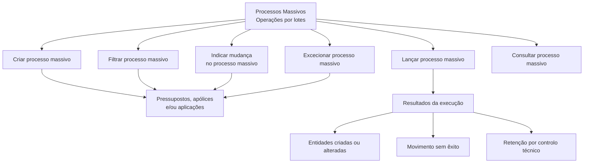

# Documentação de Operação de Emissão (Automóvel) — Processos Massivos

## 1. Metadados do Documento
- **Arquivo de Origem:** Não identificado no conteúdo fornecido
- **Tipo de Documento:** Manual Operacional
- **Domínio / Sistema:** Emissão (Automóvel) — Processos Massivos
- **Público-Alvo:** Operação, Negócio e usuários de processos de emissão
- **Data/Versão Identificada:** Não identificada

---

## 2. Resumo Executivo & Contexto de Negócio

O documento apresenta a documentação de operação para **Processos Massivos** no domínio de **Emissão (Automóvel)**. Processos massivos são operações relacionadas a processamento por lotes, aplicáveis a pressupostos, apólices e/ou aplicações.

A documentação relaciona as capacidades operacionais disponíveis para administrar um processo massivo: criar, filtrar, indicar alterações, definir exceções, lançar e consultar. Cada capacidade possui uma referência indicada como “Accede al documento”, mas o conteúdo detalhado dessas referências não foi fornecido.

O lançamento do processo massivo é a etapa explicitamente descrita como execução. Nessa execução, uma série de pressupostos, apólices e/ou aplicações pode ser criada ou alterada. O resultado pode incluir movimentos bem-sucedidos, movimentos sem êxito e itens retidos por controlo técnico.

O documento não especifica critérios de seleção, regras de alteração, contratos de integração, métodos de acesso, papéis de utilizador, estados formais ou detalhes técnicos adicionais para cada operação.

---

## 3. Arquitetura, Componentes & Tecnologias Envolvidas

Os elementos identificados no conteúdo são:

| Componente / Conceito | Descrição sustentada pelo documento |
| :--- | :--- |
| Emissão (Automóvel) | Domínio funcional da documentação. |
| Processos Massivos | Operações relacionadas a processos por lotes. |
| Pressupostos | Entidades que podem ser criadas, alteradas, selecionadas, excluídas ou processadas. |
| Apólices | Entidades que podem ser criadas, alteradas, selecionadas, excluídas ou processadas. |
| Aplicações | Entidades que podem ser criadas, alteradas, selecionadas, excluídas ou processadas. |
| Controlo técnico | Condição pela qual itens podem ficar retidos durante a execução do processo massivo. |
| RS | Termo exibido no rodapé da primeira página, sem explicação adicional. |
| Zeus | Termo exibido na navegação da primeira página, sem explicação adicional. |



> **Nota de Análise:** O diagrama representa as operações e relações explicitamente citadas. O documento não estabelece uma sequência obrigatória entre criar, filtrar, indicar mudança, excecionar, lançar e consultar.

---

## 4. Regras de Negócio, Especificações Funcionais & Processos

### Criar processo massivo

A operação **CREAR proceso masivo** define um processo massivo que permite criar ou alterar:

- Pressupostos;
- Apólices;
- Aplicações.

O documento não informa quais campos, validações, critérios de elegibilidade ou permissões são necessários para criar um processo massivo.

### Filtrar processo massivo

A operação **FILTRAR proceso masivo** permite definir quais apólices ou aplicações participam de um processo massivo.

O documento não detalha filtros disponíveis, operadores de pesquisa, critérios de inclusão, critérios de exclusão inicial ou o tratamento de pressupostos nessa operação.

### Indicar mudança no processo massivo

A operação **INDICAR CAMBIO proceso masivo** especifica as alterações a realizar no processo massivo. Essas alterações serão aplicadas às apólices e/ou aplicações participantes.

O documento não descreve os tipos de alterações possíveis, os atributos alteráveis, as validações antes da alteração ou a reversibilidade das alterações.

### Excecionar processo massivo

A operação **EXCEPCIONAR proceso masivo** determina quais pressupostos, apólices ou aplicações inicialmente selecionados passam a ser excluídos do processo massivo.

O documento não especifica o motivo, a regra ou a autorização necessária para definir uma exceção.

### Lançar processo massivo

A operação **LANZAR proceso masivo** executa o processo massivo. Durante a execução:

1. Uma série de pressupostos, apólices e/ou aplicações pode ser criada ou alterada.
2. Parte dos itens pode ficar marcada como movimento sem êxito.
3. Parte dos itens pode ficar retida por controlo técnico.

O documento não informa como os resultados são persistidos, como um movimento sem êxito é tratado, como uma retenção por controlo técnico é resolvida ou se existe reprocessamento.

### Consultar processo massivo

A operação **CONSULTAR proceso masivo** facilita o acesso à informação existente relacionada ao processo massivo.

O documento não detalha os dados disponíveis para consulta, filtros de consulta, formato dos resultados, histórico de execução ou nível de detalhe por entidade.

---

## 5. Tabelas de Parâmetros, Ambientes e Estruturas de Dados

| Item / Parâmetro | Descrição / Função | Tipo / Valores / Formato | Ambiente / Observações |
| :--- | :--- | :--- | :--- |
| Processo massivo | Processo relacionado a operações por lotes. | Conceito operacional | Aplicável à emissão de automóvel. |
| Criar processo massivo | Define um processo para criar ou alterar entidades. | Operação | Abrange pressupostos, apólices e/ou aplicações. |
| Filtrar processo massivo | Define apólices ou aplicações participantes. | Operação | Critérios de filtro não detalhados. |
| Indicar mudança | Especifica mudanças a aplicar às entidades participantes. | Operação | Aplicável a apólices e/ou aplicações. |
| Excecionar processo massivo | Exclui entidades inicialmente selecionadas. | Operação | Abrange pressupostos, apólices ou aplicações. |
| Lançar processo massivo | Executa o processamento em lote. | Operação | Pode criar, alterar, marcar insucesso ou reter itens. |
| Consultar processo massivo | Permite aceder à informação relacionada ao processo. | Operação | Dados disponíveis não detalhados. |
| Pressupostos | Entidades potencialmente criadas, alteradas ou excluídas. | Entidade de negócio | Grafia preservada conforme conteúdo original. |
| Apólices | Entidades selecionáveis, alteráveis ou excluíveis. | Entidade de negócio | Podem participar do processo massivo. |
| Aplicações | Entidades selecionáveis, alteráveis ou excluíveis. | Entidade de negócio | Podem participar do processo massivo. |
| Movimento sem êxito | Resultado possível da execução. | Estado / resultado | Não há detalhamento sobre causas ou recuperação. |
| Controlo técnico | Condição de retenção de itens na execução. | Estado / controle | Mecanismo não detalhado. |
| RS | Termo exibido no rodapé do documento. | Sigla não definida | Significado não identificado. |
| Zeus | Termo exibido na navegação do documento. | Nome não definido | Relação com os processos massivos não detalhada. |

---

## 6. Bateria de Perguntas & Respostas para RAG (FAQ Sintético)

### P1: Qual é o objetivo da documentação de Processos Massivos de Emissão (Automóvel)?
**R:** A documentação apresenta operações relacionadas a processos por lotes no domínio de Emissão (Automóvel). As operações descritas permitem criar, filtrar, indicar mudanças, excecionar, lançar e consultar processos massivos aplicáveis a pressupostos, apólices e/ou aplicações.

### P2: O que permite fazer a operação de criar processo massivo?
**R:** A operação **CREAR proceso masivo** permite definir um processo massivo para criar ou alterar pressupostos, apólices e/ou aplicações. O documento não detalha os campos, parâmetros ou validações necessários para essa definição.

### P3: Quais entidades podem participar de um processo massivo?
**R:** O documento cita pressupostos, apólices e aplicações como entidades relacionadas aos processos massivos. A participação varia por operação: o filtro menciona apólices ou aplicações; a exceção menciona pressupostos, apólices ou aplicações; e o lançamento menciona pressupostos, apólices e/ou aplicações.

### P4: Para que serve filtrar um processo massivo?
**R:** A operação **FILTRAR proceso masivo** permite definir quais apólices ou aplicações intervêm, ou seja, participam, em um processo massivo. O conteúdo fornecido não detalha os critérios nem os campos usados para esse filtro.

### P5: Como são definidas as alterações de um processo massivo?
**R:** A operação **INDICAR CAMBIO proceso masivo** especifica as mudanças a realizar no processo massivo. As apólices e/ou aplicações que participam do processo sofrerão essas mudanças. Os tipos concretos de mudança não foram informados.

### P6: O que significa excecionar um processo massivo?
**R:** **EXCEPCIONAR proceso masivo** determina quais pressupostos, apólices ou aplicações inicialmente selecionados deixam de participar do processo massivo. O documento não descreve os critérios para criar uma exceção.

### P7: O que ocorre durante o lançamento de um processo massivo?
**R:** Durante a operação **LANZAR proceso masivo**, o processo é executado. Uma série de pressupostos, apólices e/ou aplicações pode ser criada ou alterada; outros itens podem ser marcados como movimentos sem êxito; e outros podem ficar retidos por controlo técnico.

### P8: Quais resultados podem ocorrer após a execução de um processo massivo?
**R:** O documento identifica três resultados durante a execução: criação ou alteração de pressupostos, apólices e/ou aplicações; marcação de itens cujo movimento não teve êxito; e retenção de itens por controlo técnico.

### P9: Como consultar informações de um processo massivo?
**R:** A operação **CONSULTAR proceso masivo** facilita o acesso à informação existente relacionada ao processo massivo. O documento não informa quais dados específicos podem ser consultados, nem quais filtros ou formatos de retorno estão disponíveis.

### P10: O documento descreve como resolver movimentos sem êxito ou retenções por controlo técnico?
**R:** Não. O documento apenas informa que, na execução do processo massivo, alguns itens podem ficar marcados como movimentos sem êxito e outros podem ficar retidos por controlo técnico. Não há procedimentos de resolução, reprocessamento ou escalonamento descritos.

---

## 7. Glossário de Termos, Siglas & Conceitos-Chave

- **Processos Massivos:** Operações relacionadas a processos por lotes.
- **Emissão (Automóvel):** Domínio funcional indicado no título da documentação.
- **Pressupostos:** Entidades mencionadas como passíveis de criação, alteração, exclusão do processo ou processamento durante a execução.
- **Apólices:** Entidades que podem participar de filtros, alterações, exceções e execução de processos massivos.
- **Aplicações:** Entidades que podem participar de filtros, alterações, exceções e execução de processos massivos.
- **Controlo técnico:** Condição na qual determinados itens ficam retidos durante a execução do processo massivo.
- **Movimento sem êxito:** Resultado em que o movimento de determinado item não é bem-sucedido.
- **RS:** Sigla exibida no documento sem definição contextual.
- **Zeus:** Termo exibido na navegação do documento sem definição contextual.

---

## 8. Notas Críticas, Riscos & Limitações

- O conteúdo fornecido apresenta um catálogo resumido de operações e não inclui os documentos acessíveis pelos links “Accede al documento”.
- Não foram identificados métodos HTTP, contratos JSON, APIs, microsserviços, URLs, ambientes, servidores, versões ou credenciais.
- Não foram descritos critérios de filtragem, atributos alteráveis, regras de validação, permissões, estados formais, auditoria ou mecanismos de reprocessamento.
- A retenção por controlo técnico e os movimentos sem êxito são mencionados, mas não possuem causas, procedimentos de tratamento ou responsáveis definidos.
- **Nota de Análise:** O documento lista as operações de processos massivos, porém não detalha os fluxos técnicos, contratos operacionais ou regras específicas de cada operação.

---

## 9. Conteúdo Bruto Estruturado (Referência Fiel)

```text
--- [PÁGINA 1 DE 2] ---

DOCUMENTACIÓN de OPERACIÓN de
EMISIÓN (Automóvil) - PROCESOS MASIVOS
PROCESOS MASIVOS
Operaciones relacionadas con procesos por lotes
CREAR proceso masivo
Se define un proceso masivo que permita
crear o alterar presupuestos, pólizas y/o
aplicaciones
 Accede al documento
FILTRAR proceso masivo
Permite la definición de qué pólizas o
aplicaciones intervienen en un proceso
masivo
 Accede al documento
INDICAR CAMBIO proceso masivo
Se especifican los cambios a realizar en el
proceso masivo y que sufrirán las pólizas y/o
aplicaciones que participen en él
EXCEPCIONAR proceso masivo
Se determina qué presupuesto, pólizas o
aplicaciones inicialmente seleccionadas
pasan a estar excluidas del proceso masivo
 / 
 RS
Inicio Soluciones APIs Documentación Zeus
ES


--- [PÁGINA 2 DE 2] ---

Accede al documento
  Accede al documento
LANZAR proceso masivo
Ejecución del proceso masivo donde una
serie de presupuestos, póliza y/o aplicaciones
serán creadas o alteradas, otras quedarán
marcadas como que el movimiento no tuvo
éxito y otras quedarán retenidas por control
técnico
 Accede al documento
CONSULTAR proceso masivo
Facilita el acceso a la información que existe
relacionado con el proceso masivo
 Accede al documento
```
