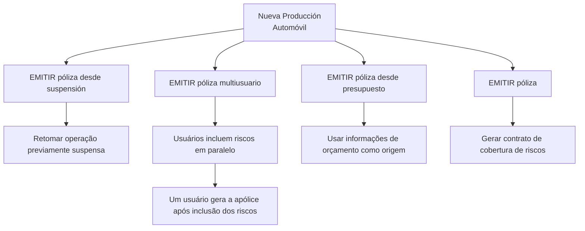

# Documentación de Operación de Emisión de Automóvil — Nueva Producción

## 1. Metadados do Documento
- **Arquivo de Origem:** Não identificado
- **Tipo de Documento:** Manual Operacional
- **Domínio / Sistema:** Emissão de apólices de Automóvel — Nova Produção
- **Público-Alvo:** Operação, negócio e usuários responsáveis pela emissão de apólices
- **Data/Versão Identificada:** Não identificada

---

## 2. Resumo Executivo & Contexto de Negócio

O documento apresenta modalidades de criação de novas apólices ou aplicações no contexto de **Nova Produção** para o domínio de **Automóvel**. A operação central descrita é **EMITIR póliza**, definida como a geração do contrato que estabelece os riscos cobertos, as condições de cobertura e a cobertura aplicável quando ocorre um dano previsto.

A documentação relaciona quatro modalidades operacionais para emissão: emissão direta de apólice, emissão a partir de uma operação suspensa, emissão multiusuário e emissão a partir de orçamento. Cada modalidade preserva a finalidade de gerar uma nova apólice, mas parte de um contexto operacional distinto.

A emissão a partir de suspensão permite retomar uma operação previamente suspensa. A emissão multiusuário permite que vários usuários incluam riscos em paralelo; após a inclusão de todos os riscos, um dos usuários gera a apólice. A emissão a partir de orçamento utiliza as informações de um orçamento como base para gerar a nova apólice.

O conteúdo apresentado é introdutório e aponta para documentos específicos por meio da indicação **“Accede al documento”**. Não há detalhamento adicional sobre telas, regras de validação, contratos de integração, métodos HTTP, perfis de acesso ou campos de dados.

---

## 3. Arquitetura, Componentes & Tecnologias Envolvidas

O documento menciona os seguintes elementos de navegação e domínio:

- **Emisión (Automóvil) - Nueva Producción:** contexto funcional da documentação.
- **EMITIR póliza:** operação principal de geração de apólice.
- **EMITIR póliza desde suspensión:** emissão baseada na retomada de operação suspensa.
- **EMITIR póliza multiusuario:** emissão com inclusão paralela de riscos por múltiplos usuários.
- **EMITIR póliza desde presupuesto:** emissão baseada em informações de orçamento.
- **Inicio, Soluciones, APIs, Documentación, Zeus:** itens apresentados na navegação da página.
- **ES:** identificador de idioma exibido na página.



> **Nota de Análise:** O documento não detalha arquitetura de software, APIs, microsserviços, bancos de dados, tecnologias, URLs, ambientes ou integrações entre sistemas.

---

## 4. Regras de Negócio, Especificações Funcionais & Processos

### Operação: EMITIR póliza

A operação **EMITIR póliza** consiste na geração de um contrato. O contrato resultante estabelece:

1. O risco ou os riscos cobertos.
2. As condições sob as quais os riscos são cobertos.
3. A cobertura aplicável quando o risco sofre algum tipo de dano estabelecido.

### Modalidade: EMITIR póliza desde suspensión

A emissão a partir de suspensão consiste em realizar a operação **EMITIR póliza** após a retomada de uma operação que havia sido previamente suspensa.

### Modalidade: EMITIR póliza multiusuario

A emissão multiusuário possui a mesma finalidade da operação de emissão de apólice, com a particularidade de que vários usuários incluem riscos de forma paralela.

Fluxo apresentado:

1. Vários usuários incluem riscos em paralelo.
2. Todos os riscos devem ser incluídos.
3. Um dos usuários gera a apólice.

### Modalidade: EMITIR póliza desde presupuesto

A emissão a partir de orçamento consiste em realizar a operação **EMITIR póliza** usando como origem as informações de um orçamento. O orçamento serve como base para a geração da nova apólice.

> **Nota de Análise:** O documento não especifica critérios para suspender ou retomar operações, validações obrigatórias para riscos, critérios de conclusão da inclusão paralela, concorrência entre usuários, regras de seleção do usuário emissor ou condições de elegibilidade de um orçamento.

---

## 5. Tabelas de Parâmetros, Ambientes e Estruturas de Dados

| Item / Parâmetro | Descrição / Função | Tipo / Valores / Formato | Ambiente / Observações |
| :--- | :--- | :--- | :--- |
| Nueva Producción | Contexto de criação de novas apólices ou aplicações. | Contexto funcional | Associado ao domínio de Automóvel. |
| EMITIR póliza | Geração de contrato que define riscos cobertos, condições e cobertura diante de dano estabelecido. | Operação | Modalidade principal de emissão. |
| EMITIR póliza desde suspensión | Realização da emissão após retomar uma operação previamente suspensa. | Operação | Não há critérios de suspensão ou retomada detalhados. |
| EMITIR póliza multiusuario | Emissão na qual múltiplos usuários incluem riscos em paralelo. | Operação | Um usuário gera a apólice após a inclusão de todos os riscos. |
| EMITIR póliza desde presupuesto | Emissão usando informações de orçamento como origem. | Operação | O orçamento é a base da nova apólice. |
| Riesgo / riesgos | Elementos cobertos pelo contrato de apólice. | Conceito de domínio | O documento não apresenta estrutura ou campos de risco. |
| Presupuesto | Fonte de informações utilizada como base para uma nova apólice. | Conceito de domínio | Não há detalhamento de campos ou validade do orçamento. |
| Inicio | Item de navegação apresentado. | Navegação | Sem detalhamento adicional. |
| Soluciones | Item de navegação apresentado. | Navegação | Sem detalhamento adicional. |
| APIs | Item de navegação apresentado. | Navegação | Não são apresentadas APIs específicas. |
| Documentación | Item de navegação apresentado. | Navegação | Página pertence a uma área documental. |
| Zeus | Elemento exibido na navegação. | Nome/termo apresentado | O papel de Zeus não é detalhado. |
| ES | Indicador exibido na navegação. | Idioma | Sugere apresentação em espanhol. |

---

## 6. Bateria de Perguntas & Respostas para RAG (FAQ Sintético)

### P1: Qual é a finalidade da operação EMITIR póliza no contexto de Nueva Producción?
**R:** A operação **EMITIR póliza** tem como finalidade gerar um contrato que estabelece os riscos cobertos, as condições sob as quais esses riscos são cobertos e a cobertura aplicável quando ocorre algum tipo de dano estabelecido.

### P2: O que caracteriza a emissão de apólice a partir de uma suspensão?
**R:** **EMITIR póliza desde suspensión** consiste em realizar a emissão de apólice após retomar uma operação que havia sido previamente suspensa. O documento não detalha os motivos de suspensão nem as validações exigidas para a retomada.

### P3: Como funciona a emissão de apólice multiusuário?
**R:** Na modalidade **EMITIR póliza multiusuario**, vários usuários incluem riscos de forma paralela. Depois que todos os riscos foram incluídos, um dos usuários gera a apólice.

### P4: Em que momento a apólice é gerada no processo multiusuário?
**R:** A apólice é gerada após a inclusão de todos os riscos pelos usuários participantes. O documento informa que um dos usuários realiza a geração da apólice, mas não define como esse usuário é selecionado.

### P5: Qual é a origem das informações usadas em EMITIR póliza desde presupuesto?
**R:** A modalidade **EMITIR póliza desde presupuesto** usa como origem as informações de um orçamento. Esse orçamento serve como base para a geração da nova apólice.

### P6: Quais modalidades de emissão são apresentadas na documentação de Automóvel — Nueva Producción?
**R:** A documentação apresenta quatro modalidades: **EMITIR póliza**, **EMITIR póliza desde suspensión**, **EMITIR póliza multiusuario** e **EMITIR póliza desde presupuesto**.

### P7: Quais elementos o contrato gerado pela emissão de apólice estabelece?
**R:** O contrato gerado pela emissão estabelece os riscos cobertos, as condições nas quais esses riscos são cobertos e a cobertura que será aplicada quando o risco sofrer algum tipo de dano estabelecido.

### P8: O documento descreve APIs ou métodos HTTP para emissão de apólices?
**R:** Não. Embora o item de navegação **APIs** seja exibido, o documento não informa APIs específicas, métodos HTTP, URLs, contratos JSON ou mecanismos de integração relacionados à emissão de apólices.

### P9: O documento define campos obrigatórios para risco, orçamento ou apólice?
**R:** Não. O documento menciona riscos, orçamento e apólice apenas no nível funcional. Não são apresentados campos, formatos, estruturas de dados ou validações obrigatórias.

### P10: O que acontece se nem todos os riscos forem incluídos na emissão multiusuário?
**R:** O documento informa que a geração da apólice ocorre quando todos os riscos foram incluídos. Não descreve comportamento alternativo, bloqueios, mensagens de erro ou tratamento para riscos pendentes.

---

## 7. Glossário de Termos, Siglas & Conceitos-Chave

- **EMITIR póliza:** Operação de geração de contrato de apólice que define riscos, condições de cobertura e cobertura para danos estabelecidos.
- **Póliza:** Apólice ou contrato gerado pela operação de emissão.
- **Nueva Producción:** Contexto de criação de novas apólices ou aplicações.
- **Riesgo / riesgos:** Risco ou riscos abrangidos pela apólice emitida.
- **Cobertura:** Cobertura que será aplicada quando ocorrer um dano estabelecido ao risco.
- **Suspensión:** Estado de uma operação previamente suspensa, que pode ser retomada para realizar a emissão.
- **Multiusuario:** Modalidade em que vários usuários incluem riscos em paralelo antes da geração da apólice.
- **Presupuesto:** Orçamento cujas informações servem de base para gerar uma nova apólice.
- **APIs:** Item de navegação exibido; o documento não define interfaces de programação específicas.
- **Zeus:** Nome exibido na navegação do documento; não há definição funcional ou técnica adicional.
- **ES:** Indicador de idioma exibido na página.

---

## 8. Notas Críticas, Riscos & Limitações

- O conteúdo é resumido e direciona o usuário a documentos adicionais por meio de **“Accede al documento”**.
- Não há detalhamento de regras de validação, campos obrigatórios, perfis de usuário, permissões ou tratamento de erros.
- Não são informados sistemas de origem e destino, integrações, URLs, endpoints, APIs, métodos HTTP, contratos de dados ou tecnologias.
- A modalidade multiusuário menciona inclusão paralela de riscos, mas não detalha mecanismos de concorrência, bloqueio, sincronização ou resolução de conflitos.
- A emissão baseada em orçamento não especifica critérios de validade, atualização ou conversão do orçamento em apólice.
- **Nota de Análise:** O documento lista modalidades funcionais de emissão, mas não oferece documentação operacional detalhada para execução, suporte ou implementação técnica.

---

## 9. Conteúdo Bruto Estruturado (Referência Fiel)

```text
--- [PÁGINA 1 DE 2] ---

DOCUMENTACIÓN de OPERACIÓN de
EMISIÓN (Automóvil) - NUEVA PRODUCCIÓN
NUEVA PRODUCCIÓN
Distintas formas de crear nuevas pólizas o aplicaciones
EMITIR póliza
Consiste en la generación del contrato por el
que se establece el riesgo o riesgos cubiertos,
las condiciones en las que se cubre y la
cobertura que se dará cuando el riesgo sufra
algún tipo de daño establecido
 Accede al documento
EMITIR póliza desde suspensión
Es la realización de la operación EMITIR
póliza, habiendo retomado la operación que
había sido previamente suspendida
 Accede al documento
EMITIR póliza multiusuario
 EMITIR póliza desde presupuesto
 /
 RS
Inicio Soluciones APIs Documentación Zeus
ES


--- [PÁGINA 2 DE 2] ---

La finalidad de esta operación es la de
EMITIR póliza pero, en la que varios usuarios
se encuentran incluyendo riesgos de forma
paralela. Una vez que todos los riesgos han
sido incluidos, uno de los usuarios genera la
póliza
 Accede al documento
Consiste en EMITIR póliza tomando como
origen la información de un presupuesto que
sirve como base para la generación de la
nueva póliza
 Accede al documento
```
