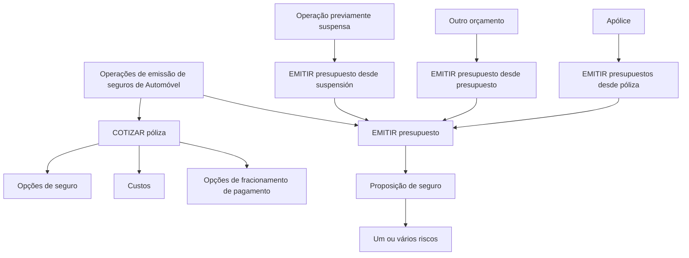

# Documentação de Operação de Emissão (Automóvel) — Orçamentos

## 1. Metadados do Documento
- **Arquivo de Origem:** Não identificado
- **Tipo de Documento:** Manual Operacional
- **Domínio / Sistema:** Emissão de seguros de Automóvel — Orçamentos
- **Público-Alvo:** Operação, Negócio e usuários de documentação de APIs
- **Data/Versão Identificada:** Não identificada

---

## 2. Resumo Executivo & Contexto de Negócio

O documento descreve operações de **emissão de orçamento** no domínio de seguros de Automóvel. O orçamento é apresentado como uma operação associada a um possível risco segurável e pode originar diferentes propostas de seguro.

A operação **COTIZAR póliza** permite oferecer opções de seguro, incluindo o respetivo custo e opções de fracionamento de pagamento. O texto não detalha critérios de cálculo, campos de entrada, contratos de API ou regras de precificação.

A operação **EMITIR presupuesto** gera uma proposição de seguro para um ou vários riscos. O processo pode ser iniciado diretamente ou reutilizar informações de operações e entidades anteriores.

O documento identifica três modalidades derivadas de emissão de orçamento: emissão a partir de uma operação suspensa, emissão baseada em outro orçamento e emissão baseada em uma apólice. Não há detalhamento adicional sobre transições, validações, permissões ou persistência de dados.

---

## 3. Arquitetura, Componentes & Tecnologias Envolvidas

Os componentes explicitamente citados são:

- Documentação de Operação de Emissão.
- Domínio de **Automóvel**.
- Operação **COTIZAR póliza**.
- Operação **EMITIR presupuesto**.
- Fonte de reutilização: operação suspensa, orçamento anterior ou apólice.
- Elementos de navegação citados: `Inicio`, `Soluciones`, `APIs`, `Documentación`, `Zeus`, `ES`.



> **Nota de Análise:** O documento não identifica tecnologias, microsserviços, protocolos, métodos HTTP, contratos JSON, URLs, ambientes, servidores ou mecanismos de integração.

---

## 4. Regras de Negócio, Especificações Funcionais & Processos

### 4.1 Operação COTIZAR póliza

A operação **COTIZAR póliza** está relacionada à cotação de uma apólice para um possível risco. A operação oferece:

1. Distintas opções de seguro.
2. O custo associado às opções de seguro.
3. Diferentes opções de fracionamento de pagamento.

### 4.2 Operação EMITIR presupuesto

A operação **EMITIR presupuesto** gera uma proposição de seguro para:

- Um risco; ou
- Vários riscos.

O documento não especifica se uma proposição emitida constitui uma apólice, nem apresenta critérios de elegibilidade, aprovação, vigência, cálculo de prêmio, validação de risco ou regras de cancelamento.

### 4.3 Emissão de orçamento a partir de suspensão

A operação **EMITIR presupuesto desde suspensión** corresponde à emissão de orçamento após a retomada de uma operação anteriormente suspensa.

Fluxo identificado:

1. Existe uma operação previamente suspensa.
2. A operação suspensa é retomada.
3. A operação **EMITIR presupuesto** é executada a partir da retomada.

### 4.4 Emissão de orçamento a partir de outro orçamento

A operação **EMITIR presupuesto desde presupuesto** consiste em emitir um novo orçamento utilizando como origem as informações de outro orçamento.

Fluxo identificado:

1. Um orçamento existente é selecionado como origem.
2. As informações do orçamento de origem servem como base.
3. Um novo orçamento é gerado.

### 4.5 Emissão de orçamento a partir de apólice

A operação **EMITIR presupuestos desde póliza** permite emitir um orçamento a partir das informações de uma apólice.

Fluxo identificado:

1. Uma apólice é utilizada como origem.
2. As informações da apólice servem como base.
3. Um novo orçamento é emitido.

> **Nota de Análise:** O documento não detalha quais dados são copiados, transformados ou obrigatoriamente revisados nas emissões originadas de suspensão, orçamento ou apólice.

---

## 5. Tabelas de Parâmetros, Ambientes e Estruturas de Dados

| Item / Parâmetro | Descrição / Função | Tipo / Valores / Formato | Ambiente / Observações |
| :--- | :--- | :--- | :--- |
| COTIZAR póliza | Oferece opções de seguro para um possível risco. | Operação de cotação. | Inclui custo e opções de fracionamento de pagamento. |
| EMITIR presupuesto | Gera uma proposição de seguro. | Operação de emissão. | Pode abranger um ou vários riscos. |
| EMITIR presupuesto desde suspensión | Emite orçamento após retomar uma operação previamente suspensa. | Modalidade de emissão. | Baseada na operação `EMITIR presupuesto`. |
| EMITIR presupuesto desde presupuesto | Emite novo orçamento usando outro orçamento como origem. | Modalidade de emissão. | O orçamento de origem serve como base para o novo orçamento. |
| EMITIR presupuestos desde póliza | Emite orçamento usando uma apólice como origem. | Modalidade de emissão. | A apólice serve como base para o novo orçamento. |
| Custo | Valor associado às opções de seguro oferecidas na cotação. | Não detalhado. | Não há fórmula, moeda ou critério de cálculo informado. |
| Fracionamento de pagamento | Opções de divisão do pagamento oferecidas na cotação. | Não detalhado. | Não há modalidades, prazos ou regras informadas. |
| Risco | Elemento segurável abrangido pela proposição de seguro. | Um ou vários riscos. | O documento não define a estrutura do risco. |
| Apólice | Fonte de informação para emissão de orçamento. | Não detalhado. | Utilizada na modalidade de emissão desde póliza. |
| Ambiente | Não informado. | Não aplicável. | Não há URLs, servidores ou identificadores de ambiente. |

---

## 6. Bateria de Perguntas & Respostas para RAG (FAQ Sintético)

### P1: Qual é o objetivo da operação COTIZAR póliza no processo de seguros de Automóvel?
**R:** A operação **COTIZAR póliza** oferece distintas opções de seguro para um possível risco, apresentando o custo das opções e diferentes alternativas de fracionamento de pagamento.

### P2: O que a operação EMITIR presupuesto gera?
**R:** A operação **EMITIR presupuesto** gera uma proposição de seguro para um ou vários riscos.

### P3: Como funciona a emissão de orçamento a partir de uma operação suspensa?
**R:** A modalidade **EMITIR presupuesto desde suspensión** executa a operação de emissão de orçamento após a retomada de uma operação que havia sido previamente suspensa.

### P4: É possível gerar um novo orçamento com base em um orçamento existente?
**R:** Sim. A operação **EMITIR presupuesto desde presupuesto** gera um novo orçamento usando como origem as informações de outro orçamento que serve como base para a nova geração.

### P5: É possível emitir um orçamento usando uma apólice como base?
**R:** Sim. A operação **EMITIR presupuestos desde póliza** permite emitir um orçamento utilizando como origem as informações de uma apólice que serve como base para o novo orçamento.

### P6: Quais informações de pagamento são mencionadas na operação de cotação?
**R:** A operação **COTIZAR póliza** menciona diferentes opções de fracionamento de pagamento. O documento não especifica quantidade de parcelas, prazos, encargos ou condições de elegibilidade.

### P7: O documento informa como o custo do seguro é calculado?
**R:** Não. O documento afirma que a cotação oferece opções de seguro juntamente com o respetivo custo, mas não descreve fórmulas, critérios de precificação, moeda ou dados utilizados no cálculo.

### P8: A emissão de orçamento pode abranger múltiplos riscos?
**R:** Sim. A operação **EMITIR presupuesto** é descrita como a geração de uma proposição de seguro para um ou vários riscos.

### P9: Quais são as fontes identificadas para emitir um orçamento?
**R:** As fontes identificadas são: uma operação previamente suspensa e retomada, outro orçamento e uma apólice. O documento também apresenta a emissão direta por meio da operação **EMITIR presupuesto**.

### P10: O documento detalha endpoints, métodos HTTP ou contratos de APIs?
**R:** Não. Embora a navegação apresente a referência a `APIs`, o conteúdo extraído não fornece endpoints, URLs, métodos HTTP, cabeçalhos, payloads, códigos de resposta ou contratos JSON.

---

## 7. Glossário de Termos, Siglas & Conceitos-Chave

- **COTIZAR póliza:** Operação de cotação que oferece opções de seguro, custo e opções de fracionamento de pagamento.
- **EMITIR presupuesto:** Operação que gera uma proposição de seguro para um ou vários riscos.
- **EMITIR presupuesto desde suspensión:** Emissão de orçamento após retomar uma operação suspensa.
- **EMITIR presupuesto desde presupuesto:** Emissão de novo orçamento usando outro orçamento como origem.
- **EMITIR presupuestos desde póliza:** Emissão de orçamento usando uma apólice como origem.
- **Apólice:** Entidade utilizada como base para a geração de um novo orçamento.
- **Orçamento / presupuesto:** Proposição de seguro gerada no processo de emissão.
- **Risco:** Possível risco segurável associado às operações de cotação e emissão.
- **Fracionamento de pagamento:** Alternativas de divisão do pagamento oferecidas durante a cotação.
- **Zeus:** Termo presente na navegação do documento, sem explicação funcional adicional.
- **ES:** Termo presente na navegação do documento, sem explicação adicional.

---

## 8. Notas Críticas, Riscos & Limitações

- O conteúdo não apresenta data, versão, autor, sistema proprietário ou arquivo de origem.
- Não há descrição de integrações, componentes técnicos, tecnologias, ambientes ou servidores.
- Não são fornecidas URLs, endpoints, métodos HTTP, contratos de API, exemplos de payload ou códigos de erro.
- O documento não define regras de cálculo de custo, fracionamento de pagamento, validação de risco ou elegibilidade para emissão.
- Não há detalhamento sobre dados reutilizados nas emissões baseadas em suspensão, orçamento ou apólice.
- O termo `Zeus` é citado apenas na navegação e não possui definição contextual no conteúdo extraído.

---

## 9. Conteúdo Bruto Estruturado (Referência Fiel)

```text
--- [PÁGINA 1 DE 2] ---

DOCUMENTACIÓN de OPERACIÓN de
EMISIÓN (Automóvil) - PRESUPUESTO
PRESUPUESTO
Operaciones relacionadas con los de seguro de un posible riesgo
COTIZAR póliza
Ofrecer distintas opciones de un seguro junto
con su coste y diferentes opciones de
fraccionamiento de pago
 Accede al documento
EMITIR presupuesto
Generar una proposición de seguro de uno
varios riesgos
 Accede al documento
EMITIR presupuesto desde suspensión
Es la operación EMITIR presupuesto,
habiendo retomado la operación que había
sido previamente suspendida
EMITIR presupuesto desde presupuesto
Consiste en EMITIR presupuesto tomando
como origen la información de otro
 / 
 RS
Inicio Soluciones APIs Documentación Zeus
ES


--- [PÁGINA 2 DE 2] ---

Accede al documento
 presupuesto que sirve como base para la
generación del nuevo presupuesto
 Accede al documento
EMITIR presupuestos desde póliza
Permite EMITIR presupuesto tomando como
origen la información de una póliza que sire
como base para la generación del nuevo
presupuesto
 Accede al documento
```
