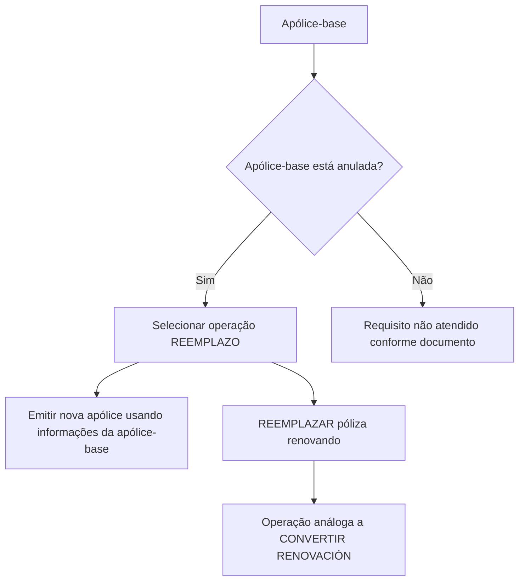

# Documentação de Operação de Emissão (Automóvel) — Reemplazo

## 1. Metadados do Documento
- **Arquivo de Origem:** Não identificado no conteúdo fornecido
- **Tipo de Documento:** Procedimento
- **Domínio / Sistema:** Emissão de apólices de Automóvel; Zeus; Soluciones APIs
- **Público-Alvo:** Operação, negócio e usuários responsáveis pela emissão de apólices
- **Data/Versão Identificada:** Não identificada

---

## 2. Resumo Executivo & Contexto de Negócio

O documento descreve a operação **REEMPLAZO** no contexto de emissão de apólices de Automóvel. A operação permite utilizar uma apólice existente como informação de partida para criar e emitir uma nova apólice.

A finalidade do REEMPLAZO é gerar uma nova apólice com base nas informações de outra apólice que atua como referência. A apólice utilizada como base deve estar anulada, condição explicitamente apresentada como requisito do processo.

O material apresenta duas possibilidades: **REEMPLAZAR póliza** e **REEMPLAZAR póliza renovando**. A segunda possibilidade é definida como uma operação análoga a **CONVERTIR RENOVACIÓN** e também exige que a apólice de origem esteja anulada.

O conteúdo é resumido e não detalha telas, campos obrigatórios, regras de cálculo, métodos HTTP, contratos de integração, etapas operacionais completas ou critérios para conclusão da emissão. A navegação indica disponibilidade de documentos complementares por meio de “Accede al documento”.

---

## 3. Arquitetura, Componentes & Tecnologias Envolvidas

Os elementos explicitamente citados são:

- **Emissão (Automóvel):** contexto funcional da documentação.
- **REEMPLAZO:** operação para emissão de uma nova apólice a partir de uma apólice-base.
- **Apólice-base:** apólice que fornece a informação inicial para criação da nova apólice.
- **CONVERTIR RENOVACIÓN:** operação citada como análoga ao fluxo de “REEMPLAZAR póliza renovando”.
- **Zeus:** item presente na navegação do documento.
- **Soluciones APIs:** item presente na navegação do documento.
- **RS:** item exibido no rodapé/navegação.



> **Nota de Análise:** O documento não detalha sistemas integrados, APIs, endpoints, bancos de dados, tecnologias de implementação, ambientes ou responsabilidades de cada componente citado na navegação.

---

## 4. Regras de Negócio, Especificações Funcionais & Processos

### Operação REEMPLAZO

1. A operação REEMPLAZO permite tomar uma apólice como informação de partida.
2. A finalidade é criar uma nova apólice.
3. A nova apólice é emitida tomando como origem as informações de outra apólice.
4. A apólice de origem serve como base para a geração da nova apólice.
5. A apólice utilizada como base deve estar anulada.

### Possibilidade: REEMPLAZAR póliza

- Consiste em emitir uma apólice utilizando como origem as informações de outra apólice.
- A apólice de origem funciona como base para a geração da nova apólice.
- A apólice-base deve estar anulada.
- O documento indica a existência de material complementar por meio de “Accede al documento”.

### Possibilidade: REEMPLAZAR póliza renovando

- É uma operação análoga a **CONVERTIR RENOVACIÓN**.
- A apólice que serve como base deve estar anulada.
- O documento indica a existência de material complementar por meio de “Accede al documento”.

> **Nota de Análise:** Não são apresentados critérios adicionais para anulação, regras de reaproveitamento de dados, identificação da nova apólice, validações de vigência, tratamento de erros ou autorização de usuários.

---

## 5. Tabelas de Parâmetros, Ambientes e Estruturas de Dados

| Item / Parâmetro | Descrição / Função | Tipo / Valores / Formato | Ambiente / Observações |
| :--- | :--- | :--- | :--- |
| REEMPLAZO | Operação que permite utilizar uma apólice como origem para criar uma nova apólice. | Operação de emissão | Contexto de Emissão (Automóvel). |
| REEMPLAZAR póliza | Emite uma nova apólice com base nas informações de outra apólice. | Possibilidade da operação REEMPLAZO | Requer apólice-base anulada. |
| REEMPLAZAR póliza renovando | Operação análoga a CONVERTIR RENOVACIÓN. | Possibilidade da operação REEMPLAZO | Requer apólice-base anulada. |
| Apólice-base | Apólice cuja informação é utilizada como ponto de partida para gerar a nova apólice. | Apólice de origem | Deve estar anulada. |
| Nova apólice | Apólice resultante da operação REEMPLAZO. | Apólice emitida | Gerada com base nas informações da apólice-base. |
| CONVERTIR RENOVACIÓN | Operação usada como analogia para REEMPLAZAR póliza renovando. | Operação funcional citada | Sem detalhamento adicional no conteúdo. |
| Zeus | Item citado na navegação do documento. | Sistema ou seção não especificada | Sem detalhamento adicional. |
| Soluciones APIs | Item citado na navegação do documento. | Seção ou recurso não especificado | Sem APIs, URLs ou contratos informados. |
| RS | Item exibido no rodapé/navegação. | Sigla não expandida | Sem detalhamento adicional. |

---

## 6. Bateria de Perguntas & Respostas para RAG (FAQ Sintético)

### P1: O que é a operação REEMPLAZO na emissão de apólices de Automóvel?
**R:** REEMPLAZO é uma operação que permite tomar uma apólice como informação de partida para criar e emitir uma nova apólice no contexto de Emissão (Automóvel).

### P2: Qual é o requisito obrigatório para a apólice usada como base no REEMPLAZO?
**R:** A apólice utilizada como base para gerar a nova apólice deve estar anulada.

### P3: A operação REEMPLAZAR póliza cria uma nova apólice?
**R:** Sim. REEMPLAZAR póliza consiste em emitir uma nova apólice usando como origem as informações de outra apólice que serve como base.

### P4: O que acontece se a apólice-base não estiver anulada?
**R:** O requisito documental para a operação não estará atendido, pois o documento afirma que a apólice utilizada como base deve estar anulada. O conteúdo não informa o comportamento do sistema ou uma mensagem de erro para esse cenário.

### P5: O que é REEMPLAZAR póliza renovando?
**R:** REEMPLAZAR póliza renovando é uma possibilidade da operação REEMPLAZO definida como análoga à operação CONVERTIR RENOVACIÓN. A apólice-base também deve estar anulada.

### P6: Qual é a relação entre REEMPLAZAR póliza renovando e CONVERTIR RENOVACIÓN?
**R:** O documento define REEMPLAZAR póliza renovando como uma operação análoga a CONVERTIR RENOVACIÓN, mas não fornece detalhamento funcional adicional dessa analogia.

### P7: Quais informações da apólice-base são reutilizadas na nova apólice?
**R:** O documento informa apenas que a nova apólice é emitida tomando como origem as informações de outra apólice. Não especifica quais campos, coberturas, dados ou atributos são reutilizados.

### P8: O documento informa APIs, endpoints ou métodos HTTP para executar REEMPLAZO?
**R:** Não. Embora “Soluciones APIs” apareça na navegação, o documento não apresenta endpoints, métodos HTTP, contratos JSON, autenticação ou parâmetros de integração.

### P9: O documento apresenta um procedimento operacional completo para REEMPLAZO?
**R:** Não. O conteúdo descreve o conceito da operação, suas duas possibilidades e o requisito de que a apólice-base esteja anulada, mas não apresenta passos de tela, campos, aprovações ou tratamento de exceções.

### P10: Em qual domínio funcional a operação REEMPLAZO está documentada?
**R:** A operação REEMPLAZO está documentada no contexto de **Emisión (Automóvil)**.

---

## 7. Glossário de Termos, Siglas & Conceitos-Chave

- **Apólice-base:** apólice de origem cuja informação é usada para gerar uma nova apólice.
- **CONVERTIR RENOVACIÓN:** operação citada como análoga a REEMPLAZAR póliza renovando; o documento não a detalha.
- **Emisión (Automóvil):** contexto de emissão de apólices de Automóvel.
- **REEMPLAZAR póliza:** possibilidade de emitir uma nova apólice usando informações de uma apólice-base anulada.
- **REEMPLAZAR póliza renovando:** possibilidade de REEMPLAZO análoga a CONVERTIR RENOVACIÓN, usando uma apólice-base anulada.
- **REEMPLAZO:** operação de emissão de nova apólice a partir das informações de outra apólice.
- **RS:** sigla exibida no rodapé; significado não identificado no conteúdo.
- **Soluciones APIs:** item de navegação citado sem detalhamento funcional ou técnico.
- **Zeus:** item de navegação citado sem detalhamento funcional ou técnico.

---

## 8. Notas Críticas, Riscos & Limitações

- O documento possui conteúdo resumido e apresenta apenas uma página.
- A anulação da apólice-base é uma pré-condição crítica para ambas as possibilidades de REEMPLAZO.
- Não há detalhamento sobre como verificar ou executar a anulação da apólice-base.
- Não são especificados campos, dados, coberturas ou informações transferidas da apólice-base para a nova apólice.
- Não há definição de fluxos alternativos, mensagens de erro, autorizações, perfis de acesso ou tratamento de exceções.
- Zeus, Soluciones APIs e RS são apenas citados na navegação; não há evidência suficiente para definir suas responsabilidades.
- Não foram identificadas versões, datas, URLs, ambientes, contratos de API ou informações de observabilidade.

---

## 9. Conteúdo Bruto Estruturado (Referência Fiel)

```text
--- [PÁGINA 1 DE 1] ---

DOCUMENTACIÓN de OPERACIÓN de
EMISIÓN (Automóvil) - REEMPLAZO
REEMPLAZO
Distintas posibilidades que permite tomar una póliza como información
de partida para crear una nueva
REEMPLAZAR póliza
Consiste en EMITIR póliza tomando como
origen la información de otra póliza que sirve
como base para la generación de la nueva
póliza. La póliza que sirve como base debe
estar anulada
 Accede al documento
REEMPLAZAR póliza renovando
Operación análoga a CONVERTIR
RENOVACIÓN. La póliza que sirve como
base debe estar anulada
 Accede al documento
 / 
 RS
Inicio Soluciones APIs Documentación Zeus
ES
```
