# Operações de Emissão de Automóvel — Suplementos, Renovação, Anulação e Reabilitação de Apólices

## 1. Metadados do Documento
- **Arquivo de Origem:** Não identificado no conteúdo fornecido
- **Tipo de Documento:** Manual Operacional
- **Domínio / Sistema:** Emissão de seguros de Automóvel; operações de suplementos sobre apólices
- **Público-Alvo:** Operação, negócio, analistas funcionais e equipes responsáveis por emissão de seguros
- **Data/Versão Identificada:** Não identificada

---

## 2. Resumo Executivo & Contexto de Negócio

O documento descreve operações de emissão relacionadas à alteração, renovação, anulação, liquidação, reabilitação e regularização de apólices de Automóvel. As operações são apresentadas como suplementos ou movimentos aplicáveis à informação, vigência, custo, capital segurado, agente e forma de pagamento de uma apólice.

A operação central é **ALTERAR póliza**, que permite modificar grande parte das informações da apólice. Informações não modificáveis por esse suplemento devem ser tratadas por outros suplementos específicos. Dependendo da alteração, pode haver impacto no custo do seguro, com cobrança ou devolução ao pagador.

O documento diferencia operações aplicadas à vigência atual, à anualidade anterior, a suplementos temporários, a operações suspensas e a renovações previamente calculadas. Também descreve operações de cancelamento e reabilitação, incluindo cenários que modificam ou preservam a vigência e cenários com ou sem efeito econômico.

Não há especificação de contratos de API, métodos HTTP, dados de entrada, estados técnicos, integrações, ambientes, identificadores transacionais ou regras de cálculo detalhadas. O conteúdo define principalmente a finalidade funcional e os impactos declarados de cada operação.

---

## 3. Arquitetura, Componentes & Tecnologias Envolvidas

O conteúdo cita uma área de documentação acessível por meio de referências como **“Inicio Soluciones APIs Documentación Zeus”**, mas não descreve a arquitetura técnica, componentes de software, microsserviços, bases de dados, endpoints, protocolos ou tecnologias de implementação.

O domínio funcional identificado é composto por:

- **Apólice de Automóvel:** entidade afetada pelas operações.
- **Suplemento:** movimento ou operação que modifica informações, vigência, custo, pagamento, capital segurado ou situação da apólice.
- **Pagador do seguro:** parte que pode receber cobrança ou devolução de valor.
- **Agente:** parte associada a comissões e recibos, passível de alteração.
- **Recibos:** registros pendentes que podem ser anulados, redistribuídos ou regenerados.
- **Comissões:** registros anulados e regenerados em operações de mudança de agente.
- **Sinistro:** evento que pode reduzir a soma segurada e, posteriormente, motivar restituição de capital.
- **Renovação:** processo que determina condições e custo do seguro para um novo período de vigência.

```mermaid
graph TD
    A[Apólice de Automóvel] --> B[Suplementos de Alteração]
    A --> C[Operações de Renovação]
    A --> D[Operações de Anulação]
    A --> E[Operações de Reabilitação]
    A --> F[Operações de Regularização]

    B --> B1[Alterar apólice]
    B --> B2[Alterar apólice temporariamente]
    B --> B3[Alterar anualidade anterior]
    B --> B4[Alterar plano de pagamento]
    B --> B5[Alterar mudança de agente]
    B --> B6[Diminuir por sinistro]
    B --> B7[Restituir capital]
    B --> B8[Estender vigência]

    C --> C1[Prerenovar]
    C --> C2[Renovar]
    C --> C3[Renovar desde prerenovação]
    C --> C4[Renovar desde suspensão]
    C --> C5[Converter renovação por migração]

    D --> D1[Anular modificação]
    D --> D2[Anular modificação temporal]
    D --> D3[Anular modificação de anualidade anterior]
    D --> D4[Anular apólice]
    D --> D5[Anular por extinção de risco]

    E --> E1[Reabilitar]
    E --> E2[Reabilitar com extensão de vigência]
    E --> E3[Reabilitar sem extensão de vigência]
    E --> E4[Reabilitar modificando dados]

    F --> F1[Regularizar]
    F --> F2[Liquidar]
```



> **Nota de Análise:** O documento lista operações funcionais, mas não detalha os sistemas executores, interfaces, APIs, contratos JSON, persistência de dados ou fluxo técnico entre componentes.

---

## 4. Regras de Negócio, Especificações Funcionais & Processos

### Operações de alteração

1. **ALTERAR póliza**
   - Permite modificar a maior parte das informações da apólice.
   - Informações que não podem ser modificadas por esse suplemento devem ser modificadas por outros suplementos.
   - Alterações identificadas podem afetar o custo do seguro.
   - O impacto econômico pode provocar cobrança ou devolução ao pagador do seguro.

2. **ALTERAR póliza desde suspensión**
   - Consiste em executar a operação **ALTERAR póliza** após retomar uma operação que havia sido previamente suspensa.

3. **ALTERAR póliza temporalmente**
   - Executa uma operação **ALTERAR póliza** com vencimento anterior ao vencimento da apólice.
   - Caracteriza um suplemento temporal.

4. **ALTERAR póliza anualidad anterior**
   - Permite modificar a apólice em uma data anterior à última renovação vigente realizada.
   - A operação atua sobre a anualidade anterior.
   - Pode afetar o custo do seguro.

5. **ALTERAR póliza plan pago**
   - Anula um ou mais recibos pendentes.
   - Utiliza o valor dos recibos anulados para realizar uma nova distribuição de recibos.
   - Refaz o fracionamento do pagamento.

6. **ALTERAR póliza cambio agente**
   - Anula comissões e recibos.
   - Regenera comissões e recibos para um novo agente.
   - Não afeta o custo do seguro.

7. **DISMINUIR póliza por siniestro**
   - Reduz a soma segurada de uma ou mais coberturas afetadas na tramitação de um sinistro.
   - A redução coincide com a liquidação realizada pela tramitação do sinistro.
   - Não afeta o custo do seguro.

8. **RESTITUIR póliza capital**
   - Restitui a soma segurada que havia sido reduzida anteriormente pela tramitação de um sinistro.
   - A restituição afeta o custo do seguro.

9. **EXTENDER póliza vigencia**
   - Altera o vencimento da apólice para uma data posterior ao vencimento original.
   - A extensão afeta o custo do seguro.

### Operações de regularização e liquidação

1. **REGULARIZAR póliza**
   - Modifica a apólice afetando a anualidade anterior.
   - Atua no período anterior à última renovação vigente.
   - Tem a particularidade de não realizar a cancelação.
   - Normalmente afeta o custo do seguro.

2. **LIQUIDAR póliza**
   - Regulariza a situação em que houve cobrança antecipada de prêmio.
   - Um exemplo citado é a existência de prêmio em depósito por parte do pagador.
   - Pode gerar aumento ou redução do custo do seguro.

### Operações de renovação

1. **PRERENOVAR póliza**
   - Executa uma renovação aplicando todos os critérios para determinar o custo do seguro no novo período da apólice.
   - A operação é registrada virtualmente.
   - O movimento não é real.

2. **RENOVAR póliza**
   - Executa a renovação real da apólice.
   - Determina condições e custo do seguro para um novo período de vigência.

3. **RENOVAR póliza desde prerenovación**
   - Executa a operação **RENOVAR póliza**.
   - Utiliza como base a renovação prévia gerada pela operação **PRERENOVAR póliza**.
   - Renova a apólice a partir das informações previamente geradas.

4. **RENOVAR póliza desde suspensión**
   - Executa a operação **RENOVAR póliza** após retomar uma operação previamente suspensa.

5. **CONVERTIR RENOVACIÓN (cargas en el sistema, renovando)**
   - Executa uma operação equivalente à **RENOVAR póliza**.
   - A origem das informações não é uma apólice da carteira.
   - A informação tem origem em uma migração de outro sistema.
   - A apólice é renovada a partir das informações migradas.

### Operações de anulação

1. **ANULAR póliza modificación**
   - Anula o último suplemento vigente executado sobre a apólice.
   - Desfaz a última modificação sofrida pela apólice.
   - Pode afetar o custo do seguro.

2. **ANULAR póliza modificación temporal**
   - É análoga à operação **ANULAR póliza modificación**.
   - Anula o último suplemento temporal vigente.

3. **ANULAR póliza modificación anualidad anterior**
   - É análoga à operação **ANULAR póliza modificación**.
   - O suplemento de origem foi realizado na anualidade anterior.
   - Anula um movimento gerado pela operação **ALTERAR póliza anualidad anterior**.
   - Pode afetar o valor do seguro.

4. **ANULAR póliza**
   - Cancela a apólice.
   - Pode gerar um valor a devolver ao pagador.

5. **ANULAR póliza extinción riesgo**
   - Aplica-se quando o risco sofreu dano tal que deixa de existir.
   - O documento cita como exemplo um sinistro total.
   - Não implica devolução de custo.

### Operações de reabilitação

1. **REHABILITAR póliza**
   - Anula uma cancelação de apólice.
   - A apólice volta a vigorar na situação anterior à anulação.
   - A reabilitação é efetiva no mesmo dia em que a apólice foi anulada.

2. **REHABILITAR póliza extensión vigencia**
   - É análoga à operação **REHABILITAR póliza**.
   - A data de reabilitação é posterior à data de anulação.
   - A mudança de data provoca extensão da apólice.
   - O vencimento é deslocado pelo mesmo período em que a apólice permaneceu anulada.
   - Não gera custo adicional do seguro.

3. **REHABILITAR póliza sin extensión vigencia**
   - É análoga à operação **REHABILITAR póliza extensión vigencia**.
   - O período em que a apólice permaneceu anulada gera redução de custo no momento da reabilitação.

4. **REHABILITAR póliza modificando cualquier dato**
   - É análoga à operação **REHABILITAR póliza**.
   - Permite modificar qualquer informação da apólice.

---

## 5. Tabelas de Parâmetros, Ambientes e Estruturas de Dados

| Item / Parâmetro | Descrição / Função | Tipo / Valores / Formato | Ambiente / Observações |
| :--- | :--- | :--- | :--- |
| ALTERAR póliza | Modifica grande parte das informações da apólice | Operação de suplemento | Pode afetar o custo; pode gerar cobrança ou devolução |
| ALTERAR póliza desde suspensión | Retoma uma operação suspensa para executar alteração | Operação de suplemento | Não há detalhamento do mecanismo de suspensão |
| ALTERAR póliza temporalmente | Altera a apólice com vencimento anterior ao vencimento da apólice | Suplemento temporal | Vencimento do suplemento é anterior ao vencimento da apólice |
| ALTERAR póliza anualidad anterior | Altera a apólice em data anterior à última renovação vigente | Suplemento de anualidade anterior | Pode afetar o custo |
| ALTERAR póliza plan pago | Anula recibos pendentes e redistribui seus valores | Operação de pagamento | Refaz o fracionamento do pagamento |
| ALTERAR póliza cambio agente | Regenera comissões e recibos para novo agente | Operação de alteração de agente | Não afeta o custo |
| DISMINUIR póliza por siniestro | Reduz soma segurada por liquidação de sinistro | Operação sobre coberturas | Não afeta o custo |
| RESTITUIR póliza capital | Restitui soma segurada reduzida por sinistro | Operação sobre capital segurado | Afeta o custo |
| EXTENDER póliza vigencia | Posterga vencimento original da apólice | Operação sobre vigência | Afeta o custo |
| REGULARIZAR póliza | Modifica a anualidade anterior sem cancelamento | Operação de regularização | Normalmente afeta o custo |
| LIQUIDAR póliza | Regulariza cobrança antecipada de prêmio | Operação de liquidação | Pode aumentar ou reduzir o custo |
| PRERENOVAR póliza | Calcula virtualmente custo e condições para novo período | Renovação virtual | Movimento não é real |
| RENOVAR póliza | Renova realmente a apólice | Renovação real | Define condições e custo para novo período |
| RENOVAR póliza desde prerenovación | Renova usando dados gerados pela prerenovação | Renovação baseada em pré-renovação | Depende da informação de PRERENOVAR |
| RENOVAR póliza desde suspensión | Renova após retomada de operação suspensa | Renovação | Não há detalhamento da suspensão |
| CONVERTIR RENOVACIÓN | Renova apólice a partir de dados migrados | Renovação por migração | Origem não é apólice da carteira |
| ANULAR póliza modificación | Desfaz o último suplemento vigente | Anulação de suplemento | Pode afetar o custo |
| ANULAR póliza modificación temporal | Anula último suplemento temporal vigente | Anulação de suplemento temporal | Análoga à anulação de modificação |
| ANULAR póliza modificación anualidad anterior | Anula alteração realizada na anualidade anterior | Anulação de suplemento | Pode afetar o valor do seguro |
| ANULAR póliza | Cancela a apólice | Anulação/cancelamento | Pode gerar devolução ao pagador |
| ANULAR póliza extinción riesgo | Cancela devido à inexistência do risco | Anulação por extinção do risco | Não devolve custo |
| REHABILITAR póliza | Desfaz cancelamento no mesmo dia | Reabilitação | Retorna à situação anterior |
| REHABILITAR póliza extensión vigencia | Reabilita posteriormente e estende a vigência | Reabilitação com extensão | Não gera custo adicional |
| REHABILITAR póliza sin extensión vigencia | Reabilita sem extensão da vigência | Reabilitação sem extensão | Gera redução de custo |
| REHABILITAR póliza modificando cualquier dato | Reabilita permitindo modificar informações | Reabilitação com alteração | Não há lista dos campos modificáveis |

> **Nota de Análise:** O conteúdo não apresenta URLs de ambiente, servidores, caminhos de logs, variáveis de configuração, portas, identificadores de API, formatos de payload ou esquemas de dados.

---

## 6. Bateria de Perguntas & Respostas para RAG (FAQ Sintético)

### P1: Qual operação permite modificar a maior parte das informações de uma apólice de Automóvel?
**R:** A operação **ALTERAR póliza** permite modificar a maior parte das informações da apólice. Informações que não podem ser alteradas por esse suplemento devem ser tratadas por outros suplementos específicos. A operação pode afetar o custo do seguro e gerar cobrança ou devolução ao pagador.

### P2: Como alterar uma apólice cuja operação anterior estava suspensa?
**R:** Deve-se utilizar **ALTERAR póliza desde suspensión**. Essa operação consiste em realizar **ALTERAR póliza** após retomar a operação que havia sido previamente suspensa. O documento não detalha o mecanismo técnico de suspensão ou retomada.

### P3: O que caracteriza a operação ALTERAR póliza temporalmente?
**R:** **ALTERAR póliza temporalmente** executa uma alteração cujo vencimento é anterior ao vencimento da apólice. Essa característica define a operação como um suplemento temporal.

### P4: Em que situação deve ser utilizada ALTERAR póliza anualidad anterior?
**R:** **ALTERAR póliza anualidad anterior** é utilizada quando é necessário modificar a apólice em uma data anterior à última renovação vigente realizada. A operação pode afetar o custo do seguro.

### P5: O que ocorre na alteração do plano de pagamento da apólice?
**R:** A operação **ALTERAR póliza plan pago** anula um ou vários recibos pendentes e utiliza o valor correspondente para gerar uma nova distribuição de recibos. Na prática, a operação refaz o fracionamento do pagamento.

### P6: A alteração de agente modifica o custo do seguro?
**R:** Não. A operação **ALTERAR póliza cambio agente** anula comissões e recibos e os regenera para um novo agente, mas o documento declara expressamente que ela não afeta o custo do seguro.

### P7: Como a soma segurada é tratada após a liquidação de um sinistro?
**R:** A operação **DISMINUIR póliza por siniestro** reduz a soma segurada de uma ou mais coberturas afetadas pelo sinistro. A redução coincide com a liquidação realizada pela tramitação do sinistro e não afeta o custo do seguro.

### P8: Qual operação restitui capital anteriormente reduzido por sinistro?
**R:** **RESTITUIR póliza capital** restitui a soma segurada que foi reduzida previamente pela tramitação de um sinistro. Diferentemente da redução por sinistro, a restituição afeta o custo do seguro.

### P9: Qual é a diferença entre PRERENOVAR póliza e RENOVAR póliza?
**R:** **PRERENOVAR póliza** aplica critérios para determinar condições e custo do seguro para o novo período, mas registra o movimento virtualmente, sem produzir movimento real. **RENOVAR póliza** realiza a renovação real e determina as condições e o custo para um novo período de vigência.

### P10: Como funciona RENOVAR póliza desde prerenovación?
**R:** **RENOVAR póliza desde prerenovación** executa a renovação usando como base as informações geradas anteriormente pela operação **PRERENOVAR póliza**.

### P11: O que é ANULAR póliza modificación?
**R:** **ANULAR póliza modificación** anula o último suplemento vigente realizado sobre a apólice, desfazendo a última modificação sofrida. A operação pode afetar o custo do seguro.

### P12: Quando ANULAR póliza extinción riesgo deve ser aplicada?
**R:** **ANULAR póliza extinción riesgo** deve ser aplicada quando o risco sofreu dano de tal magnitude que deixa de existir, como no exemplo de sinistro total apresentado no documento. Essa operação não implica devolução de custo.

### P13: Qual é o efeito da reabilitação com extensão de vigência?
**R:** **REHABILITAR póliza extensión vigencia** reabilita a apólice em data posterior à anulação. O vencimento é deslocado pelo mesmo tempo em que a apólice permaneceu anulada, sem gerar custo adicional do seguro.

### P14: Qual reabilitação gera redução de custo?
**R:** **REHABILITAR póliza sin extensión vigencia** gera redução de custo no momento da reabilitação, pois o período em que a apólice permaneceu anulada não é compensado por extensão da vigência.

---

## 7. Glossário de Termos, Siglas & Conceitos-Chave

- **Apólice / Póliza:** contrato de seguro afetado pelas operações descritas.
- **Suplemento:** operação que modifica informações, situação, vigência, custo, pagamento ou capital segurado de uma apólice.
- **Anualidade anterior:** período anterior à última renovação vigente realizada.
- **Cobertura:** elemento da apólice cuja soma segurada pode ser reduzida em função de sinistro.
- **Custo do seguro:** valor econômico do seguro, que pode ser afetado por determinadas operações.
- **Pagador:** parte responsável pelo pagamento do seguro e potencial destinatária de cobrança ou devolução.
- **Recibo:** registro de cobrança ou pagamento que pode ser anulado, redistribuído ou regenerado.
- **Comissão:** valor ou registro associado ao agente, que pode ser anulado e regenerado.
- **Sinistro:** evento cuja tramitação pode provocar redução da soma segurada.
- **Soma segurada:** capital associado a uma ou mais coberturas, sujeito a redução ou restituição.
- **Prêmio:** valor do seguro; o documento cita o caso de prêmio em depósito como exemplo de cobrança antecipada.
- **Prerenovação:** renovação virtual usada para determinar previamente condições e custo para novo período.
- **Renovação:** determinação das condições e do custo do seguro para novo período de vigência.
- **Extinção de risco:** situação na qual o risco deixa de existir, como em um sinistro total.
- **Reabilitação:** anulação de uma cancelação de apólice para restaurar sua vigência.

---

## 8. Notas Críticas, Riscos & Limitações

- O documento não identifica o arquivo de origem, a versão, a data de publicação ou responsáveis pelo processo.
- O documento não especifica critérios de elegibilidade, validações, aprovações, perfis de acesso ou pré-condições para cada operação.
- Não há detalhamento sobre como calcular cobrança, devolução, incremento, decremento, redução de custo ou impacto no custo do seguro.
- Não foram fornecidos endpoints, métodos HTTP, contratos de integração, estruturas de dados, códigos de erro, logs ou ambientes.
- As referências “Accede al documento” indicam documentação adicional, mas o conteúdo acessível desses documentos não foi fornecido.
- A expressão original “este suplemento no halla la cancelación” foi preservada conceitualmente como ausência de cancelamento; o documento não detalha tecnicamente essa particularidade.
- Não há máquina de estados formal para apólice, suplemento, suspensão, cancelamento, reabilitação ou renovação.
- **Nota de Análise:** Não é possível inferir se operações com impacto de custo acionam faturamento, contabilização, cobrança externa ou recálculo automático, pois essas regras não estão presentes no texto.

---

## 9. Conteúdo Bruto Estruturado (Referência Fiel)

```text
--- [PÁGINA 1 DE 4] ---

DOCUMENTACIÓN de OPERACIÓN de
EMISIÓN (Automóvil) - SUPLEMENTO
SUPLEMENTO
Operaciones relacionadas con la modificación de la información que
contiene una póliza o aplicación
ALTERAR póliza
Permite la modificación de la mayor parte de
la información de la póliza. La información
que no se permite modificar en este
suplemento, se permite mediante otros
suplementos. Los cambios identificados
pueden afectar al coste del seguro,
provocando un cobro o devolución al pagador
del seguro
ALTERAR póliza desde suspensión
Consiste en realizar la operación ALTERAR
póliza, habiendo retomado la operación que
había sido previamente suspendida
 Accede al documento
 / 
 RS
Inicio Soluciones APIs Documentación Zeus
ES


--- [PÁGINA 2 DE 4] ---

Accede al documento
ALTERAR póliza temporalmente
Realiza una operación ALTERAR póliza cuyo
vencimiento es anterior al vencimiento de la
póliza. Es decir, se realiza un suplemento
temporal
 Accede al documento
ALTERAR póliza anualidad anterior
Permite realizar una modificación de la póliza,
pero a una fecha anterior a la última
renovación vigente realizada. Puede afectar al
coste del seguro
 Accede al documento
ANULAR póliza modificación
Consiste en anular el último suplemento
vigente realizado sobre la póliza. Es decir, se
"deshace" la última modificación que haya
sufrido la póliza. Puede afectar al coste del
seguro
 Accede al documento
ANULAR póliza modificación temporal
Esta operación es análoga a ANULAR póliza
modificación, pero anula el últimos
suplemento temporal vigente
 Accede al documento
ALTERAR póliza plan pago
Realiza la anulación de uno o varios recibos
pendientes y con ese importe se realiza una
nueva distribución de recibos. Es decir, se
vuelve a fraccionar el pago
 Accede al documento
ALTERAR póliza cambio agente
Realiza la anulación de las comisiones y
recibos y regenera las comisiones y recibos
para un nuevo agente. No afecta al coste del
seguro
 Accede al documento
DISMINUIR póliza por siniestro
Reduce la suma asegurada de una o varias
coberturas afectadas en la tramitación de un
siniestro. La reducción coincide con la
liquidación realizada por la tramitación. No
afecta al coste del seguro
 Accede al documento
RESTITUIR póliza capital
Restituye la suma asegurada que
previamente ha sido reducida por la
tramitación de un siniestro. La restitución
afecta al coste del seguro
 Accede al documento
EXTENDER póliza vigencia
 REGULARIZAR póliza


--- [PÁGINA 3 DE 4] ---

Altera el vencimiento de la póliza llevándolo a
una fecha posterior al vencimiento original.
Esta alteración afecta al coste del seguro
 Accede al documento
Modificación de la póliza que afecta a la
anualidad anterior. Es decir, al periodo previo
a la última renovación vigente. Tiene la
particularidad de que este suplemento no
halla la cancelación por lo que es normal que
afecte al coste del seguro
 Accede al documento
LIQUIDAR póliza
Modificación que permite regularizar la
situación cuando hubo un cobro anticipado de
prima (por ejemplo hubo una prima en
depósito por parte del pagador). Este
suplemento puede implicar un incremento o
decremento del coste del seguro
 Accede al documento
PRERENOVAR póliza
Realiza una renovación aplicando todos los
criterios con el fin de determinar cual será el
coste del seguro para el nuevo periodo de la
póliza. Tiene la salvedad que la operación se
registra de forma virtual por lo que el
movimiento no es real
 Accede al documento
RENOVAR póliza
Realiza la renovación real de la póliza. Es
decir, se determina las condiciones y el coste
del seguro para un nuevo periodo de vigencia
 Accede al documento
RENOVAR póliza desde prerenovación
Realiza la operación RENOVAR póliza, pero
la base es la renovación previa que se hizo.
Es decir, toma la información generada por la
operación PRERENOVAR póliza y renueva la
póliza
 Accede al documento
RENOVAR póliza desde suspensión
Consiste en realizar la operación RENOVAR
póliza, habiendo retomando la operación que
había sido previamente suspendida
 Accede al documento
CONVERTIR RENOVACIÓN (cargas en el
sistema, renovando)
Consiste en realizar la operación RENOVAR
póliza, salvo que el origen de la información
no es una póliza de la cartera, la información
parte de una migración de otro sistema. Es
decir, con la información migrada desde otro
sistema, se produce una renovación de póliza
 Accede al documento
ANULAR póliza modificación anualidad
anterior
ANULAR póliza


--- [PÁGINA 4 DE 4] ---

Es un movimiento análogo a ANULAR póliza
modificación, pero el origen es un suplemento
realizado a la anualidad anterior. Es decir se
anula un movimiento generado con la
peración ALTERAR póliza anualidad anterior.
Este movimiento puede afectar al importe del
seguro
 Accede al documento
Realiza la cancelación de la póliza, puede
generar un importe a devolver al pagador
 Accede al documento
ANULAR póliza extinción riesgo
Este movimiento se aplica cuando el riesgo
ha sufrido tal daño que el deja de existir
(como por ejemplo un siniestro total). Este
movimiento no implica devolución de coste
 Accede al documento
REHABILITAR póliza
Es la anulación de una cancelación de póliza.
Es decir, la póliza vuelve a estar vigente con
la situación previa a la anulación. La
Rehabilitación es efectiva el mismo día en el
que se anuló la póliza
 Accede al documento
REHABILITAR póliza extensión vigencia
Operación análoga a REHABILITAR póliza,
salvo que la fecha de rehabilitación es
posterior a la fecha de anulación de la póliza.
Este cambio en la fecha, implica una
extensión de la póliza (el vencimiento se
mueve tanto tiempo como la póliza estuvo
anulada) y no genera coste adicional del
seguro
 Accede al documento
REHABILITAR póliza sin extensión
vigencia
Análoga a la operación REHABILITAR póliza
extensión vigencia, salvo que el tiempo en el
que la póliza estuvo anulada genera una
reducción de coste a la hora de rehabilitar
 Accede al documento
REHABILITAR póliza modificando
cualquier dato
Análoga a la operación REHABILITAR póliza,
pero permite modificar cualquier información
de esta
 Accede al documento
```
