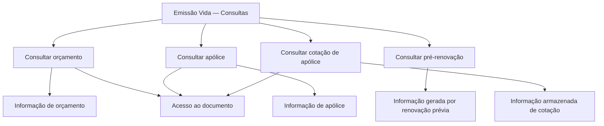

# Documentação de Operação de Emissão (Vida) — Consultas

## 1. Metadados do Documento
- **Arquivo de Origem:** Não identificado no conteúdo fornecido
- **Tipo de Documento:** Manual Operacional
- **Domínio / Sistema:** Emissão (Vida) — Consultas
- **Público-Alvo:** Operação, Negócio e usuários de consulta
- **Data/Versão Identificada:** Não identificada

---

## 2. Resumo Executivo & Contexto de Negócio

O documento descreve opções de consulta disponíveis no contexto de **Emissão (Vida)**. O objetivo apresentado é possibilitar acesso a informações de orçamento, apólice, pré-renovação e cotação de apólice.

A consulta de orçamento mostra informações relacionadas a um orçamento previamente localizado por diferentes critérios de busca. A consulta de apólice permite acessar informações de uma apólice após uma seleção prévia, também baseada em diferentes critérios de busca.

A consulta de pré-renovação permite acessar informações geradas por uma renovação anterior. A consulta de cotação de apólice direciona o usuário às informações armazenadas relativas a uma cotação.

O conteúdo não descreve sistemas técnicos, integrações, contratos, autenticação, URLs operacionais, métodos HTTP, formatos de dados ou critérios específicos de busca. O documento limita-se à apresentação funcional das opções de consulta.

---

## 3. Arquitetura, Componentes & Tecnologias Envolvidas

O documento não identifica componentes técnicos, microsserviços, bancos de dados, tecnologias, ambientes ou ferramentas. As entidades funcionais explicitamente citadas são:

- Orçamento
- Apólice
- Pré-renovação
- Cotação de apólice
- Documento associado a algumas opções de consulta



> **Nota de Análise:** O diagrama representa exclusivamente as relações funcionais explicitadas no conteúdo. O documento não detalha arquitetura de software, fluxo de integração, persistência de dados ou responsabilidades técnicas.

---

## 4. Regras de Negócio, Especificações Funcionais & Processos

### Consulta de orçamento

1. O usuário utiliza a opção **CONSULTAR presupuesto**.
2. O orçamento deve ter sido previamente localizado.
3. A localização pode ocorrer por distintos critérios de busca, sem detalhamento dos critérios.
4. A consulta mostra as informações relacionadas ao orçamento.
5. A opção indica acesso ao documento.

### Consulta de apólice

1. O usuário utiliza a opção **CONSULTAR póliza**.
2. A seleção da apólice deve ter sido previamente facilitada por distintos critérios de busca.
3. A consulta permite acesso às informações da apólice.
4. A opção indica acesso ao documento.

### Consulta de pré-renovação

1. O usuário utiliza a opção **CONSULTAR prerenovacion**.
2. A consulta facilita o acesso às informações geradas por uma renovação prévia.
3. O documento não especifica critérios de busca, status de renovação, documentos acessíveis ou campos retornados.

### Consulta de cotação de apólice

1. O usuário utiliza a opção **CONSULTAR cotización póliza**.
2. A consulta acessa informações armazenadas relativas a uma cotação.
3. A opção indica acesso ao documento.
4. O documento não especifica quais informações compõem a cotação nem onde elas são armazenadas.

---

## 5. Tabelas de Parâmetros, Ambientes e Estruturas de Dados

| Item / Parâmetro | Descrição / Função | Tipo / Valores / Formato | Ambiente / Observações |
| :--- | :--- | :--- | :--- |
| CONSULTAR presupuesto | Mostra informações relacionadas a um orçamento. | Opção de consulta funcional. | O orçamento deve ser previamente localizado por distintos critérios de busca. |
| Orçamento | Entidade consultada pela opção de consulta de orçamento. | Não detalhado. | O documento não informa campos, identificadores ou critérios de busca. |
| CONSULTAR póliza | Permite acessar informações de uma apólice. | Opção de consulta funcional. | A seleção é previamente facilitada por distintos critérios de busca. |
| Apólice | Entidade consultada pela opção de consulta de apólice. | Não detalhado. | O documento não informa campos, identificadores ou critérios de busca. |
| CONSULTAR prerenovacion | Facilita acesso a informações geradas por renovação prévia. | Opção de consulta funcional. | Não há detalhamento adicional. |
| Pré-renovação | Informações geradas por uma renovação anterior. | Não detalhado. | Não são descritos status, atributos ou critérios de seleção. |
| CONSULTAR cotización póliza | Acessa informações armazenadas relativas a uma cotação. | Opção de consulta funcional. | O documento indica acesso ao documento. |
| Cotação de apólice | Informação armazenada relativa a uma cotação. | Não detalhado. | Não são descritos campos, armazenamento ou critérios de busca. |
| Accede al documento | Indicação de acesso ao documento. | Ação ou referência documental. | Aparece para orçamento, apólice e cotação de apólice. |
| Home Solutions APIs Documentation Zeus | Texto de navegação ou referência presente no rodapé. | Não detalhado. | Não há explicação sobre função, URL ou integração. |
| CF | Texto presente no rodapé da primeira página. | Não detalhado. | Significado não identificado. |

---

## 6. Bateria de Perguntas & Respostas para RAG (FAQ Sintético)

### P1: Quais opções de consulta são apresentadas na documentação de Emissão (Vida)?
**R:** A documentação apresenta quatro opções: **CONSULTAR presupuesto**, **CONSULTAR póliza**, **CONSULTAR prerenovacion** e **CONSULTAR cotización póliza**.

### P2: O que a opção CONSULTAR presupuesto permite consultar?
**R:** A opção **CONSULTAR presupuesto** mostra as informações relacionadas a um orçamento que tenha sido previamente localizado mediante distintos critérios de busca.

### P3: Quais critérios de busca podem ser usados para localizar um orçamento?
**R:** O documento informa apenas que o orçamento pode ser previamente localizado mediante distintos critérios de busca. Os critérios específicos não são detalhados.

### P4: Qual é a finalidade da opção CONSULTAR póliza?
**R:** A opção **CONSULTAR póliza** permite acessar as informações de uma apólice cuja seleção tenha sido previamente facilitada por distintos critérios de busca.

### P5: A documentação informa quais campos são exibidos na consulta de apólice?
**R:** Não. O documento afirma que a consulta permite acessar informações de uma apólice, mas não identifica campos, atributos, identificadores ou estrutura dos dados retornados.

### P6: O que pode ser consultado em CONSULTAR prerenovacion?
**R:** A opção **CONSULTAR prerenovacion** facilita o acesso às informações que foram geradas por uma renovação prévia.

### P7: O documento detalha o fluxo ou as condições de uma pré-renovação?
**R:** Não. O documento apenas informa que a consulta de pré-renovação acessa informações geradas por uma renovação anterior; não há detalhamento de condições, estados, validações ou regras adicionais.

### P8: Qual é o objetivo de CONSULTAR cotización póliza?
**R:** A opção **CONSULTAR cotización póliza** acessa informações armazenadas relativas a uma cotação.

### P9: Há acesso a documento nas opções de consulta?
**R:** Sim. O texto indica **“Accede al documento”** nas seções de consulta de orçamento, consulta de apólice e consulta de cotação de apólice.

### P10: A documentação descreve APIs, endpoints ou contratos técnicos?
**R:** Não. Embora o rodapé contenha o texto “Home Solutions APIs Documentation Zeus”, não são fornecidos endpoints, métodos HTTP, URLs, contratos JSON, autenticação ou detalhes de integração.

---

## 7. Glossário de Termos, Siglas & Conceitos-Chave

- **Emisión (Vida):** Contexto de emissão associado ao domínio de Vida, conforme título do documento.
- **CONSULTAR presupuesto:** Opção para mostrar informações relacionadas a um orçamento previamente localizado.
- **Presupuesto:** Orçamento consultável mediante critérios de busca não especificados.
- **CONSULTAR póliza:** Opção para acessar informações de uma apólice previamente selecionada.
- **Póliza:** Apólice cujas informações podem ser acessadas pela opção de consulta correspondente.
- **CONSULTAR prerenovacion:** Opção para facilitar acesso a informações geradas por uma renovação prévia.
- **Prerenovacion:** Pré-renovação; informações originadas de uma renovação anterior.
- **CONSULTAR cotización póliza:** Opção para acessar informações armazenadas relativas a uma cotação.
- **Cotización:** Cotação armazenada, relacionada a uma apólice.
- **CF:** Sigla ou texto presente no rodapé; significado não identificado no conteúdo.
- **Zeus:** Termo presente em “Home Solutions APIs Documentation Zeus”; significado e função não detalhados.

---

## 8. Notas Críticas, Riscos & Limitações

- O nome do arquivo de origem não foi identificado no conteúdo fornecido.
- Não há data, versão, autor, área responsável ou histórico de alterações.
- Os critérios de busca para orçamento e apólice são citados, mas não são definidos.
- Não são especificados campos retornados, formatos de dados, filtros, mensagens de erro, permissões ou regras de acesso.
- Não há detalhes sobre ambiente, URL, autenticação, APIs, integrações, logs ou tecnologias.
- O texto “Home Solutions APIs Documentation Zeus” não possui detalhamento adicional que permita caracterizá-lo como sistema, portal, API ou ambiente.
- A opção **CONSULTAR prerenovacion** não contém indicação explícita de acesso a documento na extração fornecida.
- **Nota de Análise:** O documento apresenta funcionalidades de consulta em nível resumido e não fornece detalhamento técnico ou operacional suficiente para implementação, suporte de incidentes ou definição de contratos de integração.

---

## 9. Conteúdo Bruto Estruturado (Referência Fiel)

```text
--- [PÁGINA 1 DE 2] ---

DOCUMENTACIÓN de OPERACIÓN de
EMISIÓN (Vida) - CONSULTA
CONSULTAS
Distintas opciones de consulta
CONSULTAR presupuesto
Muestra la información relacionada con un
presupuesto, previamente ubicado mediante
distintos criterios de búsqueda
 Accede al documento
CONSULTAR póliza
Permite el acceso a la información de una
póliza, donde previamente se ha facilitado la
selección mediante distintos criterios de
búsqueda
 Accede al documento
CONSULTAR prerenovacion
Facilita el acceso a la información que ha sido
generada por una renovación previa
CONSULTAR cotización póliza
Accede a la información almacenada relativa
a una cotización
 /
 CF
Home Solutions APIs Documentation Zeus
EN


--- [PÁGINA 2 DE 2] ---

Accede al documento
  Accede al documento
```
