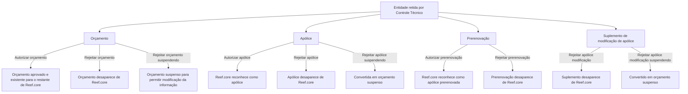

# Documentação de Operação de Emissão (Vida) — Controle Técnico

## 1. Metadados do Documento
- **Arquivo de Origem:** Não identificado
- **Tipo de Documento:** Manual Operacional
- **Domínio / Sistema:** Emissão (Vida), Controle Técnico, Reef.core
- **Público-Alvo:** Operação, Negócio, Desenvolvedores e Arquitetos
- **Data/Versão Identificada:** Não identificada

---

## 2. Resumo Executivo & Contexto de Negócio

O documento descreve operações de autorização e rejeição aplicáveis a entidades retidas por **controle técnico** no processo de emissão do domínio de Vida. As entidades explicitamente citadas são orçamento, apólice, prerenovação e suplemento de modificação de apólice.

As operações de autorização liberam entidades retidas para que sejam reconhecidas pelo restante de **Reef.core**. A autorização de orçamento faz o orçamento passar ao estado aprovado. A autorização de apólice permite que Reef.core reconheça a entidade como apólice. A autorização de prerenovação permite que uma apólice previamente renovada e retida seja reconhecida como apólice prerenovada.

As operações de rejeição impedem a autorização de entidades submetidas ao controle técnico. Dependendo da operação selecionada, a entidade pode desaparecer de Reef.core ou converter-se em orçamento suspenso.

A suspensão oferece oportunidade para modificar a informação que gerou o controle técnico. O documento não detalha os critérios que disparam a retenção, as permissões necessárias para executar as operações, os métodos HTTP, os contratos JSON, os responsáveis operacionais ou os mecanismos técnicos de persistência e integração.

---

## 3. Arquitetura, Componentes & Tecnologias Envolvidas

### Componentes e conceitos identificados

| Componente / Entidade | Papel descrito |
| :--- | :--- |
| **Controle Técnico** | Mecanismo no qual orçamentos, apólices, prerenovações ou suplementos podem ficar retidos e sujeitos a operações de autorização ou rejeição. |
| **Reef.core** | Sistema que passa a reconhecer entidades autorizadas; também é o sistema do qual determinadas entidades rejeitadas desaparecem. |
| **Orçamento** | Entidade que pode ser autorizada, rejeitada ou rejeitada com suspensão. |
| **Apólice** | Entidade que pode ser autorizada, rejeitada ou rejeitada com suspensão. |
| **Prerenovação** | Renovação prévia de uma apólice que pode ser autorizada ou rejeitada. |
| **Suplemento de apólice** | Modificação realizada em uma apólice; pode ser rejeitada ou rejeitada com suspensão. |
| **Home Solutions APIs Documentation Zeus** | Texto listado na página 1 sem detalhamento de função, integração ou relação explícita com as operações. |
| **CF** | Termo listado na página 1 sem detalhamento adicional. |



> **Nota de Análise:** O documento descreve fluxos operacionais e estados de negócio, mas não apresenta arquitetura de infraestrutura, microsserviços, APIs, bancos de dados, URLs, protocolos, tecnologias, ambientes ou contratos de integração.

---

## 4. Regras de Negócio, Especificações Funcionais & Processos

### 4.1 Autorizar orçamento

1. A operação é aplicada a um orçamento retido por controle técnico.
2. O orçamento passa ao estado aprovado.
3. Como consequência, o orçamento passa a existir para o restante de Reef.core.

### 4.2 Autorizar apólice

1. A operação é aplicada a uma apólice retida por controle técnico.
2. A apólice passa a estar aprovada.
3. Como consequência, o restante de Reef.core reconhece a entidade como apólice.

### 4.3 Autorizar prerenovação

1. A operação é aplicada a uma apólice previamente renovada e retida por controle técnico.
2. A entidade passa a estar aprovada.
3. Como consequência, o restante de Reef.core reconhece a entidade como apólice prerenovada.

### 4.4 Rejeitar orçamento

1. A operação é aplicada a um orçamento retido por controle técnico.
2. O orçamento não é autorizado.
3. Como consequência, o orçamento desaparece de Reef.core.

### 4.5 Rejeitar orçamento suspendendo

1. A operação é aplicada a um orçamento retido por controle técnico.
2. O orçamento não é autorizado.
3. O orçamento passa a converter-se em orçamento suspenso.
4. A suspensão oferece oportunidade para modificar a informação que gerou o controle técnico.

### 4.6 Rejeitar apólice

1. A operação é aplicada a uma apólice retida por controle técnico.
2. A apólice não é autorizada.
3. Como consequência, a apólice desaparece de Reef.core.

### 4.7 Rejeitar apólice suspendendo

1. A operação é aplicada a uma apólice retida por controle técnico.
2. A apólice não é autorizada.
3. A apólice passa a converter-se em orçamento suspenso.
4. A suspensão oferece oportunidade para modificar a informação que gerou o controle técnico.

### 4.8 Rejeitar apólice modificação

1. A operação é aplicada a um suplemento realizado em uma apólice que ficou retido por controle técnico.
2. O suplemento não é autorizado.
3. Como consequência, o suplemento desaparece de Reef.core.

### 4.9 Rejeitar apólice modificação suspendendo

1. A operação é aplicada a um suplemento realizado em uma apólice que ficou retido por controle técnico.
2. O suplemento não é autorizado.
3. O suplemento passa a converter-se em orçamento suspenso.
4. A suspensão oferece oportunidade para modificar a informação que gerou o controle técnico.

### 4.10 Rejeitar prerenovação

1. A operação é aplicada a uma renovação prévia de uma apólice retida por controle técnico.
2. A renovação prévia não é autorizada.
3. Como consequência, a renovação prévia desaparece de Reef.core.

---

## 5. Tabelas de Parâmetros, Ambientes e Estruturas de Dados

| Item / Parâmetro | Descrição / Função | Tipo / Valores / Formato | Ambiente / Observações |
| :--- | :--- | :--- | :--- |
| Autorizar orçamento | Aprova orçamento retido por controle técnico. | Operação de negócio | O orçamento passa a existir para o restante de Reef.core. |
| Autorizar apólice | Aprova apólice retida por controle técnico. | Operação de negócio | Reef.core reconhece a entidade como apólice. |
| Autorizar prerenovação | Aprova apólice previamente renovada e retida por controle técnico. | Operação de negócio | Reef.core reconhece a entidade como apólice prerenovada. |
| Rejeitar orçamento | Rejeita orçamento retido por controle técnico. | Operação de negócio | O orçamento desaparece de Reef.core. |
| Rejeitar orçamento suspendendo | Rejeita orçamento e o converte em orçamento suspenso. | Operação de negócio | Permite modificar a informação que gerou o controle técnico. |
| Rejeitar apólice | Rejeita apólice retida por controle técnico. | Operação de negócio | A apólice desaparece de Reef.core. |
| Rejeitar apólice suspendendo | Rejeita apólice e a converte em orçamento suspenso. | Operação de negócio | Permite modificar a informação que gerou o controle técnico. |
| Rejeitar apólice modificação | Rejeita suplemento de uma apólice retido por controle técnico. | Operação de negócio | O suplemento desaparece de Reef.core. |
| Rejeitar apólice modificação suspendendo | Rejeita suplemento de uma apólice e o converte em orçamento suspenso. | Operação de negócio | Permite modificar a informação que gerou o controle técnico. |
| Rejeitar prerenovação | Rejeita renovação prévia de uma apólice retida por controle técnico. | Operação de negócio | A renovação prévia desaparece de Reef.core. |
| Estado aprovado | Estado resultante das operações de autorização descritas. | Estado de negócio | Produz reconhecimento ou existência no restante de Reef.core, conforme a entidade. |
| Orçamento suspenso | Estado resultante de determinadas rejeições com suspensão. | Estado de negócio | Destinado a permitir a modificação da informação que originou o controle técnico. |

> **Nota de Análise:** O documento não contém parâmetros técnicos, tipos de dados, campos, URLs, servidores, rotas de logs, credenciais, portas, ambientes ou valores de configuração.

---

## 6. Bateria de Perguntas & Respostas para RAG (FAQ Sintético)

### P1: O que acontece quando um orçamento retido por controle técnico é autorizado?
**R:** O orçamento passa a estar aprovado e, como consequência, passa a existir para o restante de Reef.core.

### P2: Qual é o resultado da operação de autorizar uma apólice retida por controle técnico?
**R:** A apólice passa a estar aprovada e o restante de Reef.core passa a reconhecê-la como apólice.

### P3: Quando Reef.core reconhece uma entidade como apólice prerenovada?
**R:** Reef.core reconhece a entidade como apólice prerenovada quando uma apólice previamente renovada, retida por controle técnico, é aprovada por meio da operação de autorizar prerenovação.

### P4: O que ocorre ao rejeitar um orçamento sem suspensão?
**R:** O orçamento retido por controle técnico não é autorizado e desaparece de Reef.core.

### P5: Qual é a diferença entre rejeitar orçamento e rejeitar orçamento suspendendo?
**R:** Em ambos os casos o orçamento não é autorizado. Na rejeição comum, o orçamento desaparece de Reef.core. Na rejeição suspendendo, o orçamento é convertido em orçamento suspenso para permitir modificar a informação que gerou o controle técnico.

### P6: O que acontece quando uma apólice é rejeitada com suspensão?
**R:** A apólice retida por controle técnico não é autorizada e passa a converter-se em orçamento suspenso, permitindo modificar a informação que gerou o controle técnico.

### P7: Como é tratado um suplemento de modificação de apólice rejeitado sem suspensão?
**R:** Um suplemento realizado em uma apólice e retido por controle técnico não é autorizado; como consequência, o suplemento desaparece de Reef.core.

### P8: Qual é o resultado de rejeitar um suplemento de modificação de apólice suspendendo?
**R:** O suplemento não é autorizado e passa a converter-se em orçamento suspenso, possibilitando modificar a informação que gerou o controle técnico.

### P9: O que acontece ao rejeitar uma prerenovação?
**R:** Uma renovação prévia de uma apólice que ficou retida por controle técnico não é autorizada e desaparece de Reef.core.

### P10: O documento define quais informações devem ser modificadas após uma rejeição com suspensão?
**R:** Não. O documento informa que a suspensão permite modificar a informação que gerou o controle técnico, mas não especifica quais campos, dados ou critérios devem ser alterados.

### P11: O documento informa APIs, métodos HTTP ou contratos JSON para as operações de controle técnico?
**R:** Não. O documento apenas lista as operações de autorização e rejeição e seus efeitos de negócio em Reef.core; não apresenta métodos HTTP, endpoints, contratos JSON ou detalhes técnicos de integração.

### P12: Quais operações fazem uma entidade desaparecer de Reef.core?
**R:** Rejeitar orçamento, rejeitar apólice, rejeitar apólice modificação e rejeitar prerenovação fazem as respectivas entidades desaparecerem de Reef.core. As operações de rejeição com suspensão convertem a entidade em orçamento suspenso.

---

## 7. Glossário de Termos, Siglas & Conceitos-Chave

- **Apólice:** Entidade de negócio que pode ficar retida por controle técnico e ser autorizada, rejeitada ou rejeitada com suspensão.
- **CF:** Termo exibido no documento sem significado ou detalhamento identificado.
- **Controle Técnico:** Contexto de retenção de entidades e execução das operações de autorização e rejeição descritas.
- **Orçamento:** Entidade que pode ser aprovada, removida de Reef.core ou convertida em orçamento suspenso.
- **Orçamento suspenso:** Estado resultante de operações de rejeição com suspensão, destinado a permitir a modificação da informação que gerou o controle técnico.
- **Prerenovação:** Estado ou entidade associada a uma apólice previamente renovada, que pode ser autorizada ou rejeitada quando retida por controle técnico.
- **Reef.core:** Sistema que reconhece entidades autorizadas e do qual determinadas entidades rejeitadas desaparecem.
- **Suplemento:** Modificação realizada em uma apólice; pode ser submetida a rejeição normal ou rejeição com suspensão.

---

## 8. Notas Críticas, Riscos & Limitações

- O documento não especifica os critérios, regras ou dados que fazem um orçamento, apólice, prerenovação ou suplemento ficar retido por controle técnico.
- O documento não define usuários, perfis, permissões ou responsabilidades para executar operações de autorização e rejeição.
- Não há detalhamento de APIs, endpoints, métodos HTTP, contratos de entrada e saída, códigos de erro ou mecanismos de autenticação.
- Não são apresentados mecanismos de auditoria, rastreabilidade, logs, reversão ou reprocessamento das operações.
- A expressão “desaparece de Reef.core” é apresentada como consequência de determinadas rejeições, mas não detalha se existe exclusão física, exclusão lógica, arquivamento ou outro comportamento de persistência.
- A conversão de apólice ou suplemento em “orçamento suspenso” é descrita como regra de negócio, sem detalhamento de mapeamento de dados, integridade referencial ou comportamento posterior.
- Os termos **CF** e **Home Solutions APIs Documentation Zeus** aparecem no conteúdo, porém sem explicação funcional ou técnica adicional.

---

## 9. Conteúdo Bruto Estruturado (Referência Fiel)

```text
--- [PÁGINA 1 DE 2] ---

DOCUMENTACIÓN de OPERACIÓN de
EMISIÓN (Vida) - CONTROL TÉCNICO
CONTROL TÉCNICO
Distintas operaciones de autorización y rechazo de controles técnicos
de auditoría
AUTORIZAR presupuesto
Un presupuesto retenido por control técnico
pasa a estar aprobado y por consiguiente,
existe para el resto de Reef.core
 Accede al documento
AUTORIZAR póliza
Una póliza retenida por control técnico pasa a
estar aprobada y por consiguiente, hace que
el resto de Reef.core la reconozca como
póliza
 Accede al documento
AUTORIZAR prerenovación
 RECHAZAR presupuesto
 / 
 CF
Home Solutions APIs Documentation Zeus
EN


--- [PÁGINA 2 DE 2] ---

Una póliza que ha sido renovada previamente
y que está retenida por control técnico pasa a
estar aprobada y por consiguiente, hace que
el resto de Reef.core la reconozca como
póliza prerenovada
 Accede al documento
Un presupuesto retenido por control técnico
no es autorizado y por consiguiente
desaparece de Reef.core
 Accede al documento
RECHAZAR presupuesto suspendiendo
Un presupuesto retenido por control técnico
no es autorizado y pasa convertirse en un
presupuesto suspendido y así dar la
oportunidad de modificar la información que
generó el control técnico
 Accede al documento
RECHAZAR póliza
Una póliza retenida por control técnico no es
autorizada y por consiguiente desaparece de
Reef.core
 Accede al documento
RECHAZAR póliza suspendiendo
Una póliza retenida por control técnico no es
autorizada y pasa convertirse en un
presupuesto suspendido y así dar la
oportunidad de modificar la información que
generó el control técnico
 Accede al documento
RECHAZAR póliza modificación
Un suplemento realizado a una póliza que
quedó retenido por control técnico no es
autorizado y por consiguiente desaparece de
Reef.core
 Accede al documento
RECHAZAR póliza modificación
suspendiendo
Un suplemento realizado a una póliza que
quedó retenido por control técnico no es
autorizado y pasa convertirse en un
presupuesto suspendido y así dar la
oportunidad de modificar la información que
generó el control técnico
 Accede al documento
RECHAZAR prerenovación
Una renovación previa a una póliza que
quedó retenida por control técnico no es
autorizada y por consiguiente desaparece de
Reef.core
 Accede al documento
```
