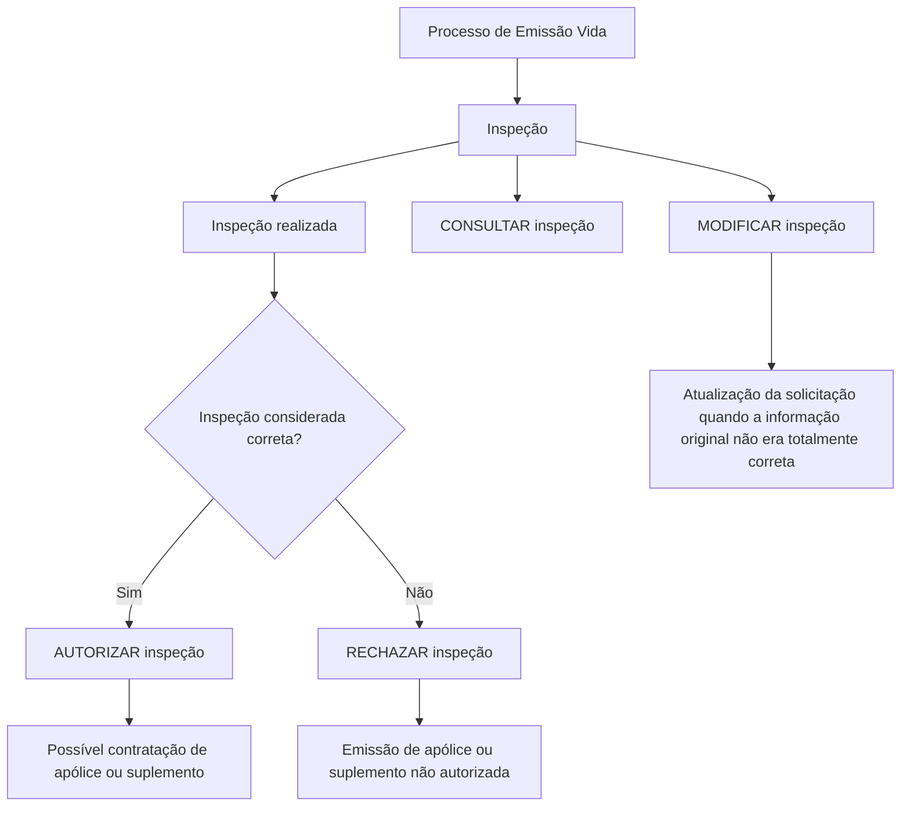
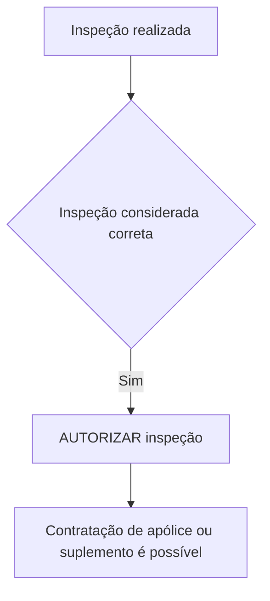
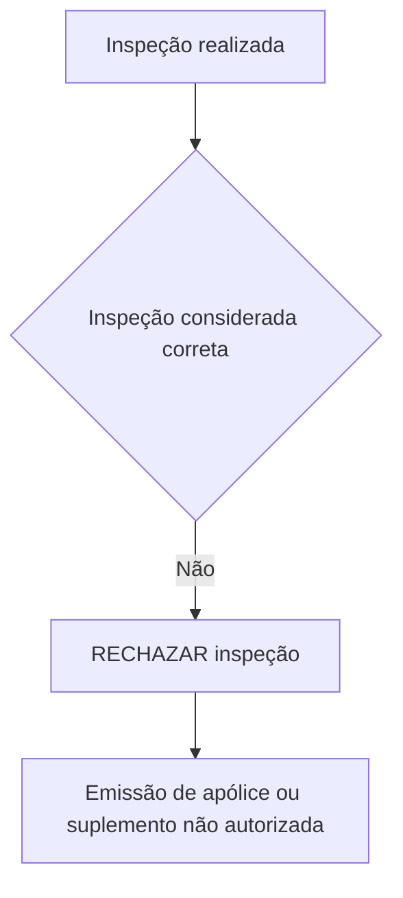

# Documentação de Operação de Emissão (Vida) — Inspeção

## 1. Metadados do Documento
- **Arquivo de Origem:** Não identificado; conteúdo fornecido diretamente na solicitação.
- **Tipo de Documento:** Manual Operacional.
- **Domínio / Sistema:** Emissão (Vida) — Inspeção.
- **Público-Alvo:** Operação, negócio e usuários responsáveis por revisões de riscos.
- **Data/Versão Identificada:** Não identificada.

---

## 2. Resumo Executivo & Contexto de Negócio

O documento descreve operações relacionadas às revisões de riscos no processo de **Emissão (Vida)**, especificamente no contexto de **inspeções**. A documentação relaciona quatro operações principais: modificar, autorizar, rejeitar e consultar uma inspeção.

A operação **MODIFICAR inspeção** permite atualizar uma solicitação de inspeção quando as informações originalmente registradas não estiverem totalmente corretas. O documento não detalha quais campos podem ser modificados, nem regras de validação, permissões ou histórico de alterações.

As operações **AUTORIZAR inspeção** e **RECHAZAR inspeção** ocorrem após a realização da inspeção. A autorização indica que a inspeção é considerada correta e viabiliza a contratação de uma apólice ou suplemento. A rejeição indica que a inspeção não é considerada correta e impede a emissão da apólice ou suplemento.

A operação **CONSULTAR inspeção** permite acessar as informações armazenadas sobre uma inspeção. O documento indica a existência de documentos de apoio por meio da expressão “Accede al documento”, mas não apresenta os respectivos conteúdos, URLs ou referências documentais.

---

## 3. Arquitetura, Componentes & Tecnologias Envolvidas

O documento não descreve arquitetura de software, integrações, microsserviços, bancos de dados, interfaces, APIs, protocolos, ambientes ou tecnologias de implementação.

Os elementos funcionais identificados são:

- Processo de **Emissão (Vida)**.
- Entidade ou registro de **inspeção**.
- Solicitação de inspeção.
- Apólice.
- Suplemento.
- Operações de modificar, autorizar, rejeitar e consultar inspeção.
- Revisões de riscos.



> **Nota de Análise:** O documento não especifica o mecanismo pelo qual uma inspeção é realizada, nem os critérios técnicos ou de negócio usados para considerá-la correta ou incorreta.

---

## 4. Regras de Negócio, Especificações Funcionais & Processos

### 4.1 Escopo funcional

O escopo declarado é composto por operações relacionadas às revisões de riscos no contexto de inspeções associadas ao processo de emissão de seguros de vida.

### 4.2 Modificar inspeção

A operação **MODIFICAR inspeção** deve ser utilizada para atualizar uma solicitação de inspeção quando a informação original não for totalmente correta.

Regra extraída:

1. Existe uma solicitação de inspeção.
2. A informação original pode apresentar incorreções ou não estar totalmente correta.
3. Quando essa condição ocorrer, a solicitação de inspeção é atualizada por meio da operação **MODIFICAR inspeção**.

> **Nota de Análise:** O documento não informa quais atributos da solicitação podem ser atualizados, quem pode realizar a atualização, se existem validações, nem se a modificação é permitida após a realização da inspeção.

### 4.3 Autorizar inspeção

A operação **AUTORIZAR inspeção** é aplicável após a realização de uma inspeção.

Regras extraídas:

1. A inspeção deve ter sido realizada.
2. A inspeção deve ser considerada correta.
3. Uma inspeção considerada correta pode ser autorizada.
4. Após a autorização da inspeção, torna-se possível a contratação de uma apólice ou suplemento.

Fluxo funcional:



> **Nota de Análise:** O documento não define os critérios para classificar uma inspeção como correta, não especifica responsáveis pela autorização e não esclarece se a autorização altera algum estado técnico persistido.

### 4.4 Rejeitar inspeção

A operação **RECHAZAR inspeção** é aplicável após a realização de uma inspeção.

Regras extraídas:

1. A inspeção deve ter sido realizada.
2. A inspeção pode ser considerada não correta.
3. Quando a inspeção não for considerada correta, ela pode ser rejeitada.
4. Após a rejeição, não é autorizada a emissão de uma apólice ou suplemento.

Fluxo funcional:



> **Nota de Análise:** O documento não informa se uma inspeção rejeitada pode ser modificada, refeita, submetida novamente ou cancelada.

### 4.5 Consultar inspeção

A operação **CONSULTAR inspeção** permite acessar as informações armazenadas sobre uma inspeção.

Regra extraída:

1. Uma inspeção possui informações armazenadas.
2. Essas informações podem ser acessadas por meio da operação **CONSULTAR inspeção**.

> **Nota de Análise:** O documento não detalha os campos armazenados, filtros de consulta, formatos de resposta, permissões de acesso ou mecanismos de auditoria.

---

## 5. Tabelas de Parâmetros, Ambientes e Estruturas de Dados

| Item / Parâmetro | Descrição / Função | Tipo / Valores / Formato | Ambiente / Observações |
| :--- | :--- | :--- | :--- |
| Emissão (Vida) | Contexto de negócio no qual a documentação de inspeção está inserida. | Processo de emissão. | O documento não especifica sistemas ou ambientes. |
| Inspeção | Elemento central das operações descritas. | Registro ou processo de inspeção. | Relacionada às revisões de riscos. |
| Solicitação de inspeção | Solicitação que pode ser atualizada quando a informação original não estiver totalmente correta. | Registro funcional. | Campos e regras de atualização não detalhados. |
| MODIFICAR inspeção | Atualiza a solicitação de inspeção. | Operação funcional. | Aplicável quando a informação original não era totalmente correta. |
| AUTORIZAR inspeção | Autoriza uma inspeção considerada correta. | Operação funcional. | Após a autorização, é possível contratar apólice ou suplemento. |
| RECHAZAR inspeção | Rejeita uma inspeção considerada não correta. | Operação funcional. | A emissão de apólice ou suplemento não é autorizada. |
| CONSULTAR inspeção | Permite acessar informações armazenadas sobre uma inspeção. | Operação funcional. | Campos retornados não detalhados. |
| Apólice | Produto ou documento cuja contratação ou emissão é impactada pelo resultado da inspeção. | Entidade de negócio. | Possível contratação após autorização; emissão não autorizada após rejeição. |
| Suplemento | Item associado à apólice, impactado pelo resultado da inspeção. | Entidade de negócio. | Possível contratação após autorização; emissão não autorizada após rejeição. |
| Documento de apoio | Referência indicada como “Accede al documento”. | Referência documental. | URL, identificador e conteúdo não apresentados. |
| Home Solutions APIs Documentation Zeus | Texto presente no conteúdo bruto. | Referência textual. | Relação funcional ou técnica com a operação não detalhada. |
| CF | Texto presente no conteúdo bruto. | Sigla ou marcador não definido. | Significado não identificado. |
| EN | Texto presente no conteúdo bruto. | Sigla ou marcador não definido. | Significado não identificado. |

---

## 6. Bateria de Perguntas & Respostas para RAG (FAQ Sintético)

### P1: Qual é o objetivo da documentação de operação de Emissão (Vida) — Inspeção?
**R:** A documentação apresenta operações relacionadas às revisões de riscos no processo de Emissão (Vida), com foco nas ações de modificar, autorizar, rejeitar e consultar uma inspeção.

### P2: Em que situação uma solicitação de inspeção deve ser modificada?
**R:** A solicitação de inspeção deve ser atualizada por meio da operação **MODIFICAR inspeção** quando, por qualquer motivo, a informação original não estiver totalmente correta.

### P3: O que acontece quando uma inspeção é autorizada?
**R:** Após uma inspeção realizada ser considerada correta, a operação **AUTORIZAR inspeção** pode ser executada. A autorização torna possível a contratação de uma apólice ou suplemento.

### P4: Qual condição deve existir para autorizar uma inspeção?
**R:** O documento estabelece que a inspeção deve ter sido realizada e considerada correta para que possa ser autorizada.

### P5: Qual é o impacto de rejeitar uma inspeção?
**R:** Quando uma inspeção realizada não é considerada correta, ela pode ser rejeitada por meio da operação **RECHAZAR inspeção**. Nesse caso, a emissão de uma apólice ou suplemento não é autorizada.

### P6: A rejeição de uma inspeção impede a emissão de quais itens?
**R:** A rejeição impede a autorização da emissão de uma apólice ou de um suplemento.

### P7: Para que serve a operação CONSULTAR inspeção?
**R:** A operação **CONSULTAR inspeção** permite acessar as informações armazenadas a respeito de uma inspeção.

### P8: O documento informa quais campos podem ser alterados na operação MODIFICAR inspeção?
**R:** Não. O documento apenas informa que a solicitação de inspeção pode ser atualizada quando a informação original não estiver totalmente correta; os campos modificáveis não são detalhados.

### P9: O documento especifica critérios para determinar se uma inspeção está correta?
**R:** Não. O documento afirma que uma inspeção pode ser considerada correta ou não correta, mas não apresenta critérios, regras de validação, evidências ou parâmetros para essa classificação.

### P10: É possível determinar, com base no documento, se uma inspeção rejeitada pode ser refeita?
**R:** Não. O documento não descreve o fluxo posterior a uma rejeição, incluindo possibilidade de correção, nova inspeção, reprocessamento, cancelamento ou reenvio.

### P11: O documento descreve APIs, métodos HTTP ou contratos de integração para as operações de inspeção?
**R:** Não. Apesar de o conteúdo bruto conter a expressão “Home Solutions APIs Documentation Zeus”, não são apresentados endpoints, métodos HTTP, contratos JSON, autenticação, códigos de resposta ou detalhes técnicos de integração.

### P12: Existem ambientes, servidores ou URLs documentados para as operações de inspeção?
**R:** Não. O documento não apresenta ambientes, servidores, URLs, portas, credenciais, caminhos de log ou variáveis de configuração.

---

## 7. Glossário de Termos, Siglas & Conceitos-Chave

- **Emissão (Vida):** Contexto de emissão relacionado ao domínio de Vida, conforme indicado no título do documento.
- **Inspeção:** Elemento funcional submetido às operações de modificação, autorização, rejeição e consulta.
- **Solicitação de inspeção:** Solicitação que pode ser atualizada quando a informação original não estiver totalmente correta.
- **Revisões de riscos:** Escopo operacional mencionado para as operações de inspeção.
- **AUTORIZAR inspeção:** Operação aplicável quando uma inspeção realizada é considerada correta; permite a contratação de apólice ou suplemento.
- **RECHAZAR inspeção:** Operação aplicável quando uma inspeção realizada não é considerada correta; impede a autorização da emissão de apólice ou suplemento.
- **MODIFICAR inspeção:** Operação de atualização da solicitação de inspeção diante de informação original não totalmente correta.
- **CONSULTAR inspeção:** Operação de acesso às informações armazenadas sobre uma inspeção.
- **Apólice:** Item cuja contratação pode ser possível após autorização de inspeção e cuja emissão não é autorizada após rejeição de inspeção.
- **Suplemento:** Item associado ao processo de inspeção, cuja contratação pode ser possível após autorização e cuja emissão não é autorizada após rejeição.
- **CF:** Sigla ou marcador presente no documento, sem definição fornecida.
- **EN:** Sigla ou marcador presente no documento, sem definição fornecida.
- **Home Solutions APIs Documentation Zeus:** Texto presente no conteúdo bruto; o documento não explica seu significado ou relação técnica com as operações descritas.

---

## 8. Notas Críticas, Riscos & Limitações

- O documento não identifica o arquivo de origem, data, versão, autoria ou responsáveis pelo processo.
- Não há detalhamento de arquitetura de software, sistemas envolvidos, bancos de dados, APIs, integrações, autenticação ou autorização.
- Não são apresentados critérios objetivos para classificar uma inspeção como correta ou não correta.
- Não são especificados papéis, perfis ou permissões necessários para modificar, autorizar, rejeitar ou consultar uma inspeção.
- Não há definição de estados formais da inspeção, transições permitidas, regras de reversão ou tratamento de exceções.
- O comportamento posterior à rejeição não é detalhado: o documento não informa se a inspeção pode ser corrigida, refeita ou reenviada.
- Os documentos referenciados por “Accede al documento” não foram fornecidos; portanto, seus conteúdos não podem ser inferidos.
- As referências “CF”, “Home Solutions APIs Documentation Zeus” e “EN” não possuem explicação contextual suficiente no material fornecido.

---

## 9. Conteúdo Bruto Estruturado (Referência Fiel)

```text
--- [PÁGINA 1 DE 2] ---

DOCUMENTACIÓN de OPERACIÓN de
EMISIÓN (Vida) - INSPECCIÓN
INSPECCIÓN
Operaciones relacionadas con las revisiones de riesgos
MODIFICAR inspección
Se actualiza la solicitud de inspección si por
cualquier motivo la información original no era
totalmente correcta
 Accede al documento
AUTORIZAR inspección
Una vez realizada la inspección, esta se
considera correcta y es posible la contratación
de la póliza o suplemento
 Accede al documento
RECHAZAR inspección
Una vez realizada la inspección, esta no se
considera correcta y no se autoriza la emisión
de la póliza o suplemento
CONSULTAR inspección
Permite el acceso a la información
almacenada acerca de una inspección
 / 
 CF
Home Solutions APIs Documentation Zeus
EN


--- [PÁGINA 2 DE 2] ---

Accede al documento
  Accede al documento
```
