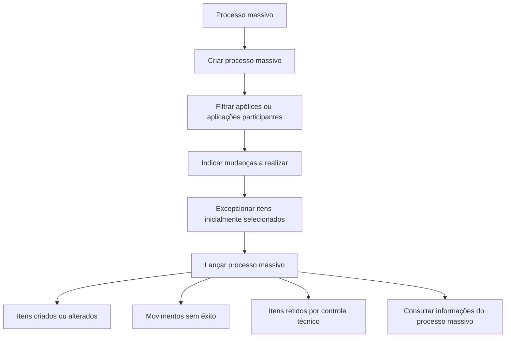

# Documentação de Operação de Emissão (Vida) — Processos Massivos

## 1. Metadados do Documento
- **Arquivo de Origem:** `Não identificado`
- **Tipo de Documento:** Manual Operacional
- **Domínio / Sistema:** Emissão (Vida) — Processos Massivos
- **Público-Alvo:** Operação, Negócio e equipes responsáveis por processos massivos de emissão
- **Data/Versão Identificada:** Não identificada

---

## 2. Resumo Executivo & Contexto de Negócio

O documento apresenta a documentação de operação para **Processos Massivos** no domínio de **Emissão (Vida)**. Processos massivos são operações relacionadas à execução em lote sobre orçamentos, apólices e/ou aplicações.

A documentação descreve seis capacidades operacionais: criar, filtrar, indicar alterações, excepcionar, lançar e consultar um processo massivo. Essas capacidades suportam a definição da população participante, a determinação das alterações desejadas, a exclusão de itens inicialmente selecionados, a execução em lote e a consulta das informações associadas.

Durante o lançamento do processo massivo, os orçamentos, apólices e/ou aplicações podem ser criados ou alterados. O documento também informa que alguns movimentos podem não ter êxito e que outros podem ficar retidos por controle técnico.

O material não detalha contratos de API, métodos HTTP, formatos de entrada e saída, critérios técnicos de retenção, regras de validação, ambientes ou mecanismos de recuperação de falhas.

---

## 3. Arquitetura, Componentes & Tecnologias Envolvidas

### Componentes e capacidades identificadas

| Componente / Capacidade | Função identificada |
| :--- | :--- |
| Emissão (Vida) | Domínio funcional ao qual pertence a documentação de processos massivos. |
| Processos Massivos | Operações relacionadas a tratamentos por lotes. |
| Criar processo massivo | Permite criar ou alterar orçamentos, apólices e/ou aplicações. |
| Filtrar processo massivo | Define quais apólices ou aplicações participam de um processo massivo. |
| Indicar mudança de processo massivo | Especifica as mudanças que serão aplicadas às apólices e/ou aplicações participantes. |
| Excepcionar processo massivo | Exclui do processo massivo determinados orçamentos, apólices ou aplicações inicialmente selecionados. |
| Lançar processo massivo | Executa o processo em lote e produz itens criados, alterados, sem êxito ou retidos por controle técnico. |
| Consultar processo massivo | Permite acessar informações relacionadas ao processo massivo. |
| Home Solutions APIs Documentation Zeus | Texto de navegação/interface presente no conteúdo extraído; o documento não explica sua função técnica. |



> **Nota de Análise:** O diagrama representa o encadeamento operacional sugerido pelas capacidades descritas. O documento não especifica mecanismos técnicos, integrações entre sistemas, APIs, persistência de dados ou regras de transição obrigatórias entre essas etapas.

---

## 4. Regras de Negócio, Especificações Funcionais & Processos

### Criar processo massivo
Um processo massivo pode ser definido para criar ou alterar os seguintes tipos de entidades:
- Orçamentos.
- Apólices.
- Aplicações.

### Filtrar processo massivo
A filtragem permite definir quais entidades participam do processo massivo:
- Apólices.
- Aplicações.

O conteúdo não apresenta critérios de filtro, atributos de seleção, operadores, limites de volume ou regras para inclusão de orçamentos nessa etapa.

### Indicar mudança de processo massivo
A indicação de mudança especifica as alterações que serão realizadas no processo massivo. As alterações serão sofridas pelas seguintes entidades participantes:
- Apólices.
- Aplicações.

O documento não descreve quais tipos de mudanças podem ser indicados, campos alteráveis, validações ou regras de consistência.

### Excepcionar processo massivo
A exceção determina quais entidades inicialmente selecionadas deixam de participar do processo massivo:
- Orçamentos.
- Apólices.
- Aplicações.

A exceção se aplica a itens que tenham sido selecionados inicialmente. Não há detalhamento sobre o momento em que a exceção pode ser aplicada, reversão de exceções ou justificativas obrigatórias.

### Lançar processo massivo
O lançamento executa o processo massivo. Na execução:
1. Uma série de orçamentos, apólices e/ou aplicações pode ser criada ou alterada.
2. Outros itens podem ser marcados como movimentos sem êxito.
3. Outros itens podem permanecer retidos por controle técnico.

O documento não define a diferença entre um movimento sem êxito e uma retenção por controle técnico, nem descreve o tratamento operacional posterior para cada resultado.

### Consultar processo massivo
A consulta facilita o acesso às informações existentes relacionadas ao processo massivo. O conteúdo não especifica:
- Dados retornados na consulta.
- Filtros disponíveis.
- Histórico de execução.
- Status possíveis.
- Paginação, exportação ou permissões de acesso.

---

## 5. Tabelas de Parâmetros, Ambientes e Estruturas de Dados

| Item / Parâmetro | Descrição / Função | Tipo / Valores / Formato | Ambiente / Observações |
| :--- | :--- | :--- | :--- |
| Processo massivo | Operação relacionada a processos por lotes. | Processo operacional. | Domínio de Emissão (Vida). |
| Orçamento | Entidade que pode ser criada, alterada ou excepcionada em um processo massivo. | Entidade de negócio. | Não há estrutura de dados detalhada. |
| Apólice | Entidade que pode ser filtrada, alterada, excepcionada, criada ou processada em lote. | Entidade de negócio. | Não há estrutura de dados detalhada. |
| Aplicação | Entidade que pode ser filtrada, alterada, excepcionada, criada ou processada em lote. | Entidade de negócio. | Não há estrutura de dados detalhada. |
| Filtro de processo massivo | Definição de quais apólices ou aplicações participam do processo massivo. | Critério de seleção não detalhado. | O documento não informa campos ou operadores. |
| Mudança de processo massivo | Alteração a ser aplicada às apólices e/ou aplicações participantes. | Regra ou alteração não detalhada. | Não há catálogo de mudanças. |
| Exceção de processo massivo | Exclusão de orçamentos, apólices ou aplicações inicialmente selecionados. | Exclusão operacional. | Sem critérios ou fluxo de aprovação detalhados. |
| Movimento sem êxito | Resultado possível do lançamento do processo massivo. | Estado/resultante operacional. | Sem causa, código ou tratamento informado. |
| Retenção por controle técnico | Resultado possível do lançamento do processo massivo. | Estado/resultante operacional. | Sem critérios técnicos descritos. |
| Consulta de processo massivo | Acesso a informações existentes relacionadas ao processo massivo. | Capacidade de consulta. | Sem contrato de consulta detalhado. |
| Ambientes | Não identificados no texto. | Não aplicável. | Não há URLs, servidores, portas ou nomes de ambientes. |
| Logs | Não identificados no texto. | Não aplicável. | Não há rotas, arquivos ou variáveis de log. |

---

## 6. Bateria de Perguntas & Respostas para RAG (FAQ Sintético)

### P1: Qual é o objetivo dos processos massivos na documentação de Emissão (Vida)?
**R:** Os processos massivos são operações relacionadas ao tratamento por lotes de orçamentos, apólices e/ou aplicações no domínio de Emissão (Vida). O documento descreve capacidades para criar, filtrar, alterar, excepcionar, lançar e consultar esses processos.

### P2: Quais entidades podem ser criadas ou alteradas em um processo massivo?
**R:** O documento informa que um processo massivo pode criar ou alterar orçamentos, apólices e/ou aplicações.

### P3: Para que serve a funcionalidade de filtrar processo massivo?
**R:** A funcionalidade de filtrar processo massivo permite definir quais apólices ou aplicações participam de um processo massivo. O texto não detalha os critérios, campos ou operadores de filtragem.

### P4: O que é definido ao indicar uma mudança de processo massivo?
**R:** A indicação de mudança especifica quais alterações serão realizadas no processo massivo e quais mudanças serão sofridas pelas apólices e/ou aplicações participantes.

### P5: O que acontece quando uma entidade é excepcionada em um processo massivo?
**R:** Um orçamento, uma apólice ou uma aplicação inicialmente selecionada pode ser determinada como exceção e, nesse caso, passa a estar excluída do processo massivo.

### P6: Quais resultados podem ocorrer durante o lançamento de um processo massivo?
**R:** Durante o lançamento, orçamentos, apólices e/ou aplicações podem ser criados ou alterados. Outros movimentos podem ser marcados como sem êxito, e outros podem permanecer retidos por controle técnico.

### P7: O documento explica por que um movimento pode ficar sem êxito?
**R:** Não. O documento apenas informa que alguns movimentos podem ficar marcados como sem êxito durante a execução do processo massivo, sem apresentar causas, códigos de erro ou procedimentos de tratamento.

### P8: O que significa retenção por controle técnico no processo massivo?
**R:** Retenção por controle técnico é um resultado possível do lançamento de um processo massivo. O documento não detalha os critérios técnicos que levam à retenção nem o fluxo de regularização posterior.

### P9: A consulta de processo massivo permite acessar quais informações?
**R:** A consulta facilita o acesso às informações existentes relacionadas ao processo massivo. O texto não especifica quais campos, status, filtros ou dados históricos são disponibilizados.

### P10: O documento fornece contratos de APIs ou métodos HTTP para os processos massivos?
**R:** Não. Apesar de o conteúdo extraído mencionar “APIs Documentation”, o documento não descreve endpoints, métodos HTTP, payloads, autenticação, respostas JSON ou códigos de retorno.

---

## 7. Glossário de Termos, Siglas & Conceitos-Chave

- **Emissão (Vida):** Domínio funcional indicado no título da documentação.
- **Processo massivo:** Operação em lote que pode envolver criação ou alteração de orçamentos, apólices e/ou aplicações.
- **Orçamento:** Entidade de negócio que pode participar de um processo massivo.
- **Apólice:** Entidade de negócio que pode ser filtrada, alterada, excepcionada, criada ou processada no contexto massivo.
- **Aplicação:** Entidade de negócio que pode ser filtrada, alterada, excepcionada, criada ou processada no contexto massivo.
- **Excepcionar:** Excluir do processo massivo uma entidade inicialmente selecionada.
- **Lançar:** Executar o processo massivo.
- **Movimento sem êxito:** Resultado de execução em que o movimento não teve sucesso.
- **Controle técnico:** Condição mencionada como motivo de retenção de determinados itens; não possui detalhamento adicional no documento.
- **API:** Sigla presente no texto de navegação “APIs Documentation”; o documento não expande a sigla nem descreve interfaces de programação.
- **CF:** Sigla exibida no conteúdo extraído; não definida no documento.

---

## 8. Notas Críticas, Riscos & Limitações

- O documento não identifica arquivo de origem, versão, data, autor ou responsável.
- Não há detalhamento de APIs, endpoints, métodos HTTP, contratos JSON, autenticação ou autorização.
- Não são apresentados ambientes, URLs, servidores, portas, variáveis de configuração ou caminhos de logs.
- Não há definição dos critérios de filtragem de apólices e aplicações.
- Não há catálogo de alterações permitidas na funcionalidade de indicação de mudança.
- O documento não explica as causas nem o tratamento de movimentos sem êxito.
- O documento não define os critérios de retenção por controle técnico nem o procedimento para liberar itens retidos.
- Não são descritos mecanismos de auditoria, reprocessamento, reversão, concorrência, limite de volume ou monitoramento.
- **Nota de Análise:** O conteúdo apresenta capacidades operacionais em nível resumido; não há detalhamento técnico adicional para sustentar especificações de implementação.

---

## 9. Conteúdo Bruto Estruturado (Referência Fiel)

```text
--- [PÁGINA 1 DE 2] ---

DOCUMENTACIÓN de OPERACIÓN de
EMISIÓN (Vida) - PROCESOS MASIVOS
PROCESOS MASIVOS
Operaciones relacionadas con procesos por lotes
CREAR proceso masivo
Se define un proceso masivo que permita
crear o alterar presupuestos, pólizas y/o
aplicaciones
 Accede al documento
FILTRAR proceso masivo
Permite la definición de qué pólizas o
aplicaciones intervienen en un proceso
masivo
 Accede al documento
INDICAR CAMBIO proceso masivo
Se especifican los cambios a realizar en el
proceso masivo y que sufrirán las pólizas y/o
aplicaciones que participen en él
EXCEPCIONAR proceso masivo
Se determina qué presupuesto, pólizas o
aplicaciones inicialmente seleccionadas
pasan a estar excluidas del proceso masivo
 / 
 CF
Home Solutions APIs Documentation Zeus
EN


--- [PÁGINA 2 DE 2] ---

Accede al documento
  Accede al documento
LANZAR proceso masivo
Ejecución del proceso masivo donde una
serie de presupuestos, póliza y/o aplicaciones
serán creadas o alteradas, otras quedarán
marcadas como que el movimiento no tuvo
éxito y otras quedarán retenidas por control
técnico
 Accede al documento
CONSULTAR proceso masivo
Facilita el acceso a la información que existe
relacionado con el proceso masivo
 Accede al documento
```
