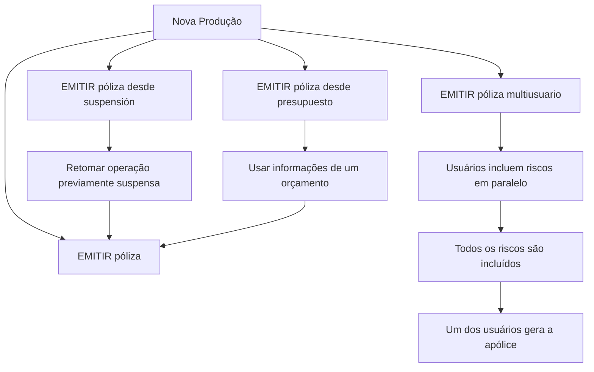

# Documentação de Operação de Emissão (Vida) — Nova Produção

## 1. Metadados do Documento
- **Arquivo de Origem:** Não identificado
- **Tipo de Documento:** Procedimento
- **Domínio / Sistema:** Emissão (Vida) — Nova Produção
- **Público-Alvo:** Operação e negócio
- **Data/Versão Identificada:** Não identificada

---

## 2. Resumo Executivo & Contexto de Negócio

O documento descreve formas de criar novas apólices ou aplicações no contexto de **Emissão (Vida) — Nova Produção**. A operação central é **EMITIR póliza**, definida como a geração do contrato que estabelece os riscos cobertos, as condições de cobertura e a cobertura aplicável quando ocorre um dano previsto.

Além da emissão direta, o documento apresenta três modalidades relacionadas: emissão a partir de uma operação suspensa, emissão multiusuário e emissão a partir de um orçamento. Essas modalidades representam diferentes origens ou condições operacionais para a criação de uma nova apólice.

A emissão a partir de suspensão permite retomar uma operação de emissão previamente suspensa. A emissão multiusuário permite que diversos usuários incluam riscos em paralelo e, após a inclusão de todos os riscos, um dos usuários gere a apólice.

A emissão a partir de orçamento utiliza as informações de um orçamento como base para gerar uma nova apólice. O conteúdo disponibilizado é resumido e não descreve telas, métodos HTTP, contratos de integração, validações sistêmicas, perfis de acesso ou detalhes técnicos adicionais.

---

## 3. Arquitetura, Componentes & Tecnologias Envolvidas

O conteúdo não apresenta uma arquitetura técnica de software, microsserviços, bancos de dados, APIs, protocolos, ambientes ou tecnologias implementadas. Os termos **Home**, **Solutions**, **APIs Documentation**, **Zeus** e **EN** aparecem como elementos textuais de navegação ou referência, sem detalhamento de função ou relacionamento técnico.

O fluxo operacional de negócio explicitamente descrito pode ser representado da seguinte forma:



**Nota de Análise:** O documento não detalha quais sistemas executam a emissão, onde são persistidas as apólices, quais usuários podem gerar a apólice multiusuário ou quais integrações são acionadas.

---

## 4. Regras de Negócio, Especificações Funcionais & Processos

### Operação: EMITIR póliza
- A operação **EMITIR póliza** consiste na geração de um contrato.
- O contrato estabelece:
  - O risco ou os riscos cobertos.
  - As condições nas quais ocorre a cobertura.
  - A cobertura que será fornecida quando o risco sofrer algum tipo de dano estabelecido.

### Operação: EMITIR póliza desde suspensión
- Consiste na realização da operação **EMITIR póliza**.
- A emissão ocorre após a retomada de uma operação que havia sido previamente suspensa.
- O documento não especifica os motivos de suspensão, critérios de retomada, responsáveis pela retomada ou impactos de dados durante a suspensão.

### Operação: EMITIR póliza multiusuario
- A finalidade é realizar a operação **EMITIR póliza**.
- Vários usuários incluem riscos de forma paralela.
- Depois que todos os riscos forem incluídos, um dos usuários gera a apólice.
- O documento não define:
  - Como o sistema determina que todos os riscos foram incluídos.
  - Qual usuário está autorizado a gerar a apólice.
  - Como são tratados conflitos entre alterações simultâneas.
  - Perfis, permissões ou mecanismos de bloqueio/conciliação.

### Operação: EMITIR póliza desde presupuesto
- Consiste em realizar a operação **EMITIR póliza**.
- A origem da emissão é a informação de um orçamento.
- O orçamento serve como base para a geração da nova apólice.
- O documento não informa quais dados do orçamento são reutilizados, quais campos devem ser revalidados ou se o orçamento possui regras de vigência.

---

## 5. Tabelas de Parâmetros, Ambientes e Estruturas de Dados

| Item / Parâmetro | Descrição / Função | Tipo / Valores / Formato | Ambiente / Observações |
| :--- | :--- | :--- | :--- |
| Nova Produção | Contexto para criação de novas apólices ou aplicações. | Processo operacional | Associado à Emissão (Vida). |
| EMITIR póliza | Gera o contrato que define riscos, condições de cobertura e cobertura aplicável diante de dano estabelecido. | Operação | Não há detalhamento de sistema ou interface. |
| Risco ou riscos | Elementos cobertos pelo contrato gerado na emissão. | Conceito de negócio | Não há catálogo ou estrutura de dados descrita. |
| Condições de cobertura | Condições sob as quais os riscos são cobertos. | Conceito de negócio | Não há regras, fórmulas ou critérios detalhados. |
| Dano estabelecido | Tipo de dano para o qual a cobertura será fornecida conforme o contrato. | Conceito de negócio | Não há classificação de danos descrita. |
| EMITIR póliza desde suspensión | Emissão retomada após uma operação previamente suspensa. | Modalidade operacional | Sem critérios de suspensão ou retomada. |
| EMITIR póliza multiusuario | Emissão com inclusão paralela de riscos por múltiplos usuários. | Modalidade operacional | Um usuário gera a apólice após a inclusão de todos os riscos. |
| EMITIR póliza desde presupuesto | Emissão baseada nas informações de um orçamento. | Modalidade operacional | Não há detalhamento do orçamento ou do mapeamento de dados. |
| Home | Termo exibido no conteúdo bruto. | Referência textual | Sem função explicada. |
| Solutions | Termo exibido no conteúdo bruto. | Referência textual | Sem função explicada. |
| APIs Documentation | Termo exibido no conteúdo bruto. | Referência textual | Não são fornecidas especificações de API. |
| Zeus | Termo exibido no conteúdo bruto. | Referência textual | Sem definição funcional ou técnica. |
| EN | Termo exibido no conteúdo bruto. | Referência textual | Sem definição no documento. |

---

## 6. Bateria de Perguntas & Respostas para RAG (FAQ Sintético)

### P1: O que significa a operação EMITIR póliza na documentação de Emissão (Vida)?
**R:** A operação **EMITIR póliza** consiste na geração de um contrato. Esse contrato estabelece o risco ou os riscos cobertos, as condições em que a cobertura ocorre e a cobertura que será fornecida quando o risco sofrer algum tipo de dano estabelecido.

### P2: Quais são as formas de criar novas apólices ou aplicações apresentadas no documento?
**R:** O documento apresenta quatro formas: **EMITIR póliza**, **EMITIR póliza desde suspensión**, **EMITIR póliza multiusuario** e **EMITIR póliza desde presupuesto**.

### P3: Como funciona a emissão de uma apólice a partir de uma operação suspensa?
**R:** A modalidade **EMITIR póliza desde suspensión** realiza a operação de emissão após retomar uma operação que havia sido previamente suspensa. O documento não detalha os critérios, motivos ou responsáveis pela suspensão e retomada.

### P4: O que caracteriza a operação EMITIR póliza multiusuario?
**R:** Na operação **EMITIR póliza multiusuario**, vários usuários incluem riscos de forma paralela. Quando todos os riscos foram incluídos, um dos usuários gera a apólice.

### P5: Quem gera a apólice na emissão multiusuário?
**R:** Depois que todos os riscos são incluídos pelos vários usuários de forma paralela, um dos usuários gera a apólice. O documento não especifica como esse usuário é selecionado ou autorizado.

### P6: Qual é a origem dos dados na operação EMITIR póliza desde presupuesto?
**R:** A operação **EMITIR póliza desde presupuesto** utiliza como origem as informações de um orçamento. Esse orçamento serve como base para a geração da nova apólice.

### P7: O documento detalha APIs, métodos HTTP ou contratos JSON para emissão de apólices?
**R:** Não. Embora o conteúdo apresente o termo “APIs Documentation”, não há métodos HTTP, endpoints, contratos JSON, autenticação, códigos de resposta ou integrações técnicas descritos.

### P8: Quais informações o contrato gerado na emissão estabelece?
**R:** O contrato gerado por **EMITIR póliza** estabelece os riscos cobertos, as condições em que esses riscos são cobertos e a cobertura que será fornecida caso ocorra algum dano estabelecido.

### P9: O documento especifica regras de validação para todos os riscos de uma emissão multiusuário?
**R:** Não. O documento somente afirma que todos os riscos devem ser incluídos antes que um dos usuários gere a apólice. Não são especificadas validações, critérios de completude, regras de concorrência ou tratamento de conflitos.

### P10: O documento informa campos, vigência ou regras de reutilização de dados do orçamento?
**R:** Não. O documento informa apenas que a emissão desde presupuesto utiliza a informação de um orçamento como base para a nova apólice, sem detalhar campos, vigência, validações ou mapeamentos.

---

## 7. Glossário de Termos, Siglas & Conceitos-Chave

- **EMITIR póliza:** Operação de geração de um contrato que define riscos cobertos, condições de cobertura e cobertura aplicável a danos estabelecidos.
- **Póliza / Apólice:** Contrato gerado pela operação de emissão, conforme a definição apresentada no documento.
- **Nueva Producción / Nova Produção:** Contexto de criação de novas apólices ou aplicações.
- **Suspensión / Suspensão:** Estado de uma operação que foi previamente interrompida e pode ser retomada para emissão.
- **Multiusuario / Multiusuário:** Modalidade em que vários usuários incluem riscos em paralelo antes da geração da apólice.
- **Presupuesto / Orçamento:** Origem de informações utilizada como base para a geração de uma nova apólice.
- **Riesgo / Risco:** Elemento ou elementos cobertos pelo contrato de apólice.
- **APIs Documentation:** Termo exibido no conteúdo, sem especificação de APIs ou documentação técnica associada.
- **Zeus:** Termo exibido no conteúdo, sem definição no documento.

---

## 8. Notas Críticas, Riscos & Limitações

- O documento é resumido e não identifica o arquivo de origem, data, versão, autor ou responsável.
- Não há arquitetura técnica detalhada, sistemas envolvidos, ambientes, servidores, URLs, portas, bancos de dados ou tecnologias.
- Não há especificações de API, métodos HTTP, contratos de mensagem, autenticação ou integração entre componentes.
- A operação multiusuário não detalha controle de concorrência, perfis de acesso, conflitos de alteração ou critérios para confirmar que todos os riscos foram incluídos.
- A emissão a partir de orçamento não detalha o modelo de dados do orçamento, regras de vigência, validações ou campos aproveitados.
- A emissão a partir de suspensão não detalha motivos de suspensão, estados possíveis, trilha de auditoria ou regras de retomada.
- **Nota de Análise:** Os termos “Home”, “Solutions”, “APIs Documentation”, “Zeus” e “EN” aparecem no texto, porém o documento não fornece contexto suficiente para classificá-los como sistemas, ambientes, produtos ou links.

---

## 9. Conteúdo Bruto Estruturado (Referência Fiel)

```text
--- [PÁGINA 1 DE 2] ---

DOCUMENTACIÓN de OPERACIÓN de
EMISIÓN (Vida) - NUEVA PRODUCCIÓN
NUEVA PRODUCCIÓN
Distintas formas de crear nuevas pólizas o aplicaciones
EMITIR póliza
Consiste en la generación del contrato por el
que se establece el riesgo o riesgos cubiertos,
las condiciones en las que se cubre y la
cobertura que se dará cuando el riesgo sufra
algún tipo de daño establecido
 Accede al documento
EMITIR póliza desde suspensión
Es la realización de la operación EMITIR
póliza, habiendo retomado la operación que
había sido previamente suspendida
 Accede al documento
EMITIR póliza multiusuario
 EMITIR póliza desde presupuesto
 / 
 CF
Home Solutions APIs Documentation Zeus
EN


--- [PÁGINA 2 DE 2] ---

La finalidad de esta operación es la de
EMITIR póliza pero, en la que varios usuarios
se encuentran incluyendo riesgos de forma
paralela. Una vez que todos los riesgos han
sido incluidos, uno de los usuarios genera la
póliza
 Accede al documento
Consiste en EMITIR póliza tomando como
origen la información de un presupuesto que
sirve como base para la generación de la
nueva póliza
 Accede al documento
```
