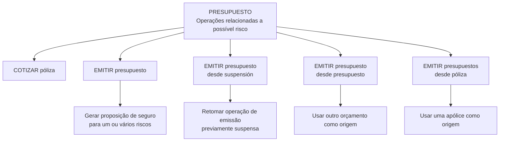
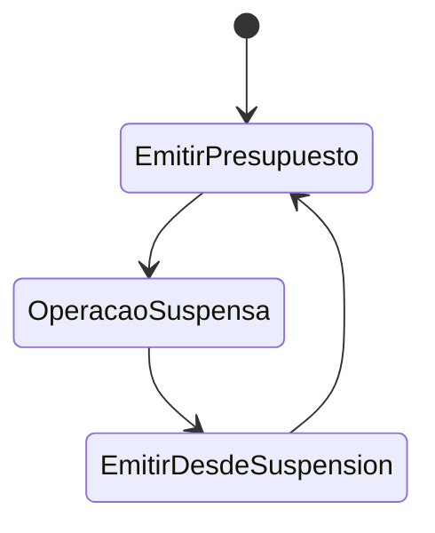

# Documentação de Operação de Emissão (Vida) — Orçamento

## 1. Metadados do Documento
- **Arquivo de Origem:** Não identificado no conteúdo fornecido
- **Tipo de Documento:** Manual Operacional
- **Domínio / Sistema:** Emissão de seguros de Vida — Orçamentos (`PRESUPUESTO`)
- **Público-Alvo:** Operação, Negócio e equipes responsáveis por emissão de seguros
- **Data/Versão Identificada:** Não identificada

---

## 2. Resumo Executivo & Contexto de Negócio

O documento apresenta operações de seguro relacionadas ao processo de `PRESUPUESTO`, descrito como operações associadas a um possível risco segurável. O escopo é a documentação operacional de emissão para o domínio de Vida.

A operação `COTIZAR póliza` permite oferecer opções de seguro, incluindo o respetivo custo e diferentes alternativas de fracionamento de pagamento. O conteúdo fornecido não detalha critérios de precificação, tipos de cobertura, meios de pagamento ou contratos técnicos.

A operação `EMITIR presupuesto` consiste em gerar uma proposição de seguro para um ou vários riscos. O documento também identifica modalidades de emissão baseadas na retomada de uma operação suspensa, em outro orçamento e em uma apólice existente.

A documentação apresentada referencia links identificados como “Accede al documento”, além de menções a `Home Solutions APIs Documentation Zeus` e `CF`. Contudo, o conteúdo desses documentos vinculados não foi fornecido. Portanto, não é possível detalhar APIs, integrações, métodos HTTP, campos, URLs ou regras adicionais.

---

## 3. Arquitetura, Componentes & Tecnologias Envolvidas

Os componentes e conceitos explicitamente identificados são:

| Componente / Conceito | Papel descrito |
| :--- | :--- |
| `PRESUPUESTO` | Conjunto de operações relacionadas ao seguro de um possível risco. |
| `COTIZAR póliza` | Operação que oferece opções de seguro, custos e alternativas de fracionamento de pagamento. |
| `EMITIR presupuesto` | Operação que gera uma proposição de seguro para um ou vários riscos. |
| `EMITIR presupuesto desde suspensión` | Retomada da operação de emissão que havia sido previamente suspensa. |
| `EMITIR presupuesto desde presupuesto` | Emissão de novo orçamento utilizando outro orçamento como origem. |
| `EMITIR presupuestos desde póliza` | Emissão de orçamento utilizando uma apólice como origem. |
| `Home Solutions APIs Documentation Zeus` | Referência documental citada; função técnica não detalhada no conteúdo. |
| `CF` | Referência citada; significado e função não detalhados no conteúdo. |



**Nota de Análise:** O conteúdo não descreve infraestrutura, microsserviços, banco de dados, protocolos, integrações técnicas, ambientes, URLs ou contratos de API. As referências a documentos acessíveis por links não estão disponíveis no material fornecido.

---

## 4. Regras de Negócio, Especificações Funcionais & Processos

### 4.1 Operação `COTIZAR póliza`

A operação `COTIZAR póliza` tem como finalidade oferecer diferentes opções de seguro. Para cada opção de seguro, a operação contempla:

1. O custo associado ao seguro.
2. Diferentes opções de fracionamento de pagamento.

**Limitação documental:** Não são especificados os critérios usados para determinar o custo, as opções disponíveis de fracionamento, as regras de elegibilidade ou os dados necessários para executar uma cotação.

### 4.2 Operação `EMITIR presupuesto`

A operação `EMITIR presupuesto` gera uma proposição de seguro para:

- Um risco; ou
- Vários riscos.

**Limitação documental:** O conteúdo não define os atributos de um risco, as validações para emissão, o ciclo de vida da proposição, os resultados possíveis da emissão ou as condições de aprovação.

### 4.3 Operação `EMITIR presupuesto desde suspensión`

A operação `EMITIR presupuesto desde suspensión` corresponde à retomada da operação `EMITIR presupuesto` quando a operação havia sido previamente suspensa.

Fluxo funcional identificado:



**Limitação documental:** Não são apresentados motivos de suspensão, estados intermediários, condições para retomada ou impactos sobre os dados do orçamento suspenso.

### 4.4 Operação `EMITIR presupuesto desde presupuesto`

A operação `EMITIR presupuesto desde presupuesto` consiste em emitir um novo orçamento usando como origem as informações de outro orçamento. O orçamento de origem serve como base para a geração do novo orçamento.

Fluxo funcional identificado:


**Limitação documental:** O texto não informa quais informações são reutilizadas, quais informações podem ser alteradas, se existem validações de compatibilidade ou se o orçamento de origem precisa estar em determinado estado.

### 4.5 Operação `EMITIR presupuestos desde póliza`

A operação `EMITIR presupuestos desde póliza` permite emitir um orçamento usando como origem as informações de uma apólice. A apólice serve como base para a geração do novo orçamento.

Fluxo funcional identificado:


**Limitação documental:** O documento não especifica quais dados da apólice são copiados, como são tratadas alterações entre a apólice e o novo orçamento, ou requisitos de vigência da apólice de origem.

---

## 5. Tabelas de Parâmetros, Ambientes e Estruturas de Dados

| Item / Parâmetro | Descrição / Função | Tipo / Valores / Formato | Ambiente / Observações |
| :--- | :--- | :--- | :--- |
| `PRESUPUESTO` | Agrupa operações relacionadas ao seguro de um possível risco. | Conceito / domínio operacional | Não há ambiente informado. |
| `COTIZAR póliza` | Oferece opções de seguro, respetivo custo e opções de fracionamento de pagamento. | Operação | Não há parâmetros detalhados. |
| Custo do seguro | Custo associado às opções de seguro apresentadas na cotação. | Não especificado | Método de cálculo não informado. |
| Fracionamento de pagamento | Alternativas de parcelamento ou divisão de pagamento oferecidas na cotação. | Não especificado | Quantidade, periodicidade e regras não informadas. |
| `EMITIR presupuesto` | Gera uma proposição de seguro. | Operação | Pode abranger um ou vários riscos. |
| Risco | Elemento para o qual uma proposição de seguro pode ser gerada. | Um ou vários riscos | Estrutura e critérios não informados. |
| `EMITIR presupuesto desde suspensión` | Retoma uma emissão previamente suspensa. | Operação | Não há critérios de retomada informados. |
| `EMITIR presupuesto desde presupuesto` | Gera novo orçamento a partir das informações de outro orçamento. | Operação | O orçamento anterior é a base de origem. |
| Orçamento de origem | Fonte de informações para gerar um novo orçamento. | Orçamento | Campos reutilizados não informados. |
| `EMITIR presupuestos desde póliza` | Gera orçamento a partir das informações de uma apólice. | Operação | A apólice é a base de origem. |
| Apólice de origem | Fonte de informações para gerar novo orçamento. | Apólice | Campos reutilizados não informados. |
| `Home Solutions APIs Documentation Zeus` | Referência documental exibida no conteúdo. | Referência / documentação | APIs e conteúdo não fornecidos. |
| `CF` | Referência exibida no conteúdo. | Sigla ou referência | Significado não detalhado. |

---

## 6. Bateria de Perguntas & Respostas para RAG (FAQ Sintético)

### P1: Qual é o objetivo do processo `PRESUPUESTO` na documentação de emissão de Vida?
**R:** O processo `PRESUPUESTO` reúne operações relacionadas ao seguro de um possível risco no contexto de emissão de seguros de Vida.

### P2: O que a operação `COTIZAR póliza` oferece ao usuário?
**R:** A operação `COTIZAR póliza` oferece diferentes opções de seguro, o custo associado a cada opção e diferentes opções de fracionamento de pagamento.

### P3: O documento explica como o custo do seguro é calculado na operação `COTIZAR póliza`?
**R:** Não. O documento informa que são oferecidas opções de seguro junto com o respetivo custo, mas não descreve fórmulas, critérios de precificação, fatores de risco ou regras de cálculo.

### P4: O que é gerado pela operação `EMITIR presupuesto`?
**R:** A operação `EMITIR presupuesto` gera uma proposição de seguro para um ou vários riscos.

### P5: Quando deve ser utilizada a operação `EMITIR presupuesto desde suspensión`?
**R:** A operação deve ser utilizada quando for necessário retomar uma operação `EMITIR presupuesto` que havia sido previamente suspensa.

### P6: Como funciona a emissão de orçamento a partir de outro orçamento?
**R:** A operação `EMITIR presupuesto desde presupuesto` gera um novo orçamento utilizando como origem as informações de outro orçamento, que serve como base para a nova geração.

### P7: Como funciona a emissão de orçamento a partir de uma apólice?
**R:** A operação `EMITIR presupuestos desde póliza` permite gerar um orçamento usando as informações de uma apólice como base para a geração do novo orçamento.

### P8: Quais dados da apólice são reutilizados em `EMITIR presupuestos desde póliza`?
**R:** O documento informa apenas que a apólice serve como base para gerar o novo orçamento. Os campos, regras de cópia, validações e possibilidades de alteração não são detalhados.

### P9: O documento apresenta métodos HTTP, contratos JSON ou endpoints para as operações de orçamento?
**R:** Não. Embora seja exibida a referência `Home Solutions APIs Documentation Zeus`, o conteúdo fornecido não apresenta métodos HTTP, endpoints, payloads, respostas JSON ou contratos de integração.

### P10: O documento informa os motivos pelos quais uma emissão pode ser suspensa?
**R:** Não. A documentação apenas declara que `EMITIR presupuesto desde suspensión` retoma uma operação previamente suspensa, sem listar motivos, estados, responsáveis ou validações para a suspensão.

### P11: É possível emitir orçamento para múltiplos riscos?
**R:** Sim. A descrição de `EMITIR presupuesto` afirma que a operação gera uma proposição de seguro de um ou vários riscos.

### P12: Há ambientes, servidores ou URLs de acesso identificados no conteúdo?
**R:** Não. O conteúdo fornecido não apresenta ambientes, nomes de servidores, URLs, portas, credenciais, configurações de log ou variáveis técnicas.

---

## 7. Glossário de Termos, Siglas & Conceitos-Chave

- **`PRESUPUESTO`:** Termo usado no documento para o conjunto de operações relacionadas ao seguro de um possível risco e para o conceito de orçamento.
- **`COTIZAR póliza`:** Operação de cotação que oferece opções de seguro, custo e opções de fracionamento de pagamento.
- **`EMITIR presupuesto`:** Operação de geração de uma proposição de seguro para um ou vários riscos.
- **`EMITIR presupuesto desde suspensión`:** Operação de emissão retomada após suspensão prévia.
- **`EMITIR presupuesto desde presupuesto`:** Operação que gera novo orçamento com base em outro orçamento.
- **`EMITIR presupuestos desde póliza`:** Operação que gera orçamento com base em uma apólice.
- **Apólice (`póliza`):** Elemento usado como origem de informações para a geração de um novo orçamento.
- **Risco (`riesgo`):** Elemento para o qual pode ser gerada uma proposição de seguro; sua estrutura não é detalhada.
- **`CF`:** Referência presente no conteúdo sem significado definido.
- **`Home Solutions APIs Documentation Zeus`:** Referência documental presente no conteúdo; detalhes não fornecidos.

---

## 8. Notas Críticas, Riscos & Limitações

- O conteúdo é resumido e referencia documentos adicionais por meio de “Accede al documento”, mas os materiais vinculados não foram disponibilizados.
- Não há especificação de APIs, endpoints, métodos HTTP, contratos JSON, autenticação ou integrações.
- Não há detalhamento de ambientes, servidores, URLs, logs, variáveis de configuração ou mecanismos de observabilidade.
- Não há regras de cálculo para custos de seguro ou condições para fracionamento de pagamento.
- Não há critérios de validação, elegibilidade, estados formais, transições ou motivos de suspensão para `EMITIR presupuesto`.
- A sigla `CF` é citada sem definição.
- **Nota de Análise:** O documento cita `Home Solutions APIs Documentation Zeus`, mas não apresenta o conteúdo dessa documentação nem permite identificar seus contratos técnicos.

---

## 9. Conteúdo Bruto Estruturado (Referência Fiel)

```text
--- [PÁGINA 1 DE 2] ---

DOCUMENTACIÓN de OPERACIÓN de
EMISIÓN (Vida) - PRESUPUESTO
PRESUPUESTO
Operaciones relacionadas con los de seguro de un posible riesgo
COTIZAR póliza
Ofrecer distintas opciones de un seguro junto
con su coste y diferentes opciones de
fraccionamiento de pago
 Accede al documento
EMITIR presupuesto
Generar una proposición de seguro de uno
varios riesgos
 Accede al documento
EMITIR presupuesto desde suspensión
Es la operación EMITIR presupuesto,
habiendo retomado la operación que había
sido previamente suspendida
EMITIR presupuesto desde presupuesto
Consiste en EMITIR presupuesto tomando
como origen la información de otro
 / 
 CF
Home Solutions APIs Documentation Zeus
EN


--- [PÁGINA 2 DE 2] ---

Accede al documento
 presupuesto que sirve como base para la
generación del nuevo presupuesto
 Accede al documento
EMITIR presupuestos desde póliza
Permite EMITIR presupuesto tomando como
origen la información de una póliza que sire
como base para la generación del nuevo
presupuesto
 Accede al documento
```
