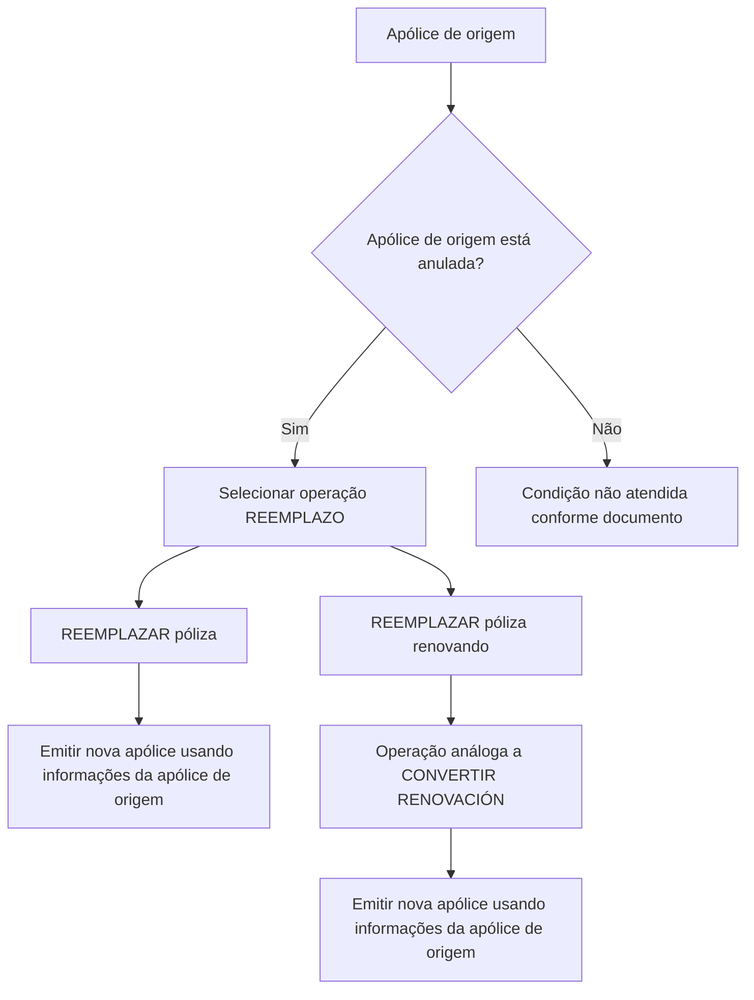

# Documentação de Operação de Emissão (Vida) — Reemplazo

## 1. Metadados do Documento
- **Arquivo de Origem:** Não informado
- **Tipo de Documento:** Manual Operacional
- **Domínio / Sistema:** Emissão de apólices de Vida; operação **REEMPLAZO**
- **Público-Alvo:** Operação, negócio e usuários responsáveis pela emissão de apólices
- **Data/Versão Identificada:** Não identificada

---

## 2. Resumo Executivo & Contexto de Negócio

O documento apresenta a operação **REEMPLAZO** no contexto de emissão de apólices de Vida. A operação permite utilizar uma apólice existente como informação de partida para criar e emitir uma nova apólice.

A modalidade **REEMPLAZAR póliza** consiste em emitir uma nova apólice com base nas informações de outra apólice previamente existente. A apólice utilizada como base deve estar anulada.

O documento também apresenta a opção **REEMPLAZAR póliza renovando**, definida como uma operação análoga à funcionalidade **CONVERTIR RENOVACIÓN**. Nessa modalidade, a apólice de origem também deve estar anulada.

A documentação indica links de acesso a documentos complementares para ambas as modalidades, mas não detalha URLs, procedimentos operacionais, campos de entrada, contratos de integração, métodos HTTP ou regras adicionais de validação.

---

## 3. Arquitetura, Componentes & Tecnologias Envolvidas

Os componentes e conceitos identificados são:

| Componente / Termo | Papel identificado |
| :--- | :--- |
| Emisión (Vida) | Contexto funcional de emissão de apólices de seguro de Vida. |
| REEMPLAZO | Operação para emitir uma nova apólice a partir de informações de uma apólice anterior. |
| REEMPLAZAR póliza | Modalidade de emissão baseada em uma apólice anulada. |
| REEMPLAZAR póliza renovando | Modalidade análoga a CONVERTIR RENOVACIÓN, também baseada em uma apólice anulada. |
| CONVERTIR RENOVACIÓN | Operação usada como analogia funcional para REEMPLAZAR póliza renovando. |
| Home Solutions APIs Documentation Zeus | Texto de navegação ou identificação de portal/documentação presente no conteúdo bruto. |
| CF | Sigla exibida no rodapé do conteúdo; sem definição adicional. |



> **Nota de Análise:** O documento não descreve arquitetura técnica, sistemas integrados, APIs, persistência de dados, ambientes, URLs ou contratos JSON. O diagrama representa exclusivamente o fluxo funcional explicitamente descrito.

---

## 4. Regras de Negócio, Especificações Funcionais & Processos

### 4.1. Finalidade da operação REEMPLAZO

A operação **REEMPLAZO** permite tomar uma apólice como informação inicial para criar uma nova apólice. A nova apólice é emitida com base nos dados de uma apólice anterior.

### 4.2. Regra obrigatória para a apólice de origem

A apólice que serve como base para a geração da nova apólice deve estar **anulada**.

Essa condição é explicitamente apresentada para as duas modalidades documentadas:

1. **REEMPLAZAR póliza**
2. **REEMPLAZAR póliza renovando**

### 4.3. Modalidade: REEMPLAZAR póliza

A modalidade **REEMPLAZAR póliza** consiste em emitir uma nova apólice tomando como origem as informações de outra apólice. A apólice de origem deve estar anulada.

Fluxo funcional extraído:

1. Identificar a apólice que será utilizada como base.
2. Confirmar que a apólice de origem está anulada.
3. Utilizar as informações da apólice anulada como base para gerar uma nova apólice.
4. Emitir a nova apólice.

### 4.4. Modalidade: REEMPLAZAR póliza renovando

A modalidade **REEMPLAZAR póliza renovando** é descrita como uma operação análoga a **CONVERTIR RENOVACIÓN**. A apólice que servirá como base também deve estar anulada.

Fluxo funcional extraído:

1. Identificar a apólice de origem.
2. Confirmar que a apólice de origem está anulada.
3. Executar a operação REEMPLAZAR póliza renovando.
4. Aplicar o comportamento análogo a CONVERTIR RENOVACIÓN, sem detalhamento adicional no documento.
5. Emitir a nova apólice.

> **Nota de Análise:** O documento não detalha o significado operacional de “anulada”, os critérios para anulação, as diferenças concretas entre REEMPLAZAR póliza e REEMPLAZAR póliza renovando, nem o comportamento interno de CONVERTIR RENOVACIÓN.

---

## 5. Tabelas de Parâmetros, Ambientes e Estruturas de Dados

| Item / Parâmetro | Descrição / Função | Tipo / Valores / Formato | Ambiente / Observações |
| :--- | :--- | :--- | :--- |
| Operação | REEMPLAZO | Operação funcional de emissão | Aplicável à emissão de apólices de Vida. |
| Modalidade | REEMPLAZAR póliza | Emissão de uma nova apólice baseada em outra apólice | A apólice de origem deve estar anulada. |
| Modalidade | REEMPLAZAR póliza renovando | Operação análoga a CONVERTIR RENOVACIÓN | A apólice de origem deve estar anulada. |
| Apólice de origem | Apólice usada como informação de partida | Apólice existente | Deve estar anulada. |
| Nova apólice | Apólice gerada pela operação REEMPLAZO | Apólice emitida | É criada a partir das informações da apólice de origem. |
| Operação de referência | CONVERTIR RENOVACIÓN | Referência funcional | Associada por analogia à modalidade REEMPLAZAR póliza renovando. |
| Documento complementar | Accede al documento | Link de acesso mencionado | URL ou localização não informada. |
| Portal/documentação | Home Solutions APIs Documentation Zeus | Texto presente no rodapé | Relação técnica e finalidade não detalhadas. |
| Sigla | CF | Sigla presente no rodapé | Significado não informado. |

---

## 6. Bateria de Perguntas & Respostas para RAG (FAQ Sintético)

### P1: O que é a operação REEMPLAZO na emissão de apólices de Vida?
**R:** REEMPLAZO é uma operação que permite criar e emitir uma nova apólice usando como informação de partida outra apólice existente. A apólice utilizada como base deve estar anulada.

### P2: Qual condição a apólice de origem precisa atender para ser usada em REEMPLAZAR póliza?
**R:** A apólice de origem precisa estar anulada. O documento estabelece essa condição como requisito para que suas informações sirvam de base para a emissão da nova apólice.

### P3: O que acontece na modalidade REEMPLAZAR póliza?
**R:** A modalidade REEMPLAZAR póliza emite uma nova apólice tomando como origem as informações de outra apólice. A apólice usada como base deve estar anulada.

### P4: O que é REEMPLAZAR póliza renovando?
**R:** REEMPLAZAR póliza renovando é uma modalidade da operação REEMPLAZO descrita como análoga a CONVERTIR RENOVACIÓN. Assim como na outra modalidade, a apólice de origem deve estar anulada.

### P5: A operação REEMPLAZAR póliza renovando exige uma apólice anulada?
**R:** Sim. O documento informa explicitamente que a apólice que serve como base para REEMPLAZAR póliza renovando deve estar anulada.

### P6: Quais são as diferenças detalhadas entre REEMPLAZAR póliza e REEMPLAZAR póliza renovando?
**R:** O documento informa que REEMPLAZAR póliza renovando é análoga a CONVERTIR RENOVACIÓN, mas não detalha as diferenças funcionais, regras de cálculo, dados transferidos ou etapas operacionais que a distinguem de REEMPLAZAR póliza.

### P7: O documento especifica quais campos da apólice original são copiados para a nova apólice?
**R:** Não. O documento apenas informa que a nova apólice é emitida tomando as informações de outra apólice como base, sem listar campos, estruturas de dados ou regras de mapeamento.

### P8: O documento apresenta APIs ou métodos HTTP para a operação REEMPLAZO?
**R:** Não. Apesar de o conteúdo mencionar “Home Solutions APIs Documentation Zeus”, não há descrição de APIs, endpoints, métodos HTTP, URLs, autenticação ou contratos JSON.

### P9: CONVERTIR RENOVACIÓN é explicada no documento?
**R:** Não. CONVERTIR RENOVACIÓN aparece apenas como referência: REEMPLAZAR póliza renovando é uma operação análoga a ela. O comportamento, regras e etapas de CONVERTIR RENOVACIÓN não são descritos.

### P10: Existem links para documentação adicional sobre as modalidades de REEMPLAZO?
**R:** Sim. O conteúdo apresenta “Accede al documento” para REEMPLAZAR póliza e para REEMPLAZAR póliza renovando. Entretanto, os destinos dos links não foram incluídos no texto extraído.

---

## 7. Glossário de Termos, Siglas & Conceitos-Chave

- **Apólice:** Registro de seguro utilizado como origem para gerar uma nova apólice na operação REEMPLAZO.
- **Apólice anulada:** Condição obrigatória da apólice de origem para as modalidades apresentadas de REEMPLAZO.
- **CONVERTIR RENOVACIÓN:** Operação citada como análoga a REEMPLAZAR póliza renovando; sem detalhamento adicional.
- **Emisión (Vida):** Contexto de emissão de apólices de seguro de Vida.
- **REEMPLAZAR póliza:** Modalidade de emissão de nova apólice a partir de informações de uma apólice anulada.
- **REEMPLAZAR póliza renovando:** Modalidade análoga a CONVERTIR RENOVACIÓN e baseada em uma apólice anulada.
- **REEMPLAZO:** Operação que permite utilizar uma apólice como base para criar uma nova apólice.
- **CF:** Sigla exibida no conteúdo bruto, sem significado explicitado.
- **Zeus:** Termo presente na identificação “Home Solutions APIs Documentation Zeus”; sem explicação funcional adicional.

---

## 8. Notas Críticas, Riscos & Limitações

- O documento não identifica o nome do arquivo de origem, autor, data, versão ou proprietário funcional.
- O documento não especifica sistemas, ambientes, URLs, credenciais, APIs, endpoints, integrações ou contratos técnicos.
- O documento não define o que caracteriza uma apólice como anulada nem descreve como essa condição deve ser validada.
- O documento não detalha quais informações da apólice de origem são reutilizadas na nova apólice.
- O documento não apresenta a diferença operacional completa entre REEMPLAZAR póliza e REEMPLAZAR póliza renovando.
- O comportamento de **CONVERTIR RENOVACIÓN** não é explicado; a relação é apenas descrita como analogia.
- Os links indicados por “Accede al documento” não possuem destino no conteúdo extraído.
- A presença de “Home Solutions APIs Documentation Zeus” e “CF” não é contextualizada; não é possível inferir suas funções técnicas ou organizacionais.

---

## 9. Conteúdo Bruto Estruturado (Referência Fiel)

```text
--- [PÁGINA 1 DE 1] ---

DOCUMENTACIÓN de OPERACIÓN de
EMISIÓN (Vida) - REEMPLAZO
REEMPLAZO
Distintas posibilidades que permite tomar una póliza como información
de partida para crear una nueva
REEMPLAZAR póliza
Consiste en EMITIR póliza tomando como
origen la información de otra póliza que sirve
como base para la generación de la nueva
póliza. La póliza que sirve como base debe
estar anulada
 Accede al documento
REEMPLAZAR póliza renovando
Operación análoga a CONVERTIR
RENOVACIÓN. La póliza que sirve como
base debe estar anulada
 Accede al documento
 /
 CF
Home Solutions APIs Documentation Zeus
EN
```
