# Operações de Emissão de Vida — Suplementos, Renovação, Anulação e Reabilitação de Apólices

## 1. Metadados do Documento
- **Arquivo de Origem:** Não identificado no conteúdo extraído
- **Tipo de Documento:** Manual Operacional
- **Domínio / Sistema:** Emissão de seguros de Vida; operações sobre apólices e suplementos
- **Público-Alvo:** Operação, negócio, analistas funcionais e equipes de suporte
- **Data/Versão Identificada:** Não identificada

---

## 2. Resumo Executivo & Contexto de Negócio

O documento descreve operações de emissão relacionadas à alteração, renovação, anulação, regularização, resgate e reabilitação de apólices de seguros de Vida. As operações são apresentadas como suplementos ou movimentos que alteram informações, vigência, capital segurado, recebimentos, comissões, condições de pagamento ou situação de vigência de uma apólice.

As operações de suplemento permitem modificar dados da apólice, inclusive em contextos especiais, como operações retomadas de suspensão, alterações temporárias, modificações referentes a anualidades anteriores e alterações de plano de pagamento. Parte dessas operações pode afetar o custo do seguro, gerando cobrança adicional, devolução ao pagador ou redução de custo.

O documento também cobre operações financeiras e patrimoniais específicas de seguros de Vida, incluindo aportação extraordinária, anticipo, cobro de anticipo, redução, prorrogado, resgate total, resgate parcial e eliminação de resgate parcial. Essas operações tratam de valores econômicos, provisões matemáticas, capital segurado e direitos de resgate previstos em contrato.

O ciclo de vigência da apólice é representado por operações de prerenovação, renovação, renovação a partir de prerenovação, renovação retomada de suspensão e conversão de renovação baseada em dados migrados de outro sistema. O documento diferencia explicitamente a prerenovação virtual da renovação real.

Também são descritas operações de cancelamento e recuperação da vigência, como anulação de apólice, anulação por extinção do risco e modalidades de reabilitação. A reabilitação pode ocorrer no mesmo dia da anulação, com extensão de vigência, sem extensão de vigência ou permitindo modificar qualquer dado da apólice.

---

## 3. Arquitetura, Componentes & Tecnologias Envolvidas

O conteúdo não apresenta arquitetura de software, APIs, microsserviços, bancos de dados, protocolos, contratos JSON, métodos HTTP, URLs técnicas, servidores, ambientes, ferramentas de CI/CD ou tecnologias de implementação.

O documento apresenta um catálogo funcional de operações de emissão de seguros de Vida. As principais entidades de negócio identificadas são:

- **Apólice**
- **Suplemento**
- **Pagador**
- **Segurado**
- **Contratante**
- **Agente**
- **Cobertura**
- **Capital segurado**
- **Soma assegurada**
- **Recibo**
- **Comissão**
- **Prêmio**
- **Reserva matemática**
- **Provisão matemática**
- **Anualidade**
- **Renovação**
- **Sinistro**
- **Risco**
- **Valor de resgate**
- **Movimento de emissão**

```mermaid
graph TD
    A[Apólice de Vida] --> B[Operações de alteração]
    A --> C[Operações financeiras e de capital]
    A --> D[Operações de renovação]
    A --> E[Operações de anulação]
    E --> F[Operações de reabilitação]

    B --> B1[ALTERAR póliza]
    B --> B2[ALTERAR póliza temporalmente]
    B --> B3[ALTERAR póliza anualidad anterior]
    B --> B4[ALTERAR póliza plan pago]
    B --> B5[ALTERAR póliza cambio agente]
    B --> B6[EXTENDER póliza vigencia]
    B --> B7[REGULARIZAR póliza]

    C --> C1[DISMINUIR póliza por siniestro]
    C --> C2[RESTITUIR póliza capital]
    C --> C3[CREAR aportación extraordinaria]
    C --> C4[CREAR anticipo]
    C --> C5[CREAR cobro de anticipo]
    C --> C6[CREAR prorrogado]
    C --> C7[CREAR reducción]
    C --> C8[CREAR rescate]
    C --> C9[CREAR rescate parcial]
    C --> C10[ELIMINAR rescate parcial]
    C --> C11[LIQUIDAR póliza]

    D --> D1[PRERENOVAR póliza]
    D --> D2[RENOVAR póliza]
    D --> D3[RENOVAR póliza desde prerenovación]
    D --> D4[RENOVAR póliza desde suspensión]
    D --> D5[CONVERTIR RENOVACIÓN]

    E --> E1[ANULAR póliza modificación]
    E --> E2[ANULAR póliza modificación temporal]
    E --> E3[ANULAR póliza modificación anualidad anterior]
    E --> E4[ANULAR póliza]
    E --> E5[ANULAR póliza extinción riesgo]

    F --> F1[REHABILITAR póliza]
    F --> F2[REHABILITAR póliza extensión vigencia]
    F --> F3[REHABILITAR póliza sin extensión vigencia]
    F --> F4[REHABILITAR póliza modificando cualquier dato]
```



> **Nota de Análise:** O conteúdo menciona repetidamente “Accede al documento”, mas não fornece URLs, identificadores de documentos vinculados, métodos de acesso ou detalhes técnicos dos documentos de apoio.

---

## 4. Regras de Negócio, Especificações Funcionais & Processos

### 4.1. Alterações e suplementos da apólice

- **ALTERAR póliza:** permite modificar a maior parte das informações da apólice. As informações que não podem ser modificadas por esse suplemento devem ser tratadas por outros suplementos. As alterações identificadas podem afetar o custo do seguro e provocar cobrança ou devolução ao pagador.
- **ALTERAR póliza desde suspensión:** executa a operação `ALTERAR póliza` após a retomada de uma operação anteriormente suspensa.
- **ALTERAR póliza temporalmente:** executa uma operação `ALTERAR póliza` com vencimento anterior ao vencimento da apólice, caracterizando um suplemento temporário.
- **ALTERAR póliza anualidad anterior:** permite modificar a apólice em uma data anterior à última renovação vigente realizada. A operação pode afetar o custo do seguro.
- **ALTERAR póliza plan pago:** anula um ou vários recibos pendentes e usa o respectivo valor para realizar uma nova distribuição de recibos, ou seja, um novo fracionamento do pagamento.
- **ALTERAR póliza cambio agente:** anula comissões e recibos existentes e regenera comissões e recibos para um novo agente. Não afeta o custo do seguro.
- **EXTENDER póliza vigencia:** altera o vencimento da apólice para uma data posterior ao vencimento original. A alteração afeta o custo do seguro.
- **REGULARIZAR póliza:** modifica a apólice em uma anualidade anterior, isto é, no período anterior à última renovação vigente. Possui a particularidade de não realizar a cancelación, sendo normal que afete o custo do seguro.

### 4.2. Anulação de suplementos e modificações

- **ANULAR póliza modificación:** anula o último suplemento vigente realizado sobre a apólice. Na prática, desfaz a última modificação sofrida pela apólice. Pode afetar o custo do seguro.
- **ANULAR póliza modificación temporal:** possui comportamento análogo a `ANULAR póliza modificación`, mas anula o último suplemento temporário vigente.
- **ANULAR póliza modificación anualidad anterior:** possui comportamento análogo a `ANULAR póliza modificación`, mas é aplicado quando a origem é um suplemento realizado em anualidade anterior, especificamente um movimento gerado pela operação `ALTERAR póliza anualidad anterior`. Pode afetar o importe do seguro.

### 4.3. Capital segurado e eventos de sinistro

- **DISMINUIR póliza por siniestro:** reduz a soma assegurada de uma ou mais coberturas afetadas durante a tramitação de um sinistro. A redução coincide com a liquidação realizada na tramitação do sinistro. Não afeta o custo do seguro.
- **RESTITUIR póliza capital:** restabelece a soma assegurada que foi previamente reduzida pela tramitação de um sinistro. A restituição afeta o custo do seguro.

### 4.4. Movimentos financeiros, direitos de resgate e redução

- **CREAR aportación extraordinaria:** gera um movimento quando uma quantia econômica extra é adicionada pontualmente para aumentar as expectativas de rentabilidade.
- **CREAR anticipo:** no seguro de Vida, para modalidades contratuais que preveem direito de resgate, representa o valor que o segurado pode receber antecipadamente sobre o capital que lhe corresponderia, desde que sejam cumpridas as condições da apólice.
- **CREAR cobro de anticipo:** consolida um anticipo.
- **CREAR prorrogado:** transforma a apólice por redução. O capital segurado para caso de vida é reduzido ou até anulado, mas o capital para caso de morte permanece vigente durante determinado período.
- **CREAR reducción:** ocorre quando o contratante ou segurado deixa de pagar os prêmios estipulados. A apólice original é rescindida e surge um novo seguro com prêmio único, representado pelas reservas matemáticas constituídas a favor do segurado no contrato original. O novo seguro possui capital segurado reduzido conforme os prêmios pagos até o momento.
- **CREAR rescate:** por vontade do segurado, permite o recebimento do valor de resgate correspondente à provisão matemática constituída sobre o risco garantido. Depois de efetuado o resgate, a apólice resgatada fica automaticamente rescindida.
- **CREAR rescate parcial:** operação equivalente a `CREAR rescate`, mas o valor recebido pelo segurado não é o total.
- **ELIMINAR rescate parcial:** anula um resgate realizado parcialmente.
- **LIQUIDAR póliza:** regulariza a situação quando houve cobrança antecipada de prêmio, por exemplo, existência de prêmio em depósito pelo pagador. Pode implicar aumento ou redução do custo do seguro.

### 4.5. Renovação de apólice

- **PRERENOVAR póliza:** realiza uma renovação aplicando todos os critérios necessários para determinar o custo do seguro no novo período da apólice. O movimento é registrado virtualmente, portanto não é um movimento real.
- **RENOVAR póliza:** realiza a renovação real da apólice, determinando condições e custo do seguro para um novo período de vigência.
- **RENOVAR póliza desde prerenovación:** executa `RENOVAR póliza` com base em uma prerenovação já realizada. A renovação utiliza as informações geradas por `PRERENOVAR póliza`.
- **RENOVAR póliza desde suspensión:** executa `RENOVAR póliza` após a retomada de uma operação anteriormente suspensa.
- **CONVERTIR RENOVACIÓN (cargas en el sistema, renovando):** realiza a operação `RENOVAR póliza`, mas a informação de origem não é uma apólice da carteira. A renovação é produzida com informações migradas de outro sistema.

### 4.6. Cancelamento e reabilitação

- **ANULAR póliza:** cancela a apólice e pode gerar um valor a devolver ao pagador.
- **ANULAR póliza extinción riesgo:** é aplicado quando o risco sofreu dano tal que deixa de existir, como em um sinistro total. Não implica devolução de custo.
- **REHABILITAR póliza:** anula um cancelamento de apólice. A apólice volta a vigorar com a situação anterior à anulação. A reabilitação é efetiva no mesmo dia da anulação.
- **REHABILITAR póliza extensión vigencia:** é análoga a `REHABILITAR póliza`, porém a data de reabilitação é posterior à data de anulação. O período em que a apólice esteve anulada é adicionado à vigência, deslocando o vencimento pelo mesmo intervalo. Não gera custo adicional do seguro.
- **REHABILITAR póliza sin extensión vigencia:** é análoga a `REHABILITAR póliza extensión vigencia`, porém o período em que a apólice esteve anulada gera redução de custo no momento da reabilitação.
- **REHABILITAR póliza modificando cualquier dato:** é análoga a `REHABILITAR póliza`, mas permite modificar qualquer informação da apólice.

---

## 5. Tabelas de Parâmetros, Ambientes e Estruturas de Dados

| Item / Parâmetro | Descrição / Função | Tipo / Valores / Formato | Ambiente / Observações |
| :--- | :--- | :--- | :--- |
| ALTERAR póliza | Modifica a maior parte das informações da apólice. | Suplemento de modificação | Pode gerar cobrança ou devolução ao pagador conforme o impacto no custo do seguro. |
| ALTERAR póliza desde suspensión | Executa alteração após retomada de operação suspensa. | Suplemento de modificação | O conteúdo não detalha critérios de suspensão ou retomada. |
| ALTERAR póliza temporalmente | Altera uma apólice com vencimento anterior ao vencimento da apólice. | Suplemento temporal | Caracterizado explicitamente como suplemento temporário. |
| ALTERAR póliza anualidad anterior | Modifica a apólice em data anterior à última renovação vigente. | Suplemento em anualidade anterior | Pode afetar o custo do seguro. |
| ANULAR póliza modificación | Desfaz o último suplemento vigente realizado na apólice. | Anulação de suplemento | Pode afetar o custo do seguro. |
| ANULAR póliza modificación temporal | Anula o último suplemento temporário vigente. | Anulação de suplemento temporal | Análogo a `ANULAR póliza modificación`. |
| ALTERAR póliza plan pago | Anula recibos pendentes e redistribui o importe em novos recibos. | Alteração de plano de pagamento | Realiza novo fracionamento do pagamento. |
| ALTERAR póliza cambio agente | Anula e regenera comissões e recibos para outro agente. | Alteração administrativa | Não afeta o custo do seguro. |
| DISMINUIR póliza por siniestro | Reduz soma assegurada de coberturas afetadas por sinistro. | Alteração de capital | A redução coincide com a liquidação do sinistro; não afeta o custo. |
| RESTITUIR póliza capital | Restabelece soma assegurada reduzida por sinistro. | Restituição de capital | Afeta o custo do seguro. |
| EXTENDER póliza vigencia | Posterga o vencimento da apólice. | Alteração de vigência | Afeta o custo do seguro. |
| REGULARIZAR póliza | Modifica a apólice na anualidade anterior à última renovação vigente. | Regularização em anualidade anterior | Não realiza cancelación; normalmente afeta o custo do seguro. |
| CREAR aportación extraordinaria | Adiciona quantia econômica extra pontual. | Movimento financeiro | Finalidade declarada: aumentar expectativas de rentabilidade. |
| CREAR anticipo | Permite antecipação de valor ao segurado sobre capital futuro. | Movimento financeiro / direito de resgate | Depende de modalidade contratual com direito de resgate e condições da apólice. |
| CREAR cobro de anticipo | Consolida um anticipo. | Movimento financeiro | Sem detalhamento adicional no conteúdo. |
| CREAR prorrogado | Mantém capital por morte por certo período após redução ou anulação do capital por vida. | Transformação por redução | O conteúdo não informa duração do período. |
| CREAR reducción | Rescinde apólice original por falta de pagamento e cria seguro com prêmio único e capital reduzido. | Transformação contratual | O prêmio único é representado pelas reservas matemáticas constituídas. |
| CREAR rescate | Paga ao segurado o valor de resgate e rescinde automaticamente a apólice. | Resgate total | Decorre de vontade do segurado. |
| CREAR rescate parcial | Realiza resgate em valor inferior ao total. | Resgate parcial | Equivalente ao resgate total, com recebimento não integral. |
| ELIMINAR rescate parcial | Anula um resgate parcial realizado. | Anulação de resgate parcial | Sem detalhamento adicional no conteúdo. |
| LIQUIDAR póliza | Regulariza situação com cobrança antecipada de prêmio. | Liquidação / regularização | Pode aumentar ou reduzir o custo do seguro. |
| PRERENOVAR póliza | Determina condições e custo para novo período de forma virtual. | Prerenovação | O movimento não é real. |
| RENOVAR póliza | Determina condições e custo para novo período de vigência de forma real. | Renovação | Movimento de renovação real. |
| RENOVAR póliza desde prerenovación | Renova usando informações previamente geradas na prerenovação. | Renovação derivada | Depende de `PRERENOVAR póliza`. |
| RENOVAR póliza desde suspensión | Renova após retomada de operação suspensa. | Renovação derivada | Sem critérios adicionais descritos. |
| CONVERTIR RENOVACIÓN | Renova com origem em dados migrados de outro sistema. | Renovação por migração | A origem não é uma apólice da carteira. |
| ANULAR póliza modificación anualidad anterior | Anula suplemento originado em alteração de anualidade anterior. | Anulação de suplemento | Pode afetar o importe do seguro. |
| ANULAR póliza | Cancela a apólice. | Cancelamento | Pode gerar devolução ao pagador. |
| ANULAR póliza extinción riesgo | Cancela por extinção do risco, como sinistro total. | Cancelamento por extinção de risco | Não implica devolução de custo. |
| REHABILITAR póliza | Anula o cancelamento e restaura a vigência no mesmo dia. | Reabilitação | Retorna à situação anterior à anulação. |
| REHABILITAR póliza extensión vigencia | Reabilita após a data de anulação e estende a vigência. | Reabilitação com extensão | Não gera custo adicional. |
| REHABILITAR póliza sin extensión vigencia | Reabilita sem estender a vigência. | Reabilitação sem extensão | O período anulado gera redução de custo. |
| REHABILITAR póliza modificando cualquier dato | Reabilita permitindo alteração de qualquer dado da apólice. | Reabilitação com modificação | Análoga a `REHABILITAR póliza`. |

---

## 6. Bateria de Perguntas & Respostas para RAG (FAQ Sintético)

### P1: Qual operação permite modificar a maior parte das informações de uma apólice de Vida?
**R:** A operação `ALTERAR póliza` permite modificar a maior parte das informações da apólice. Os dados que não podem ser modificados por esse suplemento devem ser tratados por outros suplementos. A operação pode afetar o custo do seguro e gerar cobrança ou devolução ao pagador.

### P2: Como é realizada uma alteração temporária de apólice?
**R:** A operação `ALTERAR póliza temporalmente` realiza uma alteração cuja data de vencimento é anterior ao vencimento da apólice. O documento classifica esse movimento como um suplemento temporário.

### P3: O que acontece na operação ALTERAR póliza plan pago?
**R:** `ALTERAR póliza plan pago` anula um ou mais recibos pendentes e utiliza o valor correspondente para gerar uma nova distribuição de recibos. O resultado é um novo fracionamento do pagamento da apólice.

### P4: A alteração de agente modifica o custo do seguro?
**R:** Não. A operação `ALTERAR póliza cambio agente` anula as comissões e os recibos existentes e regenera comissões e recibos para o novo agente, mas não afeta o custo do seguro.

### P5: Qual é o efeito de DISMINUIR póliza por siniestro?
**R:** `DISMINUIR póliza por siniestro` reduz a soma assegurada de uma ou mais coberturas afetadas na tramitação de um sinistro. A redução corresponde à liquidação feita na tramitação do sinistro e não afeta o custo do seguro.

### P6: Qual operação recompõe o capital que foi reduzido por um sinistro?
**R:** A operação `RESTITUIR póliza capital` restabelece a soma assegurada que havia sido reduzida pela tramitação de um sinistro. Diferentemente da redução por sinistro, a restituição afeta o custo do seguro.

### P7: Qual é a diferença entre PRERENOVAR póliza e RENOVAR póliza?
**R:** `PRERENOVAR póliza` aplica os critérios necessários para determinar o custo do seguro no novo período, mas registra a operação virtualmente; o movimento não é real. `RENOVAR póliza` realiza a renovação real, determinando condições e custo do seguro para um novo período de vigência.

### P8: Como funciona RENOVAR póliza desde prerenovación?
**R:** `RENOVAR póliza desde prerenovación` executa a renovação real usando como base as informações geradas anteriormente por `PRERENOVAR póliza`. Portanto, a operação depende de uma prerenovação prévia.

### P9: O que diferencia CONVERTIR RENOVACIÓN de uma renovação comum?
**R:** `CONVERTIR RENOVACIÓN` realiza uma operação de renovação, mas os dados de origem não pertencem a uma apólice da carteira. A informação usada para renovar a apólice vem de uma migração de outro sistema.

### P10: O que acontece quando é realizado um CREAR rescate?
**R:** Em `CREAR rescate`, por vontade do segurado, é pago o valor de resgate correspondente à provisão matemática constituída sobre o risco garantido. Após o resgate, a apólice resgatada é automaticamente rescindida.

### P11: Como CREAR reducción trata a falta de pagamento de prêmios?
**R:** Quando o contratante ou segurado deixa de pagar os prêmios estipulados, `CREAR reducción` rescinde a apólice original e cria um novo seguro. Esse novo seguro possui prêmio único representado pelas reservas matemáticas constituídas no contrato original e capital segurado reduzido conforme os prêmios pagos até então.

### P12: Quando ANULAR póliza extinción riesgo deve ser utilizada?
**R:** `ANULAR póliza extinción riesgo` é aplicada quando o risco sofreu dano de tal magnitude que deixou de existir, como em um sinistro total. A operação não implica devolução de custo.

### P13: Como funciona REHABILITAR póliza extensión vigencia?
**R:** `REHABILITAR póliza extensión vigencia` reabilita uma apólice em data posterior à data de anulação. O vencimento é deslocado pelo mesmo período em que a apólice esteve anulada. O documento informa que essa extensão não gera custo adicional do seguro.

### P14: Qual é a diferença entre reabilitação com e sem extensão de vigência?
**R:** Na `REHABILITAR póliza extensión vigencia`, o vencimento é estendido pelo tempo em que a apólice esteve anulada e não há custo adicional. Na `REHABILITAR póliza sin extensión vigencia`, não ocorre extensão do vencimento e o período de anulação gera redução de custo no momento da reabilitação.

---

## 7. Glossário de Termos, Siglas & Conceitos-Chave

- **Apólice / póliza:** contrato de seguro sobre o qual são executadas operações de emissão, alteração, renovação, cancelamento e reabilitação.
- **Suplemento:** operação relacionada à modificação de informações contidas em uma apólice ou aplicação.
- **Anualidade:** período relacionado à renovação da apólice; o documento menciona operações na anualidade anterior à última renovação vigente.
- **Anticipo:** valor que o segurado pode receber antecipadamente sobre capital a que teria direito, em contratos que preveem direito de resgate e atendem às condições da apólice.
- **Capital segurado:** valor assegurado pela apólice; pode ser reduzido, restituído, anulado ou mantido conforme a operação.
- **Cobertura:** elemento da apólice cuja soma assegurada pode ser afetada em um sinistro.
- **Comissão:** valor associado ao agente, que pode ser anulado e regenerado em uma mudança de agente.
- **Pagador:** parte que pode receber devolução quando uma operação afeta o custo do seguro ou quando ocorre cancelamento.
- **Prêmio / prima:** valor relativo ao seguro; pode ter cobrança antecipada, depósito, falta de pagamento ou ser convertido em prêmio único.
- **Prêmio único / prima única:** prêmio do novo seguro gerado por `CREAR reducción`, representado pelas reservas matemáticas constituídas no contrato original.
- **Prerenovação:** renovação virtual que determina critérios e custo para um novo período, sem registrar movimento real.
- **Provisão matemática:** provisão constituída sobre o risco garantido e usada como referência para o valor de resgate.
- **Recibo:** elemento de cobrança que pode ser anulado, redistribuído ou regenerado.
- **Redução:** transformação que ocorre por falta de pagamento, com criação de novo seguro de capital reduzido.
- **Reserva matemática:** reserva constituída a favor do segurado no contrato original, usada para compor o prêmio único em uma redução.
- **Resgate:** recebimento pelo segurado do valor correspondente à provisão matemática; o resgate total rescinde automaticamente a apólice.
- **Risco:** objeto segurado; em caso de extinção do risco, pode justificar a anulação da apólice.
- **Sinistro:** evento cuja tramitação pode reduzir a soma assegurada de coberturas.
- **Vencimento:** data de término da vigência da apólice.

---

## 8. Notas Críticas, Riscos & Limitações

- O documento não identifica o sistema, a aplicação, a versão documental, a data de publicação, o proprietário funcional ou a equipe responsável pelas operações.
- Não há especificação de permissões, perfis de usuário, critérios de elegibilidade, validações obrigatórias, regras de cálculo de custo, fórmulas financeiras ou regras de contabilização.
- Não são descritos contratos de integração, APIs, métodos HTTP, estruturas JSON, arquivos, bancos de dados, filas, logs, URLs, ambientes, portas ou mecanismos de autenticação.
- O conteúdo utiliza repetidamente a expressão “Accede al documento”, mas os documentos vinculados não foram fornecidos na extração. Portanto, detalhes operacionais adicionais podem existir fora do conteúdo analisado.
- A operação `REGULARIZAR póliza` contém a expressão “no halla la cancelación”, preservada conforme o texto extraído. O significado técnico exato dessa formulação não é detalhado.
- Não são informados os critérios para determinar valores de cobrança, devolução, incremento, decremento ou redução de custo.
- Não são fornecidos critérios para suspensão, retomada de operações suspensas, migração de dados ou validação de informação migrada.
- Não há detalhamento sobre a duração do período em que o capital para caso de morte permanece vigente na operação `CREAR prorrogado`.

---

## 9. Conteúdo Bruto Estruturado (Referência Fiel)

```text
--- [PÁGINA 1 DE 5] ---

DOCUMENTACIÓN de OPERACIÓN de
EMISIÓN (Vida) - SUPLEMENTO
SUPLEMENTO
Operaciones relacionadas con la modificación de la información que
contiene una póliza o aplicación
ALTERAR póliza
Permite la modificación de la mayor parte de
la información de la póliza. La información
que no se permite modificar en este
suplemento, se permite mediante otros
suplementos. Los cambios identificados
pueden afectar al coste del seguro,
provocando un cobro o devolución al pagador
del seguro
ALTERAR póliza desde suspensión
Consiste en realizar la operación ALTERAR
póliza, habiendo retomado la operación que
había sido previamente suspendida
 Accede al documento
 / 
 CF
Home Solutions APIs Documentation Zeus
EN


--- [PÁGINA 2 DE 5] ---

Accede al documento
ALTERAR póliza temporalmente
Realiza una operación ALTERAR póliza cuyo
vencimiento es anterior al vencimiento de la
póliza. Es decir, se realiza un suplemento
temporal
 Accede al documento
ALTERAR póliza anualidad anterior
Permite realizar una modificación de la póliza,
pero a una fecha anterior a la última
renovación vigente realizada. Puede afectar al
coste del seguro
 Accede al documento
ANULAR póliza modificación
Consiste en anular el último suplemento
vigente realizado sobre la póliza. Es decir, se
"deshace" la última modificación que haya
sufrido la póliza. Puede afectar al coste del
seguro
 Accede al documento
ANULAR póliza modificación temporal
Esta operación es análoga a ANULAR póliza
modificación, pero anula el últimos
suplemento temporal vigente
 Accede al documento
ALTERAR póliza plan pago
Realiza la anulación de uno o varios recibos
pendientes y con ese importe se realiza una
nueva distribución de recibos. Es decir, se
vuelve a fraccionar el pago
 Accede al documento
ALTERAR póliza cambio agente
Realiza la anulación de las comisiones y
recibos y regenera las comisiones y recibos
para un nuevo agente. No afecta al coste del
seguro
 Accede al documento
DISMINUIR póliza por siniestro
Reduce la suma asegurada de una o varias
coberturas afectadas en la tramitación de un
siniestro. La reducción coincide con la
liquidación realizada por la tramitación. No
afecta al coste del seguro
 Accede al documento
RESTITUIR póliza capital
Restituye la suma asegurada que
previamente ha sido reducida por la
tramitación de un siniestro. La restitución
afecta al coste del seguro
 Accede al documento
EXTENDER póliza vigencia
 REGULARIZAR póliza


--- [PÁGINA 3 DE 5] ---

Altera el vencimiento de la póliza llevándolo a
una fecha posterior al vencimiento original.
Esta alteración afecta al coste del seguro
 Accede al documento
Modificación de la póliza que afecta a la
anualidad anterior. Es decir, al periodo previo
a la última renovación vigente. Tiene la
particularidad de que este suplemento no
halla la cancelación por lo que es normal que
afecte al coste del seguro
 Accede al documento
CREAR aportación extraordinaria
Movimiento que es generado cuando se
añade una cantidad económica extra y que se
realiza de forma puntual, con el fin de
incrementar las expectativas de rentabilidad
 Accede al documento
CREAR anticipo
En el seguro de vida, y respecto a las
modalidades de contratos en los que se ha
previsto el derecho de rescate, es la cantidad
que puede percibir el asegurado a cuenta del
capital que en su momento le corresponda,
cumplidas las condiciones establecidas en la
póliza
 Accede al documento
CREAR cobro de anticipo
Consolidación de un anticipo
 Accede al documento
CREAR prorrogado
Es la transformación por reducción de la
póliza en la que, si bien se reduce o incluso
anula el capital asegurado para caso de vida,
continúa en cambio en vigor el capital para
caso de muerte durante un cierto tiempo
 Accede al documento
CREAR reducción
Movimiento que se produce cuando, al dejar
de pagar el contratante o asegurado las
primas estipuladas, se rescinde la póliza
original, surgiendo un nuevo seguro con  
prima única representada por las reservas
matemáticas que, a favor del asegurado, se
habían constituido en el contrato primitivo, y
con un capital asegurado disminuido, a tenor
de las primas pagadas hasta ese momento
 Accede al documento
CREAR rescate
Modificación que por voluntad del asegurado,
este percibe el importe que le corresponde
(valor de rescate) de la provisión matemática
constituida sobre el riesgo que tenía
garantizado. Efectuado el rescate, la póliza
rescatada queda automáticamente rescindida
 Accede al documento


--- [PÁGINA 4 DE 5] ---

CREAR rescate parcial
Movimiento equivalente a CREAR rescate,
pero el importe que recibe el asegurado no es
el total
 Accede al documento
ELIMINAR rescate parcial
Anulación de un rescate realizado
parcialmente
 Accede al documento
LIQUIDAR póliza
Modificación que permite regularizar la
situación cuando hubo un cobro anticipado de
prima (por ejemplo hubo una prima en
depósito por parte del pagador). Este
suplemento puede implicar un incremento o
decremento del coste del seguro
 Accede al documento
PRERENOVAR póliza
Realiza una renovación aplicando todos los
criterios con el fin de determinar cual será el
coste del seguro para el nuevo periodo de la
póliza. Tiene la salvedad que la operación se
registra de forma virtual por lo que el
movimiento no es real
 Accede al documento
RENOVAR póliza
Realiza la renovación real de la póliza. Es
decir, se determina las condiciones y el coste
del seguro para un nuevo periodo de vigencia
 Accede al documento
RENOVAR póliza desde prerenovación
Realiza la operación RENOVAR póliza, pero
la base es la renovación previa que se hizo.
Es decir, toma la información generada por la
operación PRERENOVAR póliza y renueva la
póliza
 Accede al documento
RENOVAR póliza desde suspensión
Consiste en realizar la operación RENOVAR
póliza, habiendo retomando la operación que
había sido previamente suspendida
 Accede al documento
CONVERTIR RENOVACIÓN (cargas en el
sistema, renovando)
Consiste en realizar la operación RENOVAR
póliza, salvo que el origen de la información
no es una póliza de la cartera, la información
parte de una migración de otro sistema. Es
decir, con la información migrada desde otro
sistema, se produce una renovación de póliza
 Accede al documento
ANULAR póliza modificación anualidad
anterior
ANULAR póliza


--- [PÁGINA 5 DE 5] ---

Es un movimiento análogo a ANULAR póliza
modificación, pero el origen es un suplemento
realizado a la anualidad anterior. Es decir se
anula un movimiento generado con la
peración ALTERAR póliza anualidad anterior.
Este movimiento puede afectar al importe del
seguro
 Accede al documento
Realiza la cancelación de la póliza, puede
generar un importe a devolver al pagador
 Accede al documento
ANULAR póliza extinción riesgo
Este movimiento se aplica cuando el riesgo
ha sufrido tal daño que el deja de existir
(como por ejemplo un siniestro total). Este
movimiento no implica devolución de coste
 Accede al documento
REHABILITAR póliza
Es la anulación de una cancelación de póliza.
Es decir, la póliza vuelve a estar vigente con
la situación previa a la anulación. La
Rehabilitación es efectiva el mismo día en el
que se anuló la póliza
 Accede al documento
REHABILITAR póliza extensión vigencia
Operación análoga a REHABILITAR póliza,
salvo que la fecha de rehabilitación es
posterior a la fecha de anulación de la póliza.
Este cambio en la fecha, implica una
extensión de la póliza (el vencimiento se
mueve tanto tiempo como la póliza estuvo
anulada) y no genera coste adicional del
seguro
 Accede al documento
REHABILITAR póliza sin extensión
vigencia
Análoga a la operación REHABILITAR póliza
extensión vigencia, salvo que el tiempo en el
que la póliza estuvo anulada genera una
reducción de coste a la hora de rehabilitar
 Accede al documento
REHABILITAR póliza modificando
cualquier dato
Análoga a la operación REHABILITAR póliza,
pero permite modificar cualquier información
de esta
 Accede al documento
```
