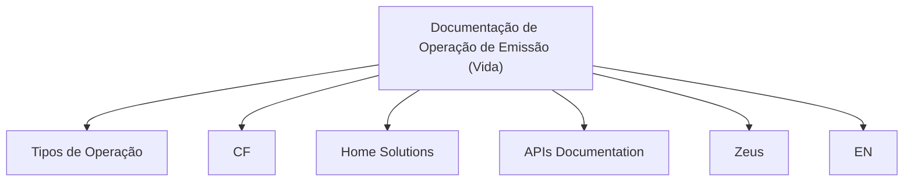

# Documentação de Operação de Emissão (Vida)

## 1. Metadados do Documento
- **Arquivo de Origem:** Não identificado; conteúdo fornecido como texto bruto.
- **Tipo de Documento:** Manual Operacional.
- **Domínio / Sistema:** Operação de Emissão (Vida).
- **Público-Alvo:** Operação e áreas de negócio.
- **Data/Versão Identificada:** Não identificada.

---

## 2. Resumo Executivo & Contexto de Negócio

O documento apresenta uma documentação orientada à operação de **Emissão (Vida)** e ao respectivo tipo de negócio. O conteúdo disponível identifica o foco operacional, mas não apresenta procedimentos, regras de execução, responsabilidades ou critérios de validação detalhados.

A extração menciona os elementos “TIPOS DE OPERACIÓN”, “CF”, “Home Solutions”, “APIs Documentation”, “Zeus” e “EN”. Entretanto, o trecho não descreve as relações entre esses termos, seus papéis no processo de emissão nem contratos técnicos associados.

O material pode servir como ponto de indexação para busca corporativa pelos termos de domínio de emissão, vida, operação, APIs e Zeus. Porém, a página fornecida não sustenta conclusões sobre arquitetura, integrações, endpoints, ambientes ou fluxos de negócio.

**Nota de Análise:** O documento menciona “Home Solutions”, “APIs Documentation” e “Zeus”, mas não detalha se são sistemas, módulos, portais, ambientes, equipes ou documentos relacionados.

---

## 3. Arquitetura, Componentes & Tecnologias Envolvidas

| Componente / Termo citado | Evidência no documento | Detalhamento disponível |
| :--- | :--- | :--- |
| Emisión (Vida) | Título “DOCUMENTACIÓN de OPERACIÓN de EMISIÓN (Vida)” | Identificado como tema central da documentação. |
| Tipos de Operación | Seção “TIPOS DE OPERACIÓN” | Não há tipos listados no conteúdo extraído. |
| CF | Termo isolado “CF” | Não definido. |
| Home Solutions | Termo presente no texto bruto | Não definido. |
| APIs Documentation | Termo presente no texto bruto | Não há APIs, métodos, URLs ou contratos descritos. |
| Zeus | Termo presente no texto bruto | Não definido. |
| EN | Termo isolado “EN” | Não definido. |



**Nota de Análise:** O diagrama representa exclusivamente a coocorrência dos termos na página extraída. O documento não descreve integrações, direção de chamadas, protocolos, dependências técnicas ou fluxo de dados entre os elementos.

---

## 4. Regras de Negócio, Especificações Funcionais & Processos

O conteúdo extraído estabelece apenas os seguintes pontos:

1. A documentação é orientada à **operação**.
2. O escopo está relacionado à **Emissão (Vida)**.
3. Há uma seção intitulada **“TIPOS DE OPERACIÓN”**.
4. Os termos **CF**, **Home Solutions**, **APIs Documentation**, **Zeus** e **EN** aparecem no documento.

Não foram identificadas regras de negócio explícitas, condições de elegibilidade, fórmulas, cálculos, estados operacionais, etapas de processo, aprovações, exceções, campos obrigatórios ou critérios de validação.

**Nota de Análise:** A página fornecida não detalha quais são os tipos de operação nem como cada tipo deve ser processado no contexto de Emissão (Vida).

---

## 5. Tabelas de Parâmetros, Ambientes e Estruturas de Dados

| Item / Parâmetro | Descrição / Função | Tipo / Valores / Formato | Ambiente / Observações |
| :--- | :--- | :--- | :--- |
| Emisión (Vida) | Tema central da documentação operacional. | Texto / domínio de negócio. | Não há ambiente identificado. |
| Tipos de Operación | Título de uma seção referente a operações. | Texto. | Tipos não detalhados. |
| CF | Termo citado isoladamente. | Não identificado. | Significado não informado. |
| Home Solutions | Termo citado no documento. | Não identificado. | Função não informada. |
| APIs Documentation | Referência a documentação de APIs. | Texto. | Não há endpoints, autenticação ou contratos. |
| Zeus | Termo citado no documento. | Não identificado. | Papel não informado. |
| EN | Termo citado isoladamente. | Não identificado. | Significado não informado. |

Não foram identificados servidores, URLs, portas, variáveis de configuração, rotas de logs, parâmetros de ambiente, estruturas JSON/XML ou modelos de dados.

---

## 6. Bateria de Perguntas & Respostas para RAG (FAQ Sintético)

### P1: Qual é o tema principal da documentação?
**R:** A documentação é orientada à operação de **Emisión (Vida)**, conforme o título “DOCUMENTACIÓN de OPERACIÓN de EMISIÓN (Vida)”.

### P2: O documento descreve quais são os tipos de operação de Emissão (Vida)?
**R:** Não. O documento contém a seção “TIPOS DE OPERACIÓN”, mas o conteúdo extraído não lista nem descreve os tipos de operação.

### P3: Qual público ou área é explicitamente atendido pelo documento?
**R:** O documento declara ser orientado à operação e ao tipo de negócio. Não há indicação mais específica de equipes, funções ou perfis profissionais.

### P4: O que significa a sigla CF no documento?
**R:** O significado de “CF” não é informado no conteúdo fornecido. A sigla aparece isoladamente e não deve receber interpretação adicional sem fonte complementar.

### P5: Home Solutions é descrito como sistema ou componente da operação?
**R:** Não. “Home Solutions” é mencionado no texto bruto, mas o documento não define sua natureza, responsabilidade ou relação com a Emissão (Vida).

### P6: Quais APIs são documentadas no material?
**R:** Nenhuma API específica é documentada no trecho fornecido. O texto menciona “APIs Documentation”, mas não contém nomes de APIs, endpoints, métodos HTTP, contratos, autenticação ou exemplos de requisição e resposta.

### P7: Qual é o papel de Zeus no processo de emissão?
**R:** O papel de “Zeus” não é detalhado. O nome aparece no documento, mas não há descrição funcional, técnica ou operacional associada.

### P8: Há ambientes, URLs ou servidores informados para a operação de Emissão (Vida)?
**R:** Não. O conteúdo extraído não apresenta ambientes, URLs, hosts, portas, servidores ou variáveis de configuração.

### P9: O documento define um fluxo operacional de emissão?
**R:** Não. Apesar de ser uma documentação de operação de Emissão (Vida), o trecho não descreve etapas, responsáveis, entradas, saídas, decisões ou exceções do fluxo.

### P10: O que significa o termo EN no documento?
**R:** O significado de “EN” não está identificado no conteúdo fornecido. Trata-se de um termo isolado sem explicação contextual adicional.

### P11: É possível determinar relações de integração entre Home Solutions, APIs Documentation e Zeus?
**R:** Não. Os três termos são mencionados, porém o documento não fornece evidência sobre integrações, dependências, protocolos ou fluxo de dados entre eles.

---

## 7. Glossário de Termos, Siglas & Conceitos-Chave

- **Emisión (Vida):** Tema de negócio e operação indicado no título do documento.
- **Tipos de Operación:** Seção mencionada no documento; os tipos não são especificados.
- **CF:** Sigla ou termo citado sem definição.
- **Home Solutions:** Termo citado sem definição funcional ou técnica.
- **APIs Documentation:** Referência textual a documentação de APIs; não há detalhes de APIs no conteúdo fornecido.
- **Zeus:** Termo citado sem definição.
- **EN:** Termo citado sem definição.

---

## 8. Notas Críticas, Riscos & Limitações

- O conteúdo disponível corresponde a uma única página e contém apenas títulos e termos isolados.
- Não há detalhamento dos **Tipos de Operación**.
- Não há fluxos operacionais, regras de negócio, procedimentos, exceções ou responsabilidades.
- Não há definição para **CF**, **Home Solutions**, **Zeus** ou **EN**.
- Não há contratos de API, endpoints, protocolos, credenciais, URLs, ambientes ou parâmetros técnicos.
- Qualquer interpretação arquitetural ou funcional adicional sobre os termos citados configuraria extrapolação não sustentada pelo documento.

---

## 9. Conteúdo Bruto Estruturado (Referência Fiel)

```text
--- [PÁGINA 1 DE 1] ---

DOCUMENTACIÓN de OPERACIÓN de
EMISIÓN (Vida)
 Documentación orientada a la operación y tipo de negocio
TIPOS DE OPERACIÓN
 
 
 
 
 / 
 CF
Home Solutions APIs Documentation Zeus
EN
```
