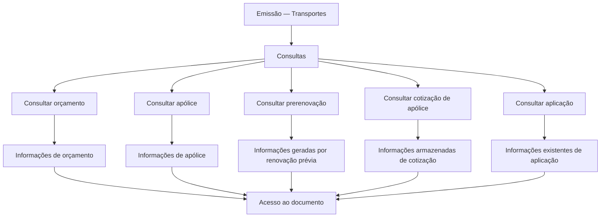

# Documentação de Operação de Emissão (Transportes) — Consultas

## 1. Metadados do Documento
- **Arquivo de Origem:** Não identificado
- **Tipo de Documento:** Manual Operacional
- **Domínio / Sistema:** Emissão — Transportes; consultas de documentos
- **Público-Alvo:** Operação, negócio e usuários de consulta
- **Data/Versão Identificada:** Não identificada

---

## 2. Resumo Executivo & Contexto de Negócio

O documento apresenta opções de consulta disponíveis no contexto de **Emissão (Transportes)**. O conteúdo descreve consultas destinadas a recuperar informações de artefatos do processo de emissão, incluindo orçamento, apólice, prerenovação, cotização de apólice e aplicação.

A consulta de orçamento permite visualizar informações relacionadas a um orçamento previamente localizado por critérios de busca. A consulta de apólice permite acessar as informações de uma apólice após uma seleção realizada com critérios de busca.

A consulta de prerenovação dá acesso a informações geradas por uma renovação anterior. A consulta de cotização de apólice permite acessar informações armazenadas relativas a uma cotização. A consulta de aplicação permite visualizar as informações existentes sobre uma aplicação.

O documento menciona, para cada opção, a ação **“Accede al documento”**, indicando acesso ao documento correspondente. Não são detalhados critérios específicos de busca, campos retornados, permissões, métodos de integração, URLs, contratos de dados ou procedimentos de navegação.

---

## 3. Arquitetura, Componentes & Tecnologias Envolvidas

Os componentes funcionais explicitamente citados são:

- **Consulta de orçamento**
- **Consulta de apólice**
- **Consulta de prerenovação**
- **Consulta de cotização de apólice**
- **Consulta de aplicação**
- **Documento associado** a cada consulta



**Nota de Análise:** O documento não detalha arquitetura técnica, sistemas de backend, microsserviços, tecnologias, interfaces, protocolos, bancos de dados ou ambientes.

---

## 4. Regras de Negócio, Especificações Funcionais & Processos

### Consulta de orçamento
1. O usuário localiza previamente um orçamento por diferentes critérios de busca.
2. A funcionalidade exibe informações relacionadas ao orçamento localizado.
3. A opção permite acessar o documento associado.

### Consulta de apólice
1. O usuário realiza previamente a seleção de uma apólice por diferentes critérios de busca.
2. A funcionalidade permite acessar as informações da apólice selecionada.
3. A opção permite acessar o documento associado.

### Consulta de prerenovação
1. A funcionalidade permite acessar informações geradas por uma renovação prévia.
2. A opção permite acessar o documento associado.

### Consulta de cotização de apólice
1. A funcionalidade acessa informações armazenadas relativas a uma cotização de apólice.
2. A opção permite acessar o documento associado.

### Consulta de aplicação
1. A funcionalidade visualiza as informações existentes relativas a uma aplicação.
2. A opção permite acessar o documento associado.

**Nota de Análise:** O documento não informa os critérios de pesquisa disponíveis, validações, regras de autorização, condições de erro, estados do processo ou campos exibidos em cada consulta.

---

## 5. Tabelas de Parâmetros, Ambientes e Estruturas de Dados

| Item / Parâmetro | Descrição / Função | Tipo / Valores / Formato | Ambiente / Observações |
| :--- | :--- | :--- | :--- |
| Consulta de orçamento | Mostra informações relacionadas a um orçamento previamente localizado. | Consulta funcional | Localização prévia mediante diferentes critérios de busca. |
| Consulta de apólice | Permite acessar informações de uma apólice. | Consulta funcional | Seleção prévia mediante diferentes critérios de busca. |
| Consulta de prerenovação | Permite acessar informações geradas por uma renovação prévia. | Consulta funcional | Não há detalhamento adicional. |
| Consulta de cotização de apólice | Acessa informações armazenadas relativas a uma cotização. | Consulta funcional | Não há detalhamento adicional. |
| Consulta de aplicação | Visualiza informações existentes relativas a uma aplicação. | Consulta funcional | Não há detalhamento adicional. |
| Accede al documento | Ação citada para acesso ao documento associado à consulta. | Ação de acesso | Não há URL, formato documental ou regra de acesso informados. |
| RS | Texto apresentado na interface ou navegação. | Sigla/elemento de interface | Significado não detalhado. |
| Zeus | Texto apresentado na interface ou navegação. | Sistema, módulo ou referência de navegação não confirmada | O papel de Zeus não é detalhado. |
| Soluciones APIs | Texto apresentado na interface ou navegação. | Seção ou referência de navegação não confirmada | Não há descrição técnica de APIs. |

---

## 6. Bateria de Perguntas & Respostas para RAG (FAQ Sintético)

### P1: Qual é o objetivo da seção de consultas da documentação de Emissão para Transportes?
**R:** A seção apresenta opções para consultar informações de orçamento, apólice, prerenovação, cotização de apólice e aplicação no contexto de Emissão — Transportes.

### P2: Como funciona a consulta de orçamento?
**R:** A consulta de orçamento mostra informações relacionadas a um orçamento previamente localizado por diferentes critérios de busca e inclui a possibilidade de acessar o documento associado.

### P3: É necessário localizar um orçamento antes de consultar suas informações?
**R:** Sim. O documento informa que o orçamento deve ter sido previamente localizado mediante diferentes critérios de busca antes da exibição das informações relacionadas.

### P4: O que a consulta de apólice permite acessar?
**R:** A consulta de apólice permite acessar informações de uma apólice cuja seleção foi previamente facilitada por diferentes critérios de busca.

### P5: O documento especifica quais critérios de busca estão disponíveis para orçamento e apólice?
**R:** Não. O documento informa apenas que existem diferentes critérios de busca, sem listar os critérios, campos, filtros ou comportamentos de pesquisa.

### P6: Qual informação é recuperada pela consulta de prerenovação?
**R:** A consulta de prerenovação permite acessar informações que foram geradas por uma renovação prévia.

### P7: Para que serve a consulta de cotização de apólice?
**R:** A consulta de cotização de apólice acessa informações armazenadas relativas a uma cotização.

### P8: O que a consulta de aplicação visualiza?
**R:** A consulta de aplicação visualiza as informações existentes relativas a uma aplicação.

### P9: Todas as opções de consulta oferecem acesso a um documento?
**R:** O conteúdo exibido associa a ação “Accede al documento” às opções de consulta apresentadas. Contudo, não detalha o formato, a localização, as permissões ou o mecanismo técnico de acesso aos documentos.

### P10: A documentação descreve APIs, métodos HTTP ou contratos JSON para as consultas?
**R:** Não. Embora o texto de navegação apresente “Soluciones APIs”, o documento não descreve APIs, métodos HTTP, endpoints, payloads, contratos JSON ou integrações técnicas.

---

## 7. Glossário de Termos, Siglas & Conceitos-Chave

- **Emissão:** Contexto funcional identificado no título do documento como “EMISIÓN”.
- **Transportes:** Domínio ou linha de negócio identificada no título do documento.
- **Orçamento / presupuesto:** Artefato consultável previamente localizado por critérios de busca.
- **Apólice / póliza:** Artefato consultável selecionado previamente por critérios de busca.
- **Prerenovação / prerenovacion:** Informação gerada por uma renovação prévia.
- **Cotização / cotización:** Informação armazenada relativa a uma cotização de apólice.
- **Aplicação / aplicación:** Entidade para a qual podem ser visualizadas informações existentes.
- **RS:** Sigla exibida no conteúdo; significado não identificado.
- **Zeus:** Termo exibido na navegação; significado e função não detalhados.

---

## 8. Notas Críticas, Riscos & Limitações

- O arquivo, data, versão e autoria do documento não foram identificados.
- O conteúdo é funcional e resumido; não apresenta detalhamento técnico de arquitetura, integrações, APIs, ambientes ou infraestrutura.
- O documento não define critérios concretos de busca para orçamento e apólice.
- Não há descrição de campos retornados, filtros, mensagens de erro, regras de autorização ou perfis de acesso.
- O termo **Zeus** e a sigla **RS** são citados sem definição contextual.
- Não há informações sobre formatos, repositórios, URLs ou permissões para a ação **“Accede al documento”**.

---

## 9. Conteúdo Bruto Estruturado (Referência Fiel)

```text
--- [PÁGINA 1 DE 2] ---

DOCUMENTACIÓN de OPERACIÓN de
EMISIÓN (Transportes) - CONSULTA
CONSULTAS
Distintas opciones de consulta
CONSULTAR presupuesto
Muestra la información relacionada con un
presupuesto, previamente ubicado mediante
distintos criterios de búsqueda
 Accede al documento
CONSULTAR póliza
Permite el acceso a la información de una
póliza, donde previamente se ha facilitado la
selección mediante distintos criterios de
búsqueda
 Accede al documento
CONSULTAR prerenovacion
Facilita el acceso a la información que ha sido
generada por una renovación previa
CONSULTAR cotización póliza
Accede a la información almacenada relativa
a una cotización
 / 
 RS
Inicio Soluciones APIs Documentación Zeus
ES


--- [PÁGINA 2 DE 2] ---

Accede al documento
  Accede al documento
CONSULTAR aplicación
Visualiza la información que existe relativa a
una aplicación
 Accede al documento
```
