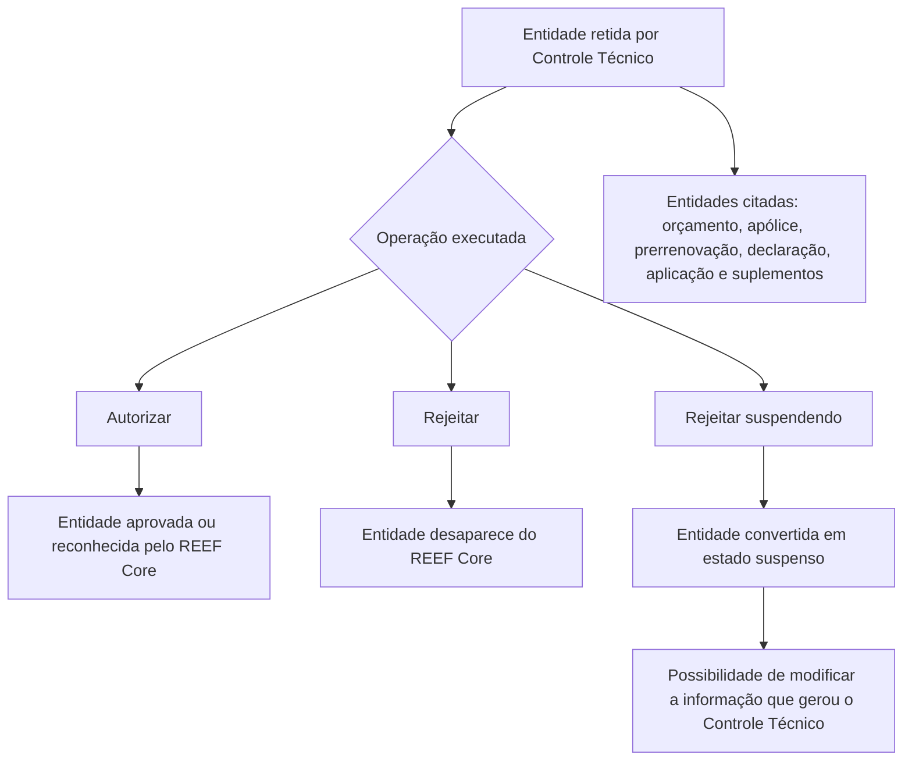

# Documentação de Operação de Emissão (Transportes) — Controle Técnico no REEF Core

## 1. Metadados do Documento
- **Arquivo de Origem:** Não informado; conteúdo bruto fornecido pelo usuário.
- **Tipo de Documento:** Manual Operacional.
- **Domínio / Sistema:** Emissão de Transportes, Controle Técnico e REEF Core.
- **Público-Alvo:** Operação, analistas funcionais, desenvolvedores e equipes de suporte.
- **Data/Versão Identificada:** Não identificada.

---

## 2. Resumo Executivo & Contexto de Negócio

O documento descreve operações de autorização e rejeição aplicáveis a entidades de emissão de Transportes que foram retidas por **controle técnico**. As entidades citadas são orçamento, apólice, prerrenovação, declaração, aplicação e suplementos associados a apólices ou aplicações.

As operações de autorização liberam a entidade retida, fazendo com que a entidade passe a ser reconhecida ou exista para o restante do sistema **REEF Core**. Para uma apólice renovada previamente, a autorização faz com que o REEF Core a reconheça como uma apólice prerrenovada.

As operações de rejeição seguem dois resultados principais: exclusão da entidade do REEF Core ou conversão para um estado suspenso. A suspensão preserva a oportunidade de corrigir a informação que ocasionou o controle técnico, conforme descrito explicitamente para orçamentos, declarações e algumas operações relacionadas a apólices e aplicações.

O material apresenta nomes de operações e seus efeitos funcionais, mas não informa URLs finais, métodos HTTP, contratos JSON, responsáveis, permissões, critérios que disparam o controle técnico, nem transições técnicas internas. As referências “Accede al documento” indicam documentação complementar não incluída no conteúdo bruto.

---

## 3. Arquitetura, Componentes & Tecnologias Envolvidas

Os componentes e conceitos explicitamente citados são:

| Componente / Conceito | Papel descrito |
| :--- | :--- |
| Emissão (Transportes) | Domínio operacional ao qual se aplica o controle técnico. |
| Controle Técnico | Mecanismo que retém entidades para posterior autorização ou rejeição. |
| REEF Core | Sistema que reconhece, mantém ou deixa de exibir entidades após a operação. |
| Orçamento / presupuesto | Entidade que pode ser aprovada, removida ou suspensa. |
| Apólice / póliza | Entidade que pode ser aprovada, removida ou submetida a operação de suspensão. |
| Prerrenovação / prerenovación | Renovação prévia de uma apólice que pode ser autorizada ou rejeitada. |
| Declaração / declaración | Entidade que pode ser autorizada, removida ou suspensa. |
| Aplicação / aplicación | Entidade que pode ser autorizada, removida ou convertida em declaração suspensa segundo o texto. |
| Suplemento / suplemento | Alteração feita sobre uma apólice ou aplicação; pode ser rejeitada ou suspensa. |
| Soluciones APIs | Item de navegação listado no conteúdo; nenhuma função técnica adicional foi descrita. |
| Zeus | Item de navegação listado no conteúdo; nenhuma função técnica adicional foi descrita. |



> **Nota de Análise:** O documento não detalha integrações, APIs, persistência, métodos HTTP, contratos de dados, autenticação ou a implementação técnica do REEF Core e do Controle Técnico.

---

## 4. Regras de Negócio, Especificações Funcionais & Processos

### 4.1 Premissa geral de Controle Técnico

1. As operações descritas são aplicadas a entidades que estão **retidas por controle técnico**.
2. A autorização torna a entidade aprovada, existente ou reconhecida pelo restante do REEF Core, dependendo da entidade.
3. A rejeição simples faz a entidade desaparecer do REEF Core.
4. A rejeição com suspensão busca permitir a modificação da informação que causou o controle técnico.
5. O documento não especifica quem pode executar as operações, quais validações são necessárias, nem como identificar a causa de uma retenção.

### 4.2 Operações de autorização

#### AUTORIZAR orçamento
- Um orçamento retido por controle técnico passa a estar aprovado.
- Como consequência, o orçamento passa a existir para o restante do REEF Core.

#### AUTORIZAR apólice
- Uma apólice retida por controle técnico passa a estar aprovada.
- Como consequência, o restante do REEF Core reconhece a entidade como apólice.

#### AUTORIZAR prerrenovação
- Uma apólice previamente renovada e retida por controle técnico passa a estar aprovada.
- Como consequência, o restante do REEF Core reconhece a entidade como apólice prerrenovada.

#### AUTORIZAR declaração
- Uma declaração retida por controle técnico passa a estar aprovada.
- Como consequência, a declaração passa a existir para o restante do REEF Core.

#### AUTORIZAR aplicação
- Uma aplicação retida por controle técnico passa a estar aprovada.
- Como consequência, o restante do REEF Core reconhece a entidade como aplicação.

### 4.3 Operações de rejeição sem suspensão

#### REJEITAR orçamento
- Um orçamento retido por controle técnico não é autorizado.
- Como consequência, o orçamento desaparece do REEF Core.

#### REJEITAR apólice
- Uma apólice retida por controle técnico não é autorizada.
- Como consequência, a apólice desaparece do REEF Core.

#### REJEITAR apólice modificação
- Um suplemento realizado sobre uma apólice e retido por controle técnico não é autorizado.
- Como consequência, o suplemento desaparece do REEF Core.

#### REJEITAR prerrenovação
- Uma renovação prévia de uma apólice retida por controle técnico não é autorizada.
- Como consequência, a prerrenovação desaparece do REEF Core.

#### REJEITAR declaração
- Uma declaração retida por controle técnico não é autorizada.
- Como consequência, a declaração desaparece do REEF Core.

#### REJEITAR aplicação
- Uma aplicação retida por controle técnico não é autorizada.
- Como consequência, a aplicação desaparece do REEF Core.

#### REJEITAR aplicação modificação
- Um suplemento realizado sobre uma aplicação e retido por controle técnico não é autorizado.
- Como consequência, o suplemento desaparece do REEF Core.

### 4.4 Operações de rejeição com suspensão

#### REJEITAR orçamento suspendendo
- Um orçamento retido por controle técnico não é autorizado.
- O orçamento passa a ser um orçamento suspenso.
- A suspensão fornece oportunidade de modificar a informação que gerou o controle técnico.

#### REJEITAR apólice suspendendo
- Uma apólice retida por controle técnico não é autorizada.
- O texto declara que a apólice passa a se converter em um **orçamento suspenso**.
- A finalidade indicada é permitir a modificação da informação que gerou o controle técnico.

> **Nota de Análise:** A conversão de uma apólice em “orçamento suspenso” é reproduzida fielmente do documento e pode representar uma regra de negócio específica ou uma inconsistência textual. O conteúdo fornecido não permite concluir qual interpretação é correta.

#### REJEITAR apólice modificação suspendendo
- Um suplemento realizado sobre uma apólice e retido por controle técnico não é autorizado.
- O texto continua na página seguinte e declara que a entidade passa a converter-se em um **orçamento suspenso**.
- A finalidade indicada é permitir a modificação da informação que gerou o controle técnico.

> **Nota de Análise:** O conteúdo não informa se o suplemento mantém vínculo com a apólice original após a conversão em orçamento suspenso.

#### REJEITAR declaração suspendendo
- Uma declaração retida por controle técnico não é autorizada.
- A declaração passa a converter-se em uma declaração suspensa.
- A suspensão permite modificar a informação que gerou o controle técnico.

#### REJEITAR aplicação suspendendo
- Uma aplicação retida por controle técnico não é autorizada.
- O texto declara que a aplicação passa a converter-se em uma **declaração suspensa**.
- A finalidade indicada é permitir a modificação da informação que gerou o controle técnico.

> **Nota de Análise:** A conversão de aplicação em “declaração suspensa” é reproduzida fielmente do documento. Não há detalhamento que esclareça se essa conversão é intencional ou uma inconsistência documental.

#### REJEITAR aplicação modificação suspendendo
- Um suplemento realizado sobre uma aplicação e retido por controle técnico não é autorizado.
- O texto declara que o suplemento passa a converter-se em uma **declaração suspensa**.
- A finalidade indicada é permitir a modificação da informação que gerou o controle técnico.

---

## 5. Tabelas de Parâmetros, Ambientes e Estruturas de Dados

| Item / Parâmetro | Descrição / Função | Tipo / Valores / Formato | Ambiente / Observações |
| :--- | :--- | :--- | :--- |
| Controle Técnico | Estado ou mecanismo que retém entidades para decisão operacional. | Conceito funcional. | Não são informados critérios de retenção. |
| REEF Core | Sistema que reconhece entidades aprovadas ou deixa de exibir entidades rejeitadas. | Sistema corporativo. | Não há versão, URL ou detalhes de integração. |
| Orçamento | Entidade de emissão sujeita a autorização, rejeição ou suspensão. | Entidade de negócio. | Autorizado: aprovado e existente no REEF Core. Rejeitado: desaparece. Rejeitado suspendendo: orçamento suspenso. |
| Apólice | Entidade de emissão sujeita a autorização, rejeição ou operação de suspensão. | Entidade de negócio. | Autorizada: aprovada e reconhecida pelo REEF Core. Rejeitada: desaparece. |
| Prerrenovação | Renovação prévia de apólice. | Entidade de negócio. | Autorizada: reconhecida como apólice prerrenovada. Rejeitada: desaparece. |
| Declaração | Entidade sujeita a controle técnico. | Entidade de negócio. | Autorizada: aprovada e existente. Rejeitada: desaparece. Rejeitada suspendendo: declaração suspensa. |
| Aplicação | Entidade sujeita a controle técnico. | Entidade de negócio. | Autorizada: aprovada e reconhecida como aplicação. Rejeitada: desaparece. Rejeitada suspendendo: o texto indica declaração suspensa. |
| Suplemento de apólice | Modificação realizada sobre uma apólice. | Entidade de negócio / alteração. | Rejeitado: desaparece. Rejeitado suspendendo: texto indica orçamento suspenso. |
| Suplemento de aplicação | Modificação realizada sobre uma aplicação. | Entidade de negócio / alteração. | Rejeitado: desaparece. Rejeitado suspendendo: texto indica declaração suspensa. |
| AUTORIZAR | Operação que libera uma entidade retida. | Ação operacional. | Resultado varia conforme a entidade. |
| REJEITAR | Operação que não autoriza uma entidade retida. | Ação operacional. | Resultado normal: entidade desaparece do REEF Core. |
| REJEITAR suspendendo | Operação que não autoriza, mas transforma a entidade em estado suspenso. | Ação operacional. | Objetivo: permitir alteração da informação que gerou o controle técnico. |
| Accede al documento | Referência a documento complementar. | Link ou chamada documental. | URLs e conteúdos de destino não fornecidos. |
| Soluciones APIs | Item de navegação apresentado no texto. | Navegação / plataforma não detalhada. | Sem detalhamento adicional. |
| Zeus | Item de navegação apresentado no texto. | Navegação / plataforma não detalhada. | Sem detalhamento adicional. |

---

## 6. Bateria de Perguntas & Respostas para RAG (FAQ Sintético)

### P1: O que acontece quando um orçamento retido por controle técnico é autorizado?
**R:** A operação **AUTORIZAR orçamento** faz com que o orçamento retido por controle técnico passe a estar aprovado. Após a autorização, o orçamento passa a existir para o restante do sistema REEF Core.

### P2: Qual é o efeito de rejeitar um orçamento sem suspendê-lo?
**R:** A operação **REJEITAR orçamento** não autoriza o orçamento retido por controle técnico. Como resultado, o orçamento desaparece do REEF Core.

### P3: Como funciona a rejeição de orçamento com suspensão?
**R:** A operação **REJEITAR orçamento suspendendo** não autoriza o orçamento retido por controle técnico, mas converte o orçamento em orçamento suspenso. O objetivo declarado é oferecer a oportunidade de modificar a informação que gerou o controle técnico.

### P4: O que ocorre ao autorizar uma apólice retida por controle técnico?
**R:** A operação **AUTORIZAR apólice** aprova a apólice retida por controle técnico. Como consequência, o restante do REEF Core passa a reconhecer a entidade como apólice.

### P5: Como o REEF Core trata uma prerrenovação autorizada?
**R:** Na operação **AUTORIZAR prerrenovação**, uma apólice que foi renovada previamente e está retida por controle técnico passa a estar aprovada. O restante do REEF Core passa a reconhecê-la como apólice prerrenovada.

### P6: Qual é o resultado de rejeitar uma declaração suspendendo?
**R:** A operação **REJEITAR declaração suspendendo** não autoriza a declaração retida por controle técnico. A declaração passa a ser uma declaração suspensa, permitindo modificar a informação que ocasionou o controle técnico.

### P7: O que acontece com uma aplicação autorizada?
**R:** A operação **AUTORIZAR aplicação** aprova a aplicação retida por controle técnico. Em seguida, o restante do REEF Core reconhece a entidade como aplicação.

### P8: O que ocorre ao rejeitar uma aplicação sem suspensão?
**R:** A operação **REJEITAR aplicação** não autoriza a aplicação retida por controle técnico. Como resultado, a aplicação desaparece do REEF Core.

### P9: Qual estado é indicado para uma aplicação rejeitada com suspensão?
**R:** O texto da operação **REJEITAR aplicação suspendendo** afirma que a aplicação não é autorizada e passa a converter-se em uma declaração suspensa. Essa formulação deve ser interpretada com cautela, pois o documento não explica a razão da conversão de aplicação para declaração suspensa.

### P10: Como é tratado um suplemento de uma apólice rejeitado por controle técnico?
**R:** Na operação **REJEITAR apólice modificação**, um suplemento realizado sobre uma apólice e retido por controle técnico não é autorizado. Como consequência, o suplemento desaparece do REEF Core.

### P11: O que o documento informa sobre a suspensão de um suplemento de aplicação?
**R:** Na operação **REJEITAR aplicação modificação suspendendo**, um suplemento realizado sobre uma aplicação, retido por controle técnico, não é autorizado e passa a converter-se em uma declaração suspensa. A finalidade declarada é permitir modificar a informação que gerou o controle técnico.

### P12: O documento especifica APIs, URLs ou contratos JSON para as operações de controle técnico?
**R:** Não. O documento apenas lista operações funcionais e os respectivos resultados no REEF Core. Embora apresente referências “Accede al documento” e itens de navegação como “Soluciones APIs” e “Zeus”, não fornece URLs, métodos HTTP, payloads JSON, contratos, portas ou mecanismos de autenticação.

---

## 7. Glossário de Termos, Siglas & Conceitos-Chave

- **REEF Core:** Sistema mencionado como responsável por reconhecer entidades aprovadas, manter entidades existentes ou deixar de exibir entidades rejeitadas.
- **Controle Técnico:** Mecanismo ou condição que retém entidades para avaliação, autorização ou rejeição.
- **Orçamento / presupuesto:** Entidade de negócio que pode ser aprovada, removida do REEF Core ou convertida em orçamento suspenso.
- **Apólice / póliza:** Entidade de negócio que pode ser autorizada, rejeitada ou relacionada a suplementos e prerrenovações.
- **Prerrenovação / prerenovación:** Renovação prévia de uma apólice.
- **Declaração / declaración:** Entidade de negócio sujeita a autorização, rejeição ou conversão em declaração suspensa.
- **Aplicação / aplicación:** Entidade de negócio sujeita a controle técnico; o texto associa a suspensão de aplicação à conversão em declaração suspensa.
- **Suplemento / suplemento:** Modificação realizada sobre uma apólice ou aplicação.
- **Suspenso / suspendido:** Estado aplicado após certas rejeições para permitir correção da informação que originou o controle técnico.
- **Soluciones APIs:** Item de navegação listado no documento, sem função adicional explicada.
- **Zeus:** Item de navegação listado no documento, sem função adicional explicada.

---

## 8. Notas Críticas, Riscos & Limitações

- O documento não define os critérios que fazem uma entidade ficar retida por controle técnico.
- Não há detalhes de permissões, perfis autorizados, trilhas de auditoria, aprovações, responsáveis ou segregação de funções.
- Não são informados métodos HTTP, APIs, contratos JSON, endpoints, ambientes, URLs, credenciais, versões ou tecnologias de implementação.
- As referências “Accede al documento” indicam materiais complementares, mas seus destinos e conteúdos não foram incluídos.
- Há possíveis inconsistências ou regras não explicadas:
  - A rejeição de uma apólice com suspensão é descrita como conversão em **orçamento suspenso**.
  - A rejeição de uma aplicação com suspensão é descrita como conversão em **declaração suspensa**.
  - A rejeição com suspensão de um suplemento de aplicação também é descrita como conversão em **declaração suspensa**.
- O documento não informa se as conversões mencionadas preservam identificadores, vínculos com entidades originais, histórico operacional ou dados do controle técnico.
- Não há detalhamento adicional para os tópicos “Soluciones APIs” e “Zeus”.

---

## 9. Conteúdo Bruto Estruturado (Referência Fiel)

```text
--- [PÁGINA 1 DE 3] ---

DOCUMENTACIÓN de OPERACIÓN de
EMISIÓN (Transportes) - CONTROL TÉCNICO
CONTROL TÉCNICO
Distintas operaciones de autorización y rechazo de controles técnicos
de auditoría
AUTORIZAR presupuesto
Un presupuesto retenido por control técnico
pasa a estar aprobado y por consiguiente,
existe para el resto de Reef.core
 Accede al documento
AUTORIZAR póliza
Una póliza retenida por control técnico pasa a
estar aprobada y por consiguiente, hace que
el resto de Reef.core la reconozca como
póliza
 Accede al documento
AUTORIZAR prerenovación
 AUTORIZAR declaración
 / 
 RS
Inicio Soluciones APIs Documentación Zeus
ES


--- [PÁGINA 2 DE 3] ---

Una póliza que ha sido renovada previamente
y que está retenida por control técnico pasa a
estar aprobada y por consiguiente, hace que
el resto de Reef.core la reconozca como
póliza prerenovada
 Accede al documento
Una declaración retenida por control técnico
pasa a estar aprobada y por consiguiente,
existe para el resto de Reef.core
 Accede al documento
AUTORIZAR aplicación
Una aplicación retenida por control técnico
pasa a estar aprobada y por consiguiente,
hace que el resto de Reef.core la reconozca
como aplicación
 Accede al documento
RECHAZAR presupuesto
Un presupuesto retenido por control técnico
no es autorizado y por consiguiente
desaparece de Reef.core
 Accede al documento
RECHAZAR presupuesto suspendiendo
Un presupuesto retenido por control técnico
no es autorizado y pasa convertirse en un
presupuesto suspendido y así dar la
oportunidad de modificar la información que
generó el control técnico
 Accede al documento
RECHAZAR póliza
Una póliza retenida por control técnico no es
autorizada y por consiguiente desaparece de
Reef.core
 Accede al documento
RECHAZAR póliza suspendiendo
Una póliza retenida por control técnico no es
autorizada y pasa convertirse en un
presupuesto suspendido y así dar la
oportunidad de modificar la información que
generó el control técnico
 Accede al documento
RECHAZAR póliza modificación
Un suplemento realizado a una póliza que
quedó retenido por control técnico no es
autorizado y por consiguiente desaparece de
Reef.core
 Accede al documento
RECHAZAR póliza modificación
suspendiendo
Un suplemento realizado a una póliza que
quedó retenido por control técnico no es
autorizado y pasa convertirse en un
RECHAZAR prerenovación
Una renovación previa a una póliza que
quedó retenida por control técnico no es
autorizada y por consiguiente desaparece de
Reef.core


--- [PÁGINA 3 DE 3] ---

presupuesto suspendido y así dar la
oportunidad de modificar la información que
generó el control técnico
 Accede al documento
 Accede al documento
RECHAZAR declaración
Una declaración retenida por control técnico
no es autorizada y por consiguiente
desaparece de Reef.core
 Accede al documento
RECHAZAR declaración suspendiendo
Una declaración retenida por control técnico
no es autorizada y pasa convertirse en una
declaración suspendida y así dar la
oportunidad de modificar la información que
generó el control técnico
 Accede al documento
RECHAZAR aplicación
Una aplicación retenida por control técnico no
es autorizada y por consiguiente desaparece
de Reef.core
 Accede al documento
RECHAZAR aplicación suspendiendo
Una aplicación retenida por control técnico no
es autorizada y pasa convertirse en una
declaración suspendida y así dar la
oportunidad de modificar la información que
generó el control técnico
 Accede al documento
RECHAZAR aplicación modificación
Un suplemento realizado a una aplicación que
quedó retenido por control técnico no es
autorizado y por consiguiente desaparece de
Reef.core
 Accede al documento
RECHAZAR aplicación modificación
suspendiendo
Un suplemento realizado a una aplicación que
quedó retenido por control técnico no es
autorizado y pasa convertirse en una
declaración suspendida y así dar la
oportunidad de modificar la información que
generó el control técnico
 Accede al documento
```
