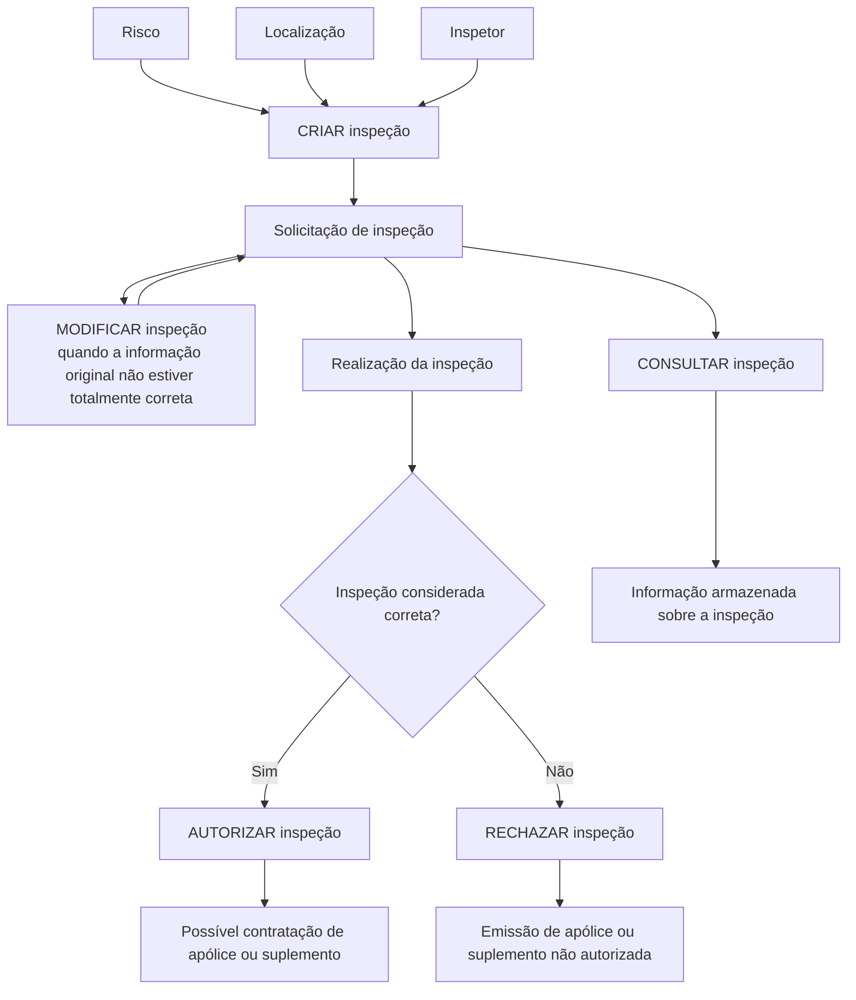

# Documentação de Operação de Emissão (Transportes) — Inspeção

## 1. Metadados do Documento
- **Arquivo de Origem:** `Não informado`
- **Tipo de Documento:** `Procedimento`
- **Domínio / Sistema:** `Emissão (Transportes) — Inspeção`
- **Público-Alvo:** `Operação`
- **Data/Versão Identificada:** `Não identificada`

---

## 2. Resumo Executivo & Contexto de Negócio

O documento descreve operações relacionadas às revisões de riscos no processo de **Emissão (Transportes)**, especificamente para a entidade de negócio **inspeção**. A inspeção é solicitada para que um risco seja avaliado antes da contratação de uma apólice ou suplemento.

A operação **CRIAR inspeção** gera uma solicitação contendo os dados básicos do risco, a localização e o inspetor. O objetivo é avaliar o estado do risco e determinar se ele pode ou não ser segurado pela companhia.

A solicitação de inspeção pode ser alterada por meio da operação **MODIFICAR inspeção** quando as informações originais não estiverem totalmente corretas. Após a realização da inspeção, o processo pode resultar em autorização ou rejeição para emissão da apólice ou suplemento.

A operação **CONSULTAR inspeção** permite acessar as informações armazenadas sobre uma inspeção. O documento menciona links de acesso a documentos associados a cada operação, mas não apresenta os respectivos URLs, contratos, métodos HTTP, campos técnicos ou critérios detalhados de autorização.

---

## 3. Arquitetura, Componentes & Tecnologias Envolvidas

O conteúdo identifica os seguintes elementos funcionais:

| Componente / Elemento | Papel identificado |
| :--- | :--- |
| Emissão (Transportes) | Contexto operacional no qual as operações de inspeção são executadas. |
| Inspeção | Entidade associada à revisão e avaliação de um risco. |
| Risco | Objeto avaliado durante a inspeção para determinar a possibilidade de seguro. |
| Localização | Informação básica incluída na solicitação de inspeção. |
| Inspetor | Informação básica incluída na solicitação de inspeção. |
| Apólice | Produto cuja emissão pode ser autorizada ou não após a inspeção. |
| Suplemento | Produto cuja emissão pode ser autorizada ou não após a inspeção. |
| Soluções APIs | Item de navegação exibido no conteúdo bruto. |
| Documentação Zeus | Item de navegação exibido no conteúdo bruto. |
| RS | Sigla exibida no conteúdo bruto, sem detalhamento. |



> **Nota de Análise:** O documento apresenta operações funcionais de inspeção, mas não detalha sistemas técnicos, microsserviços, tecnologias, métodos HTTP, contratos JSON, persistência de dados ou URLs dos documentos vinculados.

---

## 4. Regras de Negócio, Especificações Funcionais & Processos

### Processo de criação de inspeção

1. Uma solicitação de inspeção de risco é gerada.
2. A solicitação inclui os dados básicos do risco.
3. A solicitação inclui a localização.
4. A solicitação inclui o inspetor.
5. A finalidade da solicitação é avaliar o estado do risco.
6. A avaliação determina se o risco pode ou não ser segurado pela companhia.

### Processo de modificação de inspeção

1. A solicitação de inspeção pode ser atualizada.
2. A atualização é aplicável quando a informação original não estiver totalmente correta.
3. O documento não especifica quais campos podem ser modificados, quem pode modificá-los ou quais validações devem ser executadas.

### Processo de autorização de inspeção

1. A inspeção deve ter sido realizada.
2. Quando a inspeção é considerada correta, torna-se possível a contratação da apólice ou do suplemento.
3. O documento não define critérios objetivos para considerar uma inspeção correta.

### Processo de rejeição de inspeção

1. A inspeção deve ter sido realizada.
2. Quando a inspeção não é considerada correta, a emissão da apólice ou do suplemento não é autorizada.
3. O documento não detalha motivos de rejeição, regras de reavaliação ou mecanismos de recurso.

### Processo de consulta de inspeção

1. A operação **CONSULTAR inspeção** permite acessar informações armazenadas sobre uma inspeção.
2. O documento não informa critérios de pesquisa, filtros, permissões de consulta ou estrutura dos dados retornados.

---

## 5. Tabelas de Parâmetros, Ambientes e Estruturas de Dados

| Item / Parâmetro | Descrição / Função | Tipo / Valores / Formato | Ambiente / Observações |
| :--- | :--- | :--- | :--- |
| Dados básicos do risco | Informações incluídas na criação da solicitação de inspeção. | Não especificado | O documento não detalha os campos. |
| Localização | Informação incluída na solicitação de inspeção. | Não especificado | Não há formato ou regra de validação informada. |
| Inspetor | Informação incluída na solicitação de inspeção. | Não especificado | Não há identificação, perfil ou responsabilidade detalhada. |
| Solicitação de inspeção | Registro gerado para avaliar o estado de um risco. | Não especificado | Pode ser criada e modificada. |
| Estado da inspeção | Condição que determina se a inspeção é considerada correta ou não. | Correta / não correta | O documento não define valores técnicos, transições ou critérios. |
| Resultado de autorização | Permite a contratação de apólice ou suplemento após inspeção correta. | Autorizada | Não há detalhamento do mecanismo de autorização. |
| Resultado de rejeição | Não autoriza a emissão de apólice ou suplemento após inspeção não correta. | Rejeitada | Não há detalhamento de códigos ou justificativas. |
| Informação armazenada | Informação acessível pela operação CONSULTAR inspeção. | Não especificado | Estrutura de dados não apresentada. |
| Documento associado | Referência indicada como “Accede al documento”. | Link não disponibilizado | URLs ou identificadores não estão presentes no conteúdo extraído. |
| Idioma | Idioma indicado na navegação. | ES | Exibido no conteúdo bruto. |
| RS | Elemento exibido na navegação. | Não especificado | Sigla sem expansão ou explicação. |

---

## 6. Bateria de Perguntas & Respostas para RAG (FAQ Sintético)

### P1: Qual é a finalidade da operação CRIAR inspeção no processo de Emissão (Transportes)?
**R:** A operação **CRIAR inspeção** gera uma solicitação de inspeção de risco com os dados básicos do risco, a localização e o inspetor. A finalidade é avaliar o estado do risco para determinar se ele pode ou não ser segurado pela companhia.

### P2: Quais informações são mencionadas para a criação de uma solicitação de inspeção?
**R:** O documento menciona três grupos de informações: os dados básicos do risco, a localização e o inspetor. O conteúdo não detalha os campos, formatos ou validações aplicáveis a essas informações.

### P3: Quando uma solicitação de inspeção deve ser modificada?
**R:** A solicitação deve ser modificada quando, por algum motivo, a informação original não estiver totalmente correta. O documento não informa quais dados podem ser alterados nem quais perfis podem executar a modificação.

### P4: O que ocorre quando uma inspeção é considerada correta?
**R:** Quando a inspeção já foi realizada e é considerada correta, torna-se possível contratar a apólice ou o suplemento.

### P5: O que ocorre quando uma inspeção não é considerada correta?
**R:** Quando a inspeção já foi realizada e não é considerada correta, a emissão da apólice ou do suplemento não é autorizada.

### P6: A rejeição da inspeção impede a emissão de quais produtos?
**R:** A rejeição da inspeção impede a emissão da apólice ou do suplemento, conforme descrito na operação **RECHAZAR inspeção**.

### P7: Qual é a finalidade da operação CONSULTAR inspeção?
**R:** A operação **CONSULTAR inspeção** permite acessar as informações armazenadas a respeito de uma inspeção.

### P8: O documento detalha critérios para decidir se uma inspeção está correta?
**R:** Não. O documento apenas informa que uma inspeção pode ser considerada correta ou não correta, associando esses resultados à possibilidade ou impossibilidade de emissão de apólice ou suplemento.

### P9: O documento apresenta APIs, métodos HTTP ou contratos JSON para as operações de inspeção?
**R:** Não. Embora o conteúdo exiba a navegação “Soluciones APIs” e “Documentación Zeus”, não são fornecidos métodos HTTP, endpoints, URLs, contratos JSON, códigos de resposta ou especificações técnicas de integração.

### P10: Quais operações de inspeção são identificadas no documento?
**R:** O documento identifica as operações **CRIAR inspeção**, **MODIFICAR inspeção**, **AUTORIZAR inspeção**, **RECHAZAR inspeção** e **CONSULTAR inspeção**.

---

## 7. Glossário de Termos, Siglas & Conceitos-Chave

- **Apólice:** Produto cuja contratação pode se tornar possível após uma inspeção considerada correta.
- **CONSULTAR inspeção:** Operação que permite acessar a informação armazenada acerca de uma inspeção.
- **CRIAR inspeção:** Operação que gera uma solicitação de inspeção de risco.
- **Emissão (Transportes):** Contexto de operação identificado no título do documento.
- **Inspetor:** Informação incluída na solicitação de inspeção.
- **Inspeção:** Processo de avaliação do estado de um risco.
- **Localização:** Informação incluída na solicitação de inspeção.
- **MODIFICAR inspeção:** Operação para atualizar uma solicitação quando a informação original não estiver totalmente correta.
- **RECHAZAR inspeção:** Operação associada ao resultado no qual a inspeção não é considerada correta e a emissão não é autorizada.
- **RS:** Sigla exibida no documento sem definição fornecida.
- **Risco:** Elemento submetido à inspeção para avaliação de possibilidade de seguro.
- **Suplemento:** Produto cuja emissão pode ser autorizada ou não após a inspeção.
- **AUTORIZAR inspeção:** Operação associada ao resultado no qual a inspeção é considerada correta e a contratação de apólice ou suplemento é possível.

---

## 8. Notas Críticas, Riscos & Limitações

- O documento não identifica o arquivo de origem, a data, a versão ou a autoria.
- O documento não detalha critérios de avaliação para considerar uma inspeção correta ou não correta.
- Não há definição de campos, formatos, tipos de dados ou regras de validação para os dados básicos do risco, localização e inspetor.
- Não são informados endpoints, URLs, métodos HTTP, contratos de API, códigos de erro ou requisitos de autenticação.
- Embora cada operação apresente a indicação “Accede al documento”, os documentos vinculados não foram fornecidos no conteúdo extraído.
- A sigla **RS** aparece no conteúdo bruto sem expansão ou contexto funcional.
- Não há detalhamento de perfis de acesso, matriz de permissões, trilha de auditoria, transições de status ou tratamento de exceções.

---

## 9. Conteúdo Bruto Estruturado (Referência Fiel)

```text
--- [PÁGINA 1 DE 2] ---

DOCUMENTACIÓN de OPERACIÓN de
EMISIÓN (Transportes) - INSPECCIÓN
INSPECCIÓN
Operaciones relacionadas con las revisiones de riesgos
CREAR inspección
Se genera una solicitud de inspección de
riesgo con los datos básicos del riesgo,
ubicación e inspector con el fin de que se
evalúe el estado y pueda o no ser asegurado
por la compañía
 Accede al documento
MODIFICAR inspección
Se actualiza la solicitud de inspección si por
cualquier motivo la información original no era
totalmente correcta
 Accede al documento
AUTORIZAR inspección
 RECHAZAR inspección
 / 
 RS
Inicio Soluciones APIs Documentación Zeus
ES


--- [PÁGINA 2 DE 2] ---

Una vez realizada la inspección, esta se
considera correcta y es posible la contratación
de la póliza o suplemento
 Accede al documento
Una vez realizada la inspección, esta no se
considera correcta y no se autoriza la emisión
de la póliza o suplemento
 Accede al documento
CONSULTAR inspección
Permite el acceso a la información
almacenada acerca de una inspección
 Accede al documento
```
