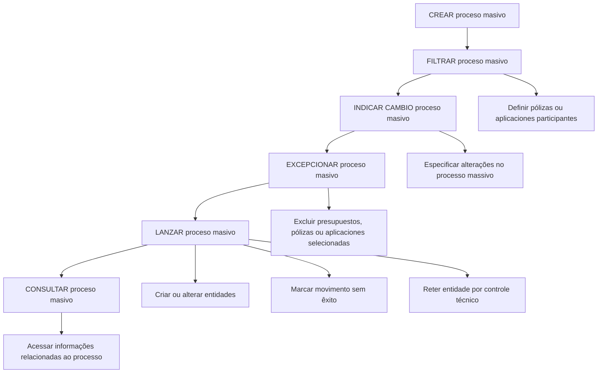

# Documentação de Operação de Emissão (Transportes) — Processos Massivos

## 1. Metadados do Documento
- **Arquivo de Origem:** Não identificado no conteúdo fornecido
- **Tipo de Documento:** Manual Operacional
- **Domínio / Sistema:** Emissão (Transportes) — Processos Massivos
- **Público-Alvo:** Operação, Negócio e usuários responsáveis por processos massivos
- **Data/Versão Identificada:** Não identificada

---

## 2. Resumo Executivo & Contexto de Negócio

O documento descreve a documentação operacional de **Emissão (Transportes)** relacionada a **processos massivos**, definidos como operações por lotes sobre entidades de negócio: **presupuestos**, **pólizas** e/ou **aplicaciones**.

O processo massivo permite criar ou alterar presupuestos, pólizas e aplicaciones. A operação é organizada em etapas funcionais: criação, filtragem das entidades participantes, indicação das alterações, exceção de entidades inicialmente selecionadas, lançamento do processamento e consulta das informações existentes.

Durante o lançamento do processo massivo, as entidades podem ter resultados distintos: podem ser criadas ou alteradas, podem ser marcadas como movimento sem êxito ou podem permanecer retidas por controle técnico.

O conteúdo fornecido apresenta os nomes e os objetivos resumidos das funcionalidades. Não detalha interfaces, métodos HTTP, contratos de integração, tecnologias, autenticação, critérios de seleção, regras de validação ou procedimentos para resolução de falhas.

---

## 3. Arquitetura, Componentes & Tecnologias Envolvidas

O documento menciona as seguintes capacidades funcionais do domínio de processos massivos:

- **CREAR proceso masivo**
- **FILTRAR proceso masivo**
- **INDICAR CAMBIO proceso masivo**
- **EXCEPCIONAR proceso masivo**
- **LANZAR proceso masivo**
- **CONSULTAR proceso masivo**

As entidades de negócio citadas são:

- **Presupuestos**
- **Pólizas**
- **Aplicaciones**

O conteúdo apresenta referências de navegação ou portal: **Inicio**, **Soluciones**, **APIs**, **Documentación**, **Zeus**, **ES** e **RS**. Não há detalhamento suficiente para afirmar relações técnicas, responsabilidades arquiteturais ou integrações entre esses elementos.



> **Nota de Análise:** O documento não detalha microsserviços, bancos de dados, APIs, protocolos, ambientes, URLs, ferramentas de implantação ou contratos JSON.

---

## 4. Regras de Negócio, Especificações Funcionais & Processos

### 4.1 Criar processo massivo

A funcionalidade **CREAR proceso masivo** define um processo massivo capaz de criar ou alterar:

- Presupuestos;
- Pólizas;
- Aplicaciones.

O documento não especifica se a criação e a alteração podem ocorrer simultaneamente no mesmo processo massivo, nem define critérios de elegibilidade, campos obrigatórios ou validações.

### 4.2 Filtrar processo massivo

A funcionalidade **FILTRAR proceso masivo** permite definir quais pólizas ou aplicaciones participam de um processo massivo.

O documento indica explicitamente a seleção de pólizas e aplicaciones. Embora presupuestos sejam citados em outras etapas, a descrição de filtragem menciona apenas pólizas ou aplicaciones.

### 4.3 Indicar mudança no processo massivo

A funcionalidade **INDICAR CAMBIO proceso masivo** permite especificar as mudanças que serão realizadas no processo massivo.

As alterações especificadas serão aplicadas às pólizas e/ou aplicaciones que participarem do processo massivo.

O conteúdo não descreve quais tipos de alterações são permitidos, nem como as alterações são validadas antes do lançamento.

### 4.4 Excepcionar processo massivo

A funcionalidade **EXCEPCIONAR proceso masivo** determina quais entidades inicialmente selecionadas deixam de participar do processo massivo.

Podem ser excluídos do processo massivo:

- Presupuestos;
- Pólizas;
- Aplicaciones.

A exceção ocorre sobre entidades que foram inicialmente selecionadas. O documento não descreve se a exclusão exige justificativa, aprovação ou registro de auditoria.

### 4.5 Lançar processo massivo

A funcionalidade **LANZAR proceso masivo** executa o processo massivo.

Durante a execução, uma série de presupuestos, pólizas e/ou aplicaciones poderá ter três resultados explicitamente descritos:

1. Ser criada ou alterada;
2. Ser marcada como movimento sem êxito;
3. Permanecer retida por controle técnico.

O documento não define códigos de erro, retentativas, tempos de processamento, regras de priorização ou procedimentos de tratamento para entidades sem êxito ou retidas.

### 4.6 Consultar processo massivo

A funcionalidade **CONSULTAR proceso masivo** facilita o acesso às informações existentes relacionadas ao processo massivo.

O documento não detalha quais informações podem ser consultadas, filtros disponíveis, níveis de acesso, histórico de execução ou formato da consulta.

---

## 5. Tabelas de Parâmetros, Ambientes e Estruturas de Dados

| Item / Parâmetro | Descrição / Função | Tipo / Valores / Formato | Ambiente / Observações |
| :--- | :--- | :--- | :--- |
| CREAR proceso masivo | Define um processo massivo para criar ou alterar entidades. | Funcionalidade operacional | Atua sobre presupuestos, pólizas e/ou aplicaciones. |
| FILTRAR proceso masivo | Define quais entidades participam do processo massivo. | Funcionalidade operacional | A descrição menciona pólizas ou aplicaciones. |
| INDICAR CAMBIO proceso masivo | Especifica as mudanças a serem aplicadas. | Funcionalidade operacional | As mudanças afetam pólizas e/ou aplicaciones participantes. |
| EXCEPCIONAR proceso masivo | Exclui entidades inicialmente selecionadas do processo massivo. | Funcionalidade operacional | Pode excluir presupuestos, pólizas ou aplicaciones. |
| LANZAR proceso masivo | Executa o processo massivo. | Funcionalidade operacional | Pode criar, alterar, marcar sem êxito ou reter por controle técnico. |
| CONSULTAR proceso masivo | Permite acessar informações existentes sobre o processo massivo. | Funcionalidade operacional | O conteúdo não informa filtros, campos ou formatos de retorno. |
| Presupuesto | Entidade de negócio citada no processo massivo. | Entidade de negócio | Pode ser criada, alterada, excepcionada ou processada no lançamento. |
| Póliza | Entidade de negócio citada no processo massivo. | Entidade de negócio | Pode ser filtrada, alterada, excepcionada, criada ou alterada no lançamento. |
| Aplicación | Entidade de negócio citada no processo massivo. | Entidade de negócio | Pode ser filtrada, alterada, excepcionada, criada ou alterada no lançamento. |
| Movimento sem êxito | Resultado possível do lançamento de um processo massivo. | Status / resultado de processamento | Não há causa, código ou tratamento detalhado. |
| Controle técnico | Condição em que uma entidade fica retida durante o lançamento. | Status / controle operacional | Não há critérios técnicos descritos. |
| Inicio / Soluciones / APIs / Documentación / Zeus / ES / RS | Referências textuais de navegação presentes na extração. | Navegação / portal não detalhado | Não há informação suficiente para definir URLs, sistemas ou responsabilidades. |

---

## 6. Bateria de Perguntas & Respostas para RAG (FAQ Sintético)

### P1: Qual é o objetivo de um processo massivo em Emissão (Transportes)?
**R:** Um processo massivo permite executar operações por lotes para criar ou alterar presupuestos, pólizas e/ou aplicaciones no contexto de Emissão (Transportes).

### P2: Quais entidades podem ser criadas ou alteradas por um processo massivo?
**R:** O documento informa que um processo massivo pode criar ou alterar presupuestos, pólizas e/ou aplicaciones.

### P3: Para que serve a funcionalidade FILTRAR proceso masivo?
**R:** A funcionalidade FILTRAR proceso masivo permite definir quais pólizas ou aplicaciones participarão de um processo massivo.

### P4: O que é definido na etapa INDICAR CAMBIO proceso masivo?
**R:** Na etapa INDICAR CAMBIO proceso masivo são especificadas as mudanças que serão realizadas no processo massivo e que serão aplicadas às pólizas e/ou aplicaciones participantes.

### P5: Qual é a finalidade de EXCEPCIONAR proceso masivo?
**R:** EXCEPCIONAR proceso masivo determina quais presupuestos, pólizas ou aplicaciones inicialmente selecionados passam a ser excluídos do processo massivo.

### P6: O que ocorre durante LANZAR proceso masivo?
**R:** LANZAR proceso masivo executa o processamento em lote. Durante a execução, presupuestos, pólizas e/ou aplicaciones podem ser criados ou alterados, marcados como movimento sem êxito ou retidos por controle técnico.

### P7: Quais resultados uma entidade pode receber após o lançamento de um processo massivo?
**R:** Segundo o documento, uma entidade pode ser criada ou alterada, marcada como movimento sem êxito ou retida por controle técnico.

### P8: O documento explica por que uma entidade pode ficar retida por controle técnico?
**R:** Não. O documento apenas informa que algumas entidades podem permanecer retidas por controle técnico, sem detalhar critérios, causas ou procedimentos de liberação.

### P9: É possível excluir uma póliza previamente selecionada de um processo massivo?
**R:** Sim. A funcionalidade EXCEPCIONAR proceso masivo permite determinar quais pólizas inicialmente selecionadas passam a ser excluídas do processo massivo.

### P10: A consulta de processo massivo permite acessar quais informações?
**R:** CONSULTAR proceso masivo facilita o acesso às informações existentes relacionadas ao processo massivo. O documento não especifica quais campos, filtros, estados ou dados históricos ficam disponíveis.

### P11: O documento especifica APIs, métodos HTTP ou contratos de integração para processos massivos?
**R:** Não. Embora a extração contenha a palavra “APIs” em elementos de navegação, não há detalhamento de endpoints, métodos HTTP, autenticação, contratos JSON ou integrações.

### P12: Presupuestos podem participar de exceções no processo massivo?
**R:** Sim. A descrição de EXCEPCIONAR proceso masivo informa que presupuestos, pólizas ou aplicaciones inicialmente selecionados podem passar a ser excluídos do processo massivo.

---

## 7. Glossário de Termos, Siglas & Conceitos-Chave

- **Aplicaciones:** Entidades de negócio citadas como participantes possíveis de operações de filtragem, alteração, exceção e lançamento de processos massivos.
- **APIs:** Termo presente na navegação extraída. O documento não define seu significado operacional nem descreve interfaces de programação.
- **CONSULTAR proceso masivo:** Funcionalidade que facilita o acesso às informações existentes relacionadas a um processo massivo.
- **Controle técnico:** Condição de retenção possível durante a execução de um processo massivo. Os critérios não são detalhados.
- **CREAR proceso masivo:** Funcionalidade para definir um processo massivo de criação ou alteração de entidades.
- **EMISIÓN (Transportes):** Contexto funcional declarado no título da documentação.
- **EXCEPCIONAR proceso masivo:** Funcionalidade para excluir entidades inicialmente selecionadas de um processo massivo.
- **FILTRAR proceso masivo:** Funcionalidade para definir quais pólizas ou aplicaciones participam de um processo massivo.
- **INDICAR CAMBIO proceso masivo:** Funcionalidade para especificar mudanças a realizar em entidades participantes.
- **LANZAR proceso masivo:** Funcionalidade de execução do processo massivo.
- **Movimento sem êxito:** Resultado possível do lançamento, no qual uma entidade é marcada como operação malsucedida.
- **Pólizas:** Entidades de negócio citadas como participantes possíveis em processos massivos.
- **Presupuestos:** Entidades de negócio citadas como participantes possíveis em processos massivos.
- **Processos massivos:** Operações relacionadas ao processamento por lotes.
- **RS:** Sigla exibida na navegação extraída. O documento não apresenta definição.
- **Zeus:** Termo exibido na navegação extraída. O documento não apresenta definição.

---

## 8. Notas Críticas, Riscos & Limitações

- O conteúdo extraído é resumido e não contém detalhamento técnico de APIs, endpoints, contratos, bancos de dados, tecnologias, servidores, ambientes, URLs, portas ou mecanismos de autenticação.
- O documento não define critérios para seleção de pólizas ou aplicaciones na etapa de filtragem.
- O documento não especifica quais alterações podem ser indicadas em **INDICAR CAMBIO proceso masivo**.
- O documento informa a possibilidade de movimento sem êxito, mas não apresenta causas, códigos de erro, estratégias de retentativa ou procedimentos operacionais de correção.
- O documento informa retenção por controle técnico, mas não define critérios de retenção, responsáveis, aprovações ou processo de liberação.
- O documento não descreve dados retornados pela consulta, filtros de pesquisa, auditoria, histórico ou controle de permissões.
- **Nota de Análise:** Os termos “Zeus”, “RS” e “APIs” aparecem na navegação, porém não recebem explicação funcional ou arquitetural no conteúdo fornecido.

---

## 9. Conteúdo Bruto Estruturado (Referência Fiel)

```text
--- [PÁGINA 1 DE 2] ---

DOCUMENTACIÓN de OPERACIÓN de
EMISIÓN (Transportes) - PROCESOS MASIVOS
PROCESOS MASIVOS
Operaciones relacionadas con procesos por lotes
CREAR proceso masivo
Se define un proceso masivo que permita
crear o alterar presupuestos, pólizas y/o
aplicaciones
 Accede al documento
FILTRAR proceso masivo
Permite la definición de qué pólizas o
aplicaciones intervienen en un proceso
masivo
 Accede al documento
INDICAR CAMBIO proceso masivo
Se especifican los cambios a realizar en el
proceso masivo y que sufrirán las pólizas y/o
aplicaciones que participen en él
EXCEPCIONAR proceso masivo
Se determina qué presupuesto, pólizas o
aplicaciones inicialmente seleccionadas
pasan a estar excluidas del proceso masivo
 / 
 RS
Inicio Soluciones APIs Documentación Zeus
ES


--- [PÁGINA 2 DE 2] ---

Accede al documento
  Accede al documento
LANZAR proceso masivo
Ejecución del proceso masivo donde una
serie de presupuestos, póliza y/o aplicaciones
serán creadas o alteradas, otras quedarán
marcadas como que el movimiento no tuvo
éxito y otras quedarán retenidas por control
técnico
 Accede al documento
CONSULTAR proceso masivo
Facilita el acceso a la información que existe
relacionado con el proceso masivo
 Accede al documento
```
