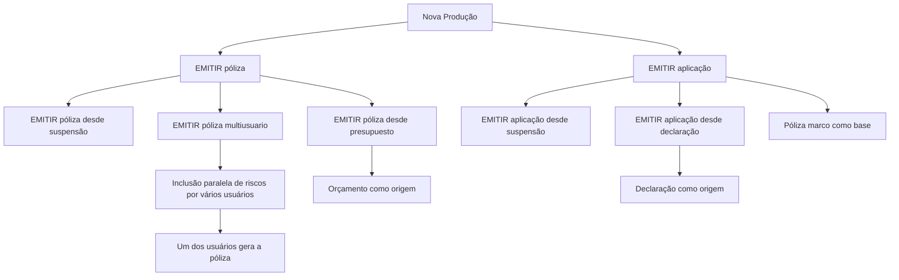

# Documentação de Operação de Emissão — Transportes: Nova Produção

## 1. Metadados do Documento
- **Arquivo de Origem:** `Não identificado no conteúdo fornecido`
- **Tipo de Documento:** Procedimento
- **Domínio / Sistema:** Operação de emissão para negócio de Transportes
- **Público-Alvo:** Operação, negócio e usuários responsáveis pela criação de pólizas, aplicações, orçamentos e declarações
- **Data/Versão Identificada:** Não identificada

---

## 2. Resumo Executivo & Contexto de Negócio

O documento apresenta as formas disponíveis para criar novas pólizas ou aplicações no contexto de **Nova Produção** do negócio de Transportes. A operação central é **EMITIR póliza**, definida como a geração de um contrato que estabelece os riscos cobertos, as condições de cobertura e a cobertura aplicável quando ocorrer dano previsto.

A documentação diferencia a emissão direta de póliza de modalidades derivadas, incluindo emissão a partir de uma operação previamente suspensa, emissão colaborativa por múltiplos usuários e emissão baseada em um orçamento. Cada modalidade preserva a finalidade de gerar uma nova póliza, mas utiliza uma origem operacional ou condição de trabalho distinta.

Também são descritas operações de **EMITIR aplicação**. Uma aplicação é apresentada como uma operação equivalente à emissão de póliza, porém com duração temporal inferior a um ano e baseada em outra póliza denominada **póliza marco**.

Para o negócio de Transportes, o documento estabelece uma particularidade terminológica: uma declaração pode funcionar como origem para emissão de uma aplicação; nesse domínio, o orçamento é chamado de declaração. O conteúdo fornecido lista as modalidades e suas definições, mas não detalha telas, APIs, critérios de elegibilidade, contratos de dados, etapas de aprovação ou procedimentos de acesso aos documentos vinculados.

---

## 3. Arquitetura, Componentes & Tecnologias Envolvidas

O conteúdo não descreve arquitetura de software, componentes técnicos, microsserviços, APIs, bancos de dados, tecnologias, URLs de ambiente ou ferramentas de integração. O documento apresenta exclusivamente modalidades operacionais de emissão.



**Nota de Análise:** O diagrama representa somente relações explicitamente descritas no conteúdo. O documento não informa fluxos de dados, responsáveis sistêmicos, integrações, métodos HTTP, contratos JSON, tecnologias ou mecanismos de persistência.

---

## 4. Regras de Negócio, Especificações Funcionais & Processos

### 4.1. Operação EMITIR póliza

A operação **EMITIR póliza** consiste na geração de um contrato que define:

- O risco ou os riscos cobertos.
- As condições nas quais o risco é coberto.
- A cobertura que será fornecida quando o risco sofrer algum tipo de dano estabelecido.

### 4.2. EMITIR póliza desde suspensão

A modalidade **EMITIR póliza desde suspensão** é a realização da operação de emissão de póliza após a retomada de uma operação que havia sido previamente suspensa.

O conteúdo não especifica:

- Motivos possíveis para suspensão.
- Estado ou status técnico da operação suspensa.
- Usuários autorizados a retomar a operação.
- Validações aplicáveis na retomada.
- Regras para alteração de informações após suspensão.

### 4.3. EMITIR póliza multiusuario

A modalidade **EMITIR póliza multiusuario** possui a finalidade de emitir uma póliza com colaboração simultânea de vários usuários.

O processo descrito é:

1. Vários usuários incluem riscos de forma paralela.
2. Todos os riscos necessários são incluídos.
3. Um dos usuários gera a póliza.

O documento não define como ocorre a coordenação entre usuários, o controle de concorrência, a atribuição do usuário emissor, as permissões individuais ou os critérios para considerar que todos os riscos foram incluídos.

### 4.4. EMITIR póliza desde presupuesto

A modalidade **EMITIR póliza desde presupuesto** consiste em emitir uma póliza utilizando como origem as informações de um orçamento.

O orçamento serve como base para a geração da nova póliza. O conteúdo não especifica quais dados do orçamento são reutilizados, quais dados podem ser alterados, nem condições de validade ou aprovação do orçamento.

### 4.5. EMITIR aplicação

A operação **EMITIR aplicação** é caracterizada como uma operação de emissão de póliza com as seguintes particularidades:

- Possui duração temporal inferior a um ano.
- Baseia-se em outra póliza denominada **póliza marco**.

O documento não detalha os campos obrigatórios da aplicação, regras de vínculo com a póliza marco, critérios para duração inferior a um ano ou regras de cobertura específicas.

### 4.6. EMITIR aplicação desde suspensão

A modalidade **EMITIR aplicação desde suspensão** é descrita como a realização da operação EMITIR póliza após a retomada de uma operação previamente suspensa.

**Nota de Análise:** Embora o título mencione emissão de aplicação, a descrição fornecida refere-se literalmente à operação **EMITIR póliza**. O conteúdo não esclarece se essa redação é intencional, uma generalização operacional ou uma inconsistência documental.

### 4.7. EMITIR aplicação desde declaração

A modalidade **EMITIR aplicação desde declaração** consiste em emitir uma póliza a partir de informações de uma declaração que serve como base para a geração de uma nova póliza.

Para o tipo de negócio de Transportes, o documento informa que o orçamento é denominado **declaração**.

---

## 5. Tabelas de Parâmetros, Ambientes e Estruturas de Dados

| Item / Parâmetro | Descrição / Função | Tipo / Valores / Formato | Ambiente / Observações |
| :--- | :--- | :--- | :--- |
| Nova Produção | Contexto que agrupa formas de criar novas pólizas ou aplicações. | Contexto operacional | Aplicável ao negócio de Transportes conforme o documento. |
| EMITIR póliza | Geração de contrato com riscos cobertos, condições de cobertura e cobertura em caso de dano estabelecido. | Operação | Não há detalhamento técnico adicional. |
| Risco | Elemento ou elementos cobertos pelo contrato gerado na emissão de póliza. | Conceito de negócio | O documento não define estrutura, classificação ou atributos. |
| Condições de cobertura | Condições sob as quais os riscos são cobertos. | Regra contratual | Não detalhadas. |
| Cobertura | Cobertura fornecida quando o risco sofre algum dano estabelecido. | Regra contratual | Não detalhada. |
| EMITIR póliza desde suspensão | Emissão de póliza após retomada de operação previamente suspensa. | Modalidade operacional | Critérios de suspensão e retomada não informados. |
| EMITIR póliza multiusuario | Emissão de póliza com inclusão paralela de riscos por vários usuários. | Modalidade operacional | Após inclusão de todos os riscos, um usuário gera a póliza. |
| Usuários | Participantes da operação multiusuário que incluem riscos de forma paralela. | Perfis operacionais | Papéis, permissões e controle de concorrência não informados. |
| EMITIR póliza desde presupuesto | Emissão de póliza baseada em informações de um orçamento. | Modalidade operacional | O orçamento serve de base para uma nova póliza. |
| Orçamento / presupuesto | Origem de informações para geração de nova póliza. | Documento ou entidade de negócio | No negócio de Transportes, o documento informa que o orçamento é chamado de declaração em um contexto específico. |
| EMITIR aplicação | Emissão com duração inferior a um ano, baseada em uma póliza marco. | Operação | Apresentada como emissão de póliza de duração temporal menor que um ano. |
| Póliza marco | Póliza que serve de base para a emissão de uma aplicação. | Documento ou entidade de negócio | Não há regras de seleção ou vínculo detalhadas. |
| EMITIR aplicação desde suspensão | Operação de aplicação retomada após suspensão, conforme título; a descrição refere-se à emissão de póliza. | Modalidade operacional | Há possível inconsistência entre título e descrição. |
| EMITIR aplicação desde declaração | Emissão baseada nas informações de uma declaração. | Modalidade operacional | Para Transportes, o orçamento é denominado declaração. |
| Declaração | Base de informação para geração de nova póliza no contexto de emissão de aplicação desde declaração. | Documento ou entidade de negócio | O texto associa declaração ao nome dado ao orçamento no negócio de Transportes. |
| Ambientes | Não identificados. | Não aplicável | O documento não fornece URLs, servidores, portas ou nomes de ambientes. |
| Logs | Não identificados. | Não aplicável | O documento não fornece rotas, níveis ou variáveis de log. |

---

## 6. Bateria de Perguntas & Respostas para RAG (FAQ Sintético)

### P1: O que significa a operação EMITIR póliza no contexto de Nova Produção?
**R:** EMITIR póliza consiste na geração de um contrato que estabelece o risco ou os riscos cobertos, as condições em que esses riscos são cobertos e a cobertura fornecida quando ocorre algum dano previamente estabelecido.

### P2: Quais modalidades de criação de nova póliza são apresentadas no documento?
**R:** O documento apresenta a emissão direta de póliza, a emissão de póliza desde suspensão, a emissão de póliza multiusuario e a emissão de póliza desde presupuesto. Também apresenta modalidades de emissão de aplicação.

### P3: Como funciona a emissão de póliza a partir de uma suspensão?
**R:** EMITIR póliza desde suspensão é a realização da operação de emissão de póliza depois que uma operação anteriormente suspensa é retomada. O documento não detalha motivos de suspensão, permissões, estados ou validações dessa retomada.

### P4: Como funciona a modalidade EMITIR póliza multiusuario?
**R:** Na modalidade multiusuario, vários usuários incluem riscos de forma paralela. Quando todos os riscos foram incluídos, um dos usuários gera a póliza. O documento não informa como são tratadas permissões, concorrência ou a escolha do usuário que finaliza a emissão.

### P5: Qual é a origem das informações em EMITIR póliza desde presupuesto?
**R:** EMITIR póliza desde presupuesto utiliza as informações de um orçamento como origem e base para gerar uma nova póliza. O documento não informa quais campos são copiados, modificáveis ou obrigatórios.

### P6: O que é EMITIR aplicação?
**R:** EMITIR aplicação é uma operação de emissão de póliza com duração temporal inferior a um ano. As informações da aplicação são baseadas em outra póliza, chamada póliza marco.

### P7: O que é uma póliza marco?
**R:** Póliza marco é a póliza utilizada como base para as informações de uma aplicação. O conteúdo não especifica regras de relacionamento, elegibilidade ou campos reutilizados entre a póliza marco e a aplicação.

### P8: O que significa EMITIR aplicação desde declaração?
**R:** EMITIR aplicação desde declaração consiste em emitir uma póliza tomando como origem as informações de uma declaração, que serve de base para gerar uma nova póliza.

### P9: Qual é a relação entre orçamento e declaração no negócio de Transportes?
**R:** Para o tipo de negócio de Transportes, o documento informa que o orçamento é chamado de declaração. Essa declaração é utilizada como origem na modalidade EMITIR aplicação desde declaração.

### P10: A descrição de EMITIR aplicação desde suspensão é específica para aplicações?
**R:** O título menciona EMITIR aplicação desde suspensão, mas a descrição fornecida afirma que se trata da realização da operação EMITIR póliza após retomar uma operação previamente suspensa. O documento não esclarece essa diferença terminológica.

### P11: O documento fornece detalhes de APIs, integrações ou ambientes técnicos?
**R:** Não. O conteúdo não apresenta APIs, métodos HTTP, contratos de integração, microsserviços, bancos de dados, URLs, servidores, portas, ambientes ou rotas de logs.

### P12: Quais condições precisam ser atendidas antes de gerar uma póliza na modalidade multiusuario?
**R:** Conforme o documento, todos os riscos devem ter sido incluídos pelos usuários participantes. Após a inclusão de todos os riscos, um dos usuários gera a póliza.

---

## 7. Glossário de Termos, Siglas & Conceitos-Chave

- **Aplicação:** Operação apresentada como emissão de póliza com duração temporal inferior a um ano e baseada em uma póliza marco.
- **Cobertura:** Proteção fornecida quando um risco sofre algum tipo de dano estabelecido.
- **Declaração:** No tipo de negócio de Transportes, termo utilizado para o orçamento; pode servir como origem para emissão de aplicação.
- **EMITIR aplicação:** Operação de emissão de aplicação baseada em uma póliza marco e com duração inferior a um ano.
- **EMITIR póliza:** Operação que gera o contrato definindo riscos, condições de cobertura e cobertura em caso de dano estabelecido.
- **Multiusuario:** Modalidade em que vários usuários incluem riscos de forma paralela antes de um usuário gerar a póliza.
- **Nova Produção:** Contexto de operações para criação de novas pólizas ou aplicações.
- **Orçamento / presupuesto:** Informação que pode servir de base para a geração de uma nova póliza; no negócio de Transportes é chamado de declaração conforme o documento.
- **Póliza:** Contrato gerado na emissão, contendo riscos cobertos, condições e cobertura.
- **Póliza marco:** Póliza que serve como base para as informações de uma aplicação.
- **Risco:** Risco ou conjunto de riscos cobertos pelo contrato de póliza.
- **Suspensão:** Estado anterior de uma operação que pode ser retomada para realizar a emissão.

---

## 8. Notas Críticas, Riscos & Limitações

- O documento é predominantemente descritivo e não apresenta especificações técnicas, arquitetura de sistemas, integrações, APIs, modelos de dados, autenticação, auditoria, logs ou monitoramento.
- Não foram identificadas versões, datas, responsáveis, URLs, ambientes, servidores, parâmetros configuráveis ou procedimentos de implantação.
- A expressão **Accede al documento** indica a existência de documentos complementares, mas seus conteúdos e referências não foram fornecidos.
- A modalidade **EMITIR aplicação desde suspensión** possui título relacionado a aplicação, mas a descrição refere-se literalmente à operação **EMITIR póliza**; a documentação não explica essa divergência.
- A operação multiusuário não define mecanismos de concorrência, bloqueio, controle de edição paralela, auditoria ou permissões.
- Não há critérios documentados para validação de riscos, cobertura, orçamento, declaração, póliza marco ou retomada de operações suspensas.

---

## 9. Conteúdo Bruto Estruturado (Referência Fiel)

```text
--- [PÁGINA 1 DE 2] ---

DOCUMENTACIÓN de OPERACIÓN de
EMISIÓN (Transportes) - NUEVA PRODUCCIÓN
NUEVA PRODUCCIÓN
Distintas formas de crear nuevas pólizas o aplicaciones
EMITIR póliza
Consiste en la generación del contrato por el
que se establece el riesgo o riesgos cubiertos,
las condiciones en las que se cubre y la
cobertura que se dará cuando el riesgo sufra
algún tipo de daño establecido
 Accede al documento
EMITIR póliza desde suspensión
Es la realización de la operación EMITIR
póliza, habiendo retomado la operación que
había sido previamente suspendida
 Accede al documento
EMITIR póliza multiusuario
 EMITIR póliza desde presupuesto
 / 
 RS
Inicio Soluciones APIs Documentación Zeus
ES


--- [PÁGINA 2 DE 2] ---

La finalidad de esta operación es la de
EMITIR póliza pero, en la que varios usuarios
se encuentran incluyendo riesgos de forma
paralela. Una vez que todos los riesgos han
sido incluidos, uno de los usuarios genera la
póliza
 Accede al documento
Consiste en EMITIR póliza tomando como
origen la información de un presupuesto que
sirve como base para la generación de la
nueva póliza
 Accede al documento
EMITIR aplicación
Realmente es la operación EMITIR póliza con
una duración temporal (menor a un año), cuya
información se basa en otra póliza llamada
póliza marco
 Accede al documento
EMITIR aplicación desde suspensión
Es la realización de la operación EMITIR
póliza, habiendo retomado la operación que
había sido previamente suspendida
 Accede al documento
EMITIR aplicación desde declaración
Consiste en EMITIR póliza tomando como
origen la información de una declaración
(para el tipo de negocio de transportes el
presupuesto se llama declaración), que sirve
como base para la generación de la nueva
póliza
 Accede al documento
```
