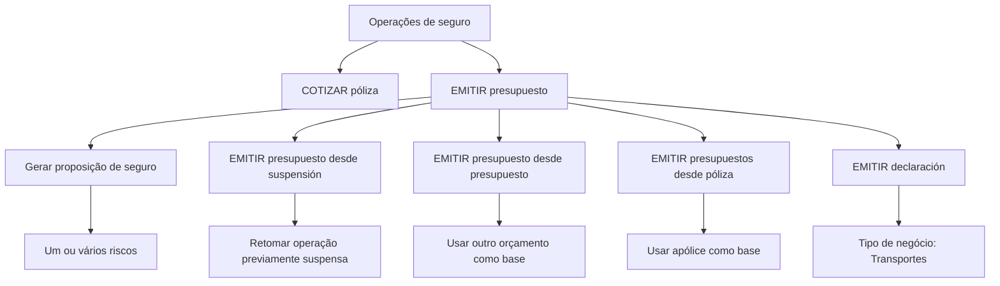

# Documentação de Operação de Emissão — Transportes / Orçamento

## 1. Metadados do Documento
- **Arquivo de Origem:** Não informado
- **Tipo de Documento:** Manual Operacional
- **Domínio / Sistema:** Operações de seguro de Transportes; Zeus
- **Público-Alvo:** Operação, Negócio, Desenvolvedores e Arquitetos
- **Data/Versão Identificada:** Não identificada

---

## 2. Resumo Executivo & Contexto de Negócio

O documento apresenta operações de emissão relacionadas ao domínio de seguros, com foco em **Transportes** e **orçamentos**. O conteúdo descreve ações disponíveis para cotar, emitir e reutilizar informações de propostas, orçamentos e apólices na criação de novos orçamentos.

A operação **COTIZAR póliza** é apresentada como a oferta de diferentes opções de seguro para um possível risco. Essas opções incluem o respetivo custo e alternativas de fracionamento de pagamento.

A operação **EMITIR presupuesto** gera uma proposição de seguro para um ou vários riscos. O documento também descreve variações dessa emissão, incluindo retomada de uma operação suspensa e geração de um novo orçamento a partir de outro orçamento ou de uma apólice existente.

No contexto de Transportes, a operação **EMITIR declaración** é explicitamente definida como equivalente à operação **EMITIR presupuesto**, porém destinada ao tipo de negócio de transportes. O material referencia documentos associados por meio de “Accede al documento”, mas não fornece os seus conteúdos, URLs ou contratos operacionais.

---

## 3. Arquitetura, Componentes & Tecnologias Envolvidas

### Componentes e elementos identificados

| Componente / Termo | Papel identificado no documento | Detalhamento disponível |
| :--- | :--- | :--- |
| Zeus | Sistema ou contexto de navegação citado no rodapé. | Não há descrição funcional ou técnica adicional. |
| APIs | Item citado na navegação do material. | O documento não identifica APIs, endpoints, métodos HTTP ou contratos JSON. |
| Soluciones | Item citado na navegação do material. | Não há detalhamento. |
| Documentación | Item citado na navegação do material. | O conteúdo fornecido constitui documentação operacional. |
| RS | Sigla exibida no rodapé. | Significado não detalhado. |
| COTIZAR póliza | Operação para oferecer opções de seguro para possível risco. | Inclui custo e opções de fracionamento de pagamento. |
| EMITIR presupuesto | Operação para gerar proposição de seguro para um ou vários riscos. | Não há detalhamento de entrada, saída ou regras de persistência. |
| EMITIR presupuesto desde suspensión | Variante de emissão que retoma operação previamente suspensa. | Não há critérios de suspensão ou retomada. |
| EMITIR presupuesto desde presupuesto | Variante de emissão que usa outro orçamento como origem. | O orçamento de origem serve como base para novo orçamento. |
| EMITIR presupuestos desde póliza | Variante de emissão que usa uma apólice como origem. | A apólice de origem serve como base para novo orçamento. |
| EMITIR declaración | Operação de emissão para o tipo de negócio de transportes. | É declarada como a mesma operação de EMITIR presupuesto. |



> **Nota de Análise:** O documento cita Zeus, APIs, Soluciones, Documentación e RS somente no contexto de navegação. Não há descrição de arquitetura de software, ambientes, integrações, serviços, protocolos, endpoints ou tecnologias de implementação.

---

## 4. Regras de Negócio, Especificações Funcionais & Processos

### 4.1 COTIZAR póliza

A operação **COTIZAR póliza** está relacionada a operações de seguro de um possível risco. A finalidade declarada é oferecer distintas opções de um seguro, acompanhadas de:

- custo do seguro;
- diferentes opções de fracionamento de pagamento.

O documento não informa os critérios para seleção de opções, cálculo de custo, elegibilidade do risco, moeda, modalidades de pagamento ou regras de aprovação.

### 4.2 EMITIR presupuesto

A operação **EMITIR presupuesto** consiste em gerar uma proposição de seguro para um ou vários riscos.

O documento não define:

- os dados obrigatórios para emitir um orçamento;
- as etapas de validação;
- as regras para múltiplos riscos;
- os estados possíveis de uma proposição;
- os documentos gerados;
- o resultado técnico ou funcional da emissão.

### 4.3 EMITIR presupuesto desde suspensión

A operação **EMITIR presupuesto desde suspensión** é a operação **EMITIR presupuesto** executada após a retomada de uma operação que havia sido previamente suspensa.

Regra identificada:

1. Deve existir uma operação previamente suspensa.
2. A operação suspensa é retomada.
3. Após a retomada, é realizada a emissão de orçamento.

> **Nota de Análise:** O documento não detalha os motivos de suspensão, quem pode suspender ou retomar a operação, nem o estado operacional associado à suspensão.

### 4.4 EMITIR presupuesto desde presupuesto

A operação **EMITIR presupuesto desde presupuesto** consiste em emitir um orçamento utilizando como origem as informações de outro orçamento. O orçamento de origem funciona como base para a geração do novo orçamento.

Regra identificada:

1. Um orçamento existente é selecionado como origem.
2. As informações do orçamento de origem são utilizadas como base.
3. Um novo orçamento é gerado.

> **Nota de Análise:** O documento não especifica quais informações são copiadas, quais campos podem ser alterados, nem se há validações ou recálculos no novo orçamento.

### 4.5 EMITIR presupuestos desde póliza

A operação **EMITIR presupuestos desde póliza** permite emitir um orçamento tomando como origem as informações de uma apólice. A apólice funciona como base para a geração do novo orçamento.

Regra identificada:

1. Uma apólice existente é utilizada como origem.
2. As informações da apólice são tomadas como base.
3. Um novo orçamento é emitido.

> **Nota de Análise:** O documento não informa se a apólice deve estar vigente, quais dados são reutilizados ou se existem restrições para emissão a partir de uma apólice.

### 4.6 EMITIR declaración para Transportes

A operação **EMITIR declaración** é definida como a mesma operação de **EMITIR presupuesto**, mas aplicável ao tipo de negócio de transportes.

Regra identificada:

- Para o tipo de negócio de transportes, a emissão é denominada **EMITIR declaración**.
- A equivalência funcional declarada é com a operação **EMITIR presupuesto**.

> **Nota de Análise:** O documento não apresenta diferenças de campos, regras, documentos ou fluxos específicos de Transportes além da denominação da operação.

---

## 5. Tabelas de Parâmetros, Ambientes e Estruturas de Dados

| Item / Parâmetro | Descrição / Função | Tipo / Valores / Formato | Ambiente / Observações |
| :--- | :--- | :--- | :--- |
| Possível risco | Contexto associado à operação COTIZAR póliza. | Não especificado. | Não há critérios de avaliação ou classificação. |
| Opções de seguro | Alternativas oferecidas durante a cotação. | Não especificado. | Associadas a custo e opções de pagamento fracionado. |
| Custo | Valor associado às opções de seguro. | Não especificado. | Não há fórmula, moeda ou fonte de cálculo. |
| Fracionamento de pagamento | Diferentes alternativas de pagamento oferecidas na cotação. | Não especificado. | Não há número de parcelas, condições ou encargos. |
| Proposição de seguro | Resultado funcional da operação EMITIR presupuesto. | Para um ou vários riscos. | Não há formato, identificador ou ciclo de vida informado. |
| Operação suspensa | Operação anteriormente interrompida e posteriormente retomada. | Estado ou condição operacional não especificada. | Utilizada em EMITIR presupuesto desde suspensión. |
| Orçamento de origem | Orçamento utilizado como base para emissão de novo orçamento. | Não especificado. | Utilizado em EMITIR presupuesto desde presupuesto. |
| Apólice de origem | Apólice utilizada como base para emissão de novo orçamento. | Não especificado. | Utilizada em EMITIR presupuestos desde póliza. |
| Tipo de negócio | Classificação de negócio para a operação EMITIR declaración. | Transportes. | EMITIR declaración é equivalente a EMITIR presupuesto nesse tipo de negócio. |
| Zeus | Sistema ou elemento de navegação citado. | Não especificado. | Sem URL, ambiente ou versão. |
| APIs | Elemento de navegação citado. | Não especificado. | Sem endpoints ou contratos descritos. |
| RS | Sigla exibida na navegação. | Não especificado. | Sem expansão ou função documentada. |

---

## 6. Bateria de Perguntas & Respostas para RAG (FAQ Sintético)

### P1: Qual é a finalidade da operação COTIZAR póliza?
**R:** A operação **COTIZAR póliza** oferece distintas opções de seguro para um possível risco. As opções incluem o custo do seguro e diferentes alternativas de fracionamento de pagamento.

### P2: O que a operação EMITIR presupuesto gera?
**R:** A operação **EMITIR presupuesto** gera uma proposição de seguro para um ou vários riscos. O documento não especifica o formato da proposição, os dados de entrada ou as validações aplicadas.

### P3: Quando deve ser utilizada a operação EMITIR presupuesto desde suspensión?
**R:** A operação **EMITIR presupuesto desde suspensión** deve ser utilizada quando uma operação de emissão de orçamento havia sido previamente suspensa e foi retomada. Após a retomada, é executada a operação EMITIR presupuesto.

### P4: Qual é a origem das informações em EMITIR presupuesto desde presupuesto?
**R:** Em **EMITIR presupuesto desde presupuesto**, as informações de outro orçamento são utilizadas como base para gerar um novo orçamento. O documento não detalha quais campos são reutilizados ou alteráveis.

### P5: O que diferencia EMITIR presupuestos desde póliza de EMITIR presupuesto desde presupuesto?
**R:** A diferença está na origem das informações. **EMITIR presupuestos desde póliza** utiliza uma apólice como base para gerar um novo orçamento, enquanto **EMITIR presupuesto desde presupuesto** utiliza outro orçamento como origem.

### P6: O que é EMITIR declaración no domínio de Transportes?
**R:** **EMITIR declaración** é a operação de emissão utilizada para o tipo de negócio de transportes. O documento afirma que essa operação é a mesma que **EMITIR presupuesto**, aplicada especificamente a Transportes.

### P7: O documento informa como o custo do seguro é calculado?
**R:** Não. O documento menciona que COTIZAR póliza oferece opções de seguro junto com o respetivo custo, mas não fornece fórmula de cálculo, moeda, variáveis de precificação ou critérios de avaliação do risco.

### P8: Quais opções de pagamento são documentadas para uma cotação de apólice?
**R:** O documento registra que COTIZAR póliza apresenta diferentes opções de fracionamento de pagamento. Não há detalhamento sobre número de parcelas, juros, vencimentos ou meios de pagamento.

### P9: Há endpoints, métodos HTTP ou contratos JSON documentados para as APIs?
**R:** Não. Embora “APIs” seja citado na navegação do documento, o conteúdo fornecido não descreve endpoints, métodos HTTP, parâmetros de requisição, respostas, autenticação ou contratos JSON.

### P10: O documento define critérios para uma apólice ser usada como origem de orçamento?
**R:** Não. O documento somente informa que uma apólice pode servir como base para a geração de um novo orçamento em **EMITIR presupuestos desde póliza**. Não são definidos critérios de vigência, elegibilidade ou validação da apólice.

---

## 7. Glossário de Termos, Siglas & Conceitos-Chave

- **APIs:** Sigla citada na navegação do documento. O conteúdo não apresenta expansão, endpoints ou contratos técnicos.
- **COTIZAR póliza:** Operação para oferecer opções de seguro para um possível risco, incluindo custo e opções de fracionamento de pagamento.
- **EMITIR presupuesto:** Operação para gerar uma proposição de seguro para um ou vários riscos.
- **EMITIR presupuesto desde presupuesto:** Operação de emissão baseada nas informações de outro orçamento.
- **EMITIR presupuesto desde suspensión:** Operação de emissão realizada após retomada de operação anteriormente suspensa.
- **EMITIR presupuestos desde póliza:** Operação de emissão de orçamento baseada nas informações de uma apólice.
- **EMITIR declaración:** Operação equivalente a EMITIR presupuesto para o tipo de negócio de transportes.
- **Póliza:** Apólice de seguro; no documento, pode ser utilizada como base para gerar um novo orçamento.
- **Presupuesto:** Orçamento; pode ser emitido diretamente, retomado após suspensão ou utilizado como origem para novo orçamento.
- **RS:** Sigla exibida no rodapé do documento, sem significado definido no conteúdo fornecido.
- **Zeus:** Nome citado no rodapé de navegação, sem descrição funcional ou técnica adicional.

---

## 8. Notas Críticas, Riscos & Limitações

- O documento é resumido e não especifica fluxos técnicos, arquiteturas de integração, endpoints, protocolos, mecanismos de autenticação ou contratos de dados.
- Não há URL associada aos links indicados como “Accede al documento”.
- Não foram identificados ambientes, servidores, versões, portas, rotas de log ou variáveis de configuração.
- Não há critérios para cálculo do custo do seguro, avaliação de risco ou escolha das opções de fracionamento de pagamento.
- As operações de emissão não possuem detalhamento de campos obrigatórios, validações, mensagens de erro, estados, permissões ou regras de transição.
- O documento não esclarece quais dados são copiados ou recalculados quando um orçamento é emitido a partir de outro orçamento ou de uma apólice.
- A sigla **RS** não é expandida nem contextualizada.
- O item **APIs** é citado somente como navegação; não há descrição de interfaces técnicas.

---

## 9. Conteúdo Bruto Estruturado (Referência Fiel)

```text
--- [PÁGINA 1 DE 2] ---

DOCUMENTACIÓN de OPERACIÓN de
EMISIÓN (Transportes) - PRESUPUESTO
PRESUPUESTO
Operaciones relacionadas con los de seguro de un posible riesgo
COTIZAR póliza
Ofrecer distintas opciones de un seguro junto
con su coste y diferentes opciones de
fraccionamiento de pago
 Accede al documento
EMITIR presupuesto
Generar una proposición de seguro de uno
varios riesgos
 Accede al documento
EMITIR presupuesto desde suspensión
Es la operación EMITIR presupuesto,
habiendo retomado la operación que había
sido previamente suspendida
EMITIR presupuesto desde presupuesto
Consiste en EMITIR presupuesto tomando
como origen la información de otro
 / 
 RS
Inicio Soluciones APIs Documentación Zeus
ES


--- [PÁGINA 2 DE 2] ---

Accede al documento
 presupuesto que sirve como base para la
generación del nuevo presupuesto
 Accede al documento
EMITIR presupuestos desde póliza
Permite EMITIR presupuesto tomando como
origen la información de una póliza que sire
como base para la generación del nuevo
presupuesto
 Accede al documento
EMITIR declaración
Esta operación es la misma que EMITIR
presupuesto pero para el tipo de negocio de
transportes
 Accede al documento
```
