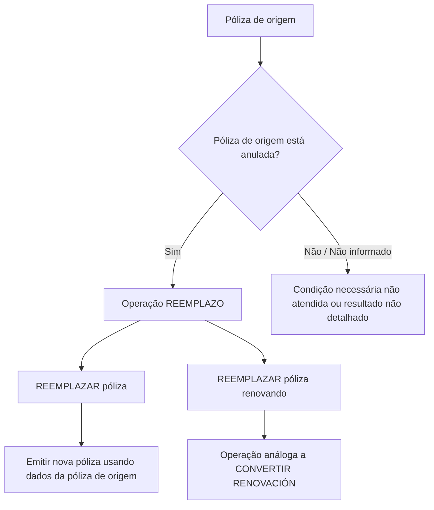

# Documentação de Operação de Emissão (Transportes) — Reemplazo de Póliza

## 1. Metadados do Documento
- **Arquivo de Origem:** Não identificado no conteúdo extraído
- **Tipo de Documento:** Manual Operacional
- **Domínio / Sistema:** Emissão de pólizas de Transportes
- **Público-Alvo:** Operação, negócio e usuários de emissão
- **Data/Versão Identificada:** Não identificada

---

## 2. Resumo Executivo & Contexto de Negócio

O documento descreve a operação **REEMPLAZO** no contexto de emissão de pólizas de Transportes. A operação permite utilizar uma póliza existente como informação de partida para a criação e emissão de uma nova póliza.

A operação **REEMPLAZAR póliza** consiste em emitir uma nova póliza tomando como origem os dados de outra póliza, que funciona como base para gerar a nova emissão. A condição explicitamente indicada é que a póliza de origem esteja anulada.

O documento também apresenta a possibilidade **REEMPLAZAR póliza renovando**, descrita como uma operação análoga a **CONVERTIR RENOVACIÓN**. Nesta modalidade, a póliza usada como base também deve estar anulada.

O conteúdo extraído possui caráter resumido e contém referências de navegação para acesso a documentos complementares. Não há detalhamento sobre etapas de interface, contratos técnicos, campos de entrada, regras de cálculo, integrações, URLs efetivas ou tratamento de erros.

---

## 3. Arquitetura, Componentes & Tecnologias Envolvidas

Os elementos identificados no conteúdo são:

- Operação de emissão de pólizas de Transportes.
- Operação **REEMPLAZO**.
- Modalidade **REEMPLAZAR póliza**.
- Modalidade **REEMPLAZAR póliza renovando**.
- Operação relacionada **CONVERTIR RENOVACIÓN**.
- Póliza de origem, usada como base para emissão.
- Póliza nova, resultante da operação de emissão.
- Navegação identificada na extração: `Inicio`, `Soluciones`, `APIs`, `Documentación`, `Zeus`, `ES` e `RS`.



**Nota de Análise:** o documento não descreve arquitetura de software, microsserviços, APIs, métodos HTTP, formatos JSON, bancos de dados, tecnologias de implementação ou ambientes de execução.

---

## 4. Regras de Negócio, Especificações Funcionais & Processos

### 4.1 Operação REEMPLAZO

A operação **REEMPLAZO** permite tomar uma póliza como informação de partida para criar uma nova póliza.

### 4.2 Modalidade REEMPLAZAR póliza

A modalidade **REEMPLAZAR póliza** possui as seguintes regras explicitamente documentadas:

1. Uma póliza existente é utilizada como origem da operação.
2. A informação da póliza de origem é utilizada como base para gerar uma nova póliza.
3. A operação consiste em emitir a nova póliza.
4. A póliza que serve como base deve estar anulada.

### 4.3 Modalidade REEMPLAZAR póliza renovando

A modalidade **REEMPLAZAR póliza renovando** possui as seguintes regras explicitamente documentadas:

1. A operação é descrita como análoga a **CONVERTIR RENOVACIÓN**.
2. A póliza usada como base para a operação deve estar anulada.
3. O documento não detalha as etapas, campos, condições adicionais ou resultado operacional específico da analogia com **CONVERTIR RENOVACIÓN**.

### 4.4 Fluxo operacional identificado

1. Selecionar ou utilizar uma póliza como informação de partida.
2. Verificar se a póliza que servirá como base está anulada.
3. Executar a operação de emissão por meio de **REEMPLAZAR póliza** ou **REEMPLAZAR póliza renovando**.
4. Gerar uma nova póliza a partir das informações da póliza de origem.

**Nota de Análise:** o documento não informa como a anulação é validada, quais dados são copiados, quais dados precisam ser alterados, nem quais efeitos existem caso a póliza-base não esteja anulada.

---

## 5. Tabelas de Parâmetros, Ambientes e Estruturas de Dados

| Item / Parâmetro | Descrição / Função | Tipo / Valores / Formato | Ambiente / Observações |
| :--- | :--- | :--- | :--- |
| REEMPLAZO | Operação que permite utilizar uma póliza como ponto de partida para criar uma nova póliza. | Operação de emissão | Contexto de Transportes. |
| REEMPLAZAR póliza | Emite uma nova póliza usando as informações de outra póliza como base. | Modalidade operacional | A póliza-base deve estar anulada. |
| REEMPLAZAR póliza renovando | Operação descrita como análoga a CONVERTIR RENOVACIÓN. | Modalidade operacional | A póliza-base deve estar anulada. |
| Póliza de origem | Póliza utilizada como base para a geração de uma nova póliza. | Entidade de negócio | Deve estar anulada. |
| Nova póliza | Póliza gerada mediante a operação de emissão. | Entidade de negócio | Criada a partir das informações da póliza de origem. |
| CONVERTIR RENOVACIÓN | Operação usada como referência de analogia para REEMPLAZAR póliza renovando. | Operação relacionada | Sem detalhamento adicional no conteúdo extraído. |
| Accede al documento | Referência de navegação para documento associado. | Link ou ação de interface | O destino não foi disponibilizado na extração. |
| Zeus | Item presente na navegação extraída. | Nome não definido | O significado ou papel não é detalhado. |
| RS | Item presente na navegação extraída. | Sigla não definida | O significado não é detalhado. |
| ES | Indicador presente na navegação extraída. | Código exibido na interface | O documento não explica o significado. |

---

## 6. Bateria de Perguntas & Respostas para RAG (FAQ Sintético)

### P1: O que é a operação REEMPLAZO na emissão de pólizas de Transportes?
**R:** REEMPLAZO é uma operação que permite tomar uma póliza como informação de partida para criar e emitir uma nova póliza no contexto de Transportes.

### P2: Qual é a finalidade da modalidade REEMPLAZAR póliza?
**R:** A modalidade REEMPLAZAR póliza emite uma nova póliza usando como origem as informações de outra póliza que atua como base para a geração da nova emissão.

### P3: Qual condição a póliza de origem deve atender para ser usada em REEMPLAZAR póliza?
**R:** A póliza usada como base na operação REEMPLAZAR póliza deve estar anulada.

### P4: A póliza-base precisa estar anulada em REEMPLAZAR póliza renovando?
**R:** Sim. O documento determina que a póliza usada como base na operação REEMPLAZAR póliza renovando deve estar anulada.

### P5: O que significa REEMPLAZAR póliza renovando?
**R:** REEMPLAZAR póliza renovando é uma modalidade de reemplazo descrita pelo documento como análoga à operação CONVERTIR RENOVACIÓN. O conteúdo não apresenta mais detalhes sobre o funcionamento dessa analogia.

### P6: O documento explica quais campos da póliza original são reutilizados na nova emissão?
**R:** Não. O documento apenas informa que a nova póliza é gerada tomando como origem as informações de outra póliza; ele não especifica os campos reutilizados, alteráveis ou obrigatórios.

### P7: O que acontece se a póliza de origem não estiver anulada?
**R:** O documento estabelece que a póliza-base deve estar anulada, mas não descreve o comportamento do sistema, a mensagem de erro ou o fluxo alternativo quando essa condição não é atendida.

### P8: O documento apresenta APIs, métodos HTTP ou contratos de integração para REEMPLAZO?
**R:** Não. Embora a navegação extraída contenha o item “APIs”, não há no conteúdo métodos HTTP, endpoints, contratos JSON, autenticação ou detalhes técnicos de integração.

### P9: Em qual domínio funcional a operação REEMPLAZO é apresentada?
**R:** A operação REEMPLAZO é apresentada na documentação de operação de emissão de pólizas de **Transportes**.

### P10: Existe um documento complementar para as operações de reemplazo?
**R:** Sim. O conteúdo apresenta a indicação “Accede al documento” para as modalidades listadas, mas a extração não contém o endereço, o identificador ou o conteúdo dos documentos referenciados.

---

## 7. Glossário de Termos, Siglas & Conceitos-Chave

- **REEMPLAZO:** Operação que permite utilizar uma póliza como informação de partida para criar uma nova póliza.
- **REEMPLAZAR póliza:** Modalidade de emissão de nova póliza baseada nas informações de outra póliza anulada.
- **REEMPLAZAR póliza renovando:** Modalidade de reemplazo análoga a CONVERTIR RENOVACIÓN, cuja póliza-base deve estar anulada.
- **CONVERTIR RENOVACIÓN:** Operação mencionada como análoga a REEMPLAZAR póliza renovando; sem detalhamento adicional no conteúdo.
- **Póliza:** Entidade de negócio usada como base ou resultante da operação de emissão.
- **Anulada:** Estado exigido para a póliza que será usada como base nas modalidades descritas.
- **Zeus:** Item de navegação citado na extração; significado não definido no documento.
- **RS:** Sigla ou item de navegação citado na extração; significado não definido no documento.
- **ES:** Código ou item de navegação citado na extração; significado não definido no documento.

---

## 8. Notas Críticas, Riscos & Limitações

- O conteúdo é resumido e não detalha procedimentos completos de operação.
- A condição de anulação da póliza-base é mandatória, mas o documento não informa como essa condição é verificada.
- Não há especificação de mensagens de erro, exceções, aprovações ou tratamento operacional para pólizas não anuladas.
- Não há definição de campos reutilizados, campos obrigatórios, regras de cálculo, regras de vigência ou regras de elegibilidade.
- A operação **REEMPLAZAR póliza renovando** é apenas caracterizada como análoga a **CONVERTIR RENOVACIÓN**; a analogia não é tecnicamente especificada.
- As referências “Accede al documento” indicam conteúdo complementar, mas os respectivos destinos não foram incluídos na extração.
- Não foram identificadas versões, datas, autores, ambientes, URLs ou informações de integração.

---

## 9. Conteúdo Bruto Estruturado (Referência Fiel)

```text
--- [PÁGINA 1 DE 1] ---

DOCUMENTACIÓN de OPERACIÓN de
EMISIÓN (Transportes) - REEMPLAZO
REEMPLAZO
Distintas posibilidades que permite tomar una póliza como información
de partida para crear una nueva
REEMPLAZAR póliza
Consiste en EMITIR póliza tomando como
origen la información de otra póliza que sirve
como base para la generación de la nueva
póliza. La póliza que sirve como base debe
estar anulada
 Accede al documento
REEMPLAZAR póliza renovando
Operación análoga a CONVERTIR
RENOVACIÓN. La póliza que sirve como
base debe estar anulada
 Accede al documento
 / 
 RS
Inicio Soluciones APIs Documentación Zeus
ES
```
