# Documentação de Operação de Emissão (Transportes) — Suplementos e Movimentos de Apólices e Aplicações

## 1. Metadados do Documento
- **Arquivo de Origem:** `Não identificado no conteúdo fornecido`
- **Tipo de Documento:** `Manual Operacional`
- **Domínio / Sistema:** `Emissão de Transportes — Suplementos, Apólices e Aplicações`
- **Público-Alvo:** `Operação, Negócio, Analistas Funcionais e Desenvolvedores`
- **Data/Versão Identificada:** `Não identificada`

---

## 2. Resumo Executivo & Contexto de Negócio

O documento apresenta operações de emissão relacionadas à modificação das informações de uma **póliza** ou de uma **aplicação** no domínio de Transportes. As operações são classificadas como suplementos e movimentos capazes de alterar dados, vigências, custos do seguro, distribuição de recibos, agentes, capitais segurados, renovações e cancelamentos.

As operações `ALTERAR` permitem modificar informações de pólizas ou aplicações, incluindo modalidades específicas para movimentos retomados de suspensão, suplementos temporais, alterações em anualidades anteriores, mudança de agente e planos de pagamento. Dependendo do movimento, a alteração pode gerar cobrança ou devolução ao pagador do seguro, ou não afetar o custo do seguro.

As operações `ANULAR` desfazem suplementos vigentes, cancelam pólizas ou aplicações, ou tratam cenários especiais, como extinção de risco. O documento diferencia anulações de modificações normais, temporais e de anualidades anteriores, preservando a distinção entre póliza e aplicação quando explicitamente indicada.

O ciclo de vigência inclui movimentos de `PRERENOVAR`, `RENOVAR`, conversão de renovação baseada em migração e reabilitação após cancelamento. A reabilitação pode ocorrer no mesmo dia da anulação, com extensão de vigência, sem extensão de vigência ou com modificação de dados. O conteúdo não apresenta contratos de API, sistemas técnicos, URLs, ambientes, responsáveis, parâmetros de entrada ou métodos de execução das operações.

---

## 3. Arquitetura, Componentes & Tecnologias Envolvidas

O documento não descreve uma arquitetura tecnológica, microsserviços, bancos de dados, APIs, protocolos, ambientes ou ferramentas de desenvolvimento. O conteúdo descreve exclusivamente um catálogo operacional de movimentos de emissão para os conceitos de **póliza** e **aplicação**.

Os principais componentes funcionais identificados são:

| Componente / Conceito | Papel identificado no documento |
| :--- | :--- |
| Póliza | Entidade sobre a qual são executadas operações de alteração, anulação, renovação, liquidação, regularização, extensão de vigência e reabilitação. |
| Aplicação | Conceito que recebe operações análogas às operações de póliza quando explicitamente indicado. |
| Suplemento | Movimento relacionado à modificação de informações de uma póliza ou aplicação. |
| Pagador do seguro | Parte que pode receber cobrança ou devolução decorrente de determinadas alterações, liquidações ou cancelamentos. |
| Recibos | Elementos que podem ser anulados, redistribuídos ou regenerados em operações de plano de pagamento e mudança de agente. |
| Comissões | Elementos anulados e regenerados para um novo agente na operação de mudança de agente. |
| Suma asegurada | Valor que pode ser reduzido por sinistro ou restituído posteriormente. |
| Siniestro | Evento cuja tramitação pode reduzir a soma assegurada ou extinguir o risco. |
| Renovação | Processo que determina condições e custo do seguro para um novo período de vigência. |
| Suspensão | Estado operacional do qual determinadas operações podem ser retomadas. |
| Migração de outro sistema | Origem de informações para a operação `CONVERTIR RENOVACIÓN`. |

```mermaid
graph TD
    A[Operações de Emissão em Transportes] --> B[Movimentos sobre Póliza]
    A --> C[Movimentos sobre Aplicação]

    B --> B1[Alterar]
    B --> B2[Anular]
    B --> B3[Renovar]
    B --> B4[Reabilitar]
    B --> B5[Regularizar / Liquidar]
    B --> B6[Gerir Vigência e Capital]

    B1 --> B11[Alterar póliza]
    B1 --> B12[Alterar desde suspensão]
    B1 --> B13[Alterar temporalmente]
    B1 --> B14[Alterar anualidade anterior]
    B1 --> B15[Alterar plano de pagamento]
    B1 --> B16[Alterar mudança de agente]

    B2 --> B21[Anular modificação]
    B2 --> B22[Anular modificação temporal]
    B2 --> B23[Anular modificação anualidade anterior]
    B2 --> B24[Anular póliza]
    B2 --> B25[Anular por extinção de risco]

    B3 --> B31[Prerenovar]
    B3 --> B32[Renovar]
    B3 --> B33[Renovar desde prerenovação]
    B3 --> B34[Renovar desde suspensão]
    B3 --> B35[Converter renovação]

    B4 --> B41[Reabilitar]
    B4 --> B42[Reabilitar com extensão]
    B4 --> B43[Reabilitar sem extensão]
    B4 --> B44[Reabilitar modificando dados]

    C --> C1[Alterar aplicação]
    C --> C2[Anular aplicação]
    C --> C3[Liquidar aplicação]
    C --> C4[Reabilitar aplicação]
```



> **Nota de Análise:** O diagrama representa somente a organização funcional inferida das operações explicitamente listadas. O documento não descreve integrações sistêmicas, sequência transacional, interfaces técnicas ou fluxos de dados entre componentes.

---

## 4. Regras de Negócio, Especificações Funcionais & Processos

### 4.1 Alterações e suplementos

1. `ALTERAR póliza` permite modificar a maior parte das informações da póliza.
2. As informações que não podem ser modificadas por `ALTERAR póliza` podem ser modificadas por outros suplementos.
3. As alterações identificadas em `ALTERAR póliza` podem afetar o custo do seguro.
4. Quando houver alteração de custo, pode ocorrer cobrança ou devolução ao pagador do seguro.
5. `ALTERAR póliza desde suspensión` consiste em executar `ALTERAR póliza` após retomar uma operação previamente suspensa.
6. `ALTERAR póliza temporalmente` executa uma alteração com vencimento anterior ao vencimento da póliza; esse cenário caracteriza um suplemento temporal.
7. `ALTERAR póliza anualidad anterior` permite modificar a póliza em uma data anterior à última renovação vigente realizada e pode afetar o custo do seguro.
8. `ALTERAR aplicación` é equivalente a `ALTERAR póliza`, mas atua sobre o conceito de aplicação.
9. `ALTERAR aplicación desde suspensión` consiste em executar `ALTERAR aplicación` após retomar uma operação previamente suspensa.
10. `ALTERAR aplicación temporalmente` executa uma alteração com vencimento anterior ao vencimento da aplicação; esse cenário caracteriza um suplemento temporal.

### 4.2 Anulação de modificações e cancelamentos

1. `ANULAR póliza modificación` anula o último suplemento vigente realizado sobre a póliza.
2. A anulação de modificação de póliza desfaz a última modificação sofrida pela póliza e pode afetar o custo do seguro.
3. `ANULAR póliza modificación temporal` é análoga à anulação de modificação de póliza, porém anula o último suplemento temporal vigente.
4. `ANULAR aplicación modificación` é análoga à anulação de modificação de póliza, mas afeta uma aplicação.
5. `ANULAR aplicación modificación temporal` é análoga à anulação de modificação temporal de póliza, mas afeta uma aplicação.
6. `ANULAR póliza modificación anualidad anterior` anula um movimento gerado por `ALTERAR póliza anualidad anterior`.
7. A anulação de modificação de anualidade anterior pode afetar o importe do seguro.
8. `ANULAR póliza` realiza o cancelamento da póliza e pode gerar um importe a devolver ao pagador.
9. `ANULAR póliza extinción riesgo` aplica-se quando o risco sofre dano que faz com que deixe de existir, como em um sinistro total.
10. A anulação por extinção de risco não implica devolução de custo.
11. `ANULAR aplicación` é análoga a `ANULAR póliza`, mas afeta uma aplicação.

### 4.3 Plano de pagamento, agente, capital e vigência

1. `ALTERAR póliza plan pago` anula um ou mais recibos pendentes.
2. O valor dos recibos anulados é utilizado para realizar uma nova distribuição de recibos.
3. A alteração de plano de pagamento refaz o fracionamento do pagamento.
4. `ALTERAR aplicación plan pago` é análoga à alteração de plano de pagamento de póliza, mas afeta uma aplicação.
5. `ALTERAR póliza cambio agente` anula comissões e recibos, regenerando comissões e recibos para um novo agente.
6. A mudança de agente não afeta o custo do seguro.
7. `ALTERAR aplicación cambio agente` é idêntica à mudança de agente de póliza, mas afeta uma aplicação.
8. `DISMINUIR póliza por siniestro` reduz a soma assegurada de uma ou mais coberturas afetadas na tramitação de um sinistro.
9. A redução de capital por sinistro coincide com a liquidação realizada durante a tramitação.
10. A redução de capital por sinistro não afeta o custo do seguro.
11. `RESTITUIR póliza capital` restitui a soma assegurada previamente reduzida pela tramitação de um sinistro.
12. A restituição de capital afeta o custo do seguro.
13. `EXTENDER póliza vigencia` altera o vencimento da póliza para data posterior ao vencimento original.
14. A extensão de vigência afeta o custo do seguro.

### 4.4 Regularização e liquidação

1. `REGULARIZAR póliza` modifica a póliza em relação à anualidade anterior, isto é, ao período anterior à última renovação vigente.
2. O documento declara que a particularidade de `REGULARIZAR póliza` é que esse suplemento “no halla la cancelación”.
3. É normal que `REGULARIZAR póliza` afete o custo do seguro.
4. `LIQUIDAR póliza` permite regularizar a situação quando houve cobrança antecipada de prêmio.
5. O documento oferece como exemplo uma prima em depósito por parte do pagador.
6. `LIQUIDAR póliza` pode implicar incremento ou decremento do custo do seguro.
7. `LIQUIDAR aplicación` é análogo a `LIQUIDAR póliza`, mas afeta uma aplicação.

### 4.5 Renovação e pré-renovação

1. `PRERENOVAR póliza` realiza uma renovação aplicando todos os critérios para determinar o custo do seguro no novo período da póliza.
2. A operação `PRERENOVAR póliza` é registrada de forma virtual; portanto, o movimento não é real.
3. `RENOVAR póliza` realiza a renovação real da póliza.
4. A renovação real determina as condições e o custo do seguro para um novo período de vigência.
5. `RENOVAR póliza desde prerenovación` realiza `RENOVAR póliza` com base na renovação prévia gerada por `PRERENOVAR póliza`.
6. `RENOVAR póliza desde suspensión` consiste em realizar `RENOVAR póliza` após retomar uma operação previamente suspensa.
7. `CONVERTIR RENOVACIÓN (cargas en el sistema, renovando)` realiza uma operação de renovação cuja origem não é uma póliza da carteira.
8. Na conversão de renovação, as informações partem de uma migração de outro sistema para produzir uma renovação de póliza.

### 4.6 Reabilitação

1. `REHABILITAR póliza` anula um cancelamento de póliza.
2. Após a reabilitação, a póliza volta a estar vigente na situação anterior à anulação.
3. A reabilitação padrão é efetiva no mesmo dia em que a póliza foi anulada.
4. `REHABILITAR póliza extensión vigencia` é análoga à reabilitação de póliza, mas a data de reabilitação é posterior à data de anulação.
5. A data posterior de reabilitação implica extensão da póliza: o vencimento é deslocado pelo mesmo período em que a póliza ficou anulada.
6. A reabilitação com extensão de vigência não gera custo adicional do seguro.
7. `REHABILITAR póliza sin extensión vigencia` é análoga à reabilitação com extensão de vigência, mas o período em que a póliza permaneceu anulada gera redução de custo no momento da reabilitação.
8. `REHABILITAR póliza modificando cualquier dato` é análoga à reabilitação de póliza, mas permite modificar qualquer informação da póliza.
9. `REHABILITAR aplicación` é análoga à reabilitação de póliza, mas afeta uma aplicação.

---

## 5. Tabelas de Parâmetros, Ambientes e Estruturas de Dados

O documento não apresenta parâmetros técnicos de API, variáveis de configuração, servidores, URLs, ambientes, formatos de payload ou estruturas de banco de dados.

| Item / Parâmetro | Descrição / Função | Tipo / Valores / Formato | Ambiente / Observações |
| :--- | :--- | :--- | :--- |
| ALTERAR póliza | Modifica a maior parte das informações da póliza. | Operação / suplemento | Pode afetar o custo; pode gerar cobrança ou devolução ao pagador. |
| ALTERAR póliza desde suspensión | Executa alteração após retomada de operação suspensa. | Operação | Não há detalhamento adicional. |
| ALTERAR póliza temporalmente | Altera póliza com vencimento anterior ao vencimento da póliza. | Suplemento temporal | Não há detalhamento adicional. |
| ALTERAR póliza anualidad anterior | Modifica póliza em data anterior à última renovação vigente. | Operação | Pode afetar o custo do seguro. |
| ALTERAR aplicación | Operação igual a `ALTERAR póliza` para aplicação. | Operação / suplemento | Afeta o conceito de aplicação. |
| ALTERAR aplicación desde suspensión | Executa alteração de aplicação após retomada de operação suspensa. | Operação | Não há detalhamento adicional. |
| ALTERAR aplicación temporalmente | Altera aplicação com vencimento anterior ao vencimento da aplicação. | Suplemento temporal | Não há detalhamento adicional. |
| ANULAR póliza modificación | Anula o último suplemento vigente da póliza. | Operação | Pode afetar o custo do seguro. |
| ANULAR póliza modificación temporal | Anula o último suplemento temporal vigente. | Operação | Análoga à anulação de modificação de póliza. |
| ANULAR aplicación modificación | Anula modificação de uma aplicação. | Operação | Análoga à operação de póliza. |
| ANULAR aplicación modificación temporal | Anula modificação temporal de uma aplicação. | Operação | Análoga à operação de póliza. |
| ALTERAR póliza plan pago | Anula recibos pendentes e cria nova distribuição de recibos. | Operação | Refraciona o pagamento. |
| ALTERAR aplicación plan pago | Altera plano de pagamento de aplicação. | Operação | Análoga à operação de póliza. |
| ALTERAR póliza cambio agente | Anula e regenera comissões e recibos para novo agente. | Operação | Não afeta o custo do seguro. |
| ALTERAR aplicación cambio agente | Altera agente de aplicação. | Operação | Idêntica à operação de póliza. |
| DISMINUIR póliza por siniestro | Reduz soma assegurada de coberturas afetadas por sinistro. | Operação | Redução coincide com a liquidação; não afeta o custo. |
| RESTITUIR póliza capital | Restitui soma assegurada reduzida por sinistro. | Operação | Afeta o custo do seguro. |
| EXTENDER póliza vigencia | Move o vencimento para data posterior ao vencimento original. | Operação | Afeta o custo do seguro. |
| REGULARIZAR póliza | Modifica póliza na anualidade anterior. | Operação / suplemento | Normalmente afeta o custo; documento menciona “no halla la cancelación”. |
| LIQUIDAR póliza | Regulariza situação após cobrança antecipada de prêmio. | Operação | Pode aumentar ou reduzir o custo. |
| LIQUIDAR aplicación | Liquida uma aplicação. | Operação | Análoga à liquidação de póliza. |
| PRERENOVAR póliza | Calcula renovação para novo período de forma virtual. | Operação | Movimento não é real. |
| RENOVAR póliza | Realiza renovação real de póliza. | Operação | Define condições e custo para novo período. |
| RENOVAR póliza desde prerenovación | Renova usando informação gerada na pré-renovação. | Operação | Baseada em `PRERENOVAR póliza`. |
| RENOVAR póliza desde suspensión | Renova após retomada de operação suspensa. | Operação | Não há detalhamento adicional. |
| CONVERTIR RENOVACIÓN | Renova usando informações migradas de outro sistema. | Operação | Origem não é uma póliza da carteira. |
| ANULAR póliza modificación anualidad anterior | Anula suplemento criado por alteração de anualidade anterior. | Operação | Pode afetar o importe do seguro. |
| ANULAR póliza | Cancela a póliza. | Operação | Pode gerar importe a devolver ao pagador. |
| ANULAR póliza extinción riesgo | Cancela póliza por desaparecimento do risco. | Operação | Exemplo: sinistro total; não implica devolução de custo. |
| ANULAR aplicación | Cancela uma aplicação. | Operação | Análoga à anulação de póliza. |
| REHABILITAR póliza | Anula cancelamento e restaura vigência da póliza. | Operação | Efetiva no mesmo dia da anulação. |
| REHABILITAR póliza extensión vigencia | Reabilita após data de anulação e amplia vigência. | Operação | Não gera custo adicional. |
| REHABILITAR póliza sin extensión vigencia | Reabilita sem extensão do período cancelado. | Operação | Tempo anulado gera redução de custo. |
| REHABILITAR póliza modificando cualquier dato | Reabilita permitindo alterar qualquer informação. | Operação | Não há detalhamento adicional. |
| REHABILITAR aplicación | Reabilita uma aplicação. | Operação | Análoga à reabilitação de póliza. |

---

## 6. Bateria de Perguntas & Respostas para RAG (FAQ Sintético)

### P1: O que a operação `ALTERAR póliza` permite modificar?
**R:** `ALTERAR póliza` permite modificar a maior parte das informações da póliza. As informações que não podem ser modificadas nesse suplemento podem ser modificadas por outros suplementos. As alterações podem afetar o custo do seguro e provocar cobrança ou devolução ao pagador do seguro.

### P2: Quando uma alteração é considerada um suplemento temporal?
**R:** Uma alteração é considerada suplemento temporal quando `ALTERAR póliza temporalmente` possui vencimento anterior ao vencimento da póliza, ou quando `ALTERAR aplicación temporalmente` possui vencimento anterior ao vencimento da aplicação.

### P3: Qual é a diferença entre `ALTERAR póliza anualidad anterior` e `REGULARIZAR póliza`?
**R:** Ambas as operações afetam a anualidade anterior, entendida como período anterior à última renovação vigente. `ALTERAR póliza anualidad anterior` permite modificar a póliza em uma data anterior à última renovação e pode afetar o custo. `REGULARIZAR póliza` também modifica a anualidade anterior e o documento indica como particularidade que esse suplemento “no halla la cancelación”, sendo normal que afete o custo do seguro.

### P4: O que acontece em `ALTERAR póliza plan pago`?
**R:** A operação anula um ou mais recibos pendentes e utiliza o valor correspondente para fazer uma nova distribuição de recibos. Na prática descrita pelo documento, o pagamento é novamente fracionado.

### P5: A mudança de agente altera o custo do seguro?
**R:** Não. `ALTERAR póliza cambio agente` anula comissões e recibos e regenera comissões e recibos para um novo agente, mas o documento afirma expressamente que a operação não afeta o custo do seguro. A operação equivalente para aplicação é `ALTERAR aplicación cambio agente`.

### P6: Como funciona a redução de capital por sinistro?
**R:** `DISMINUIR póliza por siniestro` reduz a soma assegurada de uma ou várias coberturas afetadas na tramitação de um sinistro. A redução coincide com a liquidação realizada nessa tramitação e não afeta o custo do seguro.

### P7: O que diferencia `PRERENOVAR póliza` de `RENOVAR póliza`?
**R:** `PRERENOVAR póliza` aplica todos os critérios para determinar o custo do seguro no novo período, mas registra a operação de forma virtual; portanto, o movimento não é real. `RENOVAR póliza` realiza a renovação real, determinando condições e custo do seguro para um novo período de vigência.

### P8: Em que situação é usada `CONVERTIR RENOVACIÓN`?
**R:** `CONVERTIR RENOVACIÓN` é usada para realizar uma renovação quando a origem das informações não é uma póliza da carteira. As informações são migradas de outro sistema e, com esses dados migrados, é produzida uma renovação de póliza.

### P9: O que `ANULAR póliza modificación` desfaz?
**R:** `ANULAR póliza modificación` anula o último suplemento vigente realizado sobre a póliza. Em outras palavras, desfaz a última modificação sofrida pela póliza e pode afetar o custo do seguro.

### P10: Quando `ANULAR póliza extinción riesgo` não gera devolução de custo?
**R:** Essa operação aplica-se quando o risco sofreu dano tão grave que deixa de existir, como em um sinistro total. O documento determina que essa anulação não implica devolução de custo.

### P11: Como funciona `REHABILITAR póliza extensión vigencia`?
**R:** A operação é análoga à reabilitação de póliza, mas a data de reabilitação é posterior à data de anulação. O vencimento é deslocado pelo mesmo tempo em que a póliza ficou anulada, caracterizando extensão de vigência. O documento informa que essa operação não gera custo adicional do seguro.

### P12: Qual é o efeito financeiro de `REHABILITAR póliza sin extensión vigencia`?
**R:** A operação é análoga à reabilitação com extensão de vigência, mas não amplia a vigência pelo período em que a póliza ficou anulada. Esse período gera uma redução de custo no momento da reabilitação.

---

## 7. Glossário de Termos, Siglas & Conceitos-Chave

- **Aplicação:** Conceito sobre o qual diversas operações são executadas de forma análoga às operações aplicáveis à póliza.
- **Anualidade anterior:** Período anterior à última renovação vigente realizada.
- **Cancelamento:** Anulação da póliza; pode ser revertido por reabilitação.
- **Cobertura:** Elemento cuja soma assegurada pode ser reduzida durante a tramitação de um sinistro.
- **Custo do seguro:** Valor afetado por determinadas operações de alteração, restituição, extensão, regularização, liquidação, renovação ou reabilitação.
- **Pagador do seguro:** Parte que pode receber cobrança ou devolução decorrente de movimentos sobre a póliza.
- **Póliza:** Entidade principal tratada pelas operações de emissão descritas.
- **Prima em depósito:** Exemplo citado de cobrança antecipada de prêmio que pode requerer liquidação.
- **Recibo:** Item que pode ser anulado, redistribuído ou regenerado em operações de plano de pagamento ou mudança de agente.
- **Reabilitação:** Anulação de um cancelamento de póliza, restaurando sua vigência.
- **Renovação:** Movimento que determina condições e custo para um novo período de vigência.
- **Sinistro:** Evento cuja tramitação pode reduzir a soma assegurada; um sinistro total pode resultar em extinção do risco.
- **Suma asegurada:** Capital segurado que pode ser reduzido após sinistro ou restituído posteriormente.
- **Suplemento:** Movimento relacionado à modificação de informações de uma póliza ou aplicação.
- **Suplemento temporal:** Alteração cujo vencimento é anterior ao vencimento da póliza ou aplicação.
- **Suspensão:** Estado de uma operação previamente interrompida e posteriormente retomada.

---

## 8. Notas Críticas, Riscos & Limitações

- O documento não informa o nome do sistema, versão, proprietário funcional, responsável técnico, ambiente, URL, API, protocolo ou mecanismo de autenticação.
- O documento não detalha pré-condições, permissões, perfis autorizados, validações, códigos de erro, trilha de auditoria ou ordem transacional para executar os movimentos.
- Não há detalhamento de como são calculados cobrança, devolução, incremento, decremento ou redução de custo do seguro.
- A expressão “este suplemento no halla la cancelación”, associada a `REGULARIZAR póliza`, é mantida conforme o texto original e não recebe explicação adicional no documento.
- Não há descrição de contratos JSON, métodos HTTP, integrações entre sistemas, persistência de dados ou impacto contábil.
- Diversas operações de aplicação são qualificadas apenas como análogas às operações de póliza; o documento não descreve diferenças operacionais adicionais.
- Não há detalhamento adicional sobre os links “Accede al documento”, o menu “Inicio Soluciones APIs Documentación Zeus” ou o marcador “RS”.

---

## 9. Conteúdo Bruto Estruturado (Referência Fiel)

```text
--- [PÁGINA 1 DE 5] ---

DOCUMENTACIÓN de OPERACIÓN de
EMISIÓN (Transportes) - SUPLEMENTO
SUPLEMENTO
Operaciones relacionadas con la modificación de la información que
contiene una póliza o aplicación
ALTERAR póliza
Permite la modificación de la mayor parte de
la información de la póliza. La información
que no se permite modificar en este
suplemento, se permite mediante otros
suplementos. Los cambios identificados
pueden afectar al coste del seguro,
provocando un cobro o devolución al pagador
del seguro
ALTERAR póliza desde suspensión
Consiste en realizar la operación ALTERAR
póliza, habiendo retomado la operación que
había sido previamente suspendida
 Accede al documento
 / 
 RS
Inicio Soluciones APIs Documentación Zeus
ES


--- [PÁGINA 2 DE 5] ---

Accede al documento
ALTERAR póliza temporalmente
Realiza una operación ALTERAR póliza cuyo
vencimiento es anterior al vencimiento de la
póliza. Es decir, se realiza un suplemento
temporal
 Accede al documento
ALTERAR póliza anualidad anterior
Permite realizar una modificación de la póliza,
pero a una fecha anterior a la última
renovación vigente realizada. Puede afectar al
coste del seguro
 Accede al documento
ALTERAR aplicación
Esta operación es igual a ALTERAR póliza,
pero para el concepto de aplicación
 Accede al documento
ALTERAR aplicación desde suspensión
Consiste en realizar la operación ALTERAR
aplicación, habiendo retomado la operación
que había sido previamente suspendida
 Accede al documento
ALTERAR aplicación temporalmente
Realiza una operación ALTERAR aplicación
cuyo vencimiento es anterior al vencimiento
de la aplicación. Es decir, se realiza un
suplemento temporal
 Accede al documento
ANULAR póliza modificación
Consiste en anular el último suplemento
vigente realizado sobre la póliza. Es decir, se
"deshace" la última modificación que haya
sufrido la póliza. Puede afectar al coste del
seguro
 Accede al documento
ANULAR póliza modificación temporal
Esta operación es análoga a ANULAR póliza
modificación, pero anula el últimos
suplemento temporal vigente
 Accede al documento
ANULAR aplicación modificación
Operación análoga a ANULAR póliza
modificación, pero afectando a una aplicación
 Accede al documento
ANULAR aplicación modificación temporal
Análoga a ANULAR póliza modificación
temporal, pero afectando a una aplicación
 Accede al documento
ALTERAR póliza plan pago
Realiza la anulación de uno o varios recibos
pendientes y con ese importe se realiza una
nueva distribución de recibos. Es decir, se
vuelve a fraccionar el pago


--- [PÁGINA 3 DE 5] ---

Accede al documento
ALTERAR aplicación plan pago
Operación análoga a ALTERAR póliza plan
pago, pero afectando a una aplicación
 Accede al documento
ALTERAR póliza cambio agente
Realiza la anulación de las comisiones y
recibos y regenera las comisiones y recibos
para un nuevo agente. No afecta al coste del
seguro
 Accede al documento
ALTERAR aplicación cambio agente
Operación idéntica a ALTERAR póliza cambio
agente, pero afectando a una aplicación
 Accede al documento
DISMINUIR póliza por siniestro
Reduce la suma asegurada de una o varias
coberturas afectadas en la tramitación de un
siniestro. La reducción coincide con la
liquidación realizada por la tramitación. No
afecta al coste del seguro
 Accede al documento
RESTITUIR póliza capital
Restituye la suma asegurada que
previamente ha sido reducida por la
tramitación de un siniestro. La restitución
afecta al coste del seguro
 Accede al documento
EXTENDER póliza vigencia
Altera el vencimiento de la póliza llevándolo a
una fecha posterior al vencimiento original.
Esta alteración afecta al coste del seguro
 Accede al documento
REGULARIZAR póliza
Modificación de la póliza que afecta a la
anualidad anterior. Es decir, al periodo previo
a la última renovación vigente. Tiene la
particularidad de que este suplemento no
halla la cancelación por lo que es normal que
afecte al coste del seguro
 Accede al documento
LIQUIDAR póliza
Modificación que permite regularizar la
situación cuando hubo un cobro anticipado de
prima (por ejemplo hubo una prima en
depósito por parte del pagador). Este
suplemento puede implicar un incremento o
decremento del coste del seguro
 Accede al documento
LIQUIDAR aplicación
 PRERENOVAR póliza


--- [PÁGINA 4 DE 5] ---

Movimiento análogo a LIQUIDAR póliza, pero
afectando a una aplicación
 Accede al documento
Realiza una renovación aplicando todos los
criterios con el fin de determinar cual será el
coste del seguro para el nuevo periodo de la
póliza. Tiene la salvedad que la operación se
registra de forma virtual por lo que el
movimiento no es real
 Accede al documento
RENOVAR póliza
Realiza la renovación real de la póliza. Es
decir, se determina las condiciones y el coste
del seguro para un nuevo periodo de vigencia
 Accede al documento
RENOVAR póliza desde prerenovación
Realiza la operación RENOVAR póliza, pero
la base es la renovación previa que se hizo.
Es decir, toma la información generada por la
operación PRERENOVAR póliza y renueva la
póliza
 Accede al documento
RENOVAR póliza desde suspensión
Consiste en realizar la operación RENOVAR
póliza, habiendo retomando la operación que
había sido previamente suspendida
 Accede al documento
CONVERTIR RENOVACIÓN (cargas en el
sistema, renovando)
Consiste en realizar la operación RENOVAR
póliza, salvo que el origen de la información
no es una póliza de la cartera, la información
parte de una migración de otro sistema. Es
decir, con la información migrada desde otro
sistema, se produce una renovación de póliza
 Accede al documento
ANULAR póliza modificación anualidad
anterior
Es un movimiento análogo a ANULAR póliza
modificación, pero el origen es un suplemento
realizado a la anualidad anterior. Es decir se
anula un movimiento generado con la
peración ALTERAR póliza anualidad anterior.
Este movimiento puede afectar al importe del
seguro
 Accede al documento
ANULAR póliza
Realiza la cancelación de la póliza, puede
generar un importe a devolver al pagador
 Accede al documento


--- [PÁGINA 5 DE 5] ---

ANULAR póliza extinción riesgo
Este movimiento se aplica cuando el riesgo
ha sufrido tal daño que el deja de existir
(como por ejemplo un siniestro total). Este
movimiento no implica devolución de coste
 Accede al documento
ANULAR aplicación
Movimiento análogo a ANULAR póliza, pero
afectando a una aplicación
 Accede al documento
REHABILITAR póliza
Es la anulación de una cancelación de póliza.
Es decir, la póliza vuelve a estar vigente con
la situación previa a la anulación. La
Rehabilitación es efectiva el mismo día en el
que se anuló la póliza
 Accede al documento
REHABILITAR póliza extensión vigencia
Operación análoga a REHABILITAR póliza,
salvo que la fecha de rehabilitación es
posterior a la fecha de anulación de la póliza.
Este cambio en la fecha, implica una
extensión de la póliza (el vencimiento se
mueve tanto tiempo como la póliza estuvo
anulada) y no genera coste adicional del
seguro
 Accede al documento
REHABILITAR póliza sin extensión
vigencia
Análoga a la operación REHABILITAR póliza
extensión vigencia, salvo que el tiempo en el
que la póliza estuvo anulada genera una
reducción de coste a la hora de rehabilitar
 Accede al documento
REHABILITAR póliza modificando
cualquier dato
Análoga a la operación REHABILITAR póliza,
pero permite modificar cualquier información
de esta
 Accede al documento
REHABILITAR aplicación
Operación análoga a REHABILITAR póliza,
pero afectando a una aplicación
 Accede al documento
```
