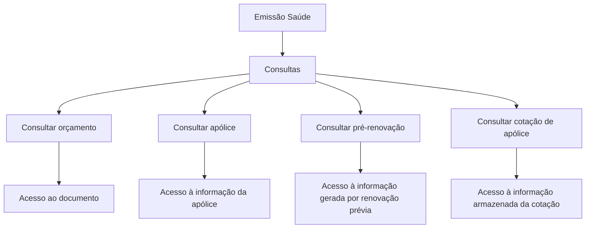

# Documentação de Operação de Emissão (Saúde) — Consultas

## 1. Metadados do Documento
- **Arquivo de Origem:** Não identificado
- **Tipo de Documento:** Manual Operacional
- **Domínio / Sistema:** Emissão (Saúde); Zeus
- **Público-Alvo:** Operação e usuários responsáveis por consultas de emissão
- **Data/Versão Identificada:** Não identificada

---

## 2. Resumo Executivo & Contexto de Negócio

O documento apresenta opções de consulta disponíveis no contexto de **Emissão (Saúde)**. As consultas permitem localizar e acessar documentos ou informações previamente registradas no sistema.

As opções documentadas abrangem consulta de orçamento, apólice, pré-renovação e cotação de apólice. Para orçamento e apólice, o texto informa que a localização prévia pode ocorrer mediante diferentes critérios de busca.

O conteúdo também exibe referências de navegação para “Início”, “Soluções”, “APIs”, “Documentação” e “Zeus”, além de indicar o idioma “ES”. Não há detalhamento de autenticação, permissões, endpoints, métodos HTTP, contratos de API ou critérios específicos de pesquisa.

---

## 3. Arquitetura, Componentes & Tecnologias Envolvidas

Componentes e conceitos explicitamente citados:

| Componente / Conceito | Papel identificado |
| :--- | :--- |
| Emissão (Saúde) | Contexto operacional ao qual pertencem as consultas. |
| Consultas | Conjunto de opções para acesso a informações e documentos. |
| Orçamento | Informação consultável após localização por critérios de busca. |
| Apólice | Informação consultável após seleção por critérios de busca. |
| Pré-renovação | Informação gerada por uma renovação prévia. |
| Cotação de apólice | Informação armazenada relativa a uma cotação. |
| Zeus | Nome exibido na navegação do documento. |
| APIs | Item exibido na navegação do documento. |



> **Nota de Análise:** O documento não descreve arquitetura de software, integrações, microsserviços, tecnologias de implementação, endpoints de APIs ou fluxo técnico entre sistemas.

---

## 4. Regras de Negócio, Especificações Funcionais & Processos

### Consultar orçamento
1. O usuário localiza previamente um orçamento.
2. A localização pode utilizar distintos critérios de busca.
3. Após a localização, a opção apresenta a informação relacionada ao orçamento.
4. A opção permite acessar o documento.

### Consultar apólice
1. O usuário realiza previamente a seleção de uma apólice.
2. A seleção pode utilizar distintos critérios de busca.
3. A opção permite acessar a informação de uma apólice.
4. A opção permite acessar o documento.

### Consultar pré-renovação
1. A consulta disponibiliza acesso à informação gerada por uma renovação prévia.
2. O texto não detalha critérios de busca, condições de elegibilidade, campos retornados ou ações posteriores.

### Consultar cotação de apólice
1. A consulta permite acessar informação armazenada relativa a uma cotação.
2. O texto não especifica os critérios de identificação da cotação, os campos consultados ou o documento acessado.

---

## 5. Tabelas de Parâmetros, Ambientes e Estruturas de Dados

| Item / Parâmetro | Descrição / Função | Tipo / Valores / Formato | Ambiente / Observações |
| :--- | :--- | :--- | :--- |
| Consultar orçamento | Mostra informação relacionada com um orçamento localizado previamente. | Opção de consulta. | A localização ocorre mediante distintos critérios de busca; critérios não detalhados. |
| Consultar apólice | Permite acessar informação de uma apólice selecionada previamente. | Opção de consulta. | A seleção ocorre mediante distintos critérios de busca; critérios não detalhados. |
| Consultar pré-renovação | Facilita acesso à informação gerada por uma renovação prévia. | Opção de consulta. | Sem detalhamento adicional. |
| Consultar cotação de apólice | Acessa informação armazenada relativa a uma cotação. | Opção de consulta. | Sem detalhamento adicional. |
| Accede al documento | Indicação de acesso a documento. | Ação ou link exibido. | O destino não é informado. |
| Zeus | Item de navegação identificado. | Nome exibido. | Sem descrição funcional adicional. |
| APIs | Item de navegação identificado. | Nome exibido. | Não há endpoints, contratos ou métodos documentados. |
| ES | Idioma exibido. | Código de idioma. | Presente na navegação. |

---

## 6. Bateria de Perguntas & Respostas para RAG (FAQ Sintético)

### P1: Quais opções de consulta estão disponíveis na documentação de Emissão (Saúde)?
**R:** A documentação apresenta quatro opções: consultar orçamento, consultar apólice, consultar pré-renovação e consultar cotação de apólice.

### P2: Como funciona a consulta de orçamento em Emissão (Saúde)?
**R:** A consulta de orçamento mostra a informação relacionada com um orçamento previamente localizado mediante distintos critérios de busca. O documento também indica que essa opção permite acessar o documento associado.

### P3: O documento informa quais critérios de busca podem ser usados para localizar um orçamento?
**R:** Não. O documento afirma que existem distintos critérios de busca para localizar o orçamento, mas não lista nem descreve esses critérios.

### P4: O que permite a opção “Consultar apólice”?
**R:** A opção “Consultar apólice” permite acessar a informação de uma apólice que foi previamente selecionada mediante distintos critérios de busca. O conteúdo também indica acesso ao documento.

### P5: Como uma apólice é selecionada antes da consulta?
**R:** O texto informa apenas que a seleção prévia da apólice é facilitada por distintos critérios de busca. Não há detalhamento dos critérios, filtros, campos ou regras de seleção.

### P6: O que é consultado na opção “Consultar pré-renovação”?
**R:** A opção “Consultar pré-renovação” facilita o acesso à informação que foi gerada por uma renovação prévia.

### P7: A documentação detalha o fluxo de renovação ou pré-renovação?
**R:** Não. O documento apenas informa que a consulta de pré-renovação acessa informação gerada por uma renovação prévia; não descreve etapas, regras, estados ou dados envolvidos no processo de renovação.

### P8: O que a consulta de cotação de apólice retorna?
**R:** A consulta de cotação de apólice permite acessar a informação armazenada relativa a uma cotação. Os atributos da cotação e os critérios de busca não são detalhados.

### P9: Existem endpoints ou contratos de API documentados para essas consultas?
**R:** Não. Embora “APIs” apareça na navegação, o texto fornecido não apresenta URLs, endpoints, métodos HTTP, parâmetros, payloads ou contratos JSON.

### P10: Qual sistema ou contexto é citado no documento?
**R:** O documento está contextualizado como “Documentación de Operación de Emisión (Salud) - Consulta”. O nome “Zeus” também aparece na navegação, sem detalhamento adicional sobre sua função.

---

## 7. Glossário de Termos, Siglas & Conceitos-Chave

- **Emissão (Saúde):** Contexto operacional identificado no título do documento.
- **Consulta:** Opção de acesso ou recuperação de informações no contexto de emissão.
- **Orçamento:** Informação que pode ser localizada por critérios de busca e consultada.
- **Apólice:** Informação que pode ser selecionada por critérios de busca e consultada.
- **Pré-renovação:** Informação gerada por uma renovação prévia.
- **Cotação de apólice:** Informação armazenada relativa a uma cotação.
- **APIs:** Item exibido na navegação; o documento não apresenta detalhes técnicos de interfaces de programação.
- **Zeus:** Nome exibido na navegação; significado e função não são detalhados.
- **ES:** Código exibido na navegação, associado ao idioma espanhol.

---

## 8. Notas Críticas, Riscos & Limitações

- O arquivo de origem, data, versão e autoria não foram identificados no conteúdo fornecido.
- Não há especificação dos critérios de busca para orçamento ou apólice.
- Não há URLs, endpoints, métodos HTTP, autenticação, autorização, contratos de API ou estruturas de dados.
- Não há descrição de permissões, perfis de acesso, tratamento de erros, logs ou auditoria.
- Não há detalhamento funcional adicional para pré-renovação e cotação de apólice.
- O item “Accede al documento” não informa o destino, formato ou conteúdo dos documentos acessados.

---

## 9. Conteúdo Bruto Estruturado (Referência Fiel)

```text
--- [PÁGINA 1 DE 2] ---

DOCUMENTACIÓN de OPERACIÓN de
EMISIÓN (Salud) - CONSULTA
CONSULTAS
Distintas opciones de consulta
CONSULTAR presupuesto
Muestra la información relacionada con un
presupuesto, previamente ubicado mediante
distintos criterios de búsqueda
 Accede al documento
CONSULTAR póliza
Permite el acceso a la información de una
póliza, donde previamente se ha facilitado la
selección mediante distintos criterios de
búsqueda
 Accede al documento
CONSULTAR prerenovacion
Facilita el acceso a la información que ha sido
generada por una renovación previa
CONSULTAR cotización póliza
Accede a la información almacenada relativa
a una cotización
 / 
 RS
Inicio Soluciones APIs Documentación Zeus
ES


--- [PÁGINA 2 DE 2] ---

Accede al documento
  Accede al documento
```
