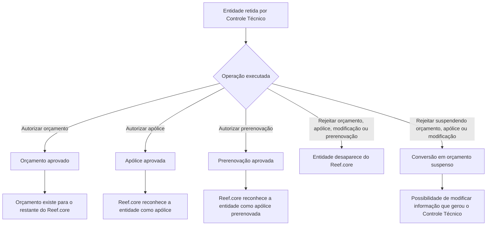

# Operações de Emissão (Saúde) — Controle Técnico no Reef.core

## 1. Metadados do Documento
- **Arquivo de Origem:** Não informado
- **Tipo de Documento:** Manual Operacional
- **Domínio / Sistema:** Emissão (Saúde), Controle Técnico e Reef.core
- **Público-Alvo:** Operação, negócio, analistas funcionais e desenvolvedores
- **Data/Versão Identificada:** Não identificada

---

## 2. Resumo Executivo & Contexto de Negócio

O documento descreve operações de autorização e rejeição aplicáveis a entidades retidas por **controle técnico de auditoria** no contexto de emissão de Saúde. As entidades citadas são orçamento, apólice, suplemento/modificação de apólice e prerenovação.

A autorização altera o estado de entidades retidas para que sejam reconhecidas pelo restante do sistema **Reef.core**. Um orçamento autorizado passa a estar aprovado; uma apólice autorizada passa a estar aprovada; e uma prerenovação autorizada passa a ser reconhecida como apólice prerenovada.

A rejeição possui dois resultados principais: remoção da entidade do Reef.core ou conversão para orçamento suspenso. A suspensão preserva a oportunidade de modificar as informações que geraram o controle técnico.

O documento não informa métodos HTTP, contratos de API, permissões, telas operacionais, URLs dos documentos vinculados por “Accede al documento”, nem critérios que originam a retenção por controle técnico.

---

## 3. Arquitetura, Componentes & Tecnologias Envolvidas

### Componentes e conceitos identificados

| Componente / Conceito | Papel descrito no documento |
| :--- | :--- |
| Emissão (Saúde) | Domínio funcional das operações documentadas. |
| Controle Técnico | Mecanismo que retém entidades para auditoria e sobre o qual são executadas operações de autorização ou rejeição. |
| Reef.core | Sistema que reconhece entidades aprovadas ou do qual entidades rejeitadas desaparecem. |
| Orçamento | Entidade que pode ser autorizada, rejeitada ou rejeitada com suspensão. |
| Apólice | Entidade que pode ser autorizada, rejeitada ou rejeitada com suspensão. |
| Suplemento / modificação de apólice | Alteração realizada em uma apólice que pode ser rejeitada ou rejeitada com suspensão quando retida por controle técnico. |
| Prerenovação | Renovação prévia de uma apólice, passível de autorização ou rejeição. |
| APIs | Termo presente na navegação do conteúdo bruto; não há detalhamento técnico sobre APIs. |
| Zeus | Termo presente na navegação do conteúdo bruto; não há explicação funcional ou técnica. |



> **Nota de Análise:** O documento apresenta resultados de negócio das operações, mas não detalha a arquitetura interna, integrações, bancos de dados, serviços, tecnologias, autenticação ou contratos expostos.

---

## 4. Regras de Negócio, Especificações Funcionais & Processos

### Autorização de orçamento

1. O orçamento deve estar retido por controle técnico.
2. A operação de autorização faz o orçamento passar ao estado de aprovado.
3. Após a aprovação, o orçamento passa a existir para o restante do Reef.core.

### Autorização de apólice

1. A apólice deve estar retida por controle técnico.
2. A operação de autorização faz a apólice passar ao estado de aprovada.
3. Após a aprovação, o restante do Reef.core reconhece a entidade como apólice.

### Autorização de prerenovação

1. A prerenovação corresponde a uma apólice que foi renovada previamente.
2. A apólice deve estar retida por controle técnico.
3. A operação de autorização faz a entidade passar ao estado de aprovada.
4. Após a aprovação, o restante do Reef.core reconhece a entidade como apólice prerenovada.

### Rejeição de orçamento

1. O orçamento deve estar retido por controle técnico.
2. A operação de rejeição impede a autorização do orçamento.
3. Como consequência, o orçamento desaparece do Reef.core.

### Rejeição de orçamento com suspensão

1. O orçamento deve estar retido por controle técnico.
2. A operação de rejeição impede a autorização do orçamento.
3. O orçamento passa a converter-se em um orçamento suspenso.
4. A suspensão oferece oportunidade de modificar a informação que gerou o controle técnico.

### Rejeição de apólice

1. A apólice deve estar retida por controle técnico.
2. A operação de rejeição impede a autorização da apólice.
3. Como consequência, a apólice desaparece do Reef.core.

### Rejeição de apólice com suspensão

1. A apólice deve estar retida por controle técnico.
2. A operação de rejeição impede a autorização da apólice.
3. A entidade passa a converter-se em um orçamento suspenso.
4. A suspensão oferece oportunidade de modificar a informação que gerou o controle técnico.

### Rejeição de modificação de apólice

1. Deve existir um suplemento realizado sobre uma apólice.
2. O suplemento deve estar retido por controle técnico.
3. A operação de rejeição impede a autorização do suplemento.
4. Como consequência, o suplemento desaparece do Reef.core.

### Rejeição de modificação de apólice com suspensão

1. Deve existir um suplemento realizado sobre uma apólice.
2. O suplemento deve estar retido por controle técnico.
3. A operação de rejeição impede a autorização do suplemento.
4. A entidade passa a converter-se em um orçamento suspenso.
5. A suspensão oferece oportunidade de modificar a informação que gerou o controle técnico.

### Rejeição de prerenovação

1. A prerenovação corresponde a uma renovação prévia de uma apólice.
2. A entidade deve estar retida por controle técnico.
3. A operação de rejeição impede a autorização da renovação prévia.
4. Como consequência, a entidade desaparece do Reef.core.

> **Nota de Análise:** O documento não especifica quais dados podem ser modificados após uma suspensão, nem define os critérios que provocam um controle técnico.

---

## 5. Tabelas de Parâmetros, Ambientes e Estruturas de Dados

| Item / Parâmetro | Descrição / Função | Tipo / Valores / Formato | Ambiente / Observações |
| :--- | :--- | :--- | :--- |
| Controle técnico | Retém entidades para auditoria e condiciona as operações descritas. | Estado ou condição operacional; valores internos não informados. | Aplicável a orçamento, apólice, suplemento/modificação e prerenovação. |
| Autorizar orçamento | Aprova orçamento retido. | Operação. | Faz o orçamento existir para o restante do Reef.core. |
| Autorizar apólice | Aprova apólice retida. | Operação. | Faz o restante do Reef.core reconhecer a entidade como apólice. |
| Autorizar prerenovação | Aprova apólice renovada previamente e retida. | Operação. | Faz o restante do Reef.core reconhecê-la como apólice prerenovada. |
| Rejeitar orçamento | Não autoriza orçamento retido. | Operação. | O orçamento desaparece do Reef.core. |
| Rejeitar orçamento suspendendo | Não autoriza orçamento e o converte em orçamento suspenso. | Operação. | Permite modificar a informação que originou o controle técnico. |
| Rejeitar apólice | Não autoriza apólice retida. | Operação. | A apólice desaparece do Reef.core. |
| Rejeitar apólice suspendendo | Não autoriza apólice e a converte em orçamento suspenso. | Operação. | Permite modificar a informação que originou o controle técnico. |
| Rejeitar apólice modificação | Não autoriza suplemento de apólice retido. | Operação. | O suplemento desaparece do Reef.core. |
| Rejeitar apólice modificação suspendendo | Não autoriza suplemento e o converte em orçamento suspenso. | Operação. | Permite modificar a informação que originou o controle técnico. |
| Rejeitar prerenovação | Não autoriza renovação prévia retida. | Operação. | A entidade desaparece do Reef.core. |
| URLs / acessos a documentos | Indicados por “Accede al documento”. | Não informado. | O texto extraído não contém os links ou seus conteúdos. |
| Ambientes | Não identificados. | Não informado. | O documento não lista servidores, URLs, portas ou ambientes. |
| Logs | Não identificados. | Não informado. | O documento não fornece rotas, níveis ou variáveis de log. |

---

## 6. Bateria de Perguntas & Respostas para RAG (FAQ Sintético)

### P1: O que acontece quando um orçamento retido por controle técnico é autorizado?
**R:** O orçamento passa a estar aprovado e, consequentemente, passa a existir para o restante do sistema Reef.core.

### P2: Qual é o resultado de autorizar uma apólice retida por controle técnico?
**R:** A apólice passa a estar aprovada, fazendo com que o restante do Reef.core reconheça a entidade como apólice.

### P3: Como o Reef.core trata uma prerenovação autorizada?
**R:** Uma apólice renovada previamente que estava retida por controle técnico, ao ser autorizada, passa a estar aprovada e é reconhecida pelo restante do Reef.core como apólice prerenovada.

### P4: O que ocorre quando um orçamento retido por controle técnico é rejeitado sem suspensão?
**R:** O orçamento não é autorizado e desaparece do Reef.core.

### P5: Para que serve rejeitar um orçamento suspendendo?
**R:** A operação não autoriza o orçamento, mas o converte em um orçamento suspenso para permitir a modificação da informação que gerou o controle técnico.

### P6: O que ocorre com uma apólice retida quando a operação “RECHAZAR póliza” é executada?
**R:** A apólice não é autorizada e, como consequência, desaparece do Reef.core.

### P7: Qual é a consequência de rejeitar uma apólice suspendendo?
**R:** A apólice não é autorizada e passa a converter-se em um orçamento suspenso, possibilitando modificar a informação que gerou o controle técnico.

### P8: Como é tratado um suplemento de apólice rejeitado sem suspensão?
**R:** Um suplemento realizado em uma apólice e retido por controle técnico não é autorizado; consequentemente, desaparece do Reef.core.

### P9: O que permite a rejeição de modificação de apólice com suspensão?
**R:** A operação não autoriza o suplemento retido, converte a entidade em um orçamento suspenso e cria a oportunidade de modificar a informação que gerou o controle técnico.

### P10: Qual é o efeito de rejeitar uma prerenovação?
**R:** Uma renovação prévia de apólice que esteja retida por controle técnico não é autorizada e desaparece do Reef.core.

### P11: O documento especifica os métodos HTTP ou contratos JSON das operações de controle técnico?
**R:** Não. O documento cita operações de autorização e rejeição, mas não detalha métodos HTTP, endpoints, contratos JSON, parâmetros de entrada ou respostas de API.

### P12: Quais entidades possuem operações explícitas de autorização no documento?
**R:** O documento explicita autorização para orçamento, apólice e prerenovação. Não apresenta uma operação explícita de autorização para suplemento ou modificação de apólice.

---

## 7. Glossário de Termos, Siglas & Conceitos-Chave

- **APIs:** Termo presente na navegação do conteúdo bruto; o documento não fornece seu significado ou especificação.
- **Apólice:** Entidade reconhecida pelo Reef.core após autorização de uma apólice retida por controle técnico.
- **Apólice prerenovada:** Forma como o restante do Reef.core reconhece uma apólice renovada previamente e autorizada.
- **Controle Técnico:** Controle de auditoria que retém orçamento, apólice, suplemento/modificação ou prerenovação até a execução de uma operação.
- **Orçamento:** Entidade que pode ser aprovada, removida do Reef.core ou convertida em orçamento suspenso.
- **Orçamento suspenso:** Resultado indicado para certas rejeições com suspensão; permite modificar a informação que gerou o controle técnico.
- **Prerenovação:** Renovação prévia de uma apólice.
- **Reef.core:** Sistema citado como consumidor ou referência de existência/reconhecimento das entidades após autorização ou rejeição.
- **Suplemento:** Modificação realizada em uma apólice.
- **Zeus:** Termo presente na navegação do conteúdo bruto; o documento não fornece definição.

---

## 8. Notas Críticas, Riscos & Limitações

- O documento não identifica arquivo de origem, autoria, data, versão, ambiente ou responsável operacional.
- Não há URLs, endpoints, métodos HTTP, contratos JSON, códigos de erro ou mecanismos de autenticação.
- O texto não define o critério de retenção por controle técnico nem os dados que geram esse controle.
- Não há matriz de permissões para autorização ou rejeição.
- O resultado “converter-se em orçamento suspenso” é indicado também para rejeição de apólice e modificação de apólice; o documento não explica a razão funcional dessa conversão.
- Os links referenciados como “Accede al documento” não estão presentes na extração fornecida.
- Não são apresentados fluxos de reversão, reprocessamento, auditoria, rastreabilidade ou tratamento de falhas.
- Não há detalhamento adicional para APIs, Zeus, “RS”, “Inicio Soluciones” ou “Documentación”.

---

## 9. Conteúdo Bruto Estruturado (Referência Fiel)

```text
--- [PÁGINA 1 DE 2] ---

DOCUMENTACIÓN de OPERACIÓN de
EMISIÓN (Salud) - CONTROL TÉCNICO
CONTROL TÉCNICO
Distintas operaciones de autorización y rechazo de controles técnicos
de auditoría
AUTORIZAR presupuesto
Un presupuesto retenido por control técnico
pasa a estar aprobado y por consiguiente,
existe para el resto de Reef.core
 Accede al documento
AUTORIZAR póliza
Una póliza retenida por control técnico pasa a
estar aprobada y por consiguiente, hace que
el resto de Reef.core la reconozca como
póliza
 Accede al documento
AUTORIZAR prerenovación
 RECHAZAR presupuesto
 / 
 RS
Inicio Soluciones APIs Documentación Zeus
ES


--- [PÁGINA 2 DE 2] ---

Una póliza que ha sido renovada previamente
y que está retenida por control técnico pasa a
estar aprobada y por consiguiente, hace que
el resto de Reef.core la reconozca como
póliza prerenovada
 Accede al documento
Un presupuesto retenido por control técnico
no es autorizado y por consiguiente
desaparece de Reef.core
 Accede al documento
RECHAZAR presupuesto suspendiendo
Un presupuesto retenido por control técnico
no es autorizado y pasa convertirse en un
presupuesto suspendido y así dar la
oportunidad de modificar la información que
generó el control técnico
 Accede al documento
RECHAZAR póliza
Una póliza retenida por control técnico no es
autorizada y por consiguiente desaparece de
Reef.core
 Accede al documento
RECHAZAR póliza suspendiendo
Una póliza retenida por control técnico no es
autorizada y pasa convertirse en un
presupuesto suspendido y así dar la
oportunidad de modificar la información que
generó el control técnico
 Accede al documento
RECHAZAR póliza modificación
Un suplemento realizado a una póliza que
quedó retenido por control técnico no es
autorizado y por consiguiente desaparece de
Reef.core
 Accede al documento
RECHAZAR póliza modificación
suspendiendo
Un suplemento realizado a una póliza que
quedó retenido por control técnico no es
autorizado y pasa convertirse en un
presupuesto suspendido y así dar la
oportunidad de modificar la información que
generó el control técnico
 Accede al documento
RECHAZAR prerenovación
Una renovación previa a una póliza que
quedó retenida por control técnico no es
autorizada y por consiguiente desaparece de
Reef.core
 Accede al documento
```
