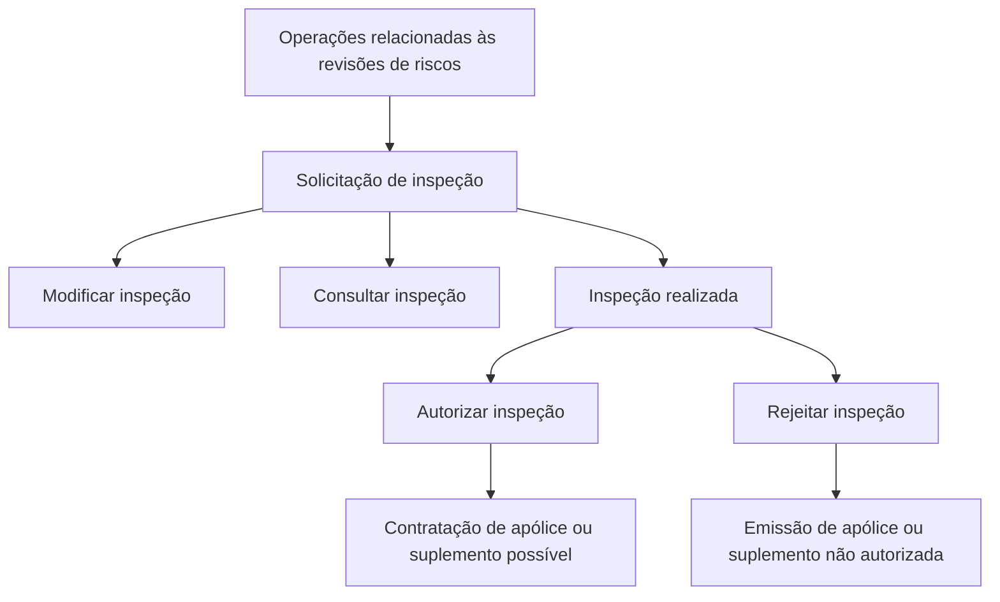

# Documentação de Operação de Emissão (Saúde) — Inspeção

## 1. Metadados do Documento
- **Arquivo de Origem:** `Não identificado no conteúdo fornecido`
- **Tipo de Documento:** `Manual Operacional`
- **Domínio / Sistema:** `Emissão (Saúde) — Inspeção`
- **Público-Alvo:** `Operações`
- **Data/Versão Identificada:** `Não identificada`

---

## 2. Resumo Executivo & Contexto de Negócio

O documento descreve operações relacionadas às revisões de riscos no contexto de **Emissão (Saúde)**, especificamente sobre o processo de **inspeção**. As operações apresentadas são modificar, autorizar, rejeitar e consultar uma inspeção.

A operação **modificar inspeção** permite atualizar uma solicitação de inspeção quando as informações originais não estiverem totalmente corretas. O documento não detalha quais campos podem ser alterados, quais validações são aplicadas nem quais perfis podem realizar a modificação.

Após a realização da inspeção, o processo pode resultar em autorização ou rejeição. A **autorização da inspeção** indica que a inspeção foi considerada correta e permite a contratação da apólice ou do suplemento. A **rejeição da inspeção** indica que a inspeção não foi considerada correta e impede a emissão da apólice ou do suplemento.

A operação **consultar inspeção** permite acessar informações armazenadas sobre uma inspeção. O conteúdo fornecido não especifica a estrutura dessas informações, mecanismos de busca, histórico de alterações, integrações, contratos técnicos ou detalhes adicionais dos documentos vinculados por “Accede al documento”.

---

## 3. Arquitetura, Componentes & Tecnologias Envolvidas

Os únicos elementos funcionais identificados são o contexto de **Operações relacionadas com as revisões de riscos** e as operações de inspeção: modificar, autorizar, rejeitar e consultar.

Não há tecnologias, microsserviços, ambientes, URLs completas, bancos de dados, APIs, protocolos, métodos HTTP, contratos JSON ou componentes de infraestrutura detalhados no conteúdo fornecido.



> **Nota de Análise:** O diagrama representa exclusivamente as relações funcionais explicitamente descritas. O documento não informa a existência de sistemas, serviços ou integrações responsáveis pelas operações.

---

## 4. Regras de Negócio, Especificações Funcionais & Processos

### 4.1. Modificar inspeção
- Uma solicitação de inspeção deve ser atualizada quando, por qualquer motivo, a informação original não estiver totalmente correta.
- O documento indica a existência de um documento de apoio por meio do texto **“Accede al documento”**.
- Não são especificados:
  - campos modificáveis;
  - critérios objetivos para considerar uma informação incorreta;
  - aprovação necessária para alteração;
  - rastreabilidade ou auditoria de modificações;
  - impacto da alteração sobre uma inspeção já realizada.

### 4.2. Autorizar inspeção
- A autorização ocorre após a realização da inspeção.
- A inspeção autorizada é considerada correta.
- A autorização torna possível a contratação da apólice ou do suplemento.
- O documento indica a existência de um documento de apoio por meio do texto **“Accede al documento”**.
- Não são especificados:
  - responsável pela autorização;
  - estados intermediários;
  - critérios de aprovação;
  - prazo de autorização;
  - efeito sobre solicitações pendentes.

### 4.3. Rejeitar inspeção
- A rejeição ocorre após a realização da inspeção.
- A inspeção rejeitada não é considerada correta.
- A rejeição não autoriza a emissão da apólice ou do suplemento.
- O documento indica a existência de um documento de apoio por meio do texto **“Accede al documento”**.
- Não são especificados:
  - motivos de rejeição;
  - possibilidade de correção ou reapresentação;
  - comunicação ao solicitante;
  - responsáveis pela decisão;
  - tratamento de apólices ou suplementos já em processamento.

### 4.4. Consultar inspeção
- A consulta permite acessar informações armazenadas sobre uma inspeção.
- Não são especificados:
  - filtros de consulta;
  - dados retornados;
  - nível de detalhe das informações;
  - permissões de acesso;
  - retenção ou histórico das inspeções.

---

## 5. Tabelas de Parâmetros, Ambientes e Estruturas de Dados

| Item / Parâmetro | Descrição / Função | Tipo / Valores / Formato | Ambiente / Observações |
| :--- | :--- | :--- | :--- |
| Modificar inspeção | Atualiza uma solicitação de inspeção quando a informação original não está totalmente correta. | Operação de inspeção. | Há referência a “Accede al documento”; destino não informado. |
| Autorizar inspeção | Considera correta uma inspeção realizada e permite a contratação da apólice ou suplemento. | Operação de decisão após inspeção. | Há referência a “Accede al documento”; critérios não detalhados. |
| Rejeitar inspeção | Considera incorreta uma inspeção realizada e não autoriza a emissão da apólice ou suplemento. | Operação de decisão após inspeção. | Há referência a “Accede al documento”; motivos não detalhados. |
| Consultar inspeção | Permite acesso às informações armazenadas sobre uma inspeção. | Operação de consulta. | Estrutura dos dados e permissões não informadas. |
| Apólice | Artefato cuja contratação pode ser permitida pela autorização ou cuja emissão pode ser impedida pela rejeição. | Termo de negócio. | Sem detalhamento adicional. |
| Suplemento | Artefato cuja contratação pode ser permitida pela autorização ou cuja emissão pode ser impedida pela rejeição. | Termo de negócio. | Sem detalhamento adicional. |
| “Accede al documento” | Referência textual para acesso a documento complementar. | Texto de navegação/documentação. | URL, identificador e conteúdo do documento complementar não informados. |
| “Inicio Soluciones APIs Documentación Zeus ES” | Texto de navegação presente no conteúdo bruto. | Navegação/interface. | Não há detalhamento sobre Zeus, APIs ou Soluciones. |

---

## 6. Bateria de Perguntas & Respostas para RAG (FAQ Sintético)

### P1: Qual é o objetivo da operação de modificar inspeção?
**R:** A operação de modificar inspeção atualiza uma solicitação de inspeção quando, por qualquer motivo, a informação original não estiver totalmente correta. O documento não especifica quais informações podem ser modificadas.

### P2: Quando uma inspeção pode ser autorizada?
**R:** Uma inspeção pode ser autorizada depois de realizada, quando ela é considerada correta. A autorização possibilita a contratação da apólice ou do suplemento.

### P3: Qual é o impacto de rejeitar uma inspeção?
**R:** Quando uma inspeção realizada não é considerada correta, ela pode ser rejeitada. A rejeição não autoriza a emissão da apólice ou do suplemento.

### P4: A autorização da inspeção permite emitir uma apólice?
**R:** O documento afirma que, após a autorização da inspeção, é possível a contratação da apólice ou do suplemento. O conteúdo não detalha o fluxo técnico de emissão nem diferencia contratação e emissão além das expressões apresentadas.

### P5: O que a consulta de inspeção disponibiliza?
**R:** A operação de consultar inspeção permite acessar informações armazenadas sobre uma inspeção. O documento não informa quais campos, documentos, dados históricos ou filtros estão disponíveis.

### P6: Quais operações de inspeção são apresentadas no documento?
**R:** O documento apresenta quatro operações: modificar inspeção, autorizar inspeção, rejeitar inspeção e consultar inspeção.

### P7: Quais são os critérios para considerar uma inspeção correta?
**R:** O conteúdo informa que uma inspeção autorizada é considerada correta, mas não define critérios, validações, regras de cálculo ou responsáveis pela avaliação dessa correção.

### P8: O documento informa quais APIs ou sistemas executam as operações de inspeção?
**R:** Não. Embora o texto de navegação mencione “Soluciones APIs Documentación Zeus”, o conteúdo não apresenta nomes de APIs, endpoints, métodos HTTP, sistemas, contratos de integração ou tecnologias.

### P9: Existe um processo descrito para corrigir uma inspeção rejeitada?
**R:** Não. O documento descreve que a modificação atualiza informações originais incorretas e que a rejeição impede a emissão da apólice ou suplemento, mas não estabelece um fluxo explícito de correção, reapresentação ou nova análise após rejeição.

### P10: Onde estão os detalhes operacionais de cada ação de inspeção?
**R:** Para modificar, autorizar, rejeitar e consultar inspeção, o documento apresenta a indicação “Accede al documento”. Contudo, os documentos de destino e seus conteúdos não foram fornecidos.

---

## 7. Glossário de Termos, Siglas & Conceitos-Chave

- **Emissão (Saúde):** Contexto identificado no título do documento, associado às operações de inspeção.
- **Inspeção:** Objeto das operações de modificação, autorização, rejeição e consulta.
- **Solicitação de inspeção:** Solicitação que pode ser atualizada quando a informação original não estiver totalmente correta.
- **Revisões de riscos:** Contexto operacional ao qual pertencem as operações de inspeção.
- **Autorizar inspeção:** Operação que considera correta uma inspeção realizada e possibilita a contratação de apólice ou suplemento.
- **Rejeitar inspeção:** Operação que considera incorreta uma inspeção realizada e não autoriza a emissão de apólice ou suplemento.
- **Consultar inspeção:** Operação que permite acessar informações armazenadas sobre uma inspeção.
- **Apólice:** Elemento de negócio cuja contratação pode ser possibilitada pela autorização da inspeção.
- **Suplemento:** Elemento de negócio cuja contratação pode ser possibilitada pela autorização da inspeção.
- **Zeus:** Termo exibido na navegação textual “Inicio Soluciones APIs Documentación Zeus ES”; não possui definição adicional no conteúdo.

---

## 8. Notas Críticas, Riscos & Limitações

- O conteúdo é resumido e não inclui detalhamento técnico, funcional ou operacional além das descrições básicas das quatro operações.
- Não foram identificados endpoints, URLs, ambientes, tecnologias, equipes responsáveis, perfis de acesso, logs, parâmetros, campos de dados ou contratos de integração.
- As referências “Accede al documento” indicam documentação complementar, mas os respectivos destinos não foram disponibilizados.
- O documento não define critérios formais de autorização ou rejeição de inspeções.
- O documento não descreve tratamento de exceções, reprocessamento, auditoria, transições de estado, notificações ou fluxo posterior à rejeição.
- **Nota de Análise:** A menção a “Soluciones APIs Documentación Zeus” não é suficiente para inferir uma arquitetura de APIs, integração com Zeus ou qualquer tecnologia específica.

---

## 9. Conteúdo Bruto Estruturado (Referência Fiel)

```text
--- [PÁGINA 1 DE 2] ---

DOCUMENTACIÓN de OPERACIÓN de
EMISIÓN (Salud) - INSPECCIÓN
INSPECCIÓN
Operaciones relacionadas con las revisiones de riesgos
MODIFICAR inspección
Se actualiza la solicitud de inspección si por
cualquier motivo la información original no era
totalmente correcta
 Accede al documento
AUTORIZAR inspección
Una vez realizada la inspección, esta se
considera correcta y es posible la contratación
de la póliza o suplemento
 Accede al documento
RECHAZAR inspección
Una vez realizada la inspección, esta no se
considera correcta y no se autoriza la emisión
de la póliza o suplemento
CONSULTAR inspección
Permite el acceso a la información
almacenada acerca de una inspección
 / 
 RS
Inicio Soluciones APIs Documentación Zeus
ES


--- [PÁGINA 2 DE 2] ---

Accede al documento
  Accede al documento
```
