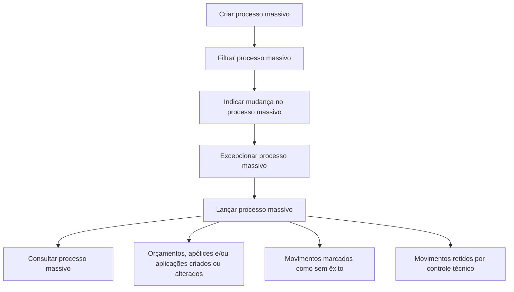

# Documentação de Operação de Emissão (Saúde) — Processos Massivos

## 1. Metadados do Documento
- **Arquivo de Origem:** Não identificado
- **Tipo de Documento:** Manual Operacional
- **Domínio / Sistema:** Emissão (Saúde) — Processos Massivos
- **Público-Alvo:** Operação
- **Data/Versão Identificada:** Não identificada

---

## 2. Resumo Executivo & Contexto de Negócio

O documento apresenta a documentação de operação para **Processos Massivos** no contexto de **Emissão (Saúde)**. Processos massivos são definidos como operações relacionadas à execução por lotes sobre orçamentos, apólices e/ou aplicações.

O fluxo operacional abrange a criação ou alteração de um processo massivo, a filtragem dos itens participantes, a indicação das mudanças a serem aplicadas e a definição de exceções. Após essas etapas, o processo pode ser lançado para execução e posteriormente consultado.

Durante o lançamento, orçamentos, apólices e/ou aplicações podem ser criados ou alterados. O documento também estabelece que determinados movimentos podem não ser bem-sucedidos ou podem ficar retidos por controle técnico.

> **Nota de Análise:** O conteúdo não detalha telas, APIs, critérios de filtragem, regras de validação, contratos de integração, responsáveis operacionais ou mecanismos de tratamento para movimentos sem êxito e itens retidos por controle técnico.

---

## 3. Arquitetura, Componentes & Tecnologias Envolvidas

O documento cita os seguintes elementos de navegação e contexto:

- **Emissão (Saúde):** domínio funcional da documentação.
- **Processos Massivos:** conjunto de operações em lote para orçamentos, apólices e/ou aplicações.
- **Zeus:** termo presente no caminho de navegação da documentação, sem detalhamento funcional ou técnico.
- **RS:** sigla exibida no conteúdo, sem definição fornecida.
- **Início / Soluções / APIs / Documentação / Zeus / ES:** elementos apresentados como caminho ou menu de navegação.

O documento não descreve componentes de software, microsserviços, bases de dados, integrações, protocolos, tecnologias de implementação ou ambientes técnicos.



---

## 4. Regras de Negócio, Especificações Funcionais & Processos

### 4.1. Criar processo massivo

A criação de um processo massivo permite criar ou alterar:

- Orçamentos;
- Apólices;
- Aplicações.

O documento não especifica quais campos, condições, permissões ou validações são necessários para criar um processo massivo.

### 4.2. Filtrar processo massivo

A filtragem permite definir quais apólices ou aplicações participam de um processo massivo.

O documento não informa:

- Critérios de filtro disponíveis;
- Operadores de filtragem;
- Possibilidade de filtrar orçamentos;
- Regras de inclusão ou exclusão automática;
- Quantidade máxima de itens participantes.

### 4.3. Indicar mudança no processo massivo

A etapa de indicação de mudança especifica quais mudanças serão realizadas no processo massivo. Essas mudanças serão aplicadas às apólices e/ou aplicações que participarem do processo massivo.

O documento não detalha os tipos de mudança possíveis, os atributos modificáveis ou as regras de validação das alterações.

### 4.4. Excepcionar processo massivo

A etapa de exceção determina quais orçamentos, apólices ou aplicações inicialmente selecionados passam a ficar excluídos do processo massivo.

A exceção atua sobre itens inicialmente selecionados, removendo esses itens da participação no processo massivo.

### 4.5. Lançar processo massivo

O lançamento corresponde à execução do processo massivo. Durante essa execução:

1. Uma série de orçamentos, apólices e/ou aplicações será criada ou alterada;
2. Outros itens ficarão marcados como movimentos sem êxito;
3. Outros itens ficarão retidos por controle técnico.

O documento não define as causas de falha, os critérios de retenção por controle técnico, mecanismos de reprocessamento ou procedimentos de correção.

### 4.6. Consultar processo massivo

A consulta facilita o acesso às informações existentes relacionadas ao processo massivo.

O documento não especifica quais informações podem ser consultadas, os filtros de consulta, o nível de detalhe disponível ou a retenção histórica dos resultados.

---

## 5. Tabelas de Parâmetros, Ambientes e Estruturas de Dados

| Item / Parâmetro | Descrição / Função | Tipo / Valores / Formato | Ambiente / Observações |
| :--- | :--- | :--- | :--- |
| Processo massivo | Operação relacionada a processamento por lotes. | Processo operacional | Aplicável a orçamentos, apólices e/ou aplicações. |
| Criar processo massivo | Permite criar ou alterar orçamentos, apólices e/ou aplicações. | Ação operacional | Não há detalhamento de campos ou validações. |
| Filtrar processo massivo | Define quais apólices ou aplicações intervêm em um processo massivo. | Ação operacional | Critérios de filtragem não identificados. |
| Indicar mudança | Especifica mudanças que serão sofridas por apólices e/ou aplicações participantes. | Ação operacional | Tipos de mudança não identificados. |
| Excepcionar processo massivo | Exclui do processo massivo orçamentos, apólices ou aplicações inicialmente selecionados. | Ação operacional | Regras para exceção não identificadas. |
| Lançar processo massivo | Executa o processo massivo. | Ação operacional | Pode criar, alterar, marcar sem êxito ou reter itens. |
| Movimento sem êxito | Situação atribuída a itens cujo movimento não teve sucesso. | Status de resultado | Causa e tratamento não detalhados. |
| Retido por controle técnico | Situação atribuída a itens retidos durante a execução. | Status de resultado | Critérios e tratamento não detalhados. |
| Consultar processo massivo | Permite acessar informações relacionadas a processos massivos. | Ação operacional | Conteúdo disponível para consulta não detalhado. |
| Zeus | Termo presente no caminho de navegação. | Sistema ou seção não detalhada | Sem explicação no documento. |
| RS | Sigla apresentada no conteúdo. | Não identificado | Significado não informado. |
| ES | Sigla apresentada no caminho de navegação. | Não identificado | Significado não informado. |

---

## 6. Bateria de Perguntas & Respostas para RAG (FAQ Sintético)

### P1: O que é um processo massivo no contexto de Emissão (Saúde)?
**R:** Um processo massivo é uma operação relacionada ao processamento por lotes que permite criar ou alterar orçamentos, apólices e/ou aplicações no contexto de Emissão (Saúde).

### P2: Quais tipos de registros podem ser criados ou alterados por um processo massivo?
**R:** Um processo massivo pode criar ou alterar orçamentos, apólices e/ou aplicações. O documento não detalha quais atributos desses registros podem ser alterados.

### P3: Qual é a finalidade da etapa de filtragem de um processo massivo?
**R:** A filtragem permite definir quais apólices ou aplicações intervêm, ou participam, de um processo massivo. O documento não informa os critérios disponíveis para realizar essa seleção.

### P4: O que acontece na etapa de indicação de mudança de um processo massivo?
**R:** Nessa etapa são especificadas as mudanças que serão realizadas no processo massivo e que serão sofridas pelas apólices e/ou aplicações participantes. Os tipos de mudança não são detalhados.

### P5: Para que serve excepcionar um processo massivo?
**R:** Excepcionar um processo massivo determina quais orçamentos, apólices ou aplicações inicialmente selecionados passam a estar excluídos do processo massivo.

### P6: O que ocorre quando um processo massivo é lançado?
**R:** O lançamento executa o processo massivo. Durante a execução, uma série de orçamentos, apólices e/ou aplicações pode ser criada ou alterada; outros movimentos podem ser marcados como sem êxito; e outros podem ficar retidos por controle técnico.

### P7: Todos os itens participantes têm êxito durante a execução do processo massivo?
**R:** Não. O documento informa que alguns movimentos podem ficar marcados como sem êxito e outros podem ficar retidos por controle técnico durante o lançamento do processo massivo.

### P8: O documento explica por que um movimento fica sem êxito?
**R:** Não. O documento informa a possibilidade de movimentos sem êxito, mas não descreve causas, mensagens de erro, critérios de classificação ou procedimentos de correção.

### P9: O que significa um item retido por controle técnico?
**R:** Significa que, durante a execução do processo massivo, o item ficou retido por controle técnico. O documento não descreve os critérios técnicos responsáveis pela retenção nem o tratamento posterior.

### P10: Qual é a função da consulta de processo massivo?
**R:** A consulta de processo massivo facilita o acesso às informações existentes relacionadas ao processo massivo. O conteúdo não especifica quais dados, filtros ou resultados estão disponíveis nessa consulta.

---

## 7. Glossário de Termos, Siglas & Conceitos-Chave

- **Aplicações:** Entidades que podem participar de processos massivos e podem ser criadas ou alteradas durante a execução.
- **Apólices:** Entidades que podem ser selecionadas, alteradas, excluídas por exceção ou processadas em lote.
- **Controle técnico:** Condição mencionada como motivo de retenção de itens durante a execução de um processo massivo; critérios não detalhados.
- **Emissão (Saúde):** Contexto funcional indicado no título da documentação.
- **ES:** Sigla presente no caminho de navegação; significado não informado.
- **Movimento sem êxito:** Resultado possível da execução, atribuído quando um movimento não teve sucesso.
- **Orçamentos:** Entidades que podem ser criadas, alteradas ou excluídas de um processo massivo por exceção.
- **Processo massivo:** Operação por lotes aplicada a orçamentos, apólices e/ou aplicações.
- **RS:** Sigla presente no conteúdo; significado não informado.
- **Zeus:** Termo presente no caminho de navegação da documentação; significado ou função não detalhados.

---

## 8. Notas Críticas, Riscos & Limitações

- O documento é predominantemente uma visão resumida das operações disponíveis para processos massivos.
- Não há detalhamento de interfaces, APIs, métodos HTTP, contratos JSON, bancos de dados ou integrações.
- Não são definidos critérios de filtragem para apólices ou aplicações.
- Não são especificados os tipos de mudanças permitidas para apólices e aplicações participantes.
- Não há critérios documentados para classificar movimentos como sem êxito.
- Não há critérios documentados para retenção por controle técnico.
- Não são descritos procedimentos de reprocessamento, correção, desbloqueio ou tratamento de itens retidos.
- As siglas **RS** e **ES**, assim como o termo **Zeus**, não possuem definição no conteúdo fornecido.
- O conteúdo apresenta referências “Accede al documento”, mas não disponibiliza os documentos referenciados.

---

## 9. Conteúdo Bruto Estruturado (Referência Fiel)

```text
--- [PÁGINA 1 DE 2] ---

DOCUMENTACIÓN de OPERACIÓN de
EMISIÓN (Salud) - PROCESOS MASIVOS
PROCESOS MASIVOS
Operaciones relacionadas con procesos por lotes
CREAR proceso masivo
Se define un proceso masivo que permita
crear o alterar presupuestos, pólizas y/o
aplicaciones
 Accede al documento
FILTRAR proceso masivo
Permite la definición de qué pólizas o
aplicaciones intervienen en un proceso
masivo
 Accede al documento
INDICAR CAMBIO proceso masivo
Se especifican los cambios a realizar en el
proceso masivo y que sufrirán las pólizas y/o
aplicaciones que participen en él
EXCEPCIONAR proceso masivo
Se determina qué presupuesto, pólizas o
aplicaciones inicialmente seleccionadas
pasan a estar excluidas del proceso masivo
 / 
 RS
Inicio Soluciones APIs Documentación Zeus
ES


--- [PÁGINA 2 DE 2] ---

Accede al documento
  Accede al documento
LANZAR proceso masivo
Ejecución del proceso masivo donde una
serie de presupuestos, póliza y/o aplicaciones
serán creadas o alteradas, otras quedarán
marcadas como que el movimiento no tuvo
éxito y otras quedarán retenidas por control
técnico
 Accede al documento
CONSULTAR proceso masivo
Facilita el acceso a la información que existe
relacionado con el proceso masivo
 Accede al documento
```
