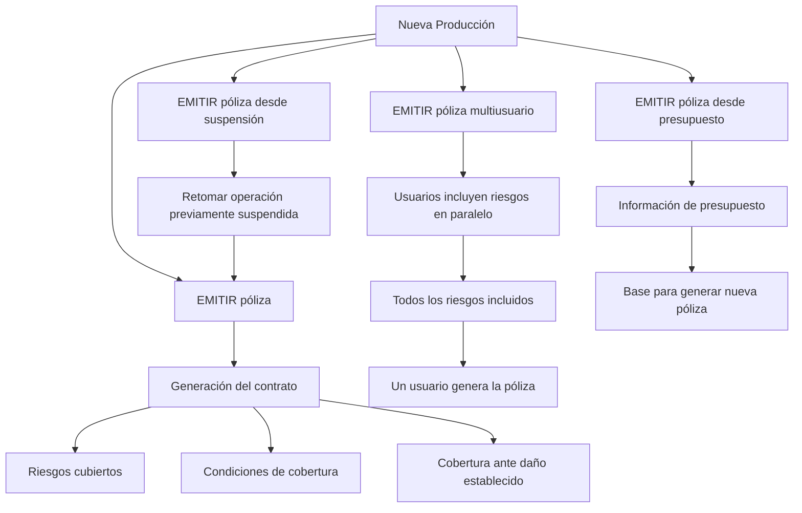

# Documentação de Operação de Emissão (Saúde) — Nova Produção

## 1. Metadados do Documento
- **Arquivo de Origem:** Não identificado no conteúdo fornecido
- **Tipo de Documento:** Manual Operacional
- **Domínio / Sistema:** Emissão de apólices de Saúde — Nova Produção
- **Público-Alvo:** Operação, Negócio e usuários responsáveis pela inclusão de riscos e emissão de apólices
- **Data/Versão Identificada:** Não identificada

---

## 2. Resumo Executivo & Contexto de Negócio

O documento descreve a operação de **EMITIR póliza** no contexto de **Salud / Nueva Producción**. A emissão é definida como a geração do contrato que estabelece os riscos cobertos, as condições de cobertura e a cobertura aplicável quando ocorrer algum dano previsto.

A documentação apresenta quatro modalidades para criar novas apólices ou aplicações: emissão direta de apólice, emissão a partir de uma operação previamente suspensa, emissão multiusuário e emissão baseada em orçamento.

A modalidade de emissão a partir de suspensão permite retomar uma operação de emissão que havia sido suspensa anteriormente. A modalidade multiusuário permite que diversos usuários incluam riscos em paralelo; após a inclusão de todos os riscos, um dos usuários gera a apólice.

A emissão a partir de orçamento utiliza as informações de um orçamento como base para gerar uma nova apólice. O conteúdo fornecido menciona links ou ações identificados como **“Accede al documento”**, mas não apresenta o conteúdo dos documentos vinculados.

---

## 3. Arquitetura, Componentes & Tecnologias Envolvidas

O conteúdo não detalha arquitetura de software, microsserviços, tecnologias, integrações, protocolos, bancos de dados, APIs ou ambientes técnicos. Os elementos identificados são funcionais e operacionais:

- **Operação EMITIR póliza**
- **Riscos**
- **Condições de cobertura**
- **Cobertura**
- **Operação previamente suspensa**
- **Múltiplos usuários**
- **Orçamento / presupuesto**
- **Apólice / póliza**
- Navegação ou cabeçalho com: `Inicio`, `Soluciones`, `APIs`, `Documentación`, `Zeus`, `ES`



> **Nota de Análise:** O documento não detalha os sistemas responsáveis pela operação, os métodos de acesso, contratos de API, telas, permissões, validações técnicas ou integrações associadas à emissão.

---

## 4. Regras de Negócio, Especificações Funcionais & Processos

### 4.1 Definição da operação EMITIR póliza

A operação **EMITIR póliza** consiste na geração de um contrato que estabelece:

1. O risco ou os riscos cobertos.
2. As condições nas quais os riscos são cobertos.
3. A cobertura que será fornecida quando o risco sofrer algum tipo de dano estabelecido.

### 4.2 Formas de criação de novas apólices ou aplicações

O documento apresenta as seguintes formas de criação:

#### Emissão direta de apólice
A emissão direta gera o contrato de apólice, definindo os riscos, as condições de cobertura e a cobertura associada a danos estabelecidos.

#### Emissão de apólice a partir de suspensão
A emissão a partir de suspensão consiste em realizar a operação **EMITIR póliza** após retomar uma operação que havia sido previamente suspensa.

#### Emissão de apólice multiusuário
A emissão multiusuário possui a finalidade de emitir uma apólice com a participação paralela de vários usuários:

1. Vários usuários incluem riscos de forma paralela.
2. Todos os riscos devem ser incluídos.
3. Após a inclusão de todos os riscos, um dos usuários gera a apólice.

#### Emissão de apólice a partir de orçamento
A emissão a partir de orçamento consiste em executar a operação **EMITIR póliza** usando como origem as informações de um orçamento. O orçamento serve como base para a geração da nova apólice.

> **Nota de Análise:** O documento não especifica critérios para determinar que “todos os riscos” foram incluídos, nem define qual usuário deve gerar a apólice no fluxo multiusuário.

---

## 5. Tabelas de Parâmetros, Ambientes e Estruturas de Dados

| Item / Parâmetro | Descrição / Função | Tipo / Valores / Formato | Ambiente / Observações |
| :--- | :--- | :--- | :--- |
| EMITIR póliza | Operação de geração de contrato de apólice. | Operação funcional. | Aplicável a Nueva Producción / Salud. |
| Póliza | Contrato gerado pela operação de emissão. | Entidade de negócio. | Estabelece riscos, condições e cobertura. |
| Riesgo / Riscos | Elementos cobertos pelo contrato de apólice. | Entidade de negócio. | Na emissão multiusuário, são incluídos paralelamente por vários usuários. |
| Condiciones de cobertura | Condições nas quais os riscos são cobertos. | Regra/condição de negócio. | Não detalhadas no conteúdo fornecido. |
| Cobertura | Cobertura disponibilizada quando um risco sofre dano estabelecido. | Regra/benefício de negócio. | Não detalhada no conteúdo fornecido. |
| EMITIR póliza desde suspensión | Emissão após retomada de uma operação previamente suspensa. | Modalidade de emissão. | Depende de existência de operação suspensa. |
| EMITIR póliza multiusuario | Emissão com inclusão paralela de riscos por diversos usuários. | Modalidade de emissão. | Um usuário gera a apólice após a inclusão de todos os riscos. |
| EMITIR póliza desde presupuesto | Emissão baseada nas informações de um orçamento. | Modalidade de emissão. | O orçamento é a origem/base da nova apólice. |
| Presupuesto / Orçamento | Informações utilizadas como base para gerar nova apólice. | Entidade de negócio. | Não são detalhados campos, formato ou regras de reutilização. |
| Accede al documento | Referência para acesso a documentação complementar. | Ação/link de navegação. | Destino e conteúdo não fornecidos. |
| Inicio / Soluciones / APIs / Documentación / Zeus / ES | Elementos textuais presentes na navegação ou cabeçalho. | Navegação/interface. | Função técnica não detalhada. |

---

## 6. Bateria de Perguntas & Respostas para RAG (FAQ Sintético)

### P1: O que significa a operação “EMITIR póliza” no contexto de Saúde e Nova Produção?
**R:** A operação **EMITIR póliza** consiste na geração de um contrato de apólice. Esse contrato estabelece o risco ou os riscos cobertos, as condições nas quais esses riscos são cobertos e a cobertura disponibilizada quando ocorrer algum dano estabelecido.

### P2: Quais são as formas de criar novas apólices ou aplicações apresentadas no documento?
**R:** O documento apresenta quatro formas: emissão direta de apólice, emissão de apólice a partir de suspensão, emissão de apólice multiusuário e emissão de apólice a partir de orçamento.

### P3: Como funciona a emissão de apólice a partir de uma suspensão?
**R:** A emissão de apólice a partir de suspensão consiste em realizar a operação **EMITIR póliza** depois de retomar uma operação que havia sido previamente suspensa.

### P4: Qual é a finalidade da emissão multiusuário?
**R:** A finalidade da emissão multiusuário é emitir uma apólice em um cenário no qual vários usuários incluem riscos de forma paralela. Depois que todos os riscos forem incluídos, um dos usuários gera a apólice.

### P5: Quem gera a apólice no processo multiusuário?
**R:** Após todos os riscos serem incluídos pelos usuários participantes, um dos usuários gera a apólice. O documento não define qual usuário deve executar essa geração nem descreve critérios de autorização ou seleção.

### P6: Qual condição precisa ser atendida antes da geração da apólice no fluxo multiusuário?
**R:** Todos os riscos devem ter sido incluídos antes que um dos usuários gere a apólice.

### P7: Como funciona a emissão de apólice a partir de orçamento?
**R:** A emissão a partir de orçamento consiste em emitir uma apólice utilizando como origem as informações de um orçamento. Esse orçamento serve como base para a geração da nova apólice.

### P8: Quais informações o contrato de apólice estabelece?
**R:** O contrato gerado pela operação de emissão estabelece os riscos cobertos, as condições em que os riscos são cobertos e a cobertura que será oferecida se o risco sofrer algum dano estabelecido.

### P9: O documento descreve APIs, endpoints ou contratos JSON para a emissão de apólices?
**R:** Não. Embora o texto de navegação apresente a palavra “APIs”, o conteúdo fornecido não descreve endpoints, métodos HTTP, contratos JSON, autenticação, integrações ou especificações técnicas de API.

### P10: O documento informa os campos obrigatórios de um orçamento utilizado para emissão?
**R:** Não. O documento apenas afirma que as informações de um orçamento servem como base para gerar uma nova apólice, sem detalhar campos, estrutura, regras de validação ou formato do orçamento.

### P11: Existem detalhes sobre tratamento de erros, cancelamento ou reprocessamento da emissão?
**R:** Não. O documento menciona somente a retomada de uma operação previamente suspensa. Não há detalhamento sobre causas da suspensão, tratamento de erro, cancelamento, reprocessamento ou auditoria.

### P12: Há documentação complementar disponível para cada modalidade de emissão?
**R:** O documento exibe a indicação **“Accede al documento”** junto às modalidades apresentadas. No entanto, os documentos vinculados não foram fornecidos, portanto não é possível detalhar seu conteúdo.

---

## 7. Glossário de Termos, Siglas & Conceitos-Chave

- **EMITIR póliza:** Operação de geração de um contrato de apólice.
- **Póliza:** Apólice ou contrato que estabelece riscos cobertos, condições de cobertura e cobertura diante de dano estabelecido.
- **Nueva Producción:** Contexto de criação de novas apólices ou aplicações.
- **Salud:** Domínio indicado no título do documento; o conteúdo fornecido não apresenta detalhamento adicional sobre o produto ou linha de Saúde.
- **Riesgo / Riscos:** Risco ou riscos cobertos pelo contrato de apólice.
- **Condiciones de cobertura:** Condições sob as quais os riscos são cobertos.
- **Cobertura:** Proteção ou cobertura oferecida quando um risco sofre dano estabelecido.
- **Suspensión:** Estado ou situação de uma operação de emissão que foi previamente suspensa e pode ser retomada.
- **Multiusuario:** Modalidade em que diversos usuários incluem riscos em paralelo antes da geração da apólice.
- **Presupuesto:** Orçamento cujas informações são utilizadas como base para gerar uma nova apólice.
- **Zeus:** Termo exibido na navegação do documento; o significado ou função não é detalhado.
- **ES:** Texto exibido na navegação; o significado não é detalhado no conteúdo fornecido.

---

## 8. Notas Críticas, Riscos & Limitações

- O conteúdo fornecido não informa o nome do arquivo de origem, autor, data, versão ou responsável pela documentação.
- Não há detalhamento técnico de arquitetura, sistemas, componentes, APIs, integrações, autenticação, bancos de dados, ambientes ou logs.
- Não há especificação de campos, formatos, validações ou regras de negócio detalhadas para riscos, condições de cobertura, cobertura ou orçamento.
- O fluxo multiusuário não define mecanismos de coordenação, concorrência, bloqueio, autorização, identificação do usuário responsável pela emissão ou tratamento de inclusão incompleta de riscos.
- A emissão a partir de suspensão não descreve os motivos de suspensão, estados permitidos, regras de retomada ou impactos sobre os dados já informados.
- As referências **“Accede al documento”** sugerem documentação complementar, mas o conteúdo dessas referências não foi disponibilizado.
- O termo **“APIs”** é exibido na navegação, porém não há especificações de API no conteúdo analisado.

---

## 9. Conteúdo Bruto Estruturado (Referência Fiel)

```text
--- [PÁGINA 1 DE 2] ---

DOCUMENTACIÓN de OPERACIÓN de
EMISIÓN (Salud) - NUEVA PRODUCCIÓN
NUEVA PRODUCCIÓN
Distintas formas de crear nuevas pólizas o aplicaciones
EMITIR póliza
Consiste en la generación del contrato por el
que se establece el riesgo o riesgos cubiertos,
las condiciones en las que se cubre y la
cobertura que se dará cuando el riesgo sufra
algún tipo de daño establecido
 Accede al documento
EMITIR póliza desde suspensión
Es la realización de la operación EMITIR
póliza, habiendo retomado la operación que
había sido previamente suspendida
 Accede al documento
EMITIR póliza multiusuario
 EMITIR póliza desde presupuesto
 / 
 RS
Inicio Soluciones APIs Documentación Zeus
ES


--- [PÁGINA 2 DE 2] ---

La finalidad de esta operación es la de
EMITIR póliza pero, en la que varios usuarios
se encuentran incluyendo riesgos de forma
paralela. Una vez que todos los riesgos han
sido incluidos, uno de los usuarios genera la
póliza
 Accede al documento
Consiste en EMITIR póliza tomando como
origen la información de un presupuesto que
sirve como base para la generación de la
nueva póliza
 Accede al documento
```
