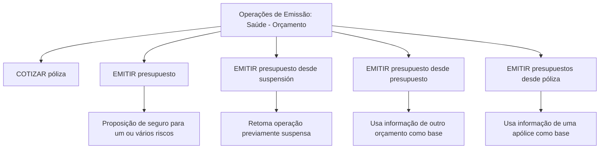
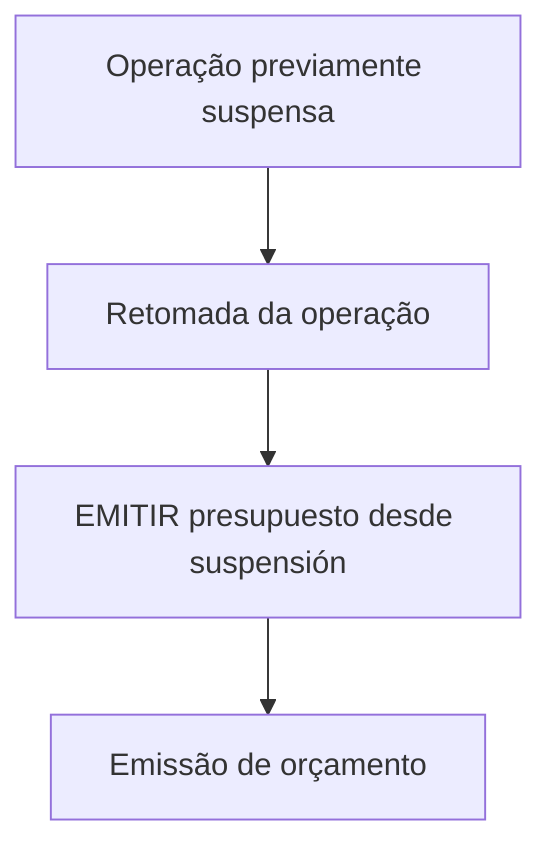
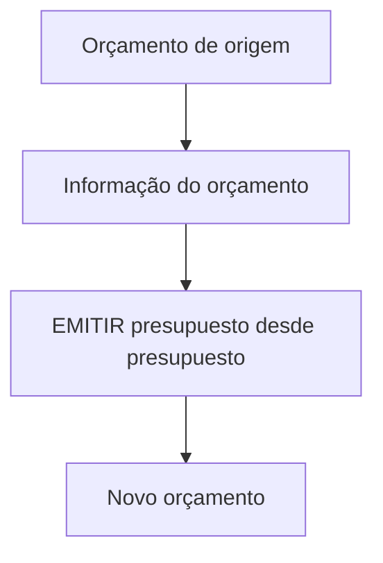
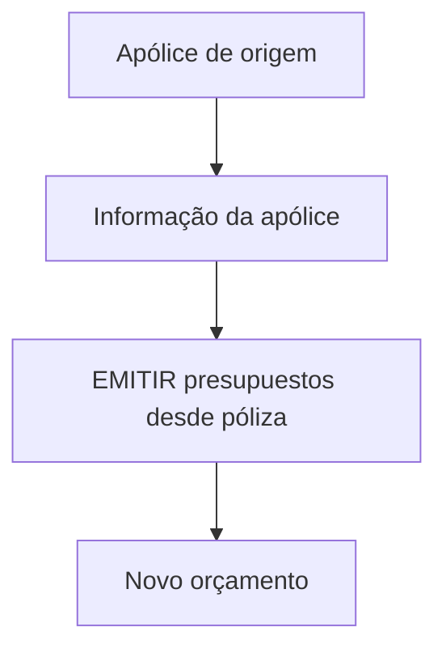

# Documentação de Operação de Emissão (Saúde) — Orçamento

## 1. Metadados do Documento
- **Arquivo de Origem:** Não identificado no conteúdo fornecido
- **Tipo de Documento:** Manual Operacional
- **Domínio / Sistema:** Emissão de seguros de Saúde — Orçamento
- **Público-Alvo:** Operação, Negócio e utilizadores das APIs/documentação
- **Data/Versão Identificada:** Não identificada

---

## 2. Resumo Executivo & Contexto de Negócio

O documento descreve operações de emissão relacionadas a orçamentos no domínio de seguros de Saúde. O conceito de **orçamento** é apresentado como uma operação associada a um possível risco segurável.

A operação **COTIZAR póliza** permite oferecer diferentes opções de seguro, incluindo respetivo custo e diferentes alternativas de fracionamento de pagamento. O conteúdo não detalha regras de cálculo, critérios de elegibilidade, entradas, saídas ou contratos técnicos dessa operação.

A operação **EMITIR presupuesto** gera uma proposição de seguro para um ou vários riscos. O documento também prevê modalidades de emissão baseadas em contextos anteriores: retomada de uma operação suspensa, reutilização de outro orçamento e utilização de uma apólice como origem.

O material faz referência a documentação acessível por meio de links identificados genericamente como “Accede al documento”. Os respetivos URLs, conteúdos vinculados, APIs, métodos HTTP, autenticação e contratos de integração não estão presentes no texto fornecido.

---

## 3. Arquitetura, Componentes & Tecnologias Envolvidas

O documento não apresenta arquitetura técnica, tecnologias, microsserviços, bancos de dados, servidores, ambientes, protocolos ou contratos de API.

Os componentes funcionais identificados são:

- **Orçamento / Presupuesto:** operação relacionada ao seguro de um possível risco.
- **COTIZAR póliza:** cotação que disponibiliza opções de seguro, custos e formas de fracionamento de pagamento.
- **EMITIR presupuesto:** geração de uma proposição de seguro para um ou vários riscos.
- **EMITIR presupuesto desde suspensión:** emissão de orçamento a partir da retomada de uma operação previamente suspensa.
- **EMITIR presupuesto desde presupuesto:** emissão de um novo orçamento usando outro orçamento como base.
- **EMITIR presupuestos desde póliza:** emissão de orçamento usando uma apólice como base.



> **Nota de Análise:** O documento não detalha como as operações se integram entre si, nem identifica sistemas, APIs, tecnologias ou responsabilidades técnicas.

---

## 4. Regras de Negócio, Especificações Funcionais & Processos

### 4.1. Conceito de orçamento

O documento define **PRESUPUESTO** como operações relacionadas com o seguro de um possível risco.

### 4.2. Cotação de apólice

A operação **COTIZAR póliza** deve:

1. Oferecer diferentes opções de seguro.
2. Apresentar o custo associado às opções de seguro.
3. Disponibilizar diferentes opções de fracionamento de pagamento.

> **Nota de Análise:** Não são informadas regras de precificação, critérios de risco, produtos disponíveis, periodicidades de pagamento ou condições para disponibilização das opções.

### 4.3. Emissão de orçamento

A operação **EMITIR presupuesto** consiste em gerar uma proposição de seguro para um ou vários riscos.

> **Nota de Análise:** O documento não especifica os dados obrigatórios para emissão, estados do orçamento, validações aplicáveis ou o formato da proposição gerada.

### 4.4. Emissão de orçamento a partir de suspensão

A operação **EMITIR presupuesto desde suspensión** corresponde à operação **EMITIR presupuesto** após a retomada de uma operação que havia sido previamente suspensa.

Fluxo funcional identificado:



> **Nota de Análise:** O motivo da suspensão, os critérios de retomada e os dados preservados durante a suspensão não são detalhados.

### 4.5. Emissão de orçamento a partir de outro orçamento

A operação **EMITIR presupuesto desde presupuesto** consiste em emitir um orçamento usando como origem a informação de outro orçamento. O orçamento de origem serve como base para gerar o novo orçamento.

Fluxo funcional identificado:



> **Nota de Análise:** O documento não informa quais informações do orçamento de origem são reutilizadas, alteradas, recalculadas ou validadas.

### 4.6. Emissão de orçamento a partir de apólice

A operação **EMITIR presupuestos desde póliza** permite emitir um orçamento tomando como origem a informação de uma apólice. A apólice serve como base para gerar o novo orçamento.

Fluxo funcional identificado:



> **Nota de Análise:** O documento não detalha critérios para selecionar a apólice, restrições de reutilização, regras de vigência ou alterações permitidas no novo orçamento.

---

## 5. Tabelas de Parâmetros, Ambientes e Estruturas de Dados

| Item / Parâmetro | Descrição / Função | Tipo / Valores / Formato | Ambiente / Observações |
| :--- | :--- | :--- | :--- |
| PRESUPUESTO | Operações relacionadas com o seguro de um possível risco | Conceito funcional | Sem detalhamento técnico |
| COTIZAR póliza | Oferece opções de seguro, custo e opções de fracionamento de pagamento | Operação funcional | Há referência a “Accede al documento”; URL não fornecida |
| EMITIR presupuesto | Gera uma proposição de seguro para um ou vários riscos | Operação funcional | Há referência a “Accede al documento”; URL não fornecida |
| EMITIR presupuesto desde suspensión | Emite orçamento após retomada de operação previamente suspensa | Operação funcional | Sem detalhamento de estados ou regras de retomada |
| EMITIR presupuesto desde presupuesto | Emite orçamento a partir da informação de outro orçamento | Operação funcional | O orçamento de origem é a base do novo orçamento |
| EMITIR presupuestos desde póliza | Emite orçamento a partir da informação de uma apólice | Operação funcional | A apólice de origem é a base do novo orçamento |
| Fraccionamiento de pago | Alternativas de fracionamento do pagamento | Não especificado | Mencionado apenas na operação COTIZAR póliza |
| Riesgo | Elemento para o qual é gerada uma proposição de seguro | Um ou vários riscos | Não há estrutura de dados informada |
| Zeus | Item visível na navegação do documento | Não especificado | Sem explicação funcional ou técnica |

---

## 6. Bateria de Perguntas & Respostas para RAG (FAQ Sintético)

### P1: Qual é o objetivo da operação PRESUPUESTO no contexto de seguros de Saúde?
**R:** PRESUPUESTO corresponde a operações relacionadas com o seguro de um possível risco. O documento apresenta operações de cotação e emissão de orçamentos no domínio de seguros de Saúde.

### P2: O que a operação COTIZAR póliza oferece ao utilizador?
**R:** A operação COTIZAR póliza oferece diferentes opções de seguro, o custo associado a essas opções e diferentes opções de fracionamento de pagamento.

### P3: O documento informa como o custo da apólice é calculado?
**R:** Não. O documento afirma que COTIZAR póliza apresenta o custo das opções de seguro, mas não detalha fórmulas de cálculo, fatores de risco, tarifas ou regras de precificação.

### P4: O que é gerado pela operação EMITIR presupuesto?
**R:** EMITIR presupuesto gera uma proposição de seguro para um ou vários riscos.

### P5: Em que situação deve ser usada a operação EMITIR presupuesto desde suspensión?
**R:** EMITIR presupuesto desde suspensión deve ser usada quando uma operação previamente suspensa é retomada. Essa modalidade corresponde à emissão de orçamento após a retomada da operação suspensa.

### P6: Como funciona EMITIR presupuesto desde presupuesto?
**R:** EMITIR presupuesto desde presupuesto gera um novo orçamento usando como origem a informação de outro orçamento. O orçamento anterior serve como base para a geração do novo orçamento.

### P7: Qual é a origem dos dados em EMITIR presupuestos desde póliza?
**R:** EMITIR presupuestos desde póliza usa a informação de uma apólice como origem. A apólice serve como base para a geração de um novo orçamento.

### P8: O documento define quais dados de um orçamento anterior são reutilizados na emissão de um novo orçamento?
**R:** Não. O documento apenas informa que a informação de outro orçamento serve como base para gerar o novo orçamento; não especifica campos reutilizados, campos obrigatórios, alterações permitidas ou validações.

### P9: O documento disponibiliza URLs ou contratos das operações mencionadas?
**R:** Não. O texto contém referências genéricas “Accede al documento”, mas não apresenta URLs, endpoints, métodos HTTP, autenticação, payloads JSON ou respostas.

### P10: Quais operações de emissão de orçamento são identificadas no documento?
**R:** O documento identifica EMITIR presupuesto, EMITIR presupuesto desde suspensión, EMITIR presupuesto desde presupuesto e EMITIR presupuestos desde póliza.

---

## 7. Glossário de Termos, Siglas & Conceitos-Chave

- **COTIZAR póliza:** Operação de cotação que oferece opções de seguro, custos e alternativas de fracionamento de pagamento.
- **EMITIR presupuesto:** Operação que gera uma proposição de seguro para um ou vários riscos.
- **EMITIR presupuesto desde suspensión:** Emissão de orçamento após a retomada de uma operação previamente suspensa.
- **EMITIR presupuesto desde presupuesto:** Emissão de um novo orçamento a partir da informação de outro orçamento.
- **EMITIR presupuestos desde póliza:** Emissão de orçamento a partir da informação de uma apólice.
- **Póliza:** Apólice de seguro; no documento, pode servir como base para gerar um novo orçamento.
- **Presupuesto:** Orçamento relacionado ao seguro de um possível risco.
- **Proposición de seguro:** Resultado gerado por EMITIR presupuesto para um ou vários riscos.
- **Riesgo:** Risco potencial associado à operação de seguro.
- **Fraccionamiento de pago:** Opções de fracionamento de pagamento.
- **Zeus:** Termo exibido na navegação do conteúdo, sem definição adicional no documento.

---

## 8. Notas Críticas, Riscos & Limitações

- O conteúdo fornecido não identifica o arquivo de origem, versão, data, autor ou proprietário do documento.
- Não há URLs, endpoints, métodos HTTP, contratos de API, modelos de dados, autenticação ou códigos de erro.
- Não há arquitetura de software, ambientes, servidores, tecnologias, dependências ou informações de observabilidade.
- Não são apresentadas regras de precificação, validações de negócio, critérios de elegibilidade, estados formais de orçamento ou transições de estado.
- As referências “Accede al documento” indicam documentação adicional, mas o texto não contém os respetivos destinos ou conteúdos.
- O termo **Zeus** aparece na navegação, porém não possui explicação funcional ou técnica.
- A expressão “EMITIR presupuestos desde póliza” é reproduzida conforme apresentada no documento; não há detalhamento para determinar se a pluralização representa uma distinção funcional.

---

## 9. Conteúdo Bruto Estruturado (Referência Fiel)

```text
--- [PÁGINA 1 DE 2] ---

DOCUMENTACIÓN de OPERACIÓN de
EMISIÓN (Salud) - PRESUPUESTO
PRESUPUESTO
Operaciones relacionadas con los de seguro de un posible riesgo
COTIZAR póliza
Ofrecer distintas opciones de un seguro junto
con su coste y diferentes opciones de
fraccionamiento de pago
 Accede al documento
EMITIR presupuesto
Generar una proposición de seguro de uno
varios riesgos
 Accede al documento
EMITIR presupuesto desde suspensión
Es la operación EMITIR presupuesto,
habiendo retomado la operación que había
sido previamente suspendida
EMITIR presupuesto desde presupuesto
Consiste en EMITIR presupuesto tomando
como origen la información de otro
 / 
 RS
Inicio Soluciones APIs Documentación Zeus
ES


--- [PÁGINA 2 DE 2] ---

Accede al documento
 presupuesto que sirve como base para la
generación del nuevo presupuesto
 Accede al documento
EMITIR presupuestos desde póliza
Permite EMITIR presupuesto tomando como
origen la información de una póliza que sire
como base para la generación del nuevo
presupuesto
 Accede al documento
```
