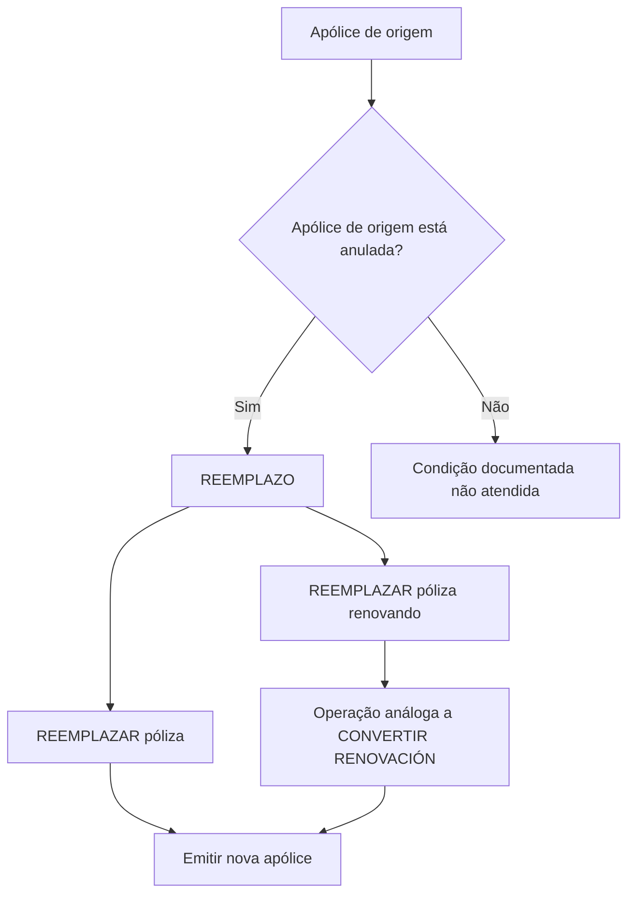

# Documentação de Operação de Emissão (Saúde) — Reemplazo

## 1. Metadados do Documento
- **Arquivo de Origem:** Não identificado no conteúdo fornecido
- **Tipo de Documento:** Manual Operacional
- **Domínio / Sistema:** Emissão de apólices de Saúde; Documentação Zeus
- **Público-Alvo:** Operação, Negócio e usuários responsáveis pela emissão de apólices
- **Data/Versão Identificada:** Não identificada

---

## 2. Resumo Executivo & Contexto de Negócio

O documento descreve a operação **REEMPLAZO** no contexto de emissão de apólices de Saúde. A operação permite utilizar uma apólice existente como informação de partida para a criação e emissão de uma nova apólice.

A operação **REEMPLAZAR póliza** consiste em emitir uma nova apólice tomando os dados de outra apólice como origem ou base. O documento estabelece como condição explícita que a apólice utilizada como base esteja anulada.

O documento também apresenta a modalidade **REEMPLAZAR póliza renovando**, descrita como uma operação análoga a **CONVERTIR RENOVACIÓN**. Nessa modalidade, a apólice de origem também deve estar anulada.

O conteúdo disponibilizado é resumido e aponta para documentos complementares por meio da indicação “Accede al documento”. Entretanto, os destinos desses documentos, URLs, regras detalhadas, telas, métodos, contratos ou fluxos operacionais não foram fornecidos.

---

## 3. Arquitetura, Componentes & Tecnologias Envolvidas

Os elementos explicitamente citados são:

- **Emissão (Salud):** contexto funcional da emissão de apólices de Saúde.
- **REEMPLAZO:** operação que usa uma apólice anterior como base para emitir uma nova apólice.
- **REEMPLAZAR póliza:** modalidade de emissão baseada em uma apólice anulada.
- **REEMPLAZAR póliza renovando:** modalidade análoga a CONVERTIR RENOVACIÓN e baseada em uma apólice anulada.
- **CONVERTIR RENOVACIÓN:** operação mencionada como análoga à modalidade de reemplazo com renovação.
- **Documentación Zeus:** área ou sistema de documentação mencionada na navegação.
- **Soluciones APIs:** item de navegação citado, sem detalhamento de integração, APIs ou contratos.



> **Nota de Análise:** O documento não detalha sistemas transacionais, APIs, métodos HTTP, contratos JSON, persistência de dados, ambientes, autenticação ou integrações técnicas.

---

## 4. Regras de Negócio, Especificações Funcionais & Processos

### Regra de negócio: uso de apólice como origem

A operação **REEMPLAZO** permite tomar uma apólice como informação de partida para criar uma nova apólice.

### Regra de negócio: emissão por reemplazo

A operação **REEMPLAZAR póliza** consiste em emitir uma apólice utilizando como origem as informações de outra apólice que serve como base para a geração da nova apólice.

### Condição obrigatória da apólice de origem

A apólice utilizada como base para a geração da nova apólice deve estar **anulada**.

### Regra de negócio: reemplazo renovando

A operação **REEMPLAZAR póliza renovando** é descrita como análoga à operação **CONVERTIR RENOVACIÓN**.

### Condição obrigatória para reemplazo renovando

Na operação **REEMPLAZAR póliza renovando**, a apólice que serve como base também deve estar **anulada**.

### Fluxo funcional identificado

1. Identificar uma apólice que será utilizada como base.
2. Verificar se a apólice de origem está anulada.
3. Selecionar uma modalidade de reemplazo:
   - **REEMPLAZAR póliza**; ou
   - **REEMPLAZAR póliza renovando**.
4. Emitir uma nova apólice com base na apólice anulada.
5. Para a modalidade renovando, aplicar a lógica análoga a **CONVERTIR RENOVACIÓN**, sem detalhes adicionais disponíveis no conteúdo fornecido.

> **Nota de Análise:** O documento não especifica quais campos da apólice de origem são copiados, modificados, recalculados ou obrigatórios durante a emissão da nova apólice.

---

## 5. Tabelas de Parâmetros, Ambientes e Estruturas de Dados

| Item / Parâmetro | Descrição / Função | Tipo / Valores / Formato | Ambiente / Observações |
| :--- | :--- | :--- | :--- |
| REEMPLAZO | Operação que permite usar uma apólice como informação inicial para criar uma nova apólice. | Operação de emissão | Contexto de Emissão (Salud). |
| REEMPLAZAR póliza | Emissão de uma nova apólice com origem em outra apólice. | Modalidade de REEMPLAZO | A apólice-base deve estar anulada. |
| REEMPLAZAR póliza renovando | Modalidade de reemplazo análoga a CONVERTIR RENOVACIÓN. | Modalidade de REEMPLAZO | A apólice-base deve estar anulada. |
| Apólice de origem / base | Apólice cujas informações são utilizadas para gerar uma nova apólice. | Apólice | Deve estar anulada nas duas modalidades documentadas. |
| CONVERTIR RENOVACIÓN | Operação usada como referência de analogia para “REEMPLAZAR póliza renovando”. | Operação | Não há detalhamento adicional. |
| Accede al documento | Indicação de acesso a documentação complementar. | Referência de navegação | Destino, URL e conteúdo complementar não fornecidos. |
| Soluciones APIs | Item de navegação exibido no conteúdo. | Navegação / possível área de documentação | Não há APIs ou especificações técnicas detalhadas. |
| Documentación Zeus | Item de navegação exibido no conteúdo. | Navegação / possível área de documentação | Não há detalhes sobre a plataforma Zeus. |
| Idioma | Identificador exibido na navegação. | `ES` | O conteúdo original está em espanhol. |

---

## 6. Bateria de Perguntas & Respostas para RAG (FAQ Sintético)

### P1: O que é a operação REEMPLAZO no contexto de Emissão de Saúde?
**R:** REEMPLAZO é uma operação que permite usar uma apólice existente como informação de partida para criar e emitir uma nova apólice no contexto de Emissão (Salud).

### P2: Qual é a condição obrigatória para uma apólice ser usada em REEMPLAZAR póliza?
**R:** A apólice que serve como base para a operação REEMPLAZAR póliza deve estar anulada.

### P3: O que acontece na operação REEMPLAZAR póliza?
**R:** A operação REEMPLAZAR póliza emite uma nova apólice tomando como origem as informações de outra apólice utilizada como base. O documento determina que a apólice-base esteja anulada.

### P4: O que é REEMPLAZAR póliza renovando?
**R:** REEMPLAZAR póliza renovando é uma modalidade de reemplazo descrita como análoga à operação CONVERTIR RENOVACIÓN. A apólice utilizada como base também deve estar anulada.

### P5: A operação REEMPLAZAR póliza renovando pode usar uma apólice não anulada?
**R:** Não. O documento afirma que, para REEMPLAZAR póliza renovando, a apólice que serve como base deve estar anulada.

### P6: Qual é a relação entre REEMPLAZAR póliza renovando e CONVERTIR RENOVACIÓN?
**R:** O documento caracteriza REEMPLAZAR póliza renovando como uma operação análoga a CONVERTIR RENOVACIÓN. Não são fornecidos detalhes adicionais sobre o comportamento dessa analogia.

### P7: Quais informações da apólice-base são reaproveitadas na nova apólice?
**R:** O documento afirma apenas que a apólice-base fornece informações de partida para a geração da nova apólice. O conteúdo não especifica quais campos, dados, coberturas ou atributos são copiados ou transformados.

### P8: O documento especifica APIs para executar a operação REEMPLAZO?
**R:** Não. Embora “Soluciones APIs” apareça na navegação, o conteúdo fornecido não descreve APIs, endpoints, métodos HTTP, autenticação, payloads ou contratos de integração.

### P9: Existem URLs para os documentos complementares indicados por “Accede al documento”?
**R:** Não. O texto apresenta a indicação “Accede al documento”, mas não contém os links, URLs ou o conteúdo dos documentos complementares.

### P10: Qual domínio funcional é tratado pelo documento?
**R:** O documento trata da emissão de apólices de Saúde, especificamente das operações de reemplazo que geram uma nova apólice com base em uma apólice anterior anulada.

---

## 7. Glossário de Termos, Siglas & Conceitos-Chave

- **REEMPLAZO:** operação que permite utilizar uma apólice como informação de partida para criar uma nova apólice.
- **REEMPLAZAR póliza:** modalidade de emissão de nova apólice com base em outra apólice anulada.
- **REEMPLAZAR póliza renovando:** modalidade de reemplazo análoga a CONVERTIR RENOVACIÓN, também baseada em uma apólice anulada.
- **CONVERTIR RENOVACIÓN:** operação citada como referência para REEMPLAZAR póliza renovando; sem detalhamento adicional no conteúdo fornecido.
- **Póliza / Apólice:** entidade utilizada como base ou resultado no processo de emissão documentado.
- **Anulada:** estado obrigatório da apólice-base nas modalidades de reemplazo descritas.
- **Emisión (Salud):** contexto de emissão de apólices no domínio de Saúde.
- **Zeus:** termo presente em “Documentación Zeus”; o documento não define sua função.
- **ES:** identificador de idioma exibido na navegação, correspondente ao espanhol.

---

## 8. Notas Críticas, Riscos & Limitações

- O conteúdo fornecido contém somente uma página e apresenta regras em formato resumido.
- A condição de anulação da apólice-base é explicitamente obrigatória para as duas modalidades de reemplazo apresentadas.
- Não há detalhamento dos critérios para anulação, nem do processo para validar esse estado.
- Não são informados campos copiados da apólice-base, campos obrigatórios da nova apólice, regras de transformação, cálculos, exceções ou mensagens de erro.
- Não há URLs, referências navegáveis ou conteúdo dos documentos indicados por “Accede al documento”.
- Não há especificações de APIs, integrações, ambientes, servidores, credenciais, logs, permissões ou requisitos técnicos.
- **Nota de Análise:** O documento menciona “Soluciones APIs” e “Documentación Zeus”, mas não permite concluir que REEMPLAZO possua APIs específicas ou qualquer integração técnica com Zeus.

---

## 9. Conteúdo Bruto Estruturado (Referência Fiel)

```text
--- [PÁGINA 1 DE 1] ---

DOCUMENTACIÓN de OPERACIÓN de
EMISIÓN (Salud) - REEMPLAZO
REEMPLAZO
Distintas posibilidades que permite tomar una póliza como información
de partida para crear una nueva
REEMPLAZAR póliza
Consiste en EMITIR póliza tomando como
origen la información de otra póliza que sirve
como base para la generación de la nueva
póliza. La póliza que sirve como base debe
estar anulada
 Accede al documento
REEMPLAZAR póliza renovando
Operación análoga a CONVERTIR
RENOVACIÓN. La póliza que sirve como
base debe estar anulada
 Accede al documento
 / 
 RS
Inicio Soluciones APIs Documentación Zeus
ES
```
