# Operações de Emissão (Saúde) — Suplementos e Movimentações de Apólice

## 1. Metadados do Documento
- **Arquivo de Origem:** Não identificado no conteúdo fornecido
- **Tipo de Documento:** Manual Operacional
- **Domínio / Sistema:** Emissão de seguros de Saúde — operações de suplemento sobre apólices
- **Público-Alvo:** Operação, negócio, analistas funcionais e desenvolvedores
- **Data/Versão Identificada:** Não identificada

---

## 2. Resumo Executivo & Contexto de Negócio

O documento descreve operações de **suplemento** aplicáveis a apólices de seguros no domínio de Saúde. Os suplementos são movimentações associadas à modificação de informações existentes em uma apólice ou aplicação, incluindo alterações de dados, renovação, cancelamento, reabilitação, distribuição de pagamentos, capital segurado e vigência.

As operações documentadas podem alterar o custo do seguro, gerar cobrança ou devolução ao pagador, cancelar e regenerar recibos e comissões, ou não produzir impacto financeiro. O efeito financeiro depende do tipo de movimentação: por exemplo, alterações de apólice, extensões de vigência, restituições de capital e determinadas reabilitações podem afetar o custo; a alteração de agente e a redução de capital por sinistro são explicitamente descritas como operações sem impacto no custo do seguro.

O processo operacional contempla cenários de ciclo de vida completos da apólice: alteração, alteração temporária, alteração de anualidade anterior, pré-renovação, renovação efetiva, renovação baseada em pré-renovação, cancelamento, reabilitação e extinção de risco. Também contempla a continuidade de operações previamente suspensas, tanto para alteração quanto para renovação.

O conteúdo fornecido é uma visão catalogada das operações e de seus efeitos. Não há detalhamento de contratos de API, métodos HTTP, telas, identificadores técnicos, regras de cálculo de prêmio, modelos de dados, permissões, URLs de acesso ou integrações entre sistemas.

---

## 3. Arquitetura, Componentes & Tecnologias Envolvidas

O documento não identifica tecnologias, microsserviços, servidores, APIs, bancos de dados, ambientes ou ferramentas de desenvolvimento. São citadas referências de navegação e documentação: **Inicio**, **Soluciones**, **APIs**, **Documentación Zeus**, **RS** e **ES**.

A estrutura funcional identificada é centrada na apólice e em suas movimentações de suplemento.

```mermaid
graph TD
    A[Apólice de Saúde] --> B[Operações de suplemento]

    B --> C[Alterações]
    C --> C1[ALTERAR póliza]
    C --> C2[ALTERAR póliza temporalmente]
    C --> C3[ALTERAR póliza anualidad anterior]
    C --> C4[ALTERAR póliza plan pago]
    C --> C5[ALTERAR póliza cambio agente]
    C --> C6[ALTERAR póliza desde suspensión]

    B --> D[Capital e sinistro]
    D --> D1[DISMINUIR póliza por siniestro]
    D --> D2[RESTITUIR póliza capital]

    B --> E[Vigência e regularização]
    E --> E1[EXTENDER póliza vigencia]
    E --> E2[REGULARIZAR póliza]
    E --> E3[LIQUIDAR póliza]

    B --> F[Renovação]
    F --> F1[PRERENOVAR póliza]
    F --> F2[RENOVAR póliza]
    F --> F3[RENOVAR póliza desde prerenovación]
    F --> F4[RENOVAR póliza desde suspensión]
    F --> F5[CONVERTIR RENOVACIÓN]

    B --> G[Anulação]
    G --> G1[ANULAR póliza modificación]
    G --> G2[ANULAR póliza modificación temporal]
    G --> G3[ANULAR póliza modificación anualidad anterior]
    G --> G4[ANULAR póliza]
    G --> G5[ANULAR póliza extinción riesgo]

    B --> H[Reabilitação]
    H --> H1[REHABILITAR póliza]
    H --> H2[REHABILITAR póliza extensión vigencia]
    H --> H3[REHABILITAR póliza sin extensión vigencia]
    H --> H4[REHABILITAR póliza modificando cualquier dato]
```



> **Nota de Análise:** O documento não detalha relações técnicas, sequência obrigatória entre todas as operações, interfaces de integração ou contratos de dados. O diagrama representa apenas a organização funcional inferida dos nomes e descrições apresentadas.

---

## 4. Regras de Negócio, Especificações Funcionais & Processos

### 4.1 Alterações de apólice

1. **ALTERAR póliza**
   - Permite modificar a maior parte das informações da apólice.
   - Informações não permitidas nesse suplemento devem ser alteradas por outros suplementos.
   - Mudanças identificadas podem afetar o custo do seguro.
   - A alteração pode provocar cobrança ou devolução ao pagador do seguro.

2. **ALTERAR póliza desde suspensión**
   - Executa a operação `ALTERAR póliza` após a retomada de uma operação previamente suspensa.

3. **ALTERAR póliza temporalmente**
   - Executa uma operação `ALTERAR póliza` com vencimento anterior ao vencimento da apólice.
   - Caracteriza um suplemento temporário.

4. **ALTERAR póliza anualidad anterior**
   - Permite modificar a apólice em data anterior à última renovação vigente realizada.
   - Pode afetar o custo do seguro.

5. **ALTERAR póliza plan pago**
   - Cancela um ou vários recibos pendentes.
   - Usa o importe resultante para executar uma nova distribuição de recibos.
   - Refraciona o pagamento.

6. **ALTERAR póliza cambio agente**
   - Cancela comissões e recibos existentes.
   - Regenera comissões e recibos para um novo agente.
   - Não afeta o custo do seguro.

### 4.2 Operações relacionadas a sinistro e capital segurado

1. **DISMINUIR póliza por siniestro**
   - Reduz a soma segurada de uma ou mais coberturas afetadas na tramitação de um sinistro.
   - A redução coincide com a liquidação efetuada na tramitação do sinistro.
   - Não afeta o custo do seguro.

2. **RESTITUIR póliza capital**
   - Restitui a soma segurada anteriormente reduzida pela tramitação de um sinistro.
   - A restituição afeta o custo do seguro.

### 4.3 Vigência, anualidade e regularização

1. **EXTENDER póliza vigencia**
   - Altera o vencimento da apólice para uma data posterior ao vencimento original.
   - A alteração afeta o custo do seguro.

2. **REGULARIZAR póliza**
   - Modifica a apólice com efeito sobre a anualidade anterior, isto é, o período anterior à última renovação vigente.
   - Tem a particularidade de que o suplemento não possui cancelamento.
   - É normal que afete o custo do seguro.

3. **LIQUIDAR póliza**
   - Regulariza a situação quando houve cobrança antecipada de prêmio.
   - Um exemplo citado é a existência de prêmio em depósito por parte do pagador.
   - Pode implicar aumento ou redução do custo do seguro.

### 4.4 Pré-renovação e renovação

1. **PRERENOVAR póliza**
   - Realiza uma renovação aplicando todos os critérios para determinar o custo do seguro no novo período da apólice.
   - A operação é registrada de forma virtual.
   - O movimento não é real.

2. **RENOVAR póliza**
   - Realiza a renovação real da apólice.
   - Determina condições e custo do seguro para um novo período de vigência.

3. **RENOVAR póliza desde prerenovación**
   - Executa `RENOVAR póliza` usando como base a renovação prévia.
   - Utiliza as informações geradas por `PRERENOVAR póliza` para renovar a apólice.

4. **RENOVAR póliza desde suspensión**
   - Executa `RENOVAR póliza` após a retomada de uma operação previamente suspensa.

5. **CONVERTIR RENOVACIÓN (cargas en el sistema, renovando)**
   - Executa a operação `RENOVAR póliza`.
   - A origem das informações não é uma apólice da carteira.
   - A informação parte de uma migração proveniente de outro sistema.
   - Com os dados migrados, produz uma renovação de apólice.

### 4.5 Anulação de movimentações e cancelamento

1. **ANULAR póliza modificación**
   - Anula o último suplemento vigente executado sobre a apólice.
   - Desfaz a última modificação sofrida pela apólice.
   - Pode afetar o custo do seguro.

2. **ANULAR póliza modificación temporal**
   - É análoga a `ANULAR póliza modificación`.
   - Anula o último suplemento temporário vigente.

3. **ANULAR póliza modificación anualidad anterior**
   - É análoga a `ANULAR póliza modificación`.
   - Tem origem em um suplemento realizado na anualidade anterior.
   - Anula um movimento gerado por `ALTERAR póliza anualidad anterior`.
   - Pode afetar o importe do seguro.

4. **ANULAR póliza**
   - Executa o cancelamento da apólice.
   - Pode gerar um importe a devolver ao pagador.

5. **ANULAR póliza extinción riesgo**
   - É aplicado quando o risco sofre dano tal que deixa de existir.
   - O documento cita sinistro total como exemplo.
   - Não implica devolução de custo.

### 4.6 Reabilitação de apólice

1. **REHABILITAR póliza**
   - Anula um cancelamento de apólice.
   - A apólice volta a vigorar na situação anterior à anulação.
   - A reabilitação é efetiva no mesmo dia em que a apólice foi anulada.

2. **REHABILITAR póliza extensión vigencia**
   - É análoga a `REHABILITAR póliza`.
   - A data de reabilitação é posterior à data de anulação da apólice.
   - A diferença de datas implica extensão da apólice.
   - O vencimento é deslocado pelo mesmo período em que a apólice permaneceu anulada.
   - Não gera custo adicional do seguro.

3. **REHABILITAR póliza sin extensión vigencia**
   - É análoga a `REHABILITAR póliza extensión vigencia`.
   - O período em que a apólice ficou anulada gera redução de custo no momento da reabilitação.

4. **REHABILITAR póliza modificando cualquier dato**
   - É análoga a `REHABILITAR póliza`.
   - Permite modificar qualquer informação da apólice.

---

## 5. Tabelas de Parâmetros, Ambientes e Estruturas de Dados

| Item / Parâmetro | Descrição / Função | Tipo / Valores / Formato | Ambiente / Observações |
| :--- | :--- | :--- | :--- |
| ALTERAR póliza | Modifica a maior parte das informações da apólice. | Operação de suplemento | Pode gerar cobrança ou devolução; pode afetar o custo do seguro. |
| ALTERAR póliza desde suspensión | Retoma uma alteração previamente suspensa. | Operação de suplemento | Executa `ALTERAR póliza` após retomada. |
| ALTERAR póliza temporalmente | Altera apólice com vencimento anterior ao vencimento da apólice. | Suplemento temporário | Caracteriza alteração temporária. |
| ALTERAR póliza anualidad anterior | Altera apólice em data anterior à última renovação vigente. | Operação de suplemento | Pode afetar o custo do seguro. |
| ALTERAR póliza plan pago | Cancela recibos pendentes e redistribui seus importes. | Operação de pagamento | Refraciona o pagamento. |
| ALTERAR póliza cambio agente | Cancela e regenera comissões e recibos para novo agente. | Operação de alteração | Não afeta o custo do seguro. |
| DISMINUIR póliza por siniestro | Reduz a soma segurada de coberturas afetadas por sinistro. | Operação sobre capital segurado | Redução coincide com a liquidação; não afeta custo. |
| RESTITUIR póliza capital | Restitui soma segurada reduzida por sinistro. | Operação sobre capital segurado | Afeta o custo do seguro. |
| EXTENDER póliza vigencia | Move o vencimento para data posterior ao vencimento original. | Operação de vigência | Afeta o custo do seguro. |
| REGULARIZAR póliza | Modifica a apólice na anualidade anterior. | Operação de regularização | Não possui cancelamento; normalmente afeta o custo. |
| LIQUIDAR póliza | Regulariza situação com cobrança antecipada de prêmio. | Operação de liquidação | Pode aumentar ou reduzir o custo do seguro. |
| PRERENOVAR póliza | Determina virtualmente as condições e o custo do novo período. | Operação de pré-renovação | Movimento virtual; não é real. |
| RENOVAR póliza | Efetiva renovação da apólice. | Operação de renovação | Determina condições e custo para novo período. |
| RENOVAR póliza desde prerenovación | Renova a partir de informações da pré-renovação. | Operação de renovação | Usa dados de `PRERENOVAR póliza`. |
| RENOVAR póliza desde suspensión | Renova após retomada de operação suspensa. | Operação de renovação | Executa `RENOVAR póliza`. |
| CONVERTIR RENOVACIÓN | Renova com informações migradas de outro sistema. | Operação de renovação por migração | Dados não se originam de apólice da carteira. |
| ANULAR póliza modificación | Anula o último suplemento vigente. | Operação de anulação | Pode afetar custo do seguro. |
| ANULAR póliza modificación temporal | Anula o último suplemento temporário vigente. | Operação de anulação | Análoga à anulação de modificação. |
| ANULAR póliza modificación anualidad anterior | Anula movimento de alteração da anualidade anterior. | Operação de anulação | Pode afetar o importe do seguro. |
| ANULAR póliza | Cancela a apólice. | Operação de cancelamento | Pode gerar devolução ao pagador. |
| ANULAR póliza extinción riesgo | Cancela em razão da extinção do risco. | Operação de cancelamento | Não implica devolução de custo. |
| REHABILITAR póliza | Anula o cancelamento e reativa a apólice. | Operação de reabilitação | Efetiva no mesmo dia da anulação. |
| REHABILITAR póliza extensión vigencia | Reabilita após a data de anulação e estende a vigência. | Operação de reabilitação | Não gera custo adicional. |
| REHABILITAR póliza sin extensión vigencia | Reabilita sem extensão de vigência. | Operação de reabilitação | Período anulado gera redução de custo. |
| REHABILITAR póliza modificando cualquier dato | Reabilita permitindo alteração de qualquer informação. | Operação de reabilitação | Análoga a `REHABILITAR póliza`. |

> **Nota de Análise:** O conteúdo não apresenta parâmetros técnicos, tipos de dados, identificadores de campos, servidores, ambientes, URLs de API, rotas de logs ou estruturas JSON.

---

## 6. Bateria de Perguntas & Respostas para RAG (FAQ Sintético)

### P1: Qual operação permite modificar a maior parte das informações de uma apólice?
**R:** A operação `ALTERAR póliza` permite modificar a maior parte das informações da apólice. Informações não permitidas nesse suplemento devem ser modificadas mediante outros suplementos. A operação pode afetar o custo do seguro e provocar cobrança ou devolução ao pagador.

### P2: Como funciona a alteração temporária de uma apólice?
**R:** `ALTERAR póliza temporalmente` realiza uma operação `ALTERAR póliza` cujo vencimento é anterior ao vencimento da apólice. O documento classifica essa movimentação como um suplemento temporário.

### P3: Qual é a diferença entre PRERENOVAR póliza e RENOVAR póliza?
**R:** `PRERENOVAR póliza` aplica os critérios para determinar o custo do seguro no novo período, mas registra o resultado de forma virtual, sem movimento real. `RENOVAR póliza` efetiva a renovação real, determinando as condições e o custo do seguro para um novo período de vigência.

### P4: Como renovar uma apólice usando dados de uma pré-renovação?
**R:** Deve-se utilizar `RENOVAR póliza desde prerenovación`. Essa operação realiza a renovação usando a informação gerada anteriormente por `PRERENOVAR póliza`.

### P5: O que ocorre em ALTERAR póliza cambio agente?
**R:** A operação cancela as comissões e os recibos existentes e regenera comissões e recibos para um novo agente. O documento informa explicitamente que a alteração de agente não afeta o custo do seguro.

### P6: Qual suplemento deve ser usado para reduzir a soma segurada após um sinistro?
**R:** `DISMINUIR póliza por siniestro` reduz a soma segurada de uma ou mais coberturas afetadas na tramitação de um sinistro. A redução coincide com a liquidação realizada nessa tramitação e não afeta o custo do seguro.

### P7: Como restaurar capital segurado previamente reduzido por sinistro?
**R:** A operação `RESTITUIR póliza capital` restitui a soma segurada que foi reduzida pela tramitação de um sinistro. O documento informa que essa restituição afeta o custo do seguro.

### P8: Qual operação anula o último suplemento vigente realizado sobre a apólice?
**R:** `ANULAR póliza modificación` anula o último suplemento vigente realizado sobre a apólice, desfazendo a última modificação que a apólice sofreu. Essa anulação pode afetar o custo do seguro.

### P9: Quando ANULAR póliza extinción riesgo deve ser utilizada?
**R:** `ANULAR póliza extinción riesgo` é utilizada quando o risco sofreu dano tal que deixa de existir, como no exemplo de um sinistro total. O documento estabelece que essa operação não implica devolução de custo.

### P10: Qual é o efeito financeiro da reabilitação com extensão de vigência?
**R:** `REHABILITAR póliza extensión vigencia` reabilita a apólice em data posterior à anulação e desloca o vencimento pelo período em que a apólice permaneceu anulada. Apesar da extensão, a operação não gera custo adicional do seguro.

### P11: Como funciona a reabilitação sem extensão de vigência?
**R:** `REHABILITAR póliza sin extensión vigencia` é análoga à reabilitação com extensão de vigência, mas o período em que a apólice esteve anulada gera uma redução de custo no momento da reabilitação.

### P12: Qual é a finalidade de LIQUIDAR póliza?
**R:** `LIQUIDAR póliza` regulariza a situação em que houve cobrança antecipada de prêmio, como uma prima em depósito por parte do pagador. O suplemento pode resultar em aumento ou redução do custo do seguro.

### P13: O que diferencia CONVERTIR RENOVACIÓN de uma renovação comum?
**R:** `CONVERTIR RENOVACIÓN` realiza uma operação de renovação, mas a informação não parte de uma apólice da carteira. A origem é uma migração proveniente de outro sistema, e os dados migrados são usados para produzir a renovação da apólice.

---

## 7. Glossário de Termos, Siglas & Conceitos-Chave

- **Apólice / Póliza:** Contrato de seguro sobre o qual são executadas as operações documentadas.
- **Anualidade anterior / Anualidad anterior:** Período anterior à última renovação vigente da apólice.
- **Cobertura / Cobertura:** Elemento segurado cuja soma segurada pode ser reduzida em decorrência de sinistro.
- **Custo do seguro / Coste del seguro:** Valor afetado por determinadas operações de suplemento, conforme indicado no documento.
- **Extinção de risco / Extinción riesgo:** Situação em que o risco deixa de existir devido a dano, sendo citado o sinistro total como exemplo.
- **Pagador / Pagador:** Parte que pode receber cobrança ou devolução relacionada ao custo ou ao cancelamento da apólice.
- **Prêmio / Prima:** Valor de seguro; o documento cita prêmio em depósito como exemplo de cobrança antecipada.
- **Pré-renovação / Prerenovación:** Renovação virtual utilizada para determinar condições e custo de um novo período, sem movimento real.
- **Recibo / Recibo:** Registro de pagamento que pode ser cancelado, redistribuído ou regenerado em determinadas operações.
- **Reabilitação / Rehabilitar:** Anulação de uma cancelamento de apólice, restaurando sua vigência sob regras específicas.
- **Renovação / Renovar:** Operação real que determina condições e custo para novo período de vigência.
- **Sinistro / Siniestro:** Evento cuja tramitação pode resultar em liquidação e redução de soma segurada.
- **Soma segurada / Suma asegurada:** Capital associado a coberturas da apólice, sujeito a redução ou restituição.
- **Suplemento / Suplemento:** Operação relacionada à modificação de informações de uma apólice ou aplicação.

---

## 8. Notas Críticas, Riscos & Limitações

- O documento não identifica o nome do arquivo original, autor, versão, data de publicação ou data de atualização.
- Não são apresentados contratos de API, métodos HTTP, payloads, modelos de dados, códigos de erro, autenticação ou mecanismos de integração.
- Não há detalhamento sobre critérios de cálculo do custo do seguro, condições de elegibilidade, validações, aprovações ou perfis de acesso.
- O documento declara que algumas operações **podem** afetar o custo, mas não especifica como o impacto é calculado.
- `REGULARIZAR póliza` é descrita como suplemento sem cancelamento; essa característica pode exigir atenção operacional por não haver mecanismo de reversão especificado no conteúdo.
- `PRERENOVAR póliza` produz um movimento virtual, enquanto `RENOVAR póliza` produz a renovação real. Processos consumidores devem distinguir explicitamente os dois estados.
- Operações iniciadas a partir de suspensão dependem da retomada de uma operação anteriormente suspensa, mas o processo de suspensão e retomada não é detalhado.
- A operação `CONVERTIR RENOVACIÓN` depende de informações migradas de outro sistema; o documento não define critérios de qualidade, mapeamento, validação ou reconciliação dos dados migrados.

---

## 9. Conteúdo Bruto Estruturado (Referência Fiel)

```text
--- [PÁGINA 1 DE 4] ---

DOCUMENTACIÓN de OPERACIÓN de
EMISIÓN (Salud) - SUPLEMENTO
SUPLEMENTO
Operaciones relacionadas con la modificación de la información que
contiene una póliza o aplicación
ALTERAR póliza
Permite la modificación de la mayor parte de
la información de la póliza. La información
que no se permite modificar en este
suplemento, se permite mediante otros
suplementos. Los cambios identificados
pueden afectar al coste del seguro,
provocando un cobro o devolución al pagador
del seguro
ALTERAR póliza desde suspensión
Consiste en realizar la operación ALTERAR
póliza, habiendo retomado la operación que
había sido previamente suspendida
 Accede al documento
 / 
 RS
Inicio Soluciones APIs Documentación Zeus
ES


--- [PÁGINA 2 DE 4] ---

Accede al documento
ALTERAR póliza temporalmente
Realiza una operación ALTERAR póliza cuyo
vencimiento es anterior al vencimiento de la
póliza. Es decir, se realiza un suplemento
temporal
 Accede al documento
ALTERAR póliza anualidad anterior
Permite realizar una modificación de la póliza,
pero a una fecha anterior a la última
renovación vigente realizada. Puede afectar al
coste del seguro
 Accede al documento
ANULAR póliza modificación
Consiste en anular el último suplemento
vigente realizado sobre la póliza. Es decir, se
"deshace" la última modificación que haya
sufrido la póliza. Puede afectar al coste del
seguro
 Accede al documento
ANULAR póliza modificación temporal
Esta operación es análoga a ANULAR póliza
modificación, pero anula el últimos
suplemento temporal vigente
 Accede al documento
ALTERAR póliza plan pago
Realiza la anulación de uno o varios recibos
pendientes y con ese importe se realiza una
nueva distribución de recibos. Es decir, se
vuelve a fraccionar el pago
 Accede al documento
ALTERAR póliza cambio agente
Realiza la anulación de las comisiones y
recibos y regenera las comisiones y recibos
para un nuevo agente. No afecta al coste del
seguro
 Accede al documento
DISMINUIR póliza por siniestro
Reduce la suma asegurada de una o varias
coberturas afectadas en la tramitación de un
siniestro. La reducción coincide con la
liquidación realizada por la tramitación. No
afecta al coste del seguro
 Accede al documento
RESTITUIR póliza capital
Restituye la suma asegurada que
previamente ha sido reducida por la
tramitación de un siniestro. La restitución
afecta al coste del seguro
 Accede al documento
EXTENDER póliza vigencia
 REGULARIZAR póliza


--- [PÁGINA 3 DE 4] ---

Altera el vencimiento de la póliza llevándolo a
una fecha posterior al vencimiento original.
Esta alteración afecta al coste del seguro
 Accede al documento
Modificación de la póliza que afecta a la
anualidad anterior. Es decir, al periodo previo
a la última renovación vigente. Tiene la
particularidad de que este suplemento no
halla la cancelación por lo que es normal que
afecte al coste del seguro
 Accede al documento
LIQUIDAR póliza
Modificación que permite regularizar la
situación cuando hubo un cobro anticipado de
prima (por ejemplo hubo una prima en
depósito por parte del pagador). Este
suplemento puede implicar un incremento o
decremento del coste del seguro
 Accede al documento
PRERENOVAR póliza
Realiza una renovación aplicando todos los
criterios con el fin de determinar cual será el
coste del seguro para el nuevo periodo de la
póliza. Tiene la salvedad que la operación se
registra de forma virtual por lo que el
movimiento no es real
 Accede al documento
RENOVAR póliza
Realiza la renovación real de la póliza. Es
decir, se determina las condiciones y el coste
del seguro para un nuevo periodo de vigencia
 Accede al documento
RENOVAR póliza desde prerenovación
Realiza la operación RENOVAR póliza, pero
la base es la renovación previa que se hizo.
Es decir, toma la información generada por la
operación PRERENOVAR póliza y renueva la
póliza
 Accede al documento
RENOVAR póliza desde suspensión
Consiste en realizar la operación RENOVAR
póliza, habiendo retomando la operación que
había sido previamente suspendida
 Accede al documento
CONVERTIR RENOVACIÓN (cargas en el
sistema, renovando)
Consiste en realizar la operación RENOVAR
póliza, salvo que el origen de la información
no es una póliza de la cartera, la información
parte de una migración de otro sistema. Es
decir, con la información migrada desde otro
sistema, se produce una renovación de póliza
 Accede al documento
ANULAR póliza modificación anualidad
anterior
ANULAR póliza


--- [PÁGINA 4 DE 4] ---

Es un movimiento análogo a ANULAR póliza
modificación, pero el origen es un suplemento
realizado a la anualidad anterior. Es decir se
anula un movimiento generado con la
peración ALTERAR póliza anualidad anterior.
Este movimiento puede afectar al importe del
seguro
 Accede al documento
Realiza la cancelación de la póliza, puede
generar un importe a devolver al pagador
 Accede al documento
ANULAR póliza extinción riesgo
Este movimiento se aplica cuando el riesgo
ha sufrido tal daño que el deja de existir
(como por ejemplo un siniestro total). Este
movimiento no implica devolución de coste
 Accede al documento
REHABILITAR póliza
Es la anulación de una cancelación de póliza.
Es decir, la póliza vuelve a estar vigente con
la situación previa a la anulación. La
Rehabilitación es efectiva el mismo día en el
que se anuló la póliza
 Accede al documento
REHABILITAR póliza extensión vigencia
Operación análoga a REHABILITAR póliza,
salvo que la fecha de rehabilitación es
posterior a la fecha de anulación de la póliza.
Este cambio en la fecha, implica una
extensión de la póliza (el vencimiento se
mueve tanto tiempo como la póliza estuvo
anulada) y no genera coste adicional del
seguro
 Accede al documento
REHABILITAR póliza sin extensión
vigencia
Análoga a la operación REHABILITAR póliza
extensión vigencia, salvo que el tiempo en el
que la póliza estuvo anulada genera una
reducción de coste a la hora de rehabilitar
 Accede al documento
REHABILITAR póliza modificando
cualquier dato
Análoga a la operación REHABILITAR póliza,
pero permite modificar cualquier información
de esta
 Accede al documento
```
