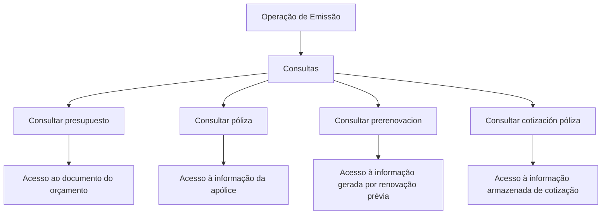

# Documentação de Operação de Emissão — Consultas Gerais

## 1. Metadados do Documento
- **Arquivo de Origem:** Não identificado
- **Tipo de Documento:** Manual Operacional
- **Domínio / Sistema:** Emissão — Consultas; documentação Zeus
- **Público-Alvo:** Operação, negócio e usuários de consulta
- **Data/Versão Identificada:** Não identificada

---

## 2. Resumo Executivo & Contexto de Negócio

O documento apresenta opções de consulta da operação de emissão, destinadas à recuperação de informações previamente armazenadas ou geradas durante processos relacionados a orçamento, apólice, pré-renovação e cotização de apólice.

As consultas descritas dependem de critérios de busca para localizar previamente o orçamento ou selecionar a apólice desejada. Após a localização ou seleção, cada opção permite acesso ao documento ou à informação correspondente.

O conteúdo evidencia quatro capacidades funcionais: consultar orçamento, consultar apólice, consultar pré-renovação e consultar cotização de apólice. O documento não descreve autenticação, URLs operacionais, contratos de API, métodos HTTP, estruturas JSON, permissões ou tecnologias de implementação.

A interface ou portal mencionado contém referências de navegação para “Inicio”, “Soluciones”, “APIs”, “Documentación” e “Zeus”, além da indicação de idioma “ES”.

---

## 3. Arquitetura, Componentes & Tecnologias Envolvidas

Os componentes e conceitos explicitamente mencionados são:

| Componente / Conceito | Papel identificado |
| :--- | :--- |
| Emisión | Contexto operacional das consultas apresentadas. |
| Consultas | Conjunto de opções de recuperação de informação. |
| Presupuesto | Documento ou informação consultável após localização por critérios de busca. |
| Póliza | Informação consultável após seleção mediante critérios de busca. |
| Prerenovacion | Informação gerada por uma renovação prévia. |
| Cotización póliza | Informação armazenada relativa a uma cotização. |
| Zeus | Nome presente na navegação da documentação. |
| APIs | Item de navegação mencionado, sem detalhamento técnico adicional. |
| Documentación | Item de navegação mencionado. |



> **Nota de Análise:** O documento não detalha arquitetura de software, integrações entre sistemas, microsserviços, banco de dados, APIs específicas ou tecnologias usadas pela operação de emissão.

---

## 4. Regras de Negócio, Especificações Funcionais & Processos

### Consultar presupuesto
1. O orçamento deve ser previamente localizado.
2. A localização do orçamento pode utilizar distintos critérios de busca.
3. Após a localização, a consulta apresenta a informação relacionada ao orçamento.
4. A funcionalidade permite acesso ao documento.

### Consultar póliza
1. A consulta permite acessar informação de uma apólice.
2. A seleção da apólice deve ser previamente facilitada por distintos critérios de busca.
3. Após a seleção, a funcionalidade permite acesso à informação da apólice.
4. A funcionalidade permite acesso ao documento.

### Consultar prerenovacion
1. A consulta facilita o acesso à informação gerada por uma renovação prévia.
2. O documento não detalha critérios de busca, regras de elegibilidade, campos apresentados ou ações disponíveis após o acesso.

### Consultar cotización póliza
1. A consulta permite acessar informação armazenada relativa a uma cotização.
2. O documento não especifica critérios de busca, status possíveis da cotização, nem o formato da informação retornada.

---

## 5. Tabelas de Parâmetros, Ambientes e Estruturas de Dados

| Item / Parâmetro | Descrição / Função | Tipo / Valores / Formato | Ambiente / Observações |
| :--- | :--- | :--- | :--- |
| Consultar presupuesto | Mostra informação relacionada a um orçamento. | Consulta operacional. | Requer localização prévia mediante distintos critérios de busca. |
| Consultar póliza | Permite acessar informação de uma apólice. | Consulta operacional. | Requer seleção prévia mediante distintos critérios de busca. |
| Consultar prerenovacion | Permite acesso a informação gerada por uma renovação prévia. | Consulta operacional. | Sem critérios ou estrutura detalhados. |
| Consultar cotización póliza | Permite acesso à informação armazenada relativa a uma cotização. | Consulta operacional. | Sem critérios ou estrutura detalhados. |
| Accede al documento | Indicação de acesso ao documento associado à consulta. | Ação de interface. | Associada explicitamente às consultas de orçamento e apólice; também aparece no conteúdo bruto final. |
| Inicio | Item de navegação. | Texto de interface. | Sem detalhamento adicional. |
| Soluciones | Item de navegação. | Texto de interface. | Sem detalhamento adicional. |
| APIs | Item de navegação. | Texto de interface. | Não há especificação de APIs. |
| Documentación | Item de navegação. | Texto de interface. | Sem detalhamento adicional. |
| Zeus | Referência exibida na navegação. | Nome de sistema, portal ou área. | O papel exato não é detalhado. |
| ES | Indicador de idioma. | Espanhol. | Exibido na navegação. |

---

## 6. Bateria de Perguntas & Respostas para RAG (FAQ Sintético)

### P1: Quais opções de consulta são apresentadas na documentação de operação de emissão?
**R:** A documentação apresenta quatro opções: consultar orçamento (`CONSULTAR presupuesto`), consultar apólice (`CONSULTAR póliza`), consultar pré-renovação (`CONSULTAR prerenovacion`) e consultar cotização de apólice (`CONSULTAR cotización póliza`).

### P2: Como consultar um orçamento na operação de emissão?
**R:** Para consultar um orçamento, o orçamento deve ser previamente localizado por distintos critérios de busca. A consulta mostra a informação relacionada ao orçamento localizado e permite acesso ao documento.

### P3: O que é necessário antes de consultar uma apólice?
**R:** Antes de consultar uma apólice, a seleção deve ser facilitada mediante distintos critérios de busca. Após essa seleção, a funcionalidade permite acesso à informação da apólice e ao documento.

### P4: O que a consulta de pré-renovação permite acessar?
**R:** A consulta de pré-renovação permite acessar informação que foi gerada por uma renovação prévia. O documento não detalha os critérios de busca nem os campos apresentados nessa consulta.

### P5: Qual informação está disponível na consulta de cotização de apólice?
**R:** A consulta de cotização de apólice permite acessar informação armazenada relativa a uma cotização. O conteúdo não informa quais atributos compõem essa informação nem quais filtros podem ser usados.

### P6: A documentação especifica quais são os critérios de busca disponíveis?
**R:** Não. A documentação afirma que orçamento e apólice podem ser localizados ou selecionados por distintos critérios de busca, mas não enumera ou descreve esses critérios.

### P7: Existem detalhes sobre APIs, métodos HTTP ou contratos de integração?
**R:** Não. Embora “APIs” apareça como item de navegação, a documentação não especifica endpoints, métodos HTTP, autenticação, payloads, contratos JSON ou integrações técnicas.

### P8: O documento descreve ambientes, URLs ou servidores?
**R:** Não. Não foram identificados ambientes, URLs, servidores, portas, variáveis de configuração ou rotas de log no conteúdo fornecido.

### P9: Qual é a relação entre orçamento e acesso ao documento?
**R:** A opção `CONSULTAR presupuesto` mostra informação relacionada a um orçamento previamente localizado e indica a ação “Accede al documento”, sinalizando acesso ao documento associado.

### P10: O que significa Zeus no documento?
**R:** “Zeus” aparece na barra de navegação junto de “Inicio”, “Soluciones”, “APIs” e “Documentación”. O documento não explica se Zeus é um sistema, portal, módulo ou produto.

---

## 7. Glossário de Termos, Siglas & Conceitos-Chave

- **Emisión:** Contexto operacional ao qual pertencem as consultas documentadas.
- **Consulta:** Opção funcional para recuperação de informação.
- **Presupuesto:** Orçamento cuja informação pode ser consultada após localização por critérios de busca.
- **Póliza:** Apólice cuja informação pode ser acessada após seleção por critérios de busca.
- **Prerenovacion:** Informação gerada por uma renovação prévia.
- **Cotización póliza:** Informação armazenada relativa a uma cotização de apólice.
- **APIs:** Termo exibido como item de navegação; não há detalhamento de interfaces de programação.
- **Zeus:** Termo presente na navegação; significado operacional não definido no conteúdo.
- **ES:** Indicador de idioma espanhol exibido na navegação.

---

## 8. Notas Críticas, Riscos & Limitações

- O documento possui conteúdo resumido e não fornece detalhamento técnico de implementação.
- Os critérios de busca de orçamento e apólice são mencionados, mas não são enumerados.
- Não há especificação de permissões, perfis de acesso, autenticação ou trilhas de auditoria.
- Não há descrição de erros, validações, mensagens de interface ou comportamento para consultas sem resultados.
- Não são informados ambientes, URLs, servidores, APIs, métodos HTTP, contratos de dados ou tecnologias.
- **Nota de Análise:** O termo “Zeus” é exibido na navegação, porém o documento não detalha sua função no domínio de emissão ou consultas.

---

## 9. Conteúdo Bruto Estruturado (Referência Fiel)

```text
--- [PÁGINA 1 DE 2] ---

DOCUMENTACIÓN de OPERACIÓN de
EMISIÓN (Generales) - CONSULTA
CONSULTAS
Distintas opciones de consulta
CONSULTAR presupuesto
Muestra la información relacionada con un
presupuesto, previamente ubicado mediante
distintos criterios de búsqueda
 Accede al documento
CONSULTAR póliza
Permite el acceso a la información de una
póliza, donde previamente se ha facilitado la
selección mediante distintos criterios de
búsqueda
 Accede al documento
CONSULTAR prerenovacion
Facilita el acceso a la información que ha sido
generada por una renovación previa
CONSULTAR cotización póliza
Accede a la información almacenada relativa
a una cotización
 / 
 RS
Inicio Soluciones APIs Documentación Zeus
ES


--- [PÁGINA 2 DE 2] ---

Accede al documento
  Accede al documento
```
