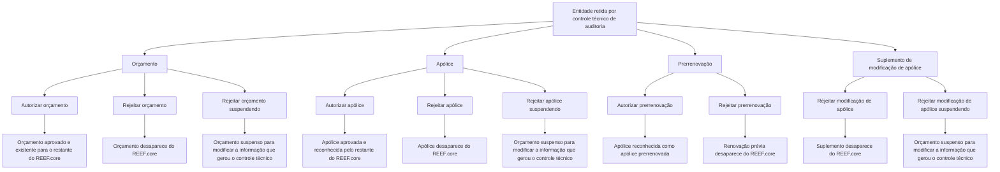

# Operações de Emissão — Controle Técnico no REEF.core

## 1. Metadados do Documento
- **Arquivo de Origem:** Não informado
- **Tipo de Documento:** Manual Operacional
- **Domínio / Sistema:** Emissão e Controle Técnico — REEF.core
- **Público-Alvo:** Operação, Negócio e equipes de suporte ao sistema REEF.core
- **Data/Versão Identificada:** Não identificada

---

## 2. Resumo Executivo & Contexto de Negócio

O documento descreve operações de autorização e rejeição aplicáveis a entidades de emissão retidas por **controle técnico de auditoria** no REEF.core. As operações cobrem orçamento, apólice, prerrenovação e suplemento de modificação de apólice.

A autorização remove a retenção decorrente do controle técnico e permite que a entidade seja reconhecida pelo restante do REEF.core. Para orçamento, o resultado é a aprovação do orçamento. Para apólice e prerrenovação, o resultado é o reconhecimento da entidade como apólice ou apólice prerrenovada, respectivamente.

A rejeição possui dois comportamentos principais: remoção da entidade do REEF.core ou conversão para orçamento suspenso. A conversão para orçamento suspenso preserva uma oportunidade de modificar as informações que provocaram o controle técnico.

O conteúdo disponibilizado apresenta as operações e seus resultados de negócio, mas não especifica interfaces de usuário, endpoints, métodos HTTP, contratos de integração, perfis de autorização, critérios que disparam o controle técnico ou procedimentos de reversão.

---

## 3. Arquitetura, Componentes & Tecnologias Envolvidas

### Componentes e conceitos identificados

| Componente / Conceito | Papel descrito |
| :--- | :--- |
| REEF.core | Sistema no qual orçamentos, apólices, prerrenovações e suplementos são reconhecidos, removidos ou convertidos em orçamento suspenso. |
| Controle técnico | Mecanismo de retenção associado a controles técnicos de auditoria. |
| Auditoria | Contexto dos controles técnicos que retêm as entidades de emissão. |
| Orçamento | Entidade que pode ser autorizada, rejeitada com remoção ou rejeitada com suspensão. |
| Apólice | Entidade que pode ser autorizada, rejeitada com remoção ou rejeitada com suspensão. |
| Prerrenovação | Renovação prévia de uma apólice que pode ser autorizada ou rejeitada. |
| Suplemento de modificação | Suplemento realizado sobre uma apólice, sujeito a rejeição com remoção ou suspensão. |
| Orçamento suspenso | Estado resultante de determinadas rejeições, permitindo modificar a informação que gerou o controle técnico. |

### Fluxo funcional reconstruído



> **Nota de Análise:** O diagrama representa exclusivamente os efeitos descritos no texto. O documento não detalha os mecanismos técnicos que executam as operações, nem os critérios de auditoria que originam a retenção.

---

## 4. Regras de Negócio, Especificações Funcionais & Processos

### 4.1 Contexto de aplicação

1. As operações descritas são operações de autorização e rejeição de controles técnicos de auditoria.
2. As operações se aplicam a entidades previamente retidas por controle técnico.
3. Os tipos de entidade explicitamente citados são: orçamento, apólice, prerrenovação e suplemento realizado sobre uma apólice.

### 4.2 Regras de autorização

#### Autorizar orçamento
1. O orçamento deve estar retido por controle técnico.
2. A autorização faz com que o orçamento passe a estar aprovado.
3. Após a aprovação, o orçamento passa a existir para o restante do REEF.core.

#### Autorizar apólice
1. A apólice deve estar retida por controle técnico.
2. A autorização faz com que a apólice passe a estar aprovada.
3. Após a aprovação, o restante do REEF.core reconhece a entidade como apólice.

#### Autorizar prerrenovação
1. A prerrenovação corresponde a uma apólice renovada previamente e retida por controle técnico.
2. A autorização faz com que a entidade passe a estar aprovada.
3. Após a aprovação, o restante do REEF.core reconhece a entidade como apólice prerrenovada.

### 4.3 Regras de rejeição com remoção do REEF.core

#### Rejeitar orçamento
1. O orçamento deve estar retido por controle técnico.
2. O orçamento não é autorizado.
3. Como consequência, o orçamento desaparece do REEF.core.

#### Rejeitar apólice
1. A apólice deve estar retida por controle técnico.
2. A apólice não é autorizada.
3. Como consequência, a apólice desaparece do REEF.core.

#### Rejeitar modificação de apólice
1. O objeto é um suplemento realizado sobre uma apólice.
2. O suplemento deve ter ficado retido por controle técnico.
3. O suplemento não é autorizado.
4. Como consequência, o suplemento desaparece do REEF.core.

#### Rejeitar prerrenovação
1. O objeto é uma renovação prévia de uma apólice.
2. A renovação prévia deve ter ficado retida por controle técnico.
3. A renovação prévia não é autorizada.
4. Como consequência, a renovação prévia desaparece do REEF.core.

### 4.4 Regras de rejeição com suspensão

#### Rejeitar orçamento suspendendo
1. O orçamento deve estar retido por controle técnico.
2. O orçamento não é autorizado.
3. O orçamento passa a se converter em um orçamento suspenso.
4. O estado de orçamento suspenso permite modificar a informação que gerou o controle técnico.

#### Rejeitar apólice suspendendo
1. A apólice deve estar retida por controle técnico.
2. A apólice não é autorizada.
3. A apólice passa a se converter em um orçamento suspenso.
4. O orçamento suspenso oferece a oportunidade de modificar a informação que gerou o controle técnico.

#### Rejeitar modificação de apólice suspendendo
1. O objeto é um suplemento realizado sobre uma apólice e retido por controle técnico.
2. O suplemento não é autorizado.
3. O suplemento passa a se converter em um orçamento suspenso.
4. O orçamento suspenso permite modificar a informação que gerou o controle técnico.

> **Nota de Análise:** O texto de origem usa a consequência “passa a converter-se em orçamento suspenso” inclusive para rejeição de apólice e suplemento. O documento não explica a conversão de tipo, o conteúdo preservado, nem a etapa posterior de reenvio para controle técnico.

---

## 5. Tabelas de Parâmetros, Ambientes e Estruturas de Dados

| Item / Parâmetro | Descrição / Função | Tipo / Valores / Formato | Ambiente / Observações |
| :--- | :--- | :--- | :--- |
| Controle técnico | Retenção aplicada no contexto de controles técnicos de auditoria. | Condição prévia para as operações descritas. | Não há critérios de disparo detalhados. |
| Orçamento retido | Orçamento submetido à retenção por controle técnico. | Entidade de emissão. | Pode ser autorizado, rejeitado com remoção ou rejeitado com suspensão. |
| Apólice retida | Apólice submetida à retenção por controle técnico. | Entidade de emissão. | Pode ser autorizada, rejeitada com remoção ou rejeitada com suspensão. |
| Prerrenovação retida | Renovação prévia de uma apólice retida por controle técnico. | Entidade de emissão. | Pode ser autorizada ou rejeitada com remoção. |
| Suplemento retido | Suplemento realizado sobre uma apólice e retido por controle técnico. | Entidade associada a modificação de apólice. | Pode ser rejeitado com remoção ou rejeitado com suspensão. |
| Autorizar orçamento | Aprova o orçamento e o torna existente para o restante do REEF.core. | Operação de autorização. | Não são especificados interface, permissões ou critérios. |
| Autorizar apólice | Aprova a apólice e permite que o restante do REEF.core a reconheça como apólice. | Operação de autorização. | Não são especificados interface, permissões ou critérios. |
| Autorizar prerrenovação | Aprova a prerrenovação e permite que o restante do REEF.core reconheça a entidade como apólice prerrenovada. | Operação de autorização. | Não são especificados interface, permissões ou critérios. |
| Rejeitar orçamento | Não autoriza o orçamento e o faz desaparecer do REEF.core. | Operação de rejeição. | Não há detalhamento de recuperação posterior. |
| Rejeitar orçamento suspendendo | Não autoriza o orçamento, mas o transforma em orçamento suspenso para alteração da informação causadora do controle. | Operação de rejeição com suspensão. | O texto não define o fluxo de retomada. |
| Rejeitar apólice | Não autoriza a apólice e a faz desaparecer do REEF.core. | Operação de rejeição. | Não há detalhamento de recuperação posterior. |
| Rejeitar apólice suspendendo | Não autoriza a apólice e a transforma em orçamento suspenso para alteração da informação causadora do controle. | Operação de rejeição com suspensão. | Conversão descrita literalmente; sem detalhamento técnico. |
| Rejeitar modificação de apólice | Não autoriza o suplemento e o faz desaparecer do REEF.core. | Operação de rejeição. | Aplica-se a suplemento de uma apólice. |
| Rejeitar modificação de apólice suspendendo | Não autoriza o suplemento e o transforma em orçamento suspenso. | Operação de rejeição com suspensão. | Permite alterar a informação que causou o controle técnico. |
| Rejeitar prerrenovação | Não autoriza a renovação prévia e a faz desaparecer do REEF.core. | Operação de rejeição. | Não foi descrita uma modalidade de suspensão para prerrenovação. |
| REEF.core | Sistema que reconhece, contém ou deixa de conter as entidades após as operações. | Sistema / domínio corporativo. | Não há versão, URL, ambiente ou arquitetura técnica identificados. |

---

## 6. Bateria de Perguntas & Respostas para RAG (FAQ Sintético)

### P1: Qual é o objetivo das operações de controle técnico no REEF.core?
**R:** As operações tratam da autorização e rejeição de entidades de emissão retidas por controles técnicos de auditoria. As entidades citadas são orçamento, apólice, prerrenovação e suplemento de modificação de apólice.

### P2: O que acontece quando um orçamento retido por controle técnico é autorizado?
**R:** O orçamento passa a estar aprovado. Como consequência, o orçamento passa a existir para o restante do REEF.core.

### P3: Qual é o efeito de autorizar uma apólice retida por controle técnico?
**R:** A apólice passa a estar aprovada. Após a autorização, o restante do REEF.core reconhece a entidade como apólice.

### P4: O que significa autorizar uma prerrenovação no REEF.core?
**R:** A operação se aplica a uma apólice renovada previamente e retida por controle técnico. Depois de autorizada, a entidade passa a estar aprovada e o restante do REEF.core a reconhece como apólice prerrenovada.

### P5: Qual é a consequência de rejeitar um orçamento sem suspendê-lo?
**R:** O orçamento não é autorizado e desaparece do REEF.core.

### P6: Qual é a diferença entre rejeitar um orçamento e rejeitar um orçamento suspendendo?
**R:** Na rejeição simples, o orçamento não é autorizado e desaparece do REEF.core. Na rejeição suspendendo, o orçamento não é autorizado, mas se converte em orçamento suspenso para permitir a modificação da informação que gerou o controle técnico.

### P7: O que ocorre ao rejeitar uma apólice retida por controle técnico?
**R:** A apólice não é autorizada e desaparece do REEF.core.

### P8: O que ocorre ao rejeitar uma apólice suspendendo?
**R:** A apólice não é autorizada e passa a se converter em orçamento suspenso. O orçamento suspenso permite modificar a informação que gerou o controle técnico.

### P9: Como é tratada uma modificação de apólice retida por controle técnico?
**R:** O documento descreve a modificação como um suplemento realizado sobre uma apólice. Na rejeição simples, o suplemento não é autorizado e desaparece do REEF.core. Na rejeição suspendendo, o suplemento não é autorizado e passa a se converter em orçamento suspenso para permitir a alteração da informação causadora do controle técnico.

### P10: O que ocorre quando uma prerrenovação é rejeitada?
**R:** Uma renovação prévia de apólice retida por controle técnico não é autorizada e, consequentemente, desaparece do REEF.core.

### P11: O documento descreve uma opção de rejeitar prerrenovação suspendendo?
**R:** Não. O conteúdo fornecido descreve “Autorizar prerrenovação” e “Rejeitar prerrenovação”, mas não apresenta uma operação de rejeição de prerrenovação com suspensão.

### P12: Quais informações devem ser modificadas em um orçamento suspenso?
**R:** O documento informa apenas que deve ser modificada a informação que gerou o controle técnico. Não identifica quais campos, regras de validação ou dados específicos podem ter provocado a retenção.

---

## 7. Glossário de Termos, Siglas & Conceitos-Chave

- **REEF.core:** Sistema citado como responsável por reconhecer as entidades aprovadas ou deixar de conter entidades rejeitadas.
- **Controle técnico:** Retenção aplicada a uma entidade no contexto de controles técnicos de auditoria.
- **Auditoria:** Contexto dos controles técnicos mencionados no documento.
- **Orçamento:** Entidade de emissão que pode ser aprovada, removida do REEF.core ou convertida em orçamento suspenso.
- **Apólice:** Entidade de emissão que pode ser aprovada, removida do REEF.core ou convertida em orçamento suspenso.
- **Prerrenovação:** Renovação prévia de uma apólice; quando autorizada, é reconhecida pelo REEF.core como apólice prerrenovada.
- **Apólice prerrenovada:** Classificação reconhecida pelo restante do REEF.core após a autorização de uma prerrenovação.
- **Suplemento:** Entidade realizada sobre uma apólice, citada no contexto de modificação de apólice.
- **Orçamento suspenso:** Estado resultante de determinadas rejeições que possibilita modificar a informação que gerou o controle técnico.

---

## 8. Notas Críticas, Riscos & Limitações

- O texto não informa nome, extensão, versão, data ou autoria do arquivo de origem.
- O documento não especifica os critérios de auditoria ou as regras que fazem uma entidade ser retida por controle técnico.
- Não há detalhamento de APIs, telas, rotas, URLs, servidores, ambientes, logs, integrações, contratos JSON ou métodos HTTP.
- Não há matriz de permissões, papéis operacionais ou trilha de auditoria para as ações de autorizar e rejeitar.
- O texto não detalha o processo posterior à alteração de um orçamento suspenso, incluindo eventual reenvio para controle técnico.
- Não há definição dos dados preservados quando apólices ou suplementos são convertidos em orçamento suspenso.
- A transcrição fornecida contém uma quebra de paginação ambígua entre “RECHAZAR presupuesto /” e o conteúdo da página seguinte. O relatório preserva essa estrutura no conteúdo bruto e evita inferir um título ausente.
- Não é descrita uma operação de “rejeitar prerrenovação suspendendo”.

---

## 9. Conteúdo Bruto Estruturado (Referência Fiel)

```text
--- [PÁGINA 1 DE 2] ---

DOCUMENTACIÓN de OPERACIÓN de
EMISIÓN (Generales) - CONTROL TÉCNICO
CONTROL TÉCNICO
Distintas operaciones de autorización y rechazo de controles técnicos
de auditoría
AUTORIZAR presupuesto
Un presupuesto retenido por control técnico
pasa a estar aprobado y por consiguiente,
existe para el resto de Reef.core
 Accede al documento
AUTORIZAR póliza
Una póliza retenida por control técnico pasa a
estar aprobada y por consiguiente, hace que
el resto de Reef.core la reconozca como
póliza
 Accede al documento
AUTORIZAR prerenovación
 RECHAZAR presupuesto
 / 
 RS
Inicio Soluciones APIs Documentación Zeus
ES


--- [PÁGINA 2 DE 2] ---

Una póliza que ha sido renovada previamente
y que está retenida por control técnico pasa a
estar aprobada y por consiguiente, hace que
el resto de Reef.core la reconozca como
póliza prerenovada
 Accede al documento
RECHAZAR presupuesto
Un presupuesto retenido por control técnico
no es autorizado y por consiguiente
desaparece de Reef.core
 Accede al documento
RECHAZAR presupuesto suspendiendo
Un presupuesto retenido por control técnico
no es autorizado y pasa convertirse en un
presupuesto suspendido y así dar la
oportunidad de modificar la información que
generó el control técnico
 Accede al documento
RECHAZAR póliza
Una póliza retenida por control técnico no es
autorizada y por consiguiente desaparece de
Reef.core
 Accede al documento
RECHAZAR póliza suspendiendo
Una póliza retenida por control técnico no es
autorizada y pasa convertirse en un
presupuesto suspendido y así dar la
oportunidad de modificar la información que
generó el control técnico
 Accede al documento
RECHAZAR póliza modificación
Un suplemento realizado a una póliza que
quedó retenido por control técnico no es
autorizado y por consiguiente desaparece de
Reef.core
 Accede al documento
RECHAZAR póliza modificación
suspendiendo
Un suplemento realizado a una póliza que
quedó retenido por control técnico no es
autorizado y pasa convertirse en un
presupuesto suspendido y así dar la
oportunidad de modificar la información que
generó el control técnico
 Accede al documento
RECHAZAR prerenovación
Una renovación previa a una póliza que
quedó retenida por control técnico no es
autorizada y por consiguiente desaparece de
Reef.core
 Accede al documento
```
