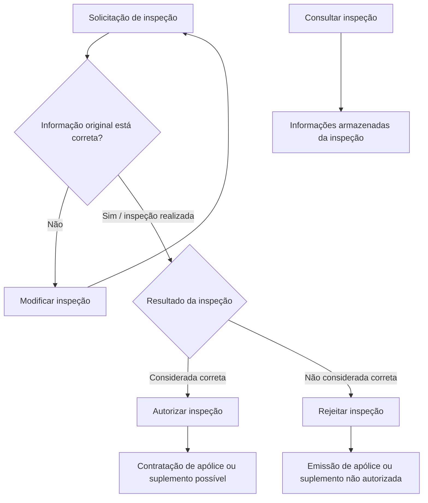

# Documentação de Operação de Emissão — Inspeção

## 1. Metadados do Documento
- **Arquivo de Origem:** Não identificado
- **Tipo de Documento:** Procedimento
- **Domínio / Sistema:** Operações de emissão e inspeção de riscos
- **Público-Alvo:** Operação, negócio e usuários responsáveis por inspeções
- **Data/Versão Identificada:** Não identificada

---

## 2. Resumo Executivo & Contexto de Negócio

O documento descreve operações relacionadas às revisões de riscos no contexto de emissão, especificamente para o processo de **inspeção**. O conteúdo apresenta quatro operações: modificar, autorizar, rejeitar e consultar uma inspeção.

A operação **modificar inspeção** permite atualizar uma solicitação de inspeção quando a informação original não estiver totalmente correta. O documento não detalha quais campos podem ser modificados, os critérios de validação nem o perfil autorizado a executar a atualização.

Após a realização de uma inspeção, a operação de **autorizar inspeção** estabelece que a inspeção é considerada correta e que a contratação da apólice ou do suplemento passa a ser possível. Em contraste, a operação de **rejeitar inspeção** determina que a inspeção não é considerada correta e que a emissão da apólice ou suplemento não é autorizada.

A operação **consultar inspeção** fornece acesso às informações armazenadas sobre uma inspeção. O trecho não especifica a estrutura dessas informações, mecanismos de busca, permissões de consulta ou retenção dos dados.

---

## 3. Arquitetura, Componentes & Tecnologias Envolvidas

O conteúdo identifica o domínio de **Operações relacionadas com as revisões de riscos** e o processo de **inspeção**. Também apresenta referências de navegação para “Soluciones”, “APIs”, “Documentación” e “Zeus”, mas não descreve arquitetura, protocolos, integrações, serviços, endpoints, tecnologias ou ambientes.



**Nota de Análise:** o documento não detalha métodos HTTP, contratos de API, modelos de dados, tecnologias implementadas ou responsabilidades dos componentes mencionados na navegação.

---

## 4. Regras de Negócio, Especificações Funcionais & Processos

1. **Modificação de inspeção**
   - A solicitação de inspeção deve ser atualizada quando, por qualquer motivo, a informação original não estiver totalmente correta.
   - O documento não define quais razões podem justificar a atualização.
   - O documento não informa campos editáveis, trilha de auditoria, workflow de aprovação ou impacto da modificação sobre uma inspeção já realizada.

2. **Autorização de inspeção**
   - A autorização ocorre após a realização da inspeção.
   - Uma inspeção autorizada é considerada correta.
   - A autorização permite a contratação de uma apólice ou suplemento.

3. **Rejeição de inspeção**
   - A rejeição ocorre após a realização da inspeção.
   - Uma inspeção rejeitada não é considerada correta.
   - A rejeição impede a autorização da emissão de uma apólice ou suplemento.

4. **Consulta de inspeção**
   - A consulta permite acesso às informações armazenadas sobre uma inspeção.
   - O documento não define filtros, atributos retornados, perfis de acesso ou fonte de persistência dessas informações.

---

## 5. Tabelas de Parâmetros, Ambientes e Estruturas de Dados

| Item / Parâmetro | Descrição / Função | Tipo / Valores / Formato | Ambiente / Observações |
| :--- | :--- | :--- | :--- |
| Inspeção | Processo relacionado à revisão de riscos. | Processo operacional | Não detalhado |
| Modificar inspeção | Atualiza a solicitação de inspeção quando a informação original não está totalmente correta. | Operação | Campos e validações não detalhados |
| Autorizar inspeção | Considera a inspeção correta após sua realização. | Operação / resultado | Permite contratação de apólice ou suplemento |
| Rejeitar inspeção | Considera a inspeção não correta após sua realização. | Operação / resultado | Não autoriza emissão de apólice ou suplemento |
| Consultar inspeção | Permite acesso às informações armazenadas de uma inspeção. | Operação de consulta | Dados retornados não detalhados |
| Apólice | Artefato cuja contratação pode ser permitida pela autorização da inspeção. | Entidade de negócio | Não detalhado |
| Suplemento | Artefato cuja contratação pode ser permitida pela autorização da inspeção. | Entidade de negócio | Não detalhado |
| Zeus | Termo exibido na navegação do documento. | Referência de navegação | Papel técnico não detalhado |

---

## 6. Bateria de Perguntas & Respostas para RAG (FAQ Sintético)

### P1: Quando uma solicitação de inspeção deve ser modificada?
**R:** A solicitação de inspeção deve ser atualizada quando, por qualquer motivo, a informação original não estiver totalmente correta. O documento não especifica os motivos aceitos nem os dados que podem ser alterados.

### P2: O que acontece quando uma inspeção é autorizada?
**R:** Após a realização da inspeção, a autorização indica que a inspeção é considerada correta. Como consequência, passa a ser possível contratar a apólice ou o suplemento.

### P3: A autorização de inspeção permite emitir uma apólice?
**R:** O documento afirma que, quando a inspeção é autorizada, é possível realizar a contratação da apólice ou suplemento. O trecho não detalha etapas adicionais entre a autorização e a emissão.

### P4: Qual é a consequência de rejeitar uma inspeção?
**R:** Uma inspeção rejeitada não é considerada correta. Nesse caso, a emissão da apólice ou do suplemento não é autorizada.

### P5: A rejeição da inspeção ocorre antes ou depois da realização da inspeção?
**R:** A rejeição ocorre uma vez realizada a inspeção, conforme indicado pelo documento.

### P6: Para que serve a operação de consultar inspeção?
**R:** A operação de consultar inspeção permite acessar as informações armazenadas acerca de uma inspeção. O documento não detalha quais informações ficam armazenadas.

### P7: O documento define quais campos podem ser modificados em uma inspeção?
**R:** Não. O documento apenas informa que a solicitação pode ser atualizada se a informação original não estiver totalmente correta.

### P8: Quais operações de inspeção são listadas no documento?
**R:** O documento lista quatro operações: modificar inspeção, autorizar inspeção, rejeitar inspeção e consultar inspeção.

### P9: Qual é a relação entre inspeção e revisão de riscos?
**R:** O documento classifica a inspeção como parte das operações relacionadas às revisões de riscos.

### P10: O documento especifica APIs ou endpoints para as operações de inspeção?
**R:** Não. Apesar de a navegação apresentar o termo “APIs”, o conteúdo não fornece endpoints, métodos HTTP, contratos JSON ou detalhes de integração.

---

## 7. Glossário de Termos, Siglas & Conceitos-Chave

- **Inspeção:** processo associado às operações de revisão de riscos.
- **Solicitação de inspeção:** registro que pode ser atualizado quando a informação original não estiver totalmente correta.
- **Autorizar inspeção:** operação que considera uma inspeção correta e permite a contratação de apólice ou suplemento.
- **Rejeitar inspeção:** operação que considera uma inspeção não correta e impede a autorização da emissão de apólice ou suplemento.
- **Consultar inspeção:** operação de acesso às informações armazenadas sobre uma inspeção.
- **Apólice:** entidade de negócio cuja contratação pode ser viabilizada pela autorização da inspeção.
- **Suplemento:** entidade de negócio cuja contratação pode ser viabilizada pela autorização da inspeção.
- **Zeus:** termo presente na navegação do documento; seu significado não é detalhado.

---

## 8. Notas Críticas, Riscos & Limitações

- O conteúdo é resumido e não apresenta detalhamento técnico sobre APIs, integrações, persistência de dados, autenticação, autorização ou ambientes.
- Não há definição de estados formais da inspeção, embora o texto indique resultados operacionais de autorização e rejeição.
- Não são descritos critérios objetivos para considerar uma inspeção correta ou não correta.
- Não são informados perfis responsáveis por modificar, autorizar, rejeitar ou consultar inspeções.
- Não há detalhes sobre tratamento de exceções, reversão de decisões, auditoria ou reprocessamento.
- **Nota de Análise:** o documento lista operações de inspeção, porém não detalha métodos HTTP, contratos JSON, campos de dados ou regras de transição entre estados.

---

## 9. Conteúdo Bruto Estruturado (Referência Fiel)

```text
--- [PÁGINA 1 DE 2] ---

DOCUMENTACIÓN de OPERACIÓN de
EMISIÓN (Generales) - INSPECCIÓN
INSPECCIÓN
Operaciones relacionadas con las revisiones de riesgos
MODIFICAR inspección
Se actualiza la solicitud de inspección si por
cualquier motivo la información original no era
totalmente correcta
 Accede al documento
AUTORIZAR inspección
Una vez realizada la inspección, esta se
considera correcta y es posible la contratación
de la póliza o suplemento
 Accede al documento
RECHAZAR inspección
Una vez realizada la inspección, esta no se
considera correcta y no se autoriza la emisión
de la póliza o suplemento
CONSULTAR inspección
Permite el acceso a la información
almacenada acerca de una inspección
 / 
 RS
Inicio Soluciones APIs Documentación Zeus
ES


--- [PÁGINA 2 DE 2] ---

Accede al documento
  Accede al documento
```
