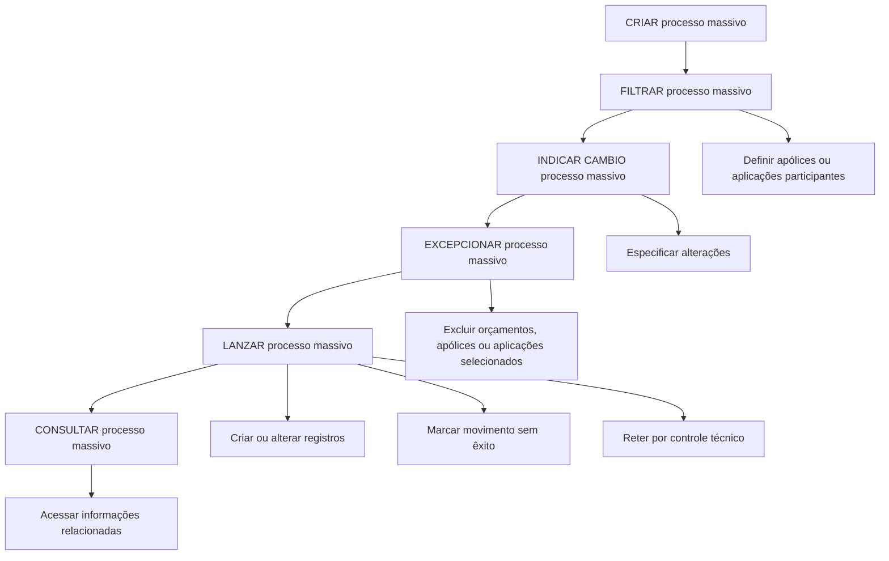

# Documentação de Operação de Emissão — Processos Massivos

## 1. Metadados do Documento
- **Arquivo de Origem:** Não identificado no conteúdo fornecido
- **Tipo de Documento:** Manual Operacional
- **Domínio / Sistema:** Emissão — Processos Massivos; Soluções APIs; Zeus
- **Público-Alvo:** Operação, Negócio e usuários responsáveis por processos massivos de emissão
- **Data/Versão Identificada:** Não identificada

---

## 2. Resumo Executivo & Contexto de Negócio

O documento descreve funcionalidades operacionais relacionadas a **processos massivos** no contexto de **Emissão (Generales)**. Processos massivos são operações por lote aplicáveis a orçamentos, apólices e/ou aplicações.

A operação contempla um ciclo de vida composto por criação, filtragem, indicação de alterações, tratamento de exceções, lançamento e consulta do processo massivo. O objetivo é permitir que múltiplos registros sejam criados ou alterados de forma coordenada.

A filtragem define quais apólices ou aplicações participarão do processo. Após a seleção, a etapa de indicação de mudança estabelece as alterações que serão aplicadas aos registros participantes.

Durante a execução, determinados orçamentos, apólices e/ou aplicações podem ser criados ou alterados com sucesso; outros podem ser marcados como movimento sem êxito; e outros podem permanecer retidos por controle técnico. A consulta permite acessar as informações existentes relacionadas ao processo massivo.

---

## 3. Arquitetura, Componentes & Tecnologias Envolvidas

Os elementos explicitamente citados são:

| Componente / Termo | Papel identificado |
| :--- | :--- |
| Emissão (Generales) | Contexto funcional da documentação de operação. |
| Processos Massivos | Operações por lote sobre orçamentos, apólices e/ou aplicações. |
| Orçamentos | Entidades que podem ser criadas ou alteradas em processos massivos. |
| Apólices | Entidades que podem participar, ser criadas ou alteradas em processos massivos. |
| Aplicações | Entidades que podem participar, ser criadas ou alteradas em processos massivos. |
| Soluções APIs | Item de navegação citado no conteúdo. |
| Documentação Zeus | Item de navegação citado no conteúdo. |
| Controle técnico | Condição de retenção possível durante o lançamento do processo massivo. |

O documento não descreve tecnologias de implementação, protocolos, APIs, métodos HTTP, bancos de dados, contratos JSON, servidores, ambientes ou integrações entre sistemas.



> **Nota de Análise:** O diagrama representa a sequência operacional inferida a partir da ordem das funcionalidades apresentadas. O documento não especifica transições obrigatórias, critérios técnicos de execução, interfaces ou dependências entre as etapas.

---

## 4. Regras de Negócio, Especificações Funcionais & Processos

### 4.1 Criar processo massivo

A funcionalidade **CRIAR processo massivo** permite definir um processo massivo destinado a criar ou alterar:

- Orçamentos;
- Apólices;
- Aplicações.

O conteúdo não detalha os campos necessários para criar um processo massivo, as validações aplicadas, os perfis autorizados ou os critérios para alteração de cada tipo de entidade.

### 4.2 Filtrar processo massivo

A funcionalidade **FILTRAR processo massivo** permite definir quais registros participarão do processo massivo.

Os registros explicitamente mencionados para a filtragem são:

- Apólices;
- Aplicações.

O documento não apresenta os filtros disponíveis, operadores de busca, critérios de seleção, limites de volume ou regras para combinação de critérios.

### 4.3 Indicar mudança no processo massivo

A funcionalidade **INDICAR CAMBIO processo massivo** especifica as mudanças a serem realizadas no processo massivo.

As mudanças indicadas serão aplicadas às:

- Apólices participantes;
- Aplicações participantes.

O documento não detalha os tipos de mudança permitidos, os campos alteráveis, regras de compatibilidade, validações de negócio ou mecanismos de aprovação.

### 4.4 Excepcionar processo massivo

A funcionalidade **EXCEPCIONAR processo massivo** determina quais registros, inicialmente selecionados, devem ser excluídos do processo massivo.

Os tipos de registros que podem ser excepcionados são:

- Orçamentos;
- Apólices;
- Aplicações.

A exceção é aplicada sobre registros previamente selecionados. O documento não especifica se uma exceção pode ser revertida, quem pode registrá-la ou quais motivos de exclusão são aceitos.

### 4.5 Lançar processo massivo

A funcionalidade **LANZAR processo massivo** executa o processo massivo. Durante a execução, uma série de orçamentos, apólices e/ou aplicações pode apresentar os seguintes resultados:

1. Ser criada;
2. Ser alterada;
3. Ser marcada como movimento sem êxito;
4. Permanecer retida por controle técnico.

O documento não informa critérios para classificação de êxito, falha ou retenção técnica, nem descreve retentativas, tratamento de erros, notificações ou reversão de alterações.

### 4.6 Consultar processo massivo

A funcionalidade **CONSULTAR processo massivo** facilita o acesso às informações existentes relacionadas ao processo massivo.

O documento não especifica quais informações podem ser consultadas, quais filtros são disponibilizados, se há histórico de execução ou se os resultados de êxito, falha e retenção podem ser visualizados separadamente.

---

## 5. Tabelas de Parâmetros, Ambientes e Estruturas de Dados

| Item / Parâmetro | Descrição / Função | Tipo / Valores / Formato | Ambiente / Observações |
| :--- | :--- | :--- | :--- |
| Processo massivo | Processo por lote relacionado à criação ou alteração de registros. | Processo operacional | Aplicável a orçamentos, apólices e/ou aplicações. |
| Criar processo massivo | Define um processo massivo. | Funcionalidade operacional | Permite criar ou alterar orçamentos, apólices e/ou aplicações. |
| Filtrar processo massivo | Define quais registros intervêm no processo massivo. | Funcionalidade operacional | O texto menciona apólices ou aplicações. |
| Indicar cambio processo massivo | Especifica as mudanças a realizar. | Funcionalidade operacional | As alterações afetam apólices e/ou aplicações participantes. |
| Excepcionar processo massivo | Exclui registros inicialmente selecionados. | Funcionalidade operacional | Pode excepcionar orçamentos, apólices ou aplicações. |
| Lançar processo massivo | Executa o processo massivo. | Funcionalidade operacional | Pode criar, alterar, marcar sem êxito ou reter por controle técnico. |
| Consultar processo massivo | Permite acessar informações relacionadas ao processo. | Funcionalidade operacional | O conteúdo não detalha os dados retornados. |
| Orçamento | Registro que pode ser criado, alterado ou excepcionado. | Entidade de negócio | Participação na filtragem não é explicitamente detalhada. |
| Apólice | Registro que pode participar do processo massivo. | Entidade de negócio | Pode ser filtrada, alterada, excepcionada, criada ou afetada na execução. |
| Aplicação | Registro que pode participar do processo massivo. | Entidade de negócio | Pode ser filtrada, alterada, excepcionada, criada ou afetada na execução. |
| Movimento sem êxito | Resultado possível da execução do processo massivo. | Status / resultado operacional | Não há critérios ou causas especificadas. |
| Controle técnico | Condição de retenção de registros durante a execução. | Status / controle operacional | Não há detalhamento de regras ou procedimentos de liberação. |
| Soluções APIs | Item citado na navegação do conteúdo. | Referência de navegação | Sem detalhamento técnico adicional. |
| Documentação Zeus | Item citado na navegação do conteúdo. | Referência de navegação | Sem detalhamento técnico adicional. |

---

## 6. Bateria de Perguntas & Respostas para RAG (FAQ Sintético)

### P1: Qual é o objetivo de um processo massivo na documentação de Emissão?
**R:** Um processo massivo permite criar ou alterar, em lote, orçamentos, apólices e/ou aplicações. O documento apresenta o processo como uma operação relacionada a processos por lotes no contexto de Emissão (Generales).

### P2: Quais entidades podem ser criadas ou alteradas por um processo massivo?
**R:** O documento informa que um processo massivo pode criar ou alterar orçamentos, apólices e/ou aplicações.

### P3: Para que serve a funcionalidade FILTRAR processo massivo?
**R:** A funcionalidade FILTRAR processo massivo permite definir quais apólices ou aplicações intervêm, ou seja, participam, de um processo massivo.

### P4: O que é definido na etapa INDICAR CAMBIO processo massivo?
**R:** Na etapa INDICAR CAMBIO processo massivo são especificadas as mudanças a realizar no processo massivo. Essas mudanças serão sofridas pelas apólices e/ou aplicações que participam do processo.

### P5: Qual é a finalidade de EXCEPCIONAR processo massivo?
**R:** EXCEPCIONAR processo massivo determina quais orçamentos, apólices ou aplicações inicialmente selecionados passam a ficar excluídos do processo massivo.

### P6: O que acontece durante o LANZAR processo massivo?
**R:** LANZAR processo massivo executa o processo. Durante a execução, uma série de orçamentos, apólices e/ou aplicações pode ser criada ou alterada; alguns registros podem ser marcados como movimento sem êxito; e outros podem ficar retidos por controle técnico.

### P7: Quais resultados podem ocorrer para registros durante a execução do processo massivo?
**R:** Os resultados explicitamente descritos são: criação do registro, alteração do registro, marcação de que o movimento não teve êxito e retenção por controle técnico.

### P8: Quais registros podem ser excluídos depois de inicialmente selecionados?
**R:** Orçamentos, apólices ou aplicações inicialmente selecionados podem ser excluídos por meio da funcionalidade EXCEPCIONAR processo massivo.

### P9: Para que serve CONSULTAR processo massivo?
**R:** CONSULTAR processo massivo facilita o acesso às informações existentes relacionadas ao processo massivo. O documento não detalha quais informações, filtros ou relatórios estão disponíveis nessa consulta.

### P10: O documento descreve os critérios para um movimento ser considerado sem êxito?
**R:** Não. O documento apenas informa que alguns registros podem ser marcados como movimento sem êxito durante a execução do processo massivo, sem apresentar critérios, causas, códigos de erro ou procedimentos de tratamento.

### P11: O documento detalha como funciona o controle técnico?
**R:** Não. O conteúdo informa que alguns registros podem ficar retidos por controle técnico, mas não detalha as regras de retenção, responsáveis pela análise, critérios de liberação ou ações corretivas.

### P12: Existem APIs, URLs, ambientes ou contratos técnicos especificados?
**R:** Não. Embora “Soluções APIs” e “Documentação Zeus” sejam citados como itens de navegação, o documento fornecido não especifica endpoints, URLs, métodos HTTP, contratos de integração, ambientes, versões, portas ou tecnologias.

---

## 7. Glossário de Termos, Siglas & Conceitos-Chave

- **Aplicações:** Entidades de negócio que podem participar de processos massivos e ser criadas, alteradas, excepcionadas ou afetadas pela execução.
- **Apólices:** Entidades de negócio que podem participar de processos massivos e ser criadas, alteradas, excepcionadas ou afetadas pela execução.
- **Controle técnico:** Condição na qual registros ficam retidos durante a execução do processo massivo.
- **Emissão (Generales):** Contexto funcional indicado no título do conteúdo.
- **Excepcionar:** Determinar que orçamentos, apólices ou aplicações inicialmente selecionados sejam excluídos do processo massivo.
- **Lançar:** Executar um processo massivo.
- **Movimento sem êxito:** Resultado possível da execução em que o movimento não é bem-sucedido.
- **Orçamentos:** Entidades de negócio que podem ser criadas, alteradas ou excluídas de um processo massivo.
- **Processo massivo:** Operação por lote para criar ou alterar registros de negócio.
- **Zeus:** Termo citado em “Documentação Zeus”, sem definição adicional no conteúdo.

---

## 8. Notas Críticas, Riscos & Limitações

- O conteúdo fornecido apresenta descrições funcionais resumidas e não detalha implementação técnica.
- Não foram identificados endpoints, URLs, métodos HTTP, contratos JSON, autenticação, ambientes, servidores, versões ou tecnologias.
- O documento não informa critérios de seleção usados na filtragem de apólices e aplicações.
- Não há detalhamento sobre os tipos de alteração permitidos na etapa de indicação de mudança.
- Não são apresentados critérios de sucesso, falha ou retenção por controle técnico durante a execução.
- Não há procedimentos documentados para tratamento de movimentos sem êxito ou registros retidos por controle técnico.
- Não foram identificadas regras de autorização, perfis de acesso, auditoria, aprovação ou reversão de processos massivos.
- **Nota de Análise:** O documento lista as funcionalidades de processos massivos, mas não detalha contratos técnicos, regras de validação, campos operacionais ou comportamentos de exceção além dos resultados explicitamente apresentados.

---

## 9. Conteúdo Bruto Estruturado (Referência Fiel)

```text
--- [PÁGINA 1 DE 2] ---

DOCUMENTACIÓN de OPERACIÓN de
EMISIÓN (Generales) - PROCESOS MASIVOS
PROCESOS MASIVOS
Operaciones relacionadas con procesos por lotes
CREAR proceso masivo
Se define un proceso masivo que permita
crear o alterar presupuestos, pólizas y/o
aplicaciones
 Accede al documento
FILTRAR proceso masivo
Permite la definición de qué pólizas o
aplicaciones intervienen en un proceso
masivo
 Accede al documento
INDICAR CAMBIO proceso masivo
Se especifican los cambios a realizar en el
proceso masivo y que sufrirán las pólizas y/o
aplicaciones que participen en él
EXCEPCIONAR proceso masivo
Se determina qué presupuesto, pólizas o
aplicaciones inicialmente seleccionadas
pasan a estar excluidas del proceso masivo
 / 
 RS
Inicio Soluciones APIs Documentación Zeus
ES


--- [PÁGINA 2 DE 2] ---

Accede al documento
  Accede al documento
LANZAR proceso masivo
Ejecución del proceso masivo donde una
serie de presupuestos, póliza y/o aplicaciones
serán creadas o alteradas, otras quedarán
marcadas como que el movimiento no tuvo
éxito y otras quedarán retenidas por control
técnico
 Accede al documento
CONSULTAR proceso masivo
Facilita el acceso a la información que existe
relacionado con el proceso masivo
 Accede al documento
```
