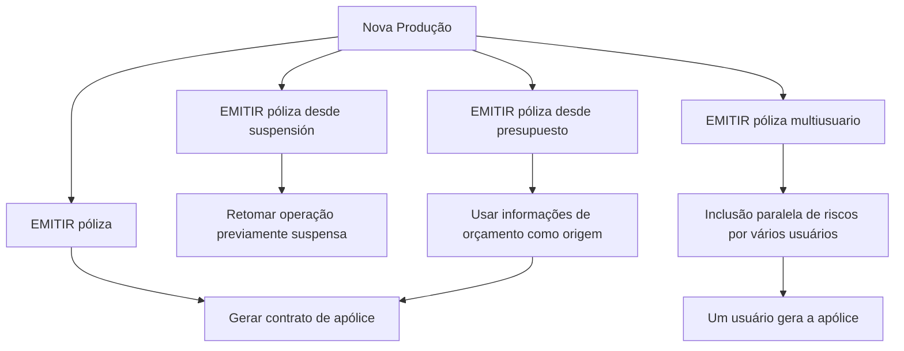

# Documentação de Operação de Emissão — Nova Produção

## 1. Metadados do Documento
- **Arquivo de Origem:** Não identificado no conteúdo fornecido
- **Tipo de Documento:** Procedimento / documentação operacional
- **Domínio / Sistema:** Emissão de apólices — Nova Produção
- **Público-Alvo:** Operação, negócio e usuários responsáveis pela criação de apólices ou aplicações
- **Data/Versão Identificada:** Não identificada

---

## 2. Resumo Executivo & Contexto de Negócio

O documento apresenta opções de operação para **Nova Produção**, voltadas à criação de novas apólices ou aplicações. O foco central é a operação **EMITIR póliza**, definida como a geração de um contrato que estabelece os riscos cobertos, as condições de cobertura e a cobertura aplicável quando ocorrer um dano previamente estabelecido.

A documentação descreve quatro modalidades relacionadas à emissão de apólices: emissão direta, emissão a partir de uma operação suspensa, emissão multiusuário e emissão baseada em orçamento. Cada modalidade atende a uma origem ou dinâmica operacional distinta, preservando a finalidade de gerar uma nova apólice.

A emissão a partir de suspensão permite retomar uma operação previamente interrompida. A emissão multiusuário permite que vários usuários incluam riscos em paralelo; após a inclusão de todos os riscos, um dos usuários gera a apólice. A emissão a partir de orçamento utiliza as informações de um orçamento como base para a geração da nova apólice.

O conteúdo funciona como um índice operacional: cada modalidade contém a indicação “Accede al documento”, mas os documentos de detalhamento, etapas de interface, critérios de validação, contratos de integração e regras de exceção não foram fornecidos no texto extraído.

---

## 3. Arquitetura, Componentes & Tecnologias Envolvidas

O conteúdo fornecido cita os seguintes elementos de navegação ou contexto:

- **Inicio**
- **Soluciones**
- **APIs**
- **Documentación**
- **Zeus**
- **ES**
- **RS**

Não há descrição técnica de arquitetura de software, APIs, microsserviços, bancos de dados, protocolos, ambientes, URLs, tecnologias ou integrações. O termo “APIs” aparece na navegação, sem detalhamento de interfaces ou serviços.



> **Nota de Análise:** O documento não especifica se “Zeus”, “RS” ou “APIs” correspondem a sistemas, módulos, ambientes ou apenas itens de navegação.

---

## 4. Regras de Negócio, Especificações Funcionais & Processos

### 4.1 Operação principal: EMITIR póliza

A operação **EMITIR póliza** consiste na geração do contrato pelo qual são definidos:

1. O risco ou os riscos cobertos.
2. As condições sob as quais ocorre a cobertura.
3. A cobertura que será fornecida quando o risco sofrer algum tipo de dano previamente estabelecido.

### 4.2 Emissão de apólice a partir de suspensão

A modalidade **EMITIR póliza desde suspensión** corresponde à realização da operação de emissão após a retomada de uma operação que havia sido previamente suspensa.

Fluxo identificado:

1. Uma operação de emissão foi previamente suspensa.
2. A operação suspensa é retomada.
3. A operação **EMITIR póliza** é realizada.

### 4.3 Emissão multiusuário

A modalidade **EMITIR póliza multiusuario** possui a mesma finalidade de emitir uma apólice, mas permite que vários usuários incluam riscos de forma paralela.

Fluxo identificado:

1. Vários usuários incluem riscos em paralelo.
2. Todos os riscos necessários são incluídos.
3. Um dos usuários gera a apólice.

### 4.4 Emissão a partir de orçamento

A modalidade **EMITIR póliza desde presupuesto** consiste em emitir uma apólice utilizando como origem as informações de um orçamento. Esse orçamento serve como base para a geração da nova apólice.

Fluxo identificado:

1. Existe um orçamento com informações disponíveis.
2. As informações do orçamento são usadas como origem.
3. Uma nova apólice é gerada.

> **Nota de Análise:** O documento não detalha campos obrigatórios, critérios de elegibilidade, regras de cálculo, aprovação, persistência de dados, validações de risco ou tratamento de falhas para nenhuma das modalidades.

---

## 5. Tabelas de Parâmetros, Ambientes e Estruturas de Dados

| Item / Parâmetro | Descrição / Função | Tipo / Valores / Formato | Ambiente / Observações |
| :--- | :--- | :--- | :--- |
| Nova Produção | Contexto para criação de novas apólices ou aplicações. | Processo operacional | Não há ambiente técnico identificado. |
| EMITIR póliza | Geração de contrato que estabelece riscos cobertos, condições de cobertura e cobertura diante de dano estabelecido. | Operação | Possui indicação “Accede al documento”. |
| Risco | Elemento ou elementos cobertos pelo contrato gerado na emissão. | Conceito de negócio | Não há taxonomia ou estrutura de dados informada. |
| Condições de cobertura | Condições sob as quais os riscos são cobertos. | Conceito de negócio | Não há critérios detalhados. |
| Dano estabelecido | Tipo de dano associado à cobertura contratada. | Conceito de negócio | O documento não lista tipos de dano. |
| EMITIR póliza desde suspensión | Emissão realizada após retomar operação previamente suspensa. | Modalidade operacional | Não há critérios de retomada ou estados de suspensão. |
| EMITIR póliza multiusuario | Emissão com inclusão paralela de riscos por vários usuários. | Modalidade operacional | Um usuário gera a apólice após a inclusão de todos os riscos. |
| EMITIR póliza desde presupuesto | Emissão baseada em informações de um orçamento. | Modalidade operacional | O orçamento é a origem/base da nova apólice. |
| Accede al documento | Indicação de acesso a documento específico de cada modalidade. | Referência de navegação | O conteúdo dos documentos vinculados não foi fornecido. |
| Inicio / Soluciones / APIs / Documentación / Zeus / ES / RS | Elementos presentes na navegação ou identificação da página. | Navegação / contexto | Sem detalhamento funcional ou técnico. |

---

## 6. Bateria de Perguntas & Respostas para RAG (FAQ Sintético)

### P1: Qual é a finalidade da operação EMITIR póliza?
**R:** A operação **EMITIR póliza** tem como finalidade gerar o contrato que estabelece o risco ou os riscos cobertos, as condições em que esses riscos são cobertos e a cobertura aplicável caso o risco sofra algum tipo de dano previamente estabelecido.

### P2: Quais modalidades de emissão são apresentadas na documentação de Nova Produção?
**R:** A documentação apresenta quatro modalidades: **EMITIR póliza**, **EMITIR póliza desde suspensión**, **EMITIR póliza multiusuario** e **EMITIR póliza desde presupuesto**.

### P3: O que significa EMITIR póliza desde suspensión?
**R:** **EMITIR póliza desde suspensión** é a realização da operação de emissão de apólice depois que uma operação previamente suspensa foi retomada. O conteúdo não informa quais condições permitem suspender ou retomar a operação.

### P4: Como funciona a emissão multiusuário de apólice?
**R:** Na modalidade **EMITIR póliza multiusuario**, vários usuários incluem riscos de forma paralela. Quando todos os riscos foram incluídos, um dos usuários gera a apólice.

### P5: Quem gera a apólice no processo multiusuário?
**R:** Após todos os riscos serem incluídos pelos vários usuários, **um dos usuários** gera a apólice. O documento não especifica como esse usuário é escolhido nem quais permissões são necessárias.

### P6: Qual é a origem dos dados na emissão de apólice a partir de orçamento?
**R:** Na modalidade **EMITIR póliza desde presupuesto**, as informações de um orçamento são utilizadas como origem e base para a geração da nova apólice.

### P7: O documento informa APIs ou contratos técnicos para emissão de apólices?
**R:** Não. Embora “APIs” apareça no conteúdo de navegação, o documento não descreve métodos HTTP, endpoints, contratos JSON, autenticação, integrações ou tecnologias associadas à emissão de apólices.

### P8: Quais informações um contrato gerado pela emissão deve estabelecer?
**R:** O contrato gerado deve estabelecer os riscos cobertos, as condições em que esses riscos são cobertos e a cobertura fornecida quando ocorrer algum tipo de dano estabelecido para o risco.

### P9: A documentação detalha quais tipos de risco ou dano podem ser incluídos?
**R:** Não. O texto menciona riscos cobertos e dano estabelecido, mas não apresenta uma lista de categorias, códigos, atributos ou critérios de classificação.

### P10: Existem regras de validação para emissão, suspensão, orçamento ou colaboração multiusuário?
**R:** Não. O documento não informa validações, campos obrigatórios, regras de aprovação, tratamento de erro, controle de concorrência ou restrições para as modalidades apresentadas.

---

## 7. Glossário de Termos, Siglas & Conceitos-Chave

- **EMITIR póliza:** Operação de geração de contrato de apólice que estabelece riscos, condições de cobertura e cobertura diante de danos estabelecidos.
- **Póliza:** Apólice; contrato gerado pela operação de emissão.
- **Nova Produção:** Contexto de criação de novas apólices ou aplicações.
- **Riesgo / Risco:** Elemento ou elementos cobertos pelo contrato da apólice.
- **Cobertura:** Proteção fornecida nas condições estabelecidas quando ocorre um dano relacionado ao risco.
- **Suspensión / Suspensão:** Estado de uma operação previamente interrompida, que pode ser retomada para emissão da apólice.
- **Multiusuario / Multiusuário:** Modalidade em que vários usuários incluem riscos de forma paralela antes da geração da apólice.
- **Presupuesto / Orçamento:** Fonte de informações que serve de base para gerar uma nova apólice.
- **APIs:** Termo presente na navegação; o documento não apresenta significado técnico adicional.
- **Zeus:** Termo presente na navegação; o documento não detalha seu significado ou papel.
- **ES:** Termo presente na navegação; o documento não detalha seu significado.
- **RS:** Termo presente na navegação; o documento não detalha seu significado.

---

## 8. Notas Críticas, Riscos & Limitações

- O conteúdo é uma visão resumida das modalidades de emissão e referencia documentos adicionais por meio de “Accede al documento”, mas esses documentos não foram incluídos.
- Não há especificação de regras de validação, permissões, auditoria, gestão de concorrência, tratamento de exceções ou critérios de conclusão para emissão multiusuário.
- Não há definição de estados, transições, responsáveis ou critérios de retomada para operações suspensas.
- Não há mapeamento dos dados transferidos do orçamento para a nova apólice.
- Não são informados ambientes, URLs, servidores, versões, APIs, integrações ou tecnologias.
- **Nota de Análise:** O documento lista “APIs”, “Zeus”, “ES” e “RS”, porém não detalha o significado, a responsabilidade ou a relação desses termos com a emissão de apólices.

---

## 9. Conteúdo Bruto Estruturado (Referência Fiel)

```text
--- [PÁGINA 1 DE 2] ---

DOCUMENTACIÓN de OPERACIÓN de
EMISIÓN (Generales) - NUEVA PRODUCCIÓN
NUEVA PRODUCCIÓN
Distintas formas de crear nuevas pólizas o aplicaciones
EMITIR póliza
Consiste en la generación del contrato por el
que se establece el riesgo o riesgos cubiertos,
las condiciones en las que se cubre y la
cobertura que se dará cuando el riesgo sufra
algún tipo de daño establecido
 Accede al documento
EMITIR póliza desde suspensión
Es la realización de la operación EMITIR
póliza, habiendo retomado la operación que
había sido previamente suspendida
 Accede al documento
EMITIR póliza multiusuario
 EMITIR póliza desde presupuesto
 / 
 RS
Inicio Soluciones APIs Documentación Zeus
ES


--- [PÁGINA 2 DE 2] ---

La finalidad de esta operación es la de
EMITIR póliza pero, en la que varios usuarios
se encuentran incluyendo riesgos de forma
paralela. Una vez que todos los riesgos han
sido incluidos, uno de los usuarios genera la
póliza
 Accede al documento
Consiste en EMITIR póliza tomando como
origen la información de un presupuesto que
sirve como base para la generación de la
nueva póliza
 Accede al documento
```
