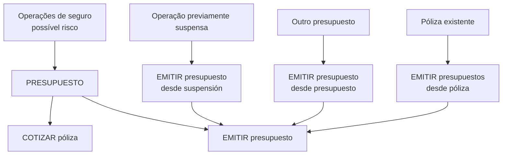

# Documentação de Operação de Emissão — Gerais / Orçamento

## 1. Metadados do Documento
- **Arquivo de Origem:** `Não identificado no conteúdo fornecido`
- **Tipo de Documento:** `Manual Operacional`
- **Domínio / Sistema:** `Operações de seguro — emissão de orçamento`
- **Público-Alvo:** `Operação, Negócio e usuários de documentação de APIs`
- **Data/Versão Identificada:** `Não identificada`

---

## 2. Resumo Executivo & Contexto de Negócio

O documento apresenta operações de emissão de orçamento no contexto de seguros gerais. Um orçamento está associado a operações relacionadas ao seguro de um possível risco e pode ser utilizado como base para apresentar alternativas de cobertura, custo e formas de fracionamento de pagamento.

A operação **COTIZAR póliza** tem como finalidade oferecer diferentes opções de seguro, incluindo o respetivo custo e distintas opções de fracionamento de pagamento. O conteúdo fornecido não detalha critérios de cálculo, entradas, saídas, métodos HTTP ou contratos de integração dessa operação.

A operação **EMITIR presupuesto** gera uma proposição de seguro para um ou vários riscos. O documento também descreve variações de emissão que reutilizam informações de operações ou entidades existentes: emissão a partir de suspensão, de outro orçamento e de uma apólice.

O material aparenta funcionar como uma página de índice ou catálogo de operações, com referências para documentos adicionais por meio de “Accede al documento”. Os detalhes operacionais das referências não foram incluídos no conteúdo bruto analisado.

---

## 3. Arquitetura, Componentes & Tecnologias Envolvidas

Os seguintes elementos são citados:

| Componente / Elemento | Papel identificado |
| :--- | :--- |
| `PRESUPUESTO` | Contexto funcional de orçamento de seguro. |
| `COTIZAR póliza` | Operação para ofertar opções de seguro, custo e fracionamento de pagamento. |
| `EMITIR presupuesto` | Operação para gerar proposição de seguro para um ou vários riscos. |
| `EMITIR presupuesto desde suspensión` | Emissão retomada após suspensão prévia da operação. |
| `EMITIR presupuesto desde presupuesto` | Emissão baseada nas informações de outro orçamento. |
| `EMITIR presupuestos desde póliza` | Emissão baseada nas informações de uma apólice. |
| `Soluciones APIs` | Item de navegação citado no rodapé/cabeçalho do conteúdo. |
| `Documentación Zeus` | Item de navegação citado no rodapé/cabeçalho do conteúdo. |



> **Nota de Análise:** O documento não apresenta arquitetura técnica de software, tecnologias, APIs, endpoints, protocolos, ambientes, servidores ou contratos JSON. O diagrama representa exclusivamente as relações funcionais explicitamente descritas.

---

## 4. Regras de Negócio, Especificações Funcionais & Processos

### 4.1 Contexto de orçamento

- O domínio `PRESUPUESTO` é descrito como relacionado a operações de seguro de um possível risco.
- O conteúdo não especifica quais categorias de risco, produtos de seguro, regras de elegibilidade ou dados obrigatórios são aplicáveis.

### 4.2 Operação: COTIZAR póliza

A operação **COTIZAR póliza** deve:

1. Oferecer distintas opções de um seguro.
2. Apresentar o custo associado a cada opção de seguro.
3. Apresentar diferentes opções de fracionamento de pagamento.

O documento não informa:

- Como as opções de seguro são selecionadas.
- Como o custo é calculado.
- Quais modalidades de fracionamento existem.
- Quais dados de entrada são necessários.
- Quais dados são retornados pela operação.

### 4.3 Operação: EMITIR presupuesto

A operação **EMITIR presupuesto** deve gerar uma proposição de seguro para:

- Um risco; ou
- Vários riscos.

O documento não define as condições necessárias para emissão, o formato da proposição, validações, estados, persistência ou resultados da geração.

### 4.4 Operação: EMITIR presupuesto desde suspensión

A operação **EMITIR presupuesto desde suspensión** corresponde à operação **EMITIR presupuesto** retomada após ter sido previamente suspensa.

Fluxo funcional explicitado:

1. Existe uma operação de emissão de orçamento previamente suspensa.
2. A operação é retomada.
3. A retomada é tratada como emissão de orçamento a partir de suspensão.

O motivo da suspensão, as condições para retomada e os estados operacionais não são detalhados.

### 4.5 Operação: EMITIR presupuesto desde presupuesto

A operação **EMITIR presupuesto desde presupuesto** consiste em emitir um orçamento utilizando como origem as informações de outro orçamento.

Fluxo funcional explicitado:

1. Existe um orçamento de origem.
2. As informações do orçamento de origem servem como base.
3. Um novo orçamento é gerado a partir dessas informações.

O documento não especifica quais informações do orçamento de origem são reutilizadas, modificáveis, obrigatórias ou excluídas.

### 4.6 Operação: EMITIR presupuestos desde póliza

A operação **EMITIR presupuestos desde póliza** permite emitir um orçamento tomando como origem as informações de uma apólice.

Fluxo funcional explicitado:

1. Existe uma apólice de origem.
2. A apólice fornece informações-base.
3. Um novo orçamento é emitido com base nas informações da apólice.

O documento não define quais atributos da apólice são copiados, se existem validações para a apólice de origem ou se há limitações para o novo orçamento.

---

## 5. Tabelas de Parâmetros, Ambientes e Estruturas de Dados

| Item / Parâmetro | Descrição / Função | Tipo / Valores / Formato | Ambiente / Observações |
| :--- | :--- | :--- | :--- |
| `PRESUPUESTO` | Contexto de operações de seguro relacionadas a um possível risco. | Conceito funcional | Não há ambiente informado. |
| `COTIZAR póliza` | Oferece opções de seguro, custo e alternativas de fracionamento de pagamento. | Operação | Sem detalhamento de parâmetros ou contrato. |
| `EMITIR presupuesto` | Gera uma proposição de seguro para um ou vários riscos. | Operação | Sem detalhamento de parâmetros ou contrato. |
| `EMITIR presupuesto desde suspensión` | Retoma a emissão de orçamento que havia sido suspensa previamente. | Operação | Sem estados, critérios ou validações documentados. |
| `EMITIR presupuesto desde presupuesto` | Gera novo orçamento a partir de informações de outro orçamento. | Operação | Não especifica campos reutilizados. |
| `EMITIR presupuestos desde póliza` | Gera orçamento a partir de informações de uma apólice. | Operação | Não especifica campos reutilizados. |
| `Soluciones APIs` | Referência de navegação exibida no documento. | Navegação / contexto de portal | Nenhuma URL foi fornecida. |
| `Documentación Zeus` | Referência de navegação exibida no documento. | Navegação / contexto de portal | Nenhuma URL foi fornecida. |
| `ES` | Indicador de idioma exibido no documento. | Idioma | Provavelmente espanhol; o documento está redigido em espanhol. |

> **Nota de Análise:** Não há parâmetros técnicos, URLs, hosts, portas, variáveis de ambiente, rotas de log, estruturas JSON, esquemas de dados ou matrizes de permissão no conteúdo fornecido.

---

## 6. Bateria de Perguntas & Respostas para RAG (FAQ Sintético)

### P1: Qual é o objetivo da operação COTIZAR póliza?
**R:** A operação **COTIZAR póliza** oferece distintas opções de seguro, juntamente com o custo de cada opção e diferentes alternativas de fracionamento de pagamento.

### P2: O que a operação EMITIR presupuesto gera?
**R:** A operação **EMITIR presupuesto** gera uma proposição de seguro para um ou vários riscos.

### P3: O que significa EMITIR presupuesto desde suspensión?
**R:** **EMITIR presupuesto desde suspensión** é a operação de emissão de orçamento realizada após retomar uma operação de emissão que havia sido previamente suspensa.

### P4: Como funciona a emissão de orçamento a partir de outro orçamento?
**R:** A operação **EMITIR presupuesto desde presupuesto** emite um novo orçamento usando como origem as informações de outro orçamento, que serve como base para a geração do novo orçamento.

### P5: Como funciona a emissão de orçamento a partir de uma apólice?
**R:** A operação **EMITIR presupuestos desde póliza** permite emitir um orçamento usando como origem as informações de uma apólice, que serve como base para a geração do novo orçamento.

### P6: O documento informa quais campos do orçamento de origem são copiados para o novo orçamento?
**R:** Não. O documento afirma apenas que as informações de outro orçamento servem como base para gerar um novo orçamento; não detalha campos, regras de cópia ou possibilidades de alteração.

### P7: O documento descreve como calcular o custo apresentado em COTIZAR póliza?
**R:** Não. O documento afirma que a operação oferece opções de seguro com o respetivo custo, mas não documenta fórmulas, tarifas, critérios de cálculo ou dados de entrada.

### P8: Quais opções de pagamento são apresentadas pela operação COTIZAR póliza?
**R:** O documento informa que são oferecidas diferentes opções de fracionamento de pagamento, mas não identifica as modalidades, prazos, quantidades de parcelas ou regras aplicáveis.

### P9: Existe documentação de endpoints, métodos HTTP ou contratos de API?
**R:** Não. Embora o conteúdo cite “Soluciones APIs”, não há URLs, endpoints, métodos HTTP, payloads, autenticação ou contratos JSON no trecho fornecido.

### P10: Quais são as fontes possíveis para emitir um orçamento?
**R:** O documento apresenta emissão direta por meio de **EMITIR presupuesto**, emissão retomada após suspensão, emissão baseada em outro orçamento e emissão baseada em uma apólice.

---

## 7. Glossário de Termos, Siglas & Conceitos-Chave

- **PRESUPUESTO:** Orçamento no contexto de operações de seguro relacionadas a um possível risco.
- **COTIZAR póliza:** Operação para oferecer opções de seguro, custos e alternativas de fracionamento de pagamento.
- **EMITIR presupuesto:** Operação para gerar uma proposição de seguro para um ou vários riscos.
- **EMITIR presupuesto desde suspensión:** Emissão de orçamento retomada após suspensão anterior da operação.
- **EMITIR presupuesto desde presupuesto:** Emissão de novo orçamento baseada nas informações de outro orçamento.
- **EMITIR presupuestos desde póliza:** Emissão de orçamento baseada nas informações de uma apólice.
- **Póliza:** Apólice usada como origem de informações para gerar um orçamento.
- **Riesgo:** Risco potencial associado às operações de seguro.
- **Soluciones APIs:** Referência de navegação exibida no conteúdo.
- **Documentación Zeus:** Referência de navegação exibida no conteúdo.
- **ES:** Indicador de idioma exibido no conteúdo.

---

## 8. Notas Críticas, Riscos & Limitações

- O conteúdo é resumido e não contém detalhes técnicos de implementação.
- Não foram identificados métodos HTTP, endpoints, contratos de API, payloads, modelos de dados, autenticação ou tratamento de erros.
- Não há regras de cálculo de preço, seleção de coberturas ou fracionamento de pagamento.
- Não há definição de estados de um orçamento, incluindo critérios de suspensão e retomada.
- Não há detalhamento sobre quais informações de um orçamento ou apólice são reutilizadas durante a emissão derivada.
- As expressões “Accede al documento” indicam a existência de documentos de aprofundamento, mas esses documentos não foram fornecidos.
- Há uma aparente inconsistência textual em “una póliza que sire”, preservada na transcrição por fidelidade ao conteúdo original.

---

## 9. Conteúdo Bruto Estruturado (Referência Fiel)

```text
--- [PÁGINA 1 DE 2] ---

DOCUMENTACIÓN de OPERACIÓN de
EMISIÓN (Generales) - PRESUPUESTO
PRESUPUESTO
Operaciones relacionadas con los de seguro de un posible riesgo
COTIZAR póliza
Ofrecer distintas opciones de un seguro junto
con su coste y diferentes opciones de
fraccionamiento de pago
 Accede al documento
EMITIR presupuesto
Generar una proposición de seguro de uno
varios riesgos
 Accede al documento
EMITIR presupuesto desde suspensión
Es la operación EMITIR presupuesto,
habiendo retomado la operación que había
sido previamente suspendida
EMITIR presupuesto desde presupuesto
Consiste en EMITIR presupuesto tomando
como origen la información de otro
 / 
 RS
Inicio Soluciones APIs Documentación Zeus
ES


--- [PÁGINA 2 DE 2] ---

Accede al documento
 presupuesto que sirve como base para la
generación del nuevo presupuesto
 Accede al documento
EMITIR presupuestos desde póliza
Permite EMITIR presupuesto tomando como
origen la información de una póliza que sire
como base para la generación del nuevo
presupuesto
 Accede al documento
```
