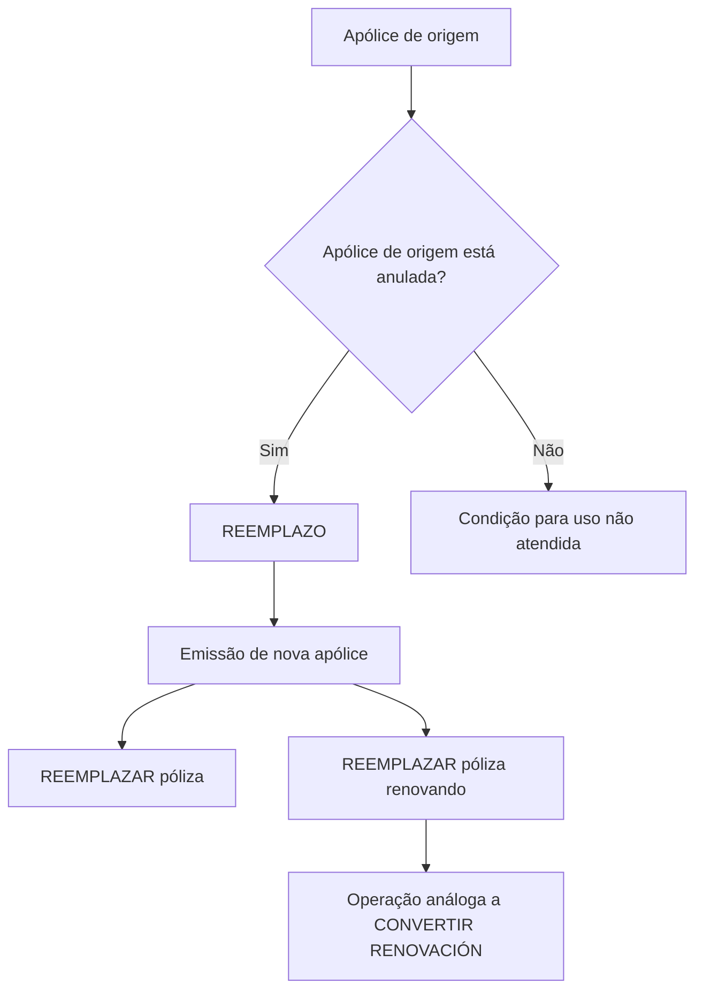

# Documentação de Operação de Emissão (Generales) — Reemplazo

## 1. Metadados do Documento
- **Arquivo de Origem:** Não identificado
- **Tipo de Documento:** Procedimento
- **Domínio / Sistema:** Emissão de apólices; Zeus
- **Público-Alvo:** Operação
- **Data/Versão Identificada:** Não identificada

---

## 2. Resumo Executivo & Contexto de Negócio

O documento descreve a operação **REEMPLAZO** no contexto de **EMISIÓN** de apólices. A operação permite usar uma apólice existente como informação de partida para criar uma nova apólice.

O processo de substituição consiste em emitir uma nova apólice tomando como origem os dados de outra apólice. A apólice de origem atua como base para a geração da nova apólice.

A condição explícita para uso da apólice de origem é que ela esteja **anulada**. O documento apresenta duas possibilidades: **REEMPLAZAR póliza** e **REEMPLAZAR póliza renovando**.

A modalidade **REEMPLAZAR póliza renovando** é descrita como uma operação análoga a **CONVERTIR RENOVACIÓN**. O material não detalha etapas de tela, regras adicionais, contratos de API, campos de dados ou efeitos posteriores à emissão.

---

## 3. Arquitetura, Componentes & Tecnologias Envolvidas

Os elementos identificados são:

- **EMISIÓN:** Contexto de emissão de apólices.
- **REEMPLAZO / REEMPLAZAR póliza:** Operação para emitir uma nova apólice com base em outra apólice anulada.
- **REEMPLAZAR póliza renovando:** Variante de substituição análoga a CONVERTIR RENOVACIÓN.
- **CONVERTIR RENOVACIÓN:** Operação citada como análoga à modalidade de substituição com renovação.
- **Zeus:** Sistema ou área de documentação mencionada no rodapé de navegação.
- **Soluciones APIs / Documentación:** Itens de navegação citados no conteúdo bruto.



> **Nota de Análise:** O documento não detalha a arquitetura técnica de Zeus, APIs, integrações, métodos HTTP, contratos JSON, bancos de dados, ambientes ou componentes de infraestrutura.

---

## 4. Regras de Negócio, Especificações Funcionais & Processos

### Operação REEMPLAZO

1. A operação REEMPLAZO permite tomar uma apólice como informação de partida.
2. A finalidade é criar uma nova apólice.
3. A nova apólice é emitida usando como origem a informação de outra apólice.
4. A apólice usada como base para a geração da nova apólice deve estar anulada.

### Modalidade REEMPLAZAR póliza

1. A modalidade REEMPLAZAR póliza está associada à emissão de uma nova apólice.
2. A origem da nova apólice é uma apólice anterior.
3. A apólice anterior usada como base deve estar anulada.
4. O documento indica a ação “Accede al documento”, sem fornecer o conteúdo do documento referenciado.

### Modalidade REEMPLAZAR póliza renovando

1. A modalidade REEMPLAZAR póliza renovando é uma operação análoga a CONVERTIR RENOVACIÓN.
2. A apólice usada como base deve estar anulada.
3. O documento indica a ação “Accede al documento”, sem fornecer o conteúdo do documento referenciado.

> **Nota de Análise:** Não foram apresentados critérios para identificar uma apólice anulada, etapas de validação, mensagens de erro, papéis autorizados, campos copiados, campos recalculados ou comportamento em caso de falha.

---

## 5. Tabelas de Parâmetros, Ambientes e Estruturas de Dados

| Item / Parâmetro | Descrição / Função | Tipo / Valores / Formato | Ambiente / Observações |
| :--- | :--- | :--- | :--- |
| REEMPLAZO | Operação de emissão que usa outra apólice como informação de partida para gerar uma nova apólice. | Operação funcional | A apólice de origem deve estar anulada. |
| REEMPLAZAR póliza | Modalidade de substituição de apólice. | Operação funcional | Há referência para acessar documento complementar, cujo conteúdo não foi fornecido. |
| REEMPLAZAR póliza renovando | Modalidade de substituição com renovação. | Operação funcional | Análoga a CONVERTIR RENOVACIÓN; a apólice de origem deve estar anulada. |
| CONVERTIR RENOVACIÓN | Operação usada como analogia para REEMPLAZAR póliza renovando. | Operação funcional | Não detalhada no conteúdo fornecido. |
| Apólice de origem | Apólice cuja informação serve de base para emissão de uma nova apólice. | Apólice | Deve estar anulada. |
| Nova apólice | Apólice gerada pelo processo de REEMPLAZO. | Apólice | O documento não informa campos, estado inicial ou regras de persistência. |
| Zeus | Nome citado na navegação da documentação. | Sistema ou contexto de documentação | Sem detalhamento técnico adicional. |
| Soluciones APIs | Item citado na navegação. | Área de navegação | Nenhuma API é descrita. |

---

## 6. Bateria de Perguntas & Respostas para RAG (FAQ Sintético)

### P1: O que é a operação REEMPLAZO na emissão de apólices?
**R:** REEMPLAZO é uma operação que permite emitir uma nova apólice usando como informação de partida outra apólice. A apólice utilizada como base deve estar anulada.

### P2: Qual é a condição obrigatória para usar uma apólice como origem no REEMPLAZO?
**R:** A apólice que servirá como base para a geração da nova apólice deve estar anulada.

### P3: A operação REEMPLAZO cria uma nova apólice?
**R:** Sim. O documento define REEMPLAZO como a emissão de uma apólice tomando como origem a informação de outra apólice que serve como base para gerar a nova apólice.

### P4: O que acontece se a apólice de origem não estiver anulada?
**R:** O documento estabelece que a apólice de origem deve estar anulada. Não informa comportamento do sistema, mensagem de erro ou alternativa operacional quando essa condição não é atendida.

### P5: O que é REEMPLAZAR póliza?
**R:** REEMPLAZAR póliza é uma das possibilidades apresentadas dentro de REEMPLAZO. Ela permite emitir uma nova apólice com base em outra apólice anulada.

### P6: O que é REEMPLAZAR póliza renovando?
**R:** REEMPLAZAR póliza renovando é uma modalidade de REEMPLAZO descrita como análoga à operação CONVERTIR RENOVACIÓN. A apólice usada como base também deve estar anulada.

### P7: Qual é a relação entre REEMPLAZAR póliza renovando e CONVERTIR RENOVACIÓN?
**R:** O documento informa que REEMPLAZAR póliza renovando é uma operação análoga a CONVERTIR RENOVACIÓN. Não apresenta regras funcionais adicionais para detalhar essa analogia.

### P8: Quais dados da apólice de origem são copiados para a nova apólice?
**R:** O documento informa apenas que a apólice de origem serve como base para a geração da nova apólice. Não especifica quais campos, coberturas, valores, dados de cliente ou condições são copiados, recalculados ou excluídos.

### P9: O documento descreve APIs ou integrações técnicas para REEMPLAZO?
**R:** Não. Embora “Soluciones APIs” seja citado na navegação, o conteúdo não apresenta endpoints, métodos HTTP, contratos, autenticação, parâmetros ou integrações.

### P10: O sistema Zeus é detalhado no documento?
**R:** Não. Zeus é citado no rodapé de navegação, mas o documento não descreve sua arquitetura, funcionalidades, ambientes ou responsabilidades no processo de REEMPLAZO.

---

## 7. Glossário de Termos, Siglas & Conceitos-Chave

- **EMISIÓN:** Contexto de emissão de apólices mencionado no documento.
- **REEMPLAZO:** Operação de emitir uma nova apólice usando outra apólice como base.
- **REEMPLAZAR póliza:** Modalidade de substituição de apólice.
- **REEMPLAZAR póliza renovando:** Modalidade de substituição descrita como análoga a CONVERTIR RENOVACIÓN.
- **CONVERTIR RENOVACIÓN:** Operação citada como análoga à modalidade REEMPLAZAR póliza renovando; não detalhada no texto.
- **Póliza / Apólice:** Registro usado como origem ou resultado no processo de emissão.
- **Anulada:** Estado obrigatório da apólice que será usada como base.
- **Zeus:** Nome presente na navegação da documentação, sem definição adicional.

---

## 8. Notas Críticas, Riscos & Limitações

- A condição de anulação da apólice de origem é uma dependência funcional explícita para ambas as modalidades de REEMPLAZO.
- O documento não informa como verificar o estado “anulada” nem quais controles impedem o uso de apólices em outros estados.
- Não há detalhamento de permissões, perfis de usuário, auditoria, logs, exceções, reversão ou tratamento de erros.
- Não há definição de campos herdados da apólice de origem, campos obrigatórios da nova apólice ou regras de cálculo.
- As referências “Accede al documento” apontam para conteúdo complementar indisponível no texto fornecido.
- Não há informações suficientes para inferir APIs, URLs, ambientes, versões, infraestrutura ou contratos técnicos.

---

## 9. Conteúdo Bruto Estruturado (Referência Fiel)

```text
--- [PÁGINA 1 DE 1] ---

DOCUMENTACIÓN de OPERACIÓN de
EMISIÓN (Generales) - REEMPLAZO
REEMPLAZO
Distintas posibilidades que permite tomar una póliza como información
de partida para crear una nueva
REEMPLAZAR póliza
Consiste en EMITIR póliza tomando como
origen la información de otra póliza que sirve
como base para la generación de la nueva
póliza. La póliza que sirve como base debe
estar anulada
 Accede al documento
REEMPLAZAR póliza renovando
Operación análoga a CONVERTIR
RENOVACIÓN. La póliza que sirve como
base debe estar anulada
 Accede al documento
 / 
 RS
Inicio Soluciones APIs Documentación Zeus
ES
```
