# Operações de Emissão de Apólices — Suplementos, Renovação, Anulação e Reabilitação

## 1. Metadados do Documento
- **Arquivo de Origem:** Não identificado no conteúdo extraído
- **Tipo de Documento:** Manual Operacional
- **Domínio / Sistema:** Emissão de apólices de seguro — operações gerais e suplementos
- **Público-Alvo:** Operação, negócio, analistas funcionais e equipes de seguros
- **Data/Versão Identificada:** Não identificada

---

## 2. Resumo Executivo & Contexto de Negócio

O documento descreve operações de emissão relacionadas à modificação das informações de uma apólice ou aplicação de seguro. Essas operações são tratadas como suplementos e abrangem alterações cadastrais, alterações de vigência, ajustes financeiros, renovação, cancelamento e reabilitação de apólices.

As operações apresentadas podem alterar condições da apólice, capital segurado, cobertura, agente, distribuição de pagamentos, vigência e situação operacional. Diversas operações podem afetar o custo do seguro, provocando cobrança adicional, devolução ao pagador, incremento ou redução de custo.

O documento diferencia operações realizadas sobre a vigência atual, sobre uma anualidade anterior e sobre suplementos temporários. Também há operações específicas para retomada de fluxos anteriormente suspensos, uso de uma pré-renovação virtual e renovação baseada em dados migrados de outro sistema.

As operações de anulação permitem desfazer suplementos ou cancelar integralmente uma apólice. As operações de reabilitação anulam uma cancelamento anterior, podendo preservar, estender ou não estender a vigência, além de permitir modificação de informações da apólice.

O conteúdo extraído é predominantemente funcional e operacional. Não são especificados sistemas de origem, APIs, métodos HTTP, contratos JSON, regras de autorização, URLs, ambientes, responsáveis operacionais ou procedimentos detalhados de execução.

---

## 3. Arquitetura, Componentes & Tecnologias Envolvidas

O documento não descreve uma arquitetura de software, tecnologias, componentes técnicos, microsserviços, bancos de dados, integrações, APIs ou ambientes. O conteúdo identifica um catálogo funcional de operações sobre apólices de seguro.

O fluxo funcional extraído pode ser representado pela seguinte taxonomia operacional:

```mermaid
graph TD
    A[Apólice de seguro] --> B[Suplementos de alteração]
    A --> C[Renovação]
    A --> D[Anulação e cancelamento]
    A --> E[Reabilitação]
    A --> F[Gestão de sinistro]

    B --> B1[ALTERAR póliza]
    B --> B2[ALTERAR póliza temporalmente]
    B --> B3[ALTERAR póliza anualidad anterior]
    B --> B4[ALTERAR póliza plan pago]
    B --> B5[ALTERAR póliza cambio agente]
    B --> B6[EXTENDER póliza vigencia]
    B --> B7[REGULARIZAR póliza]
    B --> B8[LIQUIDAR póliza]

    C --> C1[PRERENOVAR póliza]
    C --> C2[RENOVAR póliza]
    C --> C3[RENOVAR póliza desde prerenovación]
    C --> C4[RENOVAR póliza desde suspensión]
    C --> C5[CONVERTIR RENOVACIÓN]

    D --> D1[ANULAR póliza modificación]
    D --> D2[ANULAR póliza modificación temporal]
    D --> D3[ANULAR póliza modificación anualidad anterior]
    D --> D4[ANULAR póliza]
    D --> D5[ANULAR póliza extinción riesgo]

    E --> E1[REHABILITAR póliza]
    E --> E2[REHABILITAR póliza extensión vigencia]
    E --> E3[REHABILITAR póliza sin extensión vigencia]
    E --> E4[REHABILITAR póliza modificando cualquier dato]

    F --> F1[DISMINUIR póliza por siniestro]
    F --> F2[RESTITUIR póliza capital]
```



> **Nota de Análise:** O documento cita acesso a documentos individuais para as operações, mas não informa URLs, identificadores, sistemas, contratos de integração ou instruções de navegação.

---

## 4. Regras de Negócio, Especificações Funcionais & Processos

### Alteração de apólice e suplementos

- **ALTERAR póliza:** permite modificar a maior parte das informações da apólice. As informações não modificáveis por esse suplemento devem ser modificadas por outros suplementos. As alterações identificadas podem afetar o custo do seguro e provocar cobrança ou devolução ao pagador do seguro.
- **ALTERAR póliza desde suspensión:** executa a operação `ALTERAR póliza` após a retomada de uma operação previamente suspensa.
- **ALTERAR póliza temporalmente:** executa uma operação `ALTERAR póliza` cujo vencimento é anterior ao vencimento da apólice; caracteriza um suplemento temporal.
- **ALTERAR póliza anualidad anterior:** permite alterar a apólice em uma data anterior à última renovação vigente. A operação pode afetar o custo do seguro.
- **ALTERAR póliza plan pago:** anula um ou mais recibos pendentes e utiliza o respectivo valor para realizar nova distribuição de recibos; o pagamento é novamente fracionado.
- **ALTERAR póliza cambio agente:** anula comissões e recibos e os regenera para um novo agente. Não afeta o custo do seguro.
- **EXTENDER póliza vigencia:** altera o vencimento da apólice para data posterior ao vencimento original. A alteração afeta o custo do seguro.
- **REGULARIZAR póliza:** modifica a apólice em uma anualidade anterior, ou seja, no período anterior à última renovação vigente. Esse suplemento não encontra a cancelação, sendo normal que afete o custo do seguro.
- **LIQUIDAR póliza:** regulariza a situação em que houve cobrança antecipada de prêmio, como uma prima em depósito efetuada pelo pagador. Pode implicar incremento ou decremento do custo do seguro.

### Anulação e cancelamento

- **ANULAR póliza modificación:** anula o último suplemento vigente realizado sobre a apólice. A operação desfaz a última modificação sofrida pela apólice e pode afetar o custo do seguro.
- **ANULAR póliza modificación temporal:** é análoga à operação `ANULAR póliza modificación`, mas anula o último suplemento temporal vigente.
- **ANULAR póliza modificación anualidad anterior:** é análoga à operação `ANULAR póliza modificación`, mas o suplemento de origem foi realizado na anualidade anterior por meio de `ALTERAR póliza anualidad anterior`. Pode afetar o importe do seguro.
- **ANULAR póliza:** cancela a apólice e pode gerar um valor a devolver ao pagador.
- **ANULAR póliza extinción riesgo:** aplica-se quando o risco sofreu dano que resultou em sua inexistência, como em um sinistro total. Não implica devolução de custo.

### Sinistros, capital e cobertura

- **DISMINUIR póliza por siniestro:** reduz a soma segurada de uma ou mais coberturas afetadas durante a tramitação de um sinistro. A redução coincide com a liquidação realizada no tratamento do sinistro. Não afeta o custo do seguro.
- **RESTITUIR póliza capital:** restabelece a soma segurada que havia sido reduzida pela tramitação de um sinistro. A restituição afeta o custo do seguro.

### Renovação

- **PRERENOVAR póliza:** realiza uma renovação aplicando todos os critérios necessários para determinar o custo do seguro no novo período da apólice. A operação é registrada virtualmente; o movimento não é real.
- **RENOVAR póliza:** realiza a renovação real da apólice, determinando as condições e o custo do seguro para um novo período de vigência.
- **RENOVAR póliza desde prerenovación:** executa a operação `RENOVAR póliza` com base na renovação previamente realizada. Utiliza as informações geradas por `PRERENOVAR póliza`.
- **RENOVAR póliza desde suspensión:** executa a operação `RENOVAR póliza` após a retomada de uma operação previamente suspensa.
- **CONVERTIR RENOVACIÓN (cargas en el sistema, renovando):** executa uma renovação, mas a origem da informação não é uma apólice da carteira. A informação é originada em migração de outro sistema e produz uma renovação de apólice.

### Reabilitação

- **REHABILITAR póliza:** anula uma cancelamento de apólice. A apólice volta a vigorar com a situação anterior à anulação. A reabilitação é efetiva no mesmo dia em que a apólice foi anulada.
- **REHABILITAR póliza extensión vigencia:** é análoga a `REHABILITAR póliza`, mas a data de reabilitação é posterior à data de anulação. A diferença entre as datas estende a apólice pelo período em que ela permaneceu anulada. Não gera custo adicional do seguro.
- **REHABILITAR póliza sin extensión vigencia:** é análoga a `REHABILITAR póliza extensión vigencia`, mas o período em que a apólice esteve anulada gera uma redução de custo na reabilitação.
- **REHABILITAR póliza modificando cualquier dato:** é análoga a `REHABILITAR póliza`, mas permite modificar qualquer informação da apólice.

---

## 5. Tabelas de Parâmetros, Ambientes e Estruturas de Dados

| Item / Parâmetro | Descrição / Função | Tipo / Valores / Formato | Ambiente / Observações |
| :--- | :--- | :--- | :--- |
| ALTERAR póliza | Modifica a maior parte das informações da apólice. | Operação de suplemento | Pode afetar o custo e gerar cobrança ou devolução ao pagador. |
| ALTERAR póliza desde suspensión | Realiza alteração após retomada de operação suspensa. | Operação de suplemento | Depende de operação previamente suspensa e retomada. |
| ALTERAR póliza temporalmente | Realiza alteração com vencimento anterior ao vencimento da apólice. | Suplemento temporal | Caracteriza alteração temporária. |
| ALTERAR póliza anualidad anterior | Modifica a apólice em data anterior à última renovação vigente. | Suplemento em anualidade anterior | Pode afetar o custo do seguro. |
| ANULAR póliza modificación | Desfaz o último suplemento vigente. | Operação de anulação | Pode afetar o custo do seguro. |
| ANULAR póliza modificación temporal | Anula o último suplemento temporal vigente. | Operação de anulação | Análoga à anulação de modificação padrão. |
| ANULAR póliza modificación anualidad anterior | Anula suplemento realizado na anualidade anterior. | Operação de anulação | Origem: `ALTERAR póliza anualidad anterior`; pode afetar o importe do seguro. |
| ALTERAR póliza plan pago | Anula recibos pendentes e distribui novamente os valores. | Operação de pagamento | O pagamento é novamente fracionado. |
| ALTERAR póliza cambio agente | Regenera comissões e recibos para novo agente. | Operação de alteração | Não afeta o custo do seguro. |
| DISMINUIR póliza por siniestro | Reduz soma segurada de coberturas envolvidas em sinistro. | Operação vinculada a sinistro | A redução coincide com a liquidação do sinistro; não afeta o custo. |
| RESTITUIR póliza capital | Restabelece soma segurada reduzida por sinistro. | Operação vinculada a sinistro | Afeta o custo do seguro. |
| EXTENDER póliza vigencia | Posterga vencimento para data posterior ao original. | Operação de vigência | Afeta o custo do seguro. |
| REGULARIZAR póliza | Modifica a apólice no período anterior à última renovação vigente. | Suplemento em anualidade anterior | Não encontra a cancelação; normalmente afeta o custo. |
| LIQUIDAR póliza | Regulariza situação de cobrança antecipada de prêmio. | Operação de regularização | Pode aumentar ou reduzir o custo do seguro. |
| PRERENOVAR póliza | Calcula condições e custo para novo período. | Renovação virtual | O movimento é virtual e não real. |
| RENOVAR póliza | Realiza renovação real da apólice. | Operação de renovação | Determina condições e custo para novo período de vigência. |
| RENOVAR póliza desde prerenovación | Renova usando dados produzidos pela pré-renovação. | Operação de renovação | Depende de `PRERENOVAR póliza`. |
| RENOVAR póliza desde suspensión | Renova após retomada de operação suspensa. | Operação de renovação | Depende de operação previamente suspensa e retomada. |
| CONVERTIR RENOVACIÓN | Renova utilizando informação migrada de outro sistema. | Operação de renovação por migração | A origem não é uma apólice da carteira. |
| ANULAR póliza | Cancela a apólice. | Operação de cancelamento | Pode gerar importe a devolver ao pagador. |
| ANULAR póliza extinción riesgo | Cancela em caso de inexistência do risco, como sinistro total. | Operação de cancelamento | Não implica devolução de custo. |
| REHABILITAR póliza | Anula o cancelamento e restabelece a vigência. | Operação de reabilitação | Efetiva no mesmo dia da anulação. |
| REHABILITAR póliza extensión vigencia | Reabilita em data posterior e estende a vigência. | Operação de reabilitação | Não gera custo adicional. |
| REHABILITAR póliza sin extensión vigencia | Reabilita sem extensão de vigência. | Operação de reabilitação | Período cancelado gera redução de custo. |
| REHABILITAR póliza modificando cualquier dato | Reabilita permitindo modificar qualquer informação. | Operação de reabilitação | Análoga à reabilitação padrão. |

---

## 6. Bateria de Perguntas & Respostas para RAG (FAQ Sintético)

### P1: Qual operação permite modificar a maior parte das informações de uma apólice?
**R:** A operação `ALTERAR póliza` permite modificar a maior parte das informações da apólice. As informações que não podem ser alteradas por esse suplemento devem ser modificadas por outros suplementos. A alteração pode afetar o custo do seguro e gerar cobrança ou devolução ao pagador.

### P2: Como alterar uma apólice após uma operação previamente suspensa?
**R:** A operação `ALTERAR póliza desde suspensión` deve ser utilizada para realizar `ALTERAR póliza` após retomar uma operação que havia sido previamente suspensa.

### P3: O que caracteriza a operação ALTERAR póliza temporalmente?
**R:** `ALTERAR póliza temporalmente` realiza uma alteração cujo vencimento é anterior ao vencimento da apólice. Portanto, a operação representa um suplemento temporal.

### P4: Qual operação deve ser usada para alterar uma apólice em período anterior à última renovação vigente?
**R:** A operação `ALTERAR póliza anualidad anterior` permite modificar a apólice em uma data anterior à última renovação vigente. Essa operação pode afetar o custo do seguro.

### P5: Como funciona a alteração do plano de pagamento de uma apólice?
**R:** `ALTERAR póliza plan pago` anula um ou mais recibos pendentes e utiliza os respectivos valores para realizar uma nova distribuição de recibos. O efeito é um novo fracionamento do pagamento.

### P6: A mudança de agente afeta o custo do seguro?
**R:** Não. `ALTERAR póliza cambio agente` anula comissões e recibos existentes e regenera comissões e recibos para um novo agente, mas não afeta o custo do seguro.

### P7: Qual é a diferença entre PRERENOVAR póliza e RENOVAR póliza?
**R:** `PRERENOVAR póliza` aplica os critérios necessários para determinar o custo do seguro do novo período, porém registra a renovação virtualmente e sem movimento real. `RENOVAR póliza` realiza a renovação real da apólice e determina as condições e o custo para um novo período de vigência.

### P8: Como renovar uma apólice a partir dos dados de uma pré-renovação?
**R:** A operação `RENOVAR póliza desde prerenovación` realiza `RENOVAR póliza` usando como base as informações produzidas anteriormente pela operação `PRERENOVAR póliza`.

### P9: Em que situação é utilizada a operação CONVERTIR RENOVACIÓN?
**R:** `CONVERTIR RENOVACIÓN (cargas en el sistema, renovando)` é utilizada quando a origem das informações não é uma apólice da carteira, mas dados migrados de outro sistema. Com esses dados migrados, é produzida uma renovação de apólice.

### P10: O que a operação ANULAR póliza modificación faz?
**R:** `ANULAR póliza modificación` anula o último suplemento vigente realizado sobre a apólice. Em outras palavras, desfaz a última modificação sofrida pela apólice. A operação pode afetar o custo do seguro.

### P11: Quando deve ser utilizada a anulação por extinção do risco?
**R:** `ANULAR póliza extinción riesgo` aplica-se quando o risco sofre dano que faz com que deixe de existir, como no caso de sinistro total. A operação não implica devolução de custo.

### P12: Qual é o impacto de DISMINUIR póliza por siniestro?
**R:** `DISMINUIR póliza por siniestro` reduz a soma segurada de uma ou mais coberturas afetadas na tramitação de um sinistro. A redução coincide com a liquidação realizada no sinistro e não afeta o custo do seguro.

### P13: Qual a diferença entre reabilitação com e sem extensão de vigência?
**R:** `REHABILITAR póliza extensión vigencia` reabilita a apólice em data posterior à anulação e estende a vigência pelo período em que a apólice permaneceu anulada, sem custo adicional. `REHABILITAR póliza sin extensión vigencia` também reabilita posteriormente, mas o período cancelado gera redução de custo na reabilitação.

---

## 7. Glossário de Termos, Siglas & Conceitos-Chave

- **Apólice / Póliza:** contrato de seguro objeto das operações apresentadas.
- **Suplemento:** operação relacionada à modificação de informações contidas em uma apólice ou aplicação.
- **Anualidade anterior / Anualidad anterior:** período anterior à última renovação vigente da apólice.
- **Cobertura:** elemento segurado cuja soma segurada pode ser reduzida ou restituída em operações vinculadas a sinistro.
- **Custo do seguro:** valor do seguro que pode sofrer incremento, decremento, cobrança, devolução ou redução conforme a operação.
- **Pagador / Pagador del seguro:** parte que pode receber cobrança ou devolução decorrente de operações sobre a apólice.
- **Recibo:** elemento de cobrança ou pagamento que pode ser anulado, redistribuído ou regenerado.
- **Comissão:** valor associado ao agente que pode ser anulado e regenerado em alteração de agente.
- **Sinistro / Siniestro:** evento em tramitação que pode afetar coberturas e soma segurada.
- **Soma segurada / Suma asegurada:** valor segurado de uma ou mais coberturas.
- **Pré-renovação / Prerenovación:** renovação virtual usada para determinar condições e custo do novo período sem gerar movimento real.
- **Reabilitação / Rehabilitación:** anulação de uma cancelamento para que a apólice volte a vigorar.
- **Extinção do risco / Extinción riesgo:** situação em que o risco deixa de existir, como em um sinistro total.

---

## 8. Notas Críticas, Riscos & Limitações

- O documento não identifica o nome do sistema, a versão, a data, o proprietário do processo ou os responsáveis pelas operações.
- Não são fornecidos critérios de elegibilidade, permissões, validações, estados de apólice, regras de cálculo, fórmulas financeiras ou condições de erro.
- O impacto financeiro é informado para diversas operações, mas os valores, métodos de cálculo, impostos, prêmios, moedas e eventos contábeis não são detalhados.
- O documento menciona “Accede al documento” para cada operação, mas não apresenta os documentos de referência, URLs ou procedimentos associados.
- Não há detalhamento de APIs, integrações, dados de entrada, dados de saída, métodos HTTP, contratos JSON, logs ou ambientes técnicos.
- **Nota de Análise:** O termo `REGULARIZAR póliza` afirma que o suplemento “no halla la cancelación”; a redação é preservada do texto original e não recebe interpretação adicional por ausência de detalhamento.

---

## 9. Conteúdo Bruto Estruturado (Referência Fiel)

```text
--- [PÁGINA 1 DE 4] ---

DOCUMENTACIÓN de OPERACIÓN de
EMISIÓN (Generales) - SUPLEMENTO
SUPLEMENTO
Operaciones relacionadas con la modificación de la información que
contiene una póliza o aplicación
ALTERAR póliza
Permite la modificación de la mayor parte de
la información de la póliza. La información
que no se permite modificar en este
suplemento, se permite mediante otros
suplementos. Los cambios identificados
pueden afectar al coste del seguro,
provocando un cobro o devolución al pagador
del seguro
ALTERAR póliza desde suspensión
Consiste en realizar la operación ALTERAR
póliza, habiendo retomado la operación que
había sido previamente suspendida
 Accede al documento
 / 
 RS
Inicio Soluciones APIs Documentación Zeus
ES


--- [PÁGINA 2 DE 4] ---

Accede al documento
ALTERAR póliza temporalmente
Realiza una operación ALTERAR póliza cuyo
vencimiento es anterior al vencimiento de la
póliza. Es decir, se realiza un suplemento
temporal
 Accede al documento
ALTERAR póliza anualidad anterior
Permite realizar una modificación de la póliza,
pero a una fecha anterior a la última
renovación vigente realizada. Puede afectar al
coste del seguro
 Accede al documento
ANULAR póliza modificación
Consiste en anular el último suplemento
vigente realizado sobre la póliza. Es decir, se
"deshace" la última modificación que haya
sufrido la póliza. Puede afectar al coste del
seguro
 Accede al documento
ANULAR póliza modificación temporal
Esta operación es análoga a ANULAR póliza
modificación, pero anula el últimos
suplemento temporal vigente
 Accede al documento
ALTERAR póliza plan pago
Realiza la anulación de uno o varios recibos
pendientes y con ese importe se realiza una
nueva distribución de recibos. Es decir, se
vuelve a fraccionar el pago
 Accede al documento
ALTERAR póliza cambio agente
Realiza la anulación de las comisiones y
recibos y regenera las comisiones y recibos
para un nuevo agente. No afecta al coste del
seguro
 Accede al documento
DISMINUIR póliza por siniestro
Reduce la suma asegurada de una o varias
coberturas afectadas en la tramitación de un
siniestro. La reducción coincide con la
liquidación realizada por la tramitación. No
afecta al coste del seguro
 Accede al documento
RESTITUIR póliza capital
Restituye la suma asegurada que
previamente ha sido reducida por la
tramitación de un siniestro. La restitución
afecta al coste del seguro
 Accede al documento
EXTENDER póliza vigencia
 REGULARIZAR póliza


--- [PÁGINA 3 DE 4] ---

Altera el vencimiento de la póliza llevándolo a
una fecha posterior al vencimiento original.
Esta alteración afecta al coste del seguro
 Accede al documento
Modificación de la póliza que afecta a la
anualidad anterior. Es decir, al periodo previo
a la última renovación vigente. Tiene la
particularidad de que este suplemento no
halla la cancelación por lo que es normal que
afecte al coste del seguro
 Accede al documento
LIQUIDAR póliza
Modificación que permite regularizar la
situación cuando hubo un cobro anticipado de
prima (por ejemplo hubo una prima en
depósito por parte del pagador). Este
suplemento puede implicar un incremento o
decremento del coste del seguro
 Accede al documento
PRERENOVAR póliza
Realiza una renovación aplicando todos los
criterios con el fin de determinar cual será el
coste del seguro para el nuevo periodo de la
póliza. Tiene la salvedad que la operación se
registra de forma virtual por lo que el
movimiento no es real
 Accede al documento
RENOVAR póliza
Realiza la renovación real de la póliza. Es
decir, se determina las condiciones y el coste
del seguro para un nuevo periodo de vigencia
 Accede al documento
RENOVAR póliza desde prerenovación
Realiza la operación RENOVAR póliza, pero
la base es la renovación previa que se hizo.
Es decir, toma la información generada por la
operación PRERENOVAR póliza y renueva la
póliza
 Accede al documento
RENOVAR póliza desde suspensión
Consiste en realizar la operación RENOVAR
póliza, habiendo retomando la operación que
había sido previamente suspendida
 Accede al documento
CONVERTIR RENOVACIÓN (cargas en el
sistema, renovando)
Consiste en realizar la operación RENOVAR
póliza, salvo que el origen de la información
no es una póliza de la cartera, la información
parte de una migración de otro sistema. Es
decir, con la información migrada desde otro
sistema, se produce una renovación de póliza
 Accede al documento
ANULAR póliza modificación anualidad
anterior
ANULAR póliza


--- [PÁGINA 4 DE 4] ---

Es un movimiento análogo a ANULAR póliza
modificación, pero el origen es un suplemento
realizado a la anualidad anterior. Es decir se
anula un movimiento generado con la
peración ALTERAR póliza anualidad anterior.
Este movimiento puede afectar al importe del
seguro
 Accede al documento
Realiza la cancelación de la póliza, puede
generar un importe a devolver al pagador
 Accede al documento
ANULAR póliza extinción riesgo
Este movimiento se aplica cuando el riesgo
ha sufrido tal daño que el deja de existir
(como por ejemplo un siniestro total). Este
movimiento no implica devolución de coste
 Accede al documento
REHABILITAR póliza
Es la anulación de una cancelación de póliza.
Es decir, la póliza vuelve a estar vigente con
la situación previa a la anulación. La
Rehabilitación es efectiva el mismo día en el
que se anuló la póliza
 Accede al documento
REHABILITAR póliza extensión vigencia
Operación análoga a REHABILITAR póliza,
salvo que la fecha de rehabilitación es
posterior a la fecha de anulación de la póliza.
Este cambio en la fecha, implica una
extensión de la póliza (el vencimiento se
mueve tanto tiempo como la póliza estuvo
anulada) y no genera coste adicional del
seguro
 Accede al documento
REHABILITAR póliza sin extensión
vigencia
Análoga a la operación REHABILITAR póliza
extensión vigencia, salvo que el tiempo en el
que la póliza estuvo anulada genera una
reducción de coste a la hora de rehabilitar
 Accede al documento
REHABILITAR póliza modificando
cualquier dato
Análoga a la operación REHABILITAR póliza,
pero permite modificar cualquier información
de esta
 Accede al documento
```
