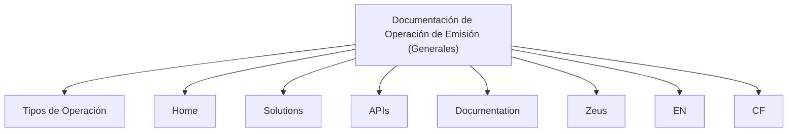

# Documentação de Operação de Emissão — Generales

## 1. Metadados do Documento
- **Arquivo de Origem:** Não identificado
- **Tipo de Documento:** Procedimento
- **Domínio / Sistema:** Emissão — Generales
- **Público-Alvo:** Operação e negócio
- **Data/Versão Identificada:** Não identificada

---

## 2. Resumo Executivo & Contexto de Negócio

O conteúdo fornecido apresenta uma referência intitulada **“DOCUMENTACIÓN de OPERACIÓN de EMISIÓN (Generales)”**. O texto declara que a documentação é orientada à operação e ao tipo de negócio denominado **Generales**.

O documento também menciona **“TIPOS DE OPERACIÓN”**, mas não descreve quais tipos de operação existem, seus critérios, responsáveis, entradas, saídas ou procedimentos de execução.

Há referências textuais a **Home**, **Solutions**, **APIs**, **Documentation**, **Zeus**, **EN** e **CF**. O conteúdo não estabelece explicitamente se esses termos representam sistemas, módulos, menus, ambientes, links, fornecedores, siglas ou elementos de navegação.

Não há detalhamento suficiente para identificar arquitetura técnica, contratos de APIs, integrações, regras funcionais, parâmetros operacionais ou indicadores de negócio.

---

## 3. Arquitetura, Componentes & Tecnologias Envolvidas

Os termos a seguir são citados no conteúdo bruto:

- Emisión
- Generales
- Tipos de Operación
- Home
- Solutions
- APIs
- Documentation
- Zeus
- EN
- CF

O texto não descreve relações técnicas, fluxo de dados, protocolos, tecnologias, interfaces, ambientes ou responsabilidades entre os itens citados.



> **Nota de Análise:** O diagrama representa apenas a coocorrência dos termos no conteúdo fornecido. O documento não especifica fluxos funcionais, integrações ou dependências entre Home, Solutions, APIs, Zeus, EN e CF.

---

## 4. Regras de Negócio, Especificações Funcionais & Processos

1. A documentação é identificada como orientada à operação de **Emisión**.
2. A documentação é associada ao tipo de negócio **Generales**.
3. O conteúdo inclui a expressão **“TIPOS DE OPERACIÓN”**.
4. Não foram fornecidas regras de negócio, critérios de elegibilidade, validações, cálculos, estados, exceções ou procedimentos operacionais.
5. Não foram fornecidos métodos HTTP, contratos de API, payloads, códigos de retorno, políticas de autenticação ou requisitos de integração.

> **Nota de Análise:** O documento lista referências a APIs e Zeus, porém não detalha métodos HTTP, contratos JSON, endpoints, autenticação ou responsabilidades técnicas.

---

## 5. Tabelas de Parâmetros, Ambientes e Estruturas de Dados

| Item / Parâmetro | Descrição / Função | Tipo / Valores / Formato | Ambiente / Observações |
| :--- | :--- | :--- | :--- |
| Emisión | Tema central identificado no título da documentação. | Texto | Associado a Generales. |
| Generales | Tipo de negócio mencionado no documento. | Texto | Não há detalhamento adicional. |
| Tipos de Operación | Seção ou assunto citado. | Texto | Os tipos não são enumerados. |
| Home | Termo presente no conteúdo. | Texto | Função não especificada. |
| Solutions | Termo presente no conteúdo. | Texto | Função não especificada. |
| APIs | Termo presente no conteúdo. | Texto | Não há endpoints ou contratos informados. |
| Documentation | Termo presente no conteúdo. | Texto | Pode referir-se à própria documentação; não confirmado. |
| Zeus | Termo presente no conteúdo. | Texto | Não há definição ou papel técnico informado. |
| EN | Sigla ou marcador presente no conteúdo. | Texto | Significado não identificado. |
| CF | Sigla ou marcador presente no conteúdo. | Texto | Significado não identificado. |

---

## 6. Bateria de Perguntas & Respostas para RAG (FAQ Sintético)

### P1: Qual é o assunto principal da documentação fornecida?
**R:** O assunto principal é a documentação de operação de **Emisión**, associada ao contexto ou tipo de negócio **Generales**.

### P2: Para qual tipo de negócio a documentação de Emisión é orientada?
**R:** O conteúdo informa que a documentação é orientada ao tipo de negócio **Generales**.

### P3: Quais tipos de operação são definidos no documento?
**R:** O documento contém o título ou referência **“TIPOS DE OPERACIÓN”**, mas não enumera nem descreve tipos específicos de operação.

### P4: O documento especifica uma arquitetura de integração para APIs?
**R:** Não. Embora o termo **APIs** seja citado, não há informações sobre endpoints, métodos HTTP, contratos, payloads, autenticação, protocolos ou fluxos de integração.

### P5: Qual é a função do componente Zeus na operação de Emisión?
**R:** O conteúdo menciona **Zeus**, mas não define sua função, responsabilidade, integração ou relação com Emisión e Generales.

### P6: Existem URLs, servidores ou ambientes identificados?
**R:** Não. O conteúdo não fornece URLs, nomes de servidores, portas, ambientes técnicos ou configurações de acesso.

### P7: O documento apresenta regras de negócio para emissão?
**R:** Não. O documento identifica o tema como documentação de operação de Emisión, mas não apresenta regras, condições, cálculos, validações ou exceções de negócio.

### P8: Home e Solutions são sistemas ou módulos da solução?
**R:** Não é possível confirmar. **Home** e **Solutions** aparecem no conteúdo, mas o documento não explica se representam sistemas, módulos, opções de menu ou outros elementos.

### P9: O que significa a sigla CF no documento?
**R:** A sigla **CF** aparece no conteúdo bruto, mas não possui definição explícita no material fornecido.

### P10: O que significa EN no contexto do documento?
**R:** O marcador **EN** é mencionado, mas seu significado e sua função não são explicados no texto fornecido.

---

## 7. Glossário de Termos, Siglas & Conceitos-Chave

- **Emisión:** Termo central do título da documentação; o conteúdo não fornece definição funcional adicional.
- **Generales:** Tipo de negócio mencionado como contexto da documentação de operação.
- **Tipos de Operación:** Expressão presente no documento sem enumeração ou descrição dos tipos.
- **APIs:** Termo citado sem especificação de interfaces, endpoints ou contratos.
- **Zeus:** Termo citado sem definição de sistema, componente ou responsabilidade.
- **CF:** Sigla ou marcador sem significado identificado no conteúdo.
- **EN:** Sigla ou marcador sem significado identificado no conteúdo.

---

## 8. Notas Críticas, Riscos & Limitações

- O material fornecido possui baixa densidade informacional e não detalha processos operacionais executáveis.
- Não há identificação de arquivo, versão, data, autoria ou responsáveis.
- Não há arquitetura técnica verificável, apesar da presença dos termos APIs e Zeus.
- Não há definição dos tipos de operação mencionados.
- Não há dados de ambiente, URLs, rotas de logs, credenciais, configurações ou parâmetros.
- As siglas **CF** e **EN** não são definidas.
- Qualquer interpretação de Home, Solutions, APIs, Documentation ou Zeus além de sua simples menção seria especulativa.

---

## 9. Conteúdo Bruto Estruturado (Referência Fiel)

```text
--- [PÁGINA 1 DE 1] ---

DOCUMENTACIÓN de OPERACIÓN de
EMISIÓN (Generales)
Imagen GENERALES Documentación orientada a la operación y tipo de negocio
TIPOS DE OPERACIÓN
 
 
 
 
 / 
 CF
Home Solutions APIs Documentation Zeus
EN
```
