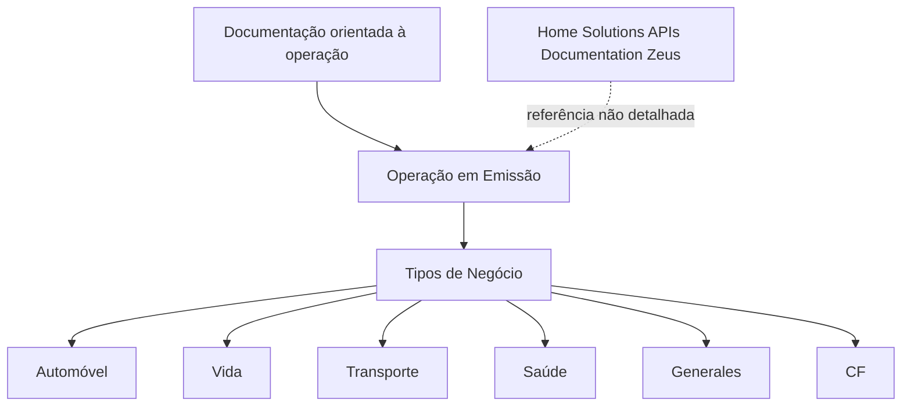

# Documentação de Operação em Emissão e Tipos de Negócio — Home Solutions APIs Zeus

## 1. Metadados do Documento
- **Arquivo de Origem:** Não identificado
- **Tipo de Documento:** Procedimento / Documentação operacional
- **Domínio / Sistema:** Operação em Emissão; Home Solutions APIs; Zeus
- **Público-Alvo:** Operação e áreas de negócio
- **Data/Versão Identificada:** Não identificada

---

## 2. Resumo Executivo & Contexto de Negócio

O documento apresenta uma referência intitulada **“Operación en Emisión”**, indicando foco operacional associado ao processo de emissão. O conteúdo disponível declara que a documentação é orientada à operação e ao tipo de negócio.

Os tipos de negócio explicitamente listados são **Automóvel, Vida, Transporte, Saúde, Generales e CF**. O documento não define processos específicos, regras de emissão, responsabilidades operacionais, integrações, APIs, contratos ou critérios de validação para essas categorias.

Também são citados os termos **Home Solutions**, **APIs Documentation** e **Zeus**, sem explicitar a relação arquitetural, funcional ou operacional entre eles e a operação em emissão.

**Nota de Análise:** o conteúdo extraído corresponde a uma página resumida, marcada como **“EN CONSTRUCCIÓN”**. Não há detalhamento adicional suficiente para reconstruir processos, integrações ou especificações técnicas.

---

## 3. Arquitetura, Componentes & Tecnologias Envolvidas

Os componentes e termos identificados são:

| Componente / Termo | Contexto identificado | Detalhamento disponível |
| :--- | :--- | :--- |
| Operación en Emisión | Tema central do documento | Não especificado |
| Home Solutions | Termo listado no rodapé ou referência de navegação | Não especificado |
| APIs Documentation | Referência a documentação de APIs | Não há endpoints, métodos HTTP ou contratos |
| Zeus | Sistema ou referência citada | Não especificado |
| EN | Indicador textual exibido no documento | Não especificado |



**Nota de Análise:** o diagrama representa exclusivamente as associações textuais presentes no conteúdo. O documento não descreve chamadas entre sistemas, fluxos de dados, camadas de arquitetura ou dependências técnicas.

---

## 4. Regras de Negócio, Especificações Funcionais & Processos

O documento estabelece os seguintes elementos funcionais e operacionais:

1. A documentação é orientada para **operação**.
2. A documentação está associada a **tipos de negócio**.
3. Os tipos de negócio listados são:
   - Automóvel;
   - Vida;
   - Transporte;
   - Saúde;
   - Generales;
   - CF.
4. O tema operacional identificado é **Operación en Emisión**.
5. O documento contém o status ou indicação textual **“EN CONSTRUCCIÓN”**.

Não foram identificadas regras de cálculo, critérios de elegibilidade, estados do processo de emissão, papéis de usuários, matrizes de aprovação, exceções operacionais, campos obrigatórios ou regras de validação.

---

## 5. Tabelas de Parâmetros, Ambientes e Estruturas de Dados

| Item / Parâmetro | Descrição / Função | Tipo / Valores / Formato | Ambiente / Observações |
| :--- | :--- | :--- | :--- |
| Status do documento | Indicação textual do estado do conteúdo | `EN CONSTRUCCIÓN` | Sugere conteúdo em construção; não há explicação adicional |
| Tema operacional | Assunto central citado | `OPERACIÓN en EMISIÓN` | Sem fluxo operacional detalhado |
| Orientação documental | Direcionamento declarado para a documentação | Operação e tipo de negócio | Sem escopo adicional |
| Tipo de negócio | Categoria de negócio listada | `AUTOMÓVIL` | Sem regras específicas |
| Tipo de negócio | Categoria de negócio listada | `VIDA` | Sem regras específicas |
| Tipo de negócio | Categoria de negócio listada | `TRANSPORTE` | Sem regras específicas |
| Tipo de negócio | Categoria de negócio listada | `SALUD` | Sem regras específicas |
| Tipo de negócio | Categoria de negócio listada | `GENERALES` | Sem regras específicas |
| Tipo de negócio | Categoria de negócio listada | `CF` | Sigla não expandida no documento |
| Referência citada | Termo textual relacionado a documentação e sistema | `Home Solutions APIs Documentation Zeus` | Relação entre os termos não detalhada |
| Indicador textual | Texto exibido no conteúdo | `EN` | Sem definição no documento |

---

## 6. Bateria de Perguntas & Respostas para RAG (FAQ Sintético)

### P1: Qual é o tema operacional central apresentado no documento?
**R:** O tema operacional central é **“Operación en Emisión”**. O documento não detalha as etapas, os responsáveis ou as regras desse processo de emissão.

### P2: Para qual finalidade a documentação é orientada?
**R:** A documentação é declarada como orientada à **operação** e ao **tipo de negócio**.

### P3: Quais tipos de negócio são listados na documentação?
**R:** Os tipos de negócio listados são **Automóvel, Vida, Transporte, Saúde, Generales e CF**.

### P4: O documento descreve o fluxo completo de emissão?
**R:** Não. O documento apenas cita **“Operación en Emisión”** e não apresenta etapas, transições, aprovações, regras de validação ou exceções do processo.

### P5: Há especificações de APIs, endpoints ou contratos JSON?
**R:** Não. Embora o texto mencione **“APIs Documentation”**, não há métodos HTTP, URLs, endpoints, parâmetros, payloads, autenticação ou contratos JSON.

### P6: Qual é o significado de “EN CONSTRUCCIÓN” no documento?
**R:** **“EN CONSTRUCCIÓN”** é uma indicação textual presente no conteúdo. O documento não explica formalmente o seu significado, mas o conteúdo disponível não apresenta detalhamento técnico ou operacional aprofundado.

### P7: O que é Zeus no contexto do documento?
**R:** **Zeus** é citado junto de “Home Solutions APIs Documentation”. O documento não informa se Zeus é um sistema, módulo, ambiente, aplicação ou produto.

### P8: O documento apresenta ambientes, servidores ou URLs?
**R:** Não. Não foram identificados nomes de ambientes, servidores, endereços URL, portas, credenciais, rotas de logs ou parâmetros de configuração.

### P9: Existem regras específicas para Automóvel, Vida, Transporte, Saúde, Generales ou CF?
**R:** Não. Essas categorias aparecem somente como uma lista de tipos de negócio, sem regras funcionais ou operacionais associadas.

### P10: A sigla CF está definida no conteúdo?
**R:** Não. O documento lista **CF** como tipo de negócio, mas não expande nem define a sigla.

---

## 7. Glossário de Termos, Siglas & Conceitos-Chave

- **Operación en Emisión:** expressão que identifica o tema operacional central do documento; o processo não é detalhado.
- **Automóvil:** tipo de negócio listado no documento.
- **Vida:** tipo de negócio listado no documento.
- **Transporte:** tipo de negócio listado no documento.
- **Salud:** tipo de negócio listado no documento.
- **Generales:** tipo de negócio listado no documento.
- **CF:** tipo de negócio listado; sigla sem definição no conteúdo.
- **Home Solutions:** termo citado no documento; sem definição adicional.
- **APIs Documentation:** referência textual a documentação de APIs; sem especificações técnicas.
- **Zeus:** termo citado no documento; sem definição adicional.
- **EN:** indicador textual exibido; sem significado definido.
- **EN CONSTRUCCIÓN:** status ou indicação textual de conteúdo em construção.

---

## 8. Notas Críticas, Riscos & Limitações

- O conteúdo disponível está marcado como **“EN CONSTRUCCIÓN”**.
- Não há arquivo de origem, data, versão ou autoria identificados.
- Não há detalhamento de arquitetura, integrações, componentes, ambientes, servidores ou URLs.
- Não há descrição de APIs, métodos HTTP, contratos de dados ou requisitos de autenticação.
- Não há regras de negócio específicas para Automóvel, Vida, Transporte, Saúde, Generales ou CF.
- A sigla **CF** não é definida.
- Os termos **Home Solutions**, **Zeus** e **EN** são citados sem contexto adicional.
- A extração contém somente uma página, conforme a indicação literal **“PÁGINA 1 DE 1”**.

---

## 9. Conteúdo Bruto Estruturado (Referência Fiel)

```text
--- [PÁGINA 1 DE 1] ---

EN CONSTRUCCIÓN
OPERACIÓN en EMISIÓN
 Documentación orientada a la operación y tipo de negocio.
TIPOS DE NEGOCIO
 AUTOMÓVIL
  VIDA
 TRANSPORTE
  SALUD
 GENERALES
 / 
 CF
Home Solutions APIs Documentation Zeus
EN
```
