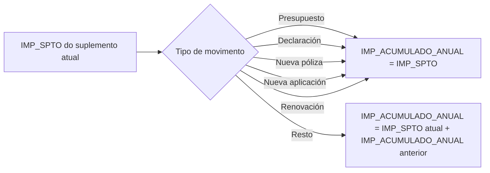

# Conceitos de Desglose — Informação Económica de Apólices e Riscos no Reef.core

## 1. Metadados do Documento
- **Arquivo de Origem:** Texto bruto fornecido pelo utilizador; nome do arquivo não identificado.
- **Tipo de Documento:** Especificação Técnica.
- **Domínio / Sistema:** Reef.core / MAPFRE / informação económica de apólices e riscos.
- **Público-Alvo:** Desenvolvedores, analistas funcionais e equipas que parametrizam ou operam movimentos de apólices e riscos.
- **Data/Versão Identificada:** Não identificada.

---

## 2. Resumo Executivo & Contexto de Negócio

O documento descreve o significado e o comportamento de colunas económicas associadas a uma apólice ou risco na tabela `A2100170`, denominada **CONCEPTOS DE DESGLOSE ECONÓMICO DE LA PÓLIZA**. O objetivo declarado é compreender o conteúdo das colunas que contêm informação económica de apólices e riscos, especialmente `IMP_ANUAL`, `IMP_NO_CONSUMIDO`, `IMP_SPTO` e `IMP_ACUMULADO_ANUAL`.

A lógica apresentada utiliza o exemplo de um conceito de desagregação económica que aplica um recargo segundo a idade do segurado. Nesse exemplo, a idade é uma informação do risco que influencia o cálculo económico, desde que esteja registada e assinalada como relevante para a tarifa. Esta identificação permite que o Reef.core reconheça alterações em suplementos e aplique a parametrização correspondente.

O `IMP_ANUAL` representa o valor anual de cobertura e é a base para os restantes cálculos. O `IMP_NO_CONSUMIDO` representa o valor que deve ser devolvido ou cobrado quando um conceito deixa de ser aplicável durante a vigência. O `IMP_SPTO` é o valor a receber ou devolver pela MAPFRE e serve posteriormente para gerar quotas. O `IMP_ACUMULADO_ANUAL` consolida os valores de suplemento gerados no período de vigência.

O documento distingue suplementos que anulam a apólice ou risco daqueles que mantêm a apólice ou risco vigente. Também estabelece exceções: suplementos de renovação não calculam `IMP_NO_CONSUMIDO`, pois criam um novo período de vigência, e suplementos de regularização também não calculam essa coluna.

---

## 3. Arquitetura, Componentes & Tecnologias Envolvidas

### Sistemas, tabelas e entidades identificados

| Componente / Entidade | Papel no documento |
| :--- | :--- |
| `Reef.core` | Sistema que utiliza informação de apólice e risco para calcular ou recalcular valores económicos durante suplementos. |
| `MAPFRE` | Entidade que recebe ou devolve os importes económicos expressos nas colunas `IMP_ANUAL` e `IMP_SPTO`. |
| `A2100170` | Tabela denominada `CONCEPTOS DE DESGLOSE ECONÓMICO DE LA PÓLIZA`. |
| Apólice | Entidade contratual sobre a qual são aplicados movimentos, suplementos, renovação e cálculos económicos. |
| Risco | Entidade associada à apólice cuja informação pode afetar o cálculo económico. |
| Suplemento | Movimento que pode modificar a situação económica da apólice ou do risco. |
| Renovação | Movimento que cria um novo período de vigência. |
| Regularização | Tipo de suplemento que não calcula `IMP_NO_CONSUMIDO`. |
| Quotas | Valores posteriormente criados a partir de `IMP_SPTO`. |

```mermaid
flowchart TD
    A[Informação da apólice e/ou risco] --> B{Informação registada e marcada como afeta a tarifa?}
    B -->|Sim| C[Reef.core determina IMP_ANUAL]
    B -->|Não detalhado no documento| D[Sem comportamento adicional especificado]

    C --> E[Suplemento com datas conhecidas]
    E --> F{Suplemento está dentro do período de vigência?}

    F -->|Não: renovação| G[Não calcular IMP_NO_CONSUMIDO]
    F -->|Sim| H{Suplemento é de regularização?}

    H -->|Sim| I[Não calcular IMP_NO_CONSUMIDO]
    H -->|Não| J{Anula apólice ou risco?}

    J -->|Não| K[IMP_NO_CONSUMIDO = IMP_ANUAL anterior × coeficiente de constituição]
    J -->|Sim| L[IMP_NO_CONSUMIDO = (IMP_SPTO anterior + IMP_NO_CONSUMIDO anterior) × coeficiente de anulação]

    K --> M[Calcular IMP_SPTO]
    L --> M
    M --> N[IMP_SPTO = IMP_ANUAL × coeficiente de constituição - IMP_NO_CONSUMIDO]
    N --> O[Gerar quotas]
    N --> P[Atualizar IMP_ACUMULADO_ANUAL]
```

**Nota de Análise:** O documento menciona o Reef.core, mas não detalha a arquitetura interna, métodos HTTP, contratos JSON, bases de dados adicionais, integrações externas ou interfaces técnicas do sistema.

---

## 4. Regras de Negócio, Especificações Funcionais & Processos

### 4.1 Regra de cálculo condicionada por informação de apólice ou risco

- O cálculo de `IMP_ANUAL` depende de informação da apólice e/ou do risco declarada como informação que afeta o cálculo.
- No exemplo apresentado, a informação que afeta o cálculo é a **idade do segurado**.
- Qualquer informação existente na apólice e/ou risco pode interferir no cálculo de `IMP_ANUAL`.
- Para que o Reef.core reconheça alterações durante um suplemento e atue conforme a parametrização, a informação deve:
  1. Estar registada.
  2. Estar marcada como informação que afeta a tarifa.

### 4.2 Regra de recargo por idade

| Idade | Recargo |
| :--- | :--- |
| 15 | 150,00 |
| 16 | 160,00 |
| 17 | 170,00 |
| 18 | 180,00 |
| 19 | 365,00 |
| >= 20 | 0,00 |

### 4.3 Regras de `IMP_ANUAL`

- `IMP_ANUAL` é o valor correspondente a um ano de cobertura.
- `IMP_ANUAL` é o valor-base utilizado para calcular as restantes colunas descritas.
- `IMP_ANUAL` é expresso com sinal:
  - Valor positivo: valor que a MAPFRE receberá.
  - Valor negativo: valor que a MAPFRE devolverá.
- `IMP_ANUAL` não participa na geração de quotas.
- Para a idade do segurado igual a 15, os cenários apresentados mantêm `IMP_ANUAL` igual a `150,00`, independentemente dos dias de vigência indicados.

### 4.4 Regras de `IMP_NO_CONSUMIDO`

- `IMP_NO_CONSUMIDO` é, conceitualmente, o valor que deve ser devolvido ou cobrado, dependendo do sinal, caso o conceito de desagregação económica deixe de ser aplicável.
- O Reef.core simula a anulação do conceito de desagregação para determinar `IMP_NO_CONSUMIDO`.
- O cálculo é executado:
  1. Quando são conhecidas as datas do novo suplemento do risco afetado.
  2. Antes de qualquer modificação sobre o risco.
- `IMP_NO_CONSUMIDO` é calculado quando:
  - Existe um suplemento.
  - O suplemento está dentro do período de vigência.
- Uma renovação não calcula `IMP_NO_CONSUMIDO`, pois a renovação cria um novo período de vigência e, segundo o documento, não existe valor consumido ou não consumido.
- Um suplemento de tipo regularização não calcula `IMP_NO_CONSUMIDO`.

#### Cálculo quando o suplemento não anula a apólice ou o risco

O cálculo considera, no último suplemento não anulado:

- `IMP_ANUAL` do movimento anterior.
- Coeficiente de constituição.

**Fórmula:**

```text
IMP_NO_CONSUMIDO := IMP_ANUAL × coeficiente_de_constituição
```

#### Cálculo quando o suplemento anula a apólice ou o risco

O cálculo considera, no último suplemento não anulado:

- `IMP_NO_CONSUMIDO` do suplemento anterior.
- `IMP_SPTO` do suplemento anterior.
- Coeficiente de anulação.

**Fórmula:**

```text
IMP_NO_CONSUMIDO := (IMP_SPTO + IMP_NO_CONSUMIDO) × coeficiente_de_anulação
```

### 4.5 Regras de `IMP_SPTO`

- `IMP_SPTO` é o valor que a MAPFRE deve receber ou devolver.
- `IMP_SPTO` é expresso com sinal.
- `IMP_SPTO` é utilizado posteriormente para criar quotas.
- O cálculo de `IMP_SPTO` depende de:
  - `IMP_ANUAL`.
  - Coeficiente de constituição.
  - `IMP_NO_CONSUMIDO` da situação anterior, quando o movimento ocorre dentro do período de vigência.
- Quando existe um suplemento e o conceito de desagregação já existia, é necessário considerar a parte não consumida desde a data do suplemento até ao vencimento, pois esse valor deve ser devolvido de acordo com a nova situação.

**Fórmula:**

```text
IMP_SPTO := IMP_ANUAL × coeficiente_de_constituição - IMP_NO_CONSUMIDO
```

### 4.6 Regras de `IMP_ACUMULADO_ANUAL`

- `IMP_ACUMULADO_ANUAL` contém o valor que será obtido se forem cobrados todos os recibos gerados no período de vigência.
- `IMP_ACUMULADO_ANUAL` é a soma de `IMP_SPTO` de todos os suplementos gerados no período de vigência.
- Na renovação, `IMP_ACUMULADO_ANUAL` é inicializado com o `IMP_SPTO` do suplemento.
- Para determinados movimentos, o valor é igual ao `IMP_SPTO` atual:
  - Presupuesto.
  - Declaración.
  - Nueva póliza.
  - Nueva aplicación.
  - Renovación.
- Para os restantes movimentos, o valor é calculado pela soma do `IMP_SPTO` do suplemento atual com o `IMP_ACUMULADO_ANUAL` do suplemento anterior.



---

## 5. Tabelas de Parâmetros, Ambientes e Estruturas de Dados

### 5.1 Tabela `A2100170` — Conceitos de desagregação económica da apólice

| Item / Parâmetro | Descrição / Função | Tipo / Valores / Formato | Ambiente / Observações |
| :--- | :--- | :--- | :--- |
| `COD_CIA` | Companhia. | Não detalhado. | Tabela `A2100170`. |
| `NUM_POLIZA` | Apólice. | Não detalhado. | Tabela `A2100170`. |
| `NUM_SPTO` | Número de suplemento. | Não detalhado. | Tabela `A2100170`. |
| `NUM_APLI` | Número de aplicação. | Não detalhado. | Tabela `A2100170`. |
| `NUM_SPTO_APLI` | Suplemento da aplicação. | Não detalhado. | Tabela `A2100170`. |
| `NUM_RIESGO` | Risco. | Não detalhado. | Tabela `A2100170`. |
| `NUM_PERIODO` | Período para apólices multianuais. | Não detalhado. | Tabela `A2100170`. |
| `COD_COB` | Cobertura. | Não detalhado. | Tabela `A2100170`. |
| `COD_DESGLOSE` | Conceito de desagregação económica. | Não detalhado. | Tabela `A2100170`. |
| `COD_ECO` | Conceito económico de recibo. | Não detalhado. | Tabela `A2100170`. |
| `NUM_BLOQUE_ESTUDIO` | Campo não utilizado. | Não se usa. | Tabela `A2100170`. |
| `IMP_ACUMULADO_ANUAL` | Valor acumulado anual dos suplementos no período de vigência. | Valor económico com sinal. | Inicializa em renovação com `IMP_SPTO`. |
| `IMP_SPTO` | Valor de suplemento a receber ou devolver pela MAPFRE. | Valor económico com sinal. | Base para geração de quotas. |
| `IMP_NO_CONSUMIDO` | Valor não consumido a devolver ou cobrar em determinadas situações. | Valor económico com sinal. | Não calculado em renovação nem em regularização. |
| `IMP_ANUAL` | Valor correspondente a um ano de cobertura. | Valor económico com sinal. | Base de cálculos; não gera quotas diretamente. |
| `COD_RAMO` | Ramo. | Não detalhado. | Tabela `A2100170`. |

### 5.2 Cenários de `IMP_ANUAL` para idade 15

| Cenário | Efeito | Vencimento | Dias de vigência | `IMP_ANUAL` |
| :--- | :--- | :--- | :--- | :--- |
| 1 | 01 Janeiro 2023 | 01 Janeiro 2024 | 365 | 150,00 |
| 2 | 01 Janeiro 2023 | 01 Outubro 2023 | 273 | 150,00 |
| 3 | 01 Janeiro 2023 | 01 Julho 2023 | 181 | 150,00 |
| 4 | 01 Janeiro 2023 | 01 Abril 2023 | 90 | 150,00 |

### 5.3 Exemplo de coeficiente de constituição

| Suplemento | Efeito | Vencimento | Dias de vigência | Coeficiente de constituição |
| :--- | :--- | :--- | :--- | :--- |
| 0 | 01 Janeiro 2023 | 01 Janeiro 2024 | 365 | 1,000000000 |
| 1 | 01 Fevereiro 2023 | 01 Janeiro 2024 | 334 | 0,915068493 |
| 2 | 01 Março 2023 | 01 Janeiro 2024 | 306 | 0,838356164 |
| 4 | 01 Maio 2023 | 01 Janeiro 2024 | 245 | 0,671232877 |

| Parâmetro | Valor |
| :--- | :--- |
| Dias do ano | 365 |

### 5.4 Exemplo de suplemento de anulação

| Suplemento | Efeito | Vencimento | Dias de vigência | Coeficiente de constituição | Coeficiente de anulação |
| :--- | :--- | :--- | :--- | :--- | :--- |
| 0 | 01 Janeiro 2023 | 01 Janeiro 2024 | 365 | 1,000000000 | Não apresentado |
| 1 | 01 Fevereiro 2023 | 01 Janeiro 2024 | 334 | 0,915068493 | Não apresentado |
| 2 | 01 Março 2023 | 01 Janeiro 2024 | 306 | 0,838356164 | Não apresentado |
| 4 | 01 Maio 2023 | 01 Janeiro 2024 | 245 | 0,671232877 | Não apresentado |
| 5 | 01 Julho 2023 | 01 Janeiro 2024 | 184 | N.A. | 0, |

### 5.5 Fórmulas de `IMP_ACUMULADO_ANUAL` por movimento

| Movimento | Fórmula |
| :--- | :--- |
| Presupuesto | `IMP_ACUMULADO_ANUAL = IMP_SPTO` |
| Declaración | `IMP_ACUMULADO_ANUAL = IMP_SPTO` |
| Nueva póliza | `IMP_ACUMULADO_ANUAL = IMP_SPTO` |
| Nueva aplicación | `IMP_ACUMULADO_ANUAL = IMP_SPTO` |
| Renovación | `IMP_ACUMULADO_ANUAL = IMP_SPTO` |
| Resto | `IMP_ACUMULADO_ANUAL = IMP_SPTO (suplemento atual) + IMP_ACUMULADO_ANUAL (suplemento anterior)` |

### 5.6 Exemplo de valores acumulados

| Suplemento | Tipo | `IMP_SPTO` | `IMP_ACUMULADO_ANUAL` |
| :--- | :--- | :--- | :--- |
| 0 | XX | 170,00 | 170,00 |
| 1 | AD | 127,50 | 297,50 |
| 2 | AP | -85,00 | 212,50 |
| 3 | AD | 42,52 | 250,02 |
| 4 | RF | 170,00 | 170,00 |
| 5 | AP | -10,00 | 160,00 |

**Nota de Análise:** O documento apresenta os códigos de tipo `XX`, `AD`, `AP` e `RF`, mas não define os respetivos significados.

---

## 6. Bateria de Perguntas & Respostas para RAG (FAQ Sintético)

### P1: Qual é o objetivo do documento sobre conceitos de desagregação económica?
**R:** O objetivo é explicar o conteúdo e o comportamento das colunas que armazenam informação económica de uma apólice ou risco, especialmente `IMP_ANUAL`, `IMP_NO_CONSUMIDO`, `IMP_SPTO` e `IMP_ACUMULADO_ANUAL`, presentes na tabela `A2100170`.

### P2: O que representa a coluna `IMP_ANUAL`?
**R:** `IMP_ANUAL` representa o valor correspondente a um ano de cobertura. É o valor-base para o cálculo das restantes colunas económicas. Um valor positivo representa um montante que a MAPFRE receberá; um valor negativo representa um montante que a MAPFRE devolverá. A coluna não participa diretamente na geração de quotas.

### P3: Que informação pode afetar o cálculo de `IMP_ANUAL` no Reef.core?
**R:** Qualquer informação registada na apólice e/ou no risco pode afetar `IMP_ANUAL`, desde que esteja marcada como informação que afeta a tarifa. No exemplo do documento, a idade do segurado é a informação utilizada para definir o recargo económico.

### P4: Quando o `IMP_NO_CONSUMIDO` é calculado?
**R:** `IMP_NO_CONSUMIDO` é calculado quando é realizado um suplemento dentro do período de vigência, após serem conhecidas as datas do novo suplemento do risco afetado e antes de qualquer modificação. A coluna não é calculada em suplementos de renovação nem em suplementos de regularização.

### P5: Por que uma renovação não calcula `IMP_NO_CONSUMIDO`?
**R:** Uma renovação não calcula `IMP_NO_CONSUMIDO` porque não ocorre dentro do período de vigência existente: a renovação cria um novo período de vigência. Segundo o documento, nessa situação não existe valor consumido nem valor por consumir.

### P6: Como é calculado `IMP_NO_CONSUMIDO` quando o suplemento não anula a apólice ou o risco?
**R:** Para suplementos que mantêm a apólice ou o risco vigente, o cálculo usa o `IMP_ANUAL` do movimento anterior não anulado e o coeficiente de constituição. A fórmula é `IMP_NO_CONSUMIDO := IMP_ANUAL × coeficiente_de_constituição`.

### P7: Como é calculado `IMP_NO_CONSUMIDO` em um suplemento que anula a apólice ou o risco?
**R:** Em suplementos que anulam a apólice ou o risco, o cálculo utiliza o `IMP_SPTO` e o `IMP_NO_CONSUMIDO` do suplemento anterior não anulado, além do coeficiente de anulação. A fórmula é `IMP_NO_CONSUMIDO := (IMP_SPTO + IMP_NO_CONSUMIDO) × coeficiente_de_anulação`.

### P8: Qual é a fórmula de cálculo de `IMP_SPTO`?
**R:** A fórmula indicada é `IMP_SPTO := IMP_ANUAL × coeficiente_de_constituição - IMP_NO_CONSUMIDO`. O cálculo considera o valor anual, o coeficiente de constituição e, em movimentos dentro da vigência, o valor não consumido da situação anterior.

### P9: Para que serve `IMP_SPTO`?
**R:** `IMP_SPTO` representa o montante que a MAPFRE deve receber ou devolver, com expressão de sinal positivo ou negativo. É este valor que é utilizado posteriormente para criar quotas.

### P10: O que representa `IMP_ACUMULADO_ANUAL`?
**R:** `IMP_ACUMULADO_ANUAL` representa o valor que será obtido caso sejam cobrados todos os recibos gerados no período de vigência. É a soma dos valores de `IMP_SPTO` dos suplementos gerados nesse período.

### P11: Como `IMP_ACUMULADO_ANUAL` é atualizado para uma renovação?
**R:** Para o movimento de renovação, `IMP_ACUMULADO_ANUAL` é inicializado ou definido diretamente com o valor do `IMP_SPTO` do suplemento de renovação: `IMP_ACUMULADO_ANUAL = IMP_SPTO`.

### P12: Como `IMP_ACUMULADO_ANUAL` é calculado para movimentos que não são nova apólice, nova aplicação, renovação, presupuesto ou declaración?
**R:** Para os restantes movimentos, `IMP_ACUMULADO_ANUAL` é calculado como a soma do `IMP_SPTO` do suplemento atual com o `IMP_ACUMULADO_ANUAL` do suplemento anterior: `IMP_ACUMULADO_ANUAL = IMP_SPTO atual + IMP_ACUMULADO_ANUAL anterior`.

---

## 7. Glossário de Termos, Siglas & Conceitos-Chave

- **`A2100170`:** Tabela denominada `CONCEPTOS DE DESGLOSE ECONÓMICO DE LA PÓLIZA`.
- **Apólice / Póliza:** Entidade contratual referenciada pelos campos e cálculos económicos descritos.
- **Coeficiente de anulação:** Coeficiente utilizado no cálculo de `IMP_NO_CONSUMIDO` quando o suplemento anula a apólice ou o risco.
- **Coeficiente de constituição:** Coeficiente utilizado nos cálculos de `IMP_NO_CONSUMIDO` e `IMP_SPTO`.
- **Conceito de desagregação económica / Concepto de desglose económico:** Conceito económico associado a uma apólice ou risco; no exemplo, aplica um recargo em função da idade do segurado.
- **`COD_CIA`:** Companhia.
- **`COD_COB`:** Cobertura.
- **`COD_DESGLOSE`:** Código do conceito de desagregação económica.
- **`COD_ECO`:** Código do conceito económico de recibo.
- **`COD_RAMO`:** Ramo.
- **`IMP_ACUMULADO_ANUAL`:** Valor acumulado de `IMP_SPTO` no período de vigência.
- **`IMP_ANUAL`:** Valor anual da cobertura, utilizado como base de cálculo.
- **`IMP_NO_CONSUMIDO`:** Valor não consumido, a devolver ou cobrar em função do sinal e da situação do suplemento.
- **`IMP_SPTO`:** Valor económico do suplemento, posteriormente utilizado para gerar quotas.
- **MAPFRE:** Entidade que recebe ou devolve os valores económicos indicados no documento.
- **`NUM_APLI`:** Número de aplicação.
- **`NUM_BLOQUE_ESTUDIO`:** Campo indicado como não utilizado.
- **`NUM_PERIODO`:** Período para apólices multianuais.
- **`NUM_POLIZA`:** Número da apólice.
- **`NUM_RIESGO`:** Número ou referência do risco.
- **`NUM_SPTO`:** Número de suplemento.
- **`NUM_SPTO_APLI`:** Suplemento da aplicação.
- **Quotas:** Valores criados posteriormente a partir de `IMP_SPTO`.
- **Reef.core:** Sistema citado como responsável por reconhecer alterações relevantes para a tarifa durante suplementos.
- **Regularização:** Tipo de suplemento que não calcula `IMP_NO_CONSUMIDO`.
- **Renovação:** Movimento que cria um novo período de vigência.
- **Risco:** Entidade associada a uma apólice cuja informação pode influenciar cálculos económicos.
- **Suplemento:** Movimento sobre apólice ou risco que pode afetar valores económicos.

---

## 8. Notas Críticas, Riscos & Limitações

- O documento não identifica o nome do arquivo de origem, versão, data de publicação, autor ou equipa responsável.
- Não são especificados tipos de dados, precisão decimal, regras de arredondamento, moeda, persistência, transações ou mecanismos de auditoria para os campos económicos.
- Os significados dos códigos de tipo de suplemento `XX`, `AD`, `AP` e `RF` não são definidos.
- O documento não detalha a fórmula de obtenção dos coeficientes de constituição e de anulação; apenas apresenta os coeficientes em exemplos.
- O exemplo de suplemento de anulação apresenta o coeficiente de anulação do suplemento 5 como `0,`, sem precisão adicional.
- A nota de rodapé estabelece que suplemento anterior significa suplemento não anulado, pois um suplemento anulado “para Reef.core não existe”.
- Não há detalhamento de APIs, eventos, integrações, contratos de dados, logs, URLs de ambientes, permissões ou procedimentos operacionais.

---

## 9. Conteúdo Bruto Estruturado (Referência Fiel)

```text
--- [PÁGINA 1 DE 10] ---

Conceptos de desglose - Información
económica
Objetivo
Conocer cual es el contenido y el comportamiento de las columnas que contienen la información
económica de una póliza/riesgo (marcadas en negrita).
Modelo de datos involucrado
TABLA DESCRIPCIÓN
A2100170 CONCEPTOS DE DESGLOSE ECONÓMICO DE LA PÓLIZA
COLUMNA COMENTARIOS
COD_CIA COMPAÑÍA
NUM_POLIZA PÓLIZA
NUM_SPTO NUMERO DE SUPLEMENTO
NUM_APLI NUMERO DE APLICACIÓN
 /
 RS
Inicio Soluciones APIs Documentación Zeus
ES


--- [PÁGINA 2 DE 10] ---

COLUMNA COMENTARIOS
NUM_SPTO_APLI SUPLEMENTO DE LA APLICACIÓN
NUM_RIESGO RIESGO
NUM_PERIODO PERIODO (PARA PÓLIZAS MULTIANUALES)
COD_COB COBERTURA
COD_DESGLOSE CONCEPTO DE DESGLOSE ECONÓMICO
COD_ECO CONCEPTO ECONÓMICO DE RECIBO
NUM_BLOQUE_ESTUDIO NO SE USA
IMP_ACUMULADO_ANUAL IMPORTE ACUMULADO ANUAL
IMP_SPTO IMPORTE DEL SUPLEMENTO
IMP_NO_CONSUMIDO IMPORTE NO CONSUMIDO
IMP_ANUAL IMPORTE ANUAL
COD_RAMO RAMO
A continuación y con el fin de entender mejor el sentido de las columnas que ocupan este
documento, se establece unas bases para posteriormente realizar ejemplos:
Se supone que existe un concepto de desglose que, dependiendo de la edad del asegurado aplicará
un recargo. Para ello se cuenta con la siguiente tabla que determina para cada edad el monto a
aplicar:
Recargo por edad
EDAD RECARGO
15 150,00


--- [PÁGINA 3 DE 10] ---

EDAD RECARGO
16 160,00
17 170,00
18 180,00
19 365,00
>= 20 0,00
Columnas
Las columnas tratadas en este documento son:
IMP_ANUAL
IMP_NO_CONSUMIDO
IMP_SPTO
IMP_ACUMULADO_ANUAL
IMP_ANUAL
Importe que corresponde a un año de cobertura. Es el importe base con el que se halla el resto de
columnas que intervienen en este documento. Viene expresado con signo (positivo importe que
MAPFRE recibirá, negativo importe que MAPFRE devolverá). Este importe no interviene en la
generación de cuotas.
Este importe viene condicionado por:
La información del riesgo y/o la información de la póliza que ha debido ser declarada como que
afecta al cálculo (en el ejemplo es la edad del asegurado).
Es decir, cualquier información que disponga la póliza y/o riesgo puede intervenir en el modo en
el que se halla esta columna. Es importante que la información esté registrada y marcada como
que afecta a la tarifa para que Reef.core, en caso de suplemento pueda conocer que hubo o no
cambio y así actuar según la parametrización marcada.
Ejemplo
La información por la que viene condicionado el cálculo es:


--- [PÁGINA 4 DE 10] ---

EDAD DEL ASEGURADO
15
Con esta información, se muestran varios escenarios:
ESCENARIO EFECTO VENCIMIENTO DÍAS DE
VIGENCIA
IMP_ANUAL
1 01 Enero
2023
01 Enero 2024 365 150,00
2 01 Enero
2023
01 Octubre
2023
273 150,00
3 01 Enero
2023
01 Julio 2023 181 150,00
4 01 Enero
2023
01 Abril 2023 90 150,00
IMP_NO_CONSUMIDO
Conceptualmente es el importe que habría que devolver o cobrar (depende del signo), en caso que el
concepto de desglose deje de aplicarse. Es decir, Reef.core simula la anulación del concepto de
desglose.
Este cálculo se realiza en el momento que se conocen las fechas del nuevo suplemento del riesgo
afectado y previo a realizar cualquier modificación sobre este.
Riesgo
seleccionado
Efecto
del
riesgo
establecido
Importe
no
consumido
hallado
Modificación
de
riesgo
Fin
Este importe se calcula siempre que se realiza un suplemento, y el suplemento se encuentra dentro
del periodo de vigencia. Por ejemplo, una renovación no se realiza dentro del periodo de vigencia de
la póliza, sino que está creando un nuevo periodo de vigencia. Es por lo que en un suplemento de
renovación no se halla esta columna, ya que no hay ni consumido, ni sin consumir.


--- [PÁGINA 5 DE 10] ---

Existe una excepción a la regla anterior y aplica a los suplementos de tipo de regularización, que no
calcula esta columna.
Hay dos formas de hallar este importe:
1. El suplemento implica la anulación de la póliza/riesgo
2. El suplemento dejará la póliza o el riesgo vigente
Dependiendo del modo en el que la póliza/riesgo quedará, esta columna viene condicionada por:
Para suplementos que NO anulan la póliza/riesgo:
- El importe anual (columna IMP_ANUAL) del movimiento anterior (no anulado 1)
- El llamado coeficiente de constitución
Se aplica la fórmula siguiente sobre el último suplemento no anulado:
Ejemplo
Para este ejemplo se va a tomar una supuesta póliza que ha sufrido una serie de modificaciones
a lo largo del tiempo y el objetivo es hallar el importe no consumido. Hay que recordar que como
se ha comentado previamente, este importe se halla nada más conocer las fechas del
movimiento:
PARÁMETRO DÍAS AÑO
365
SUPLEMENTO EFECTO VENCIMIENTO DÍAS
VIGENCIA
COEFICIENTE
DE
CONSTITUCIÓN SUP
A
0 01
Enero
2023
01 Enero 2024 365 1,000000000
1 01
Febrero
2023
01 Enero 2024 334 0,915068493
1 imp_no_consumido := IMP_ANUAL * coeficiente_de_constitución


--- [PÁGINA 6 DE 10] ---

SUPLEMENTO EFECTO VENCIMIENTO DÍAS
VIGENCIA
COEFICIENTE
DE
CONSTITUCIÓN SUP
A
2 01
Marzo
2023
01 Enero 2024 306 0,838356164
4 01 Mayo
2023
01 Enero 2024 245 0,671232877
Para suplementos que SI anulan la póliza/riesgo:
- El importe no consumido (columna IMP_NO_CONSUMIDO) del suplemento anterior (no
anulado 1)
- El importe del suplemento (columna IMP_SPTO) del suplemento anterior (no anulado 1)
- El llamado coeficiente de anulación
Se aplica la fórmula siguiente sobre el último suplemento no anulado:
Ejemplo
Para este ejemplo se va a tomar la misma póliza que en el ejemplo anterior y se va a simular un
suplemento que anula la póliza. En este caso el suplemento de anulación es el último mostrado en la
tabla
PARÁMETRO DÍAS AÑO
365
SUPLEMENTO EFECTO VENCIMIENTO DÍAS
DE
VIGENCIA
COEFICIENTE
DE
CONSTITUCIÓN
COE
AN
0 01
Enero
2023
01 Enero 2024 365 1,000000000
1 imp_no_consumido := (IMP_SPTO + IMP_NO_CONSUMIDO) * coeficiente_de_anulación


--- [PÁGINA 7 DE 10] ---

SUPLEMENTO EFECTO VENCIMIENTO DÍAS
DE
VIGENCIA
COEFICIENTE
DE
CONSTITUCIÓN
COE
AN
1 01
Febrero
2023
01 Enero 2024 334 0,915068493
2 01
Marzo
2023
01 Enero 2024 306 0,838356164
4 01 Mayo
2023
01 Enero 2024 245 0,671232877
5 01 Julio
2023
01 Enero 2024 184 N.A. 0,
IMP_SPTO
Monto a recibir o a devolver (el importe se expresa con signo) por parte de MAPFRE. Con este
importe es con el que se crean posteriormente las cuotas.
Este importe viene condicionado por:
El importe anual (columna IMP_ANUAL), que como se comentó es la base para determinar el
valor a recibir o devolver
El llamado coeficiente de constitución
En caso de movimiento dentro del periodo de vigencia, el importe no consumido (columna
IMP_NO_CONSUMIDO) de la situación anterior
Es decir, si se realiza un suplemento y el concepto de desglose existía, hay que considerar
cuanto importe no se ha consumido desde la fecha del suplemento que se está realizando hasta
el vencimiento, ya que este importe ha de ser devuelto teniendo en cuenta que la situación
puede cambiar
La fórmula que aplica para esta columna es:
Ejemplo
1 imp_spto := IMP_ANUAL * coeficiente_de_constitución - IMP_NO_CONSUMIDO


--- [PÁGINA 8 DE 10] ---

Este ejemplo simula una póliza que tiene varios suplementos a lo largo del tiempo
PARÁMETRO DÍAS AÑO
365
SUPLEMENTO EFECTO VENCIMIENTO DÍAS
DE
VIGENCIA
COEFICIENTE
DE
CONSTITUCIÓN
I
CON
0 01
Enero
2023
01 Enero 2024 365 1,000000000
1 01
Febrero
2023
01 Enero 2024 334 0,915068493
2 01
Marzo
2023
01 Enero 2024 306 0,838356164
4 01 Mayo
2023
01 Enero 2024 245 0,671232877
IMP_ACUMULADO_ANUAL
Contiene el importe que se obtendrá si se cobran todos los recibos generados en el periodo de
vigencia. Es decir, contiene la suma de la columna IMP_SPTO de todos los suplementos generados
en el periodo de vigencia. Esta columna se inicializa en la renovación de la póliza con el importe del
suplemento (columna IMP_SPTO)
Para cada suplemento que se realiza, esta columna se halla de la forma:
MOVIMIENTO FÓRMULA
Presupuesto IMP_ACUMULADO_ANUAL = IMP_SPTO
Declaración IMP_ACUMULADO_ANUAL = IMP_SPTO


--- [PÁGINA 9 DE 10] ---

MOVIMIENTO FÓRMULA
Nueva póliza IMP_ACUMULADO_ANUAL = IMP_SPTO
Nueva
aplicación
IMP_ACUMULADO_ANUAL = IMP_SPTO
Renovación IMP_ACUMULADO_ANUAL = IMP_SPTO
Resto IMP_ACUMULADO_ANUAL = IMP_SPTO (suplemento actual) +
IMP_ACUMULADO_ANUAL (suplemento anterior)
Ejemplo
A continuación se muestra los importes de suplemento que se han generado en un periodo de
vigencia para una póliza:
SUPLEMENTO TIPO IMP_SPTO
0 XX 170,00
1 AD 127,50
2 AP -85,00
3 AD 42,52
4 RF 170,00
5 AP -10,00
Ahora se muestra el contenido de la columna IMP_ACUMULADO_ANUAL
SUPLEMENTO IMP_SPTO IMP_ACUMULADO_ANUAL
0 170,00 170,00
1 127,50 297,50


--- [PÁGINA 10 DE 10] ---

SUPLEMENTO IMP_SPTO IMP_ACUMULADO_ANUAL
2 -85,00 212,50
3 42,52 250,02
4 170,00 170,00
5 -10,00 160,00
1. Se refiere a un suplemento que no haya sido anulado, ya que un suplemento anulado, para Reef.core no existe
```
