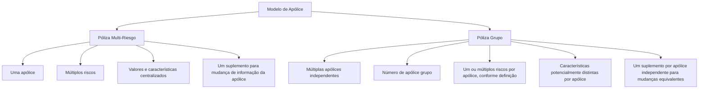

# Comparativo Funcional: Póliza Multi-Riesgo vs. Póliza Grupo

## 1. Metadados do Documento
- **Arquivo de Origem:** Não identificado; conteúdo bruto fornecido na solicitação.
- **Tipo de Documento:** Especificação funcional comparativa.
- **Domínio / Sistema:** Seguros — gestão de apólices, riscos, recibos, reaseguro, cosseguro, suplementos/endossos.
- **Público-Alvo:** Analistas funcionais, arquitetos de soluções, desenvolvedores, operação e áreas de negócio de seguros.
- **Data/Versão Identificada:** Não identificada.

---

## 2. Resumo Executivo & Contexto de Negócio

O documento compara dois modelos de estruturação de seguros: **Póliza Multi-Riesgo** e **Póliza Grupo**. O objetivo declarado é confrontar as características dos dois tipos de apólice para apoiar a decisão quando não estiver claro qual alternativa deve ser adotada.

A **Póliza Multi-Riesgo** concentra múltiplos riscos em uma única apólice. Consequentemente, diversos elementos de gestão são únicos e centralizados, incluindo número de apólice, moeda, tipo de câmbio, plano de pagamento, tipo de reaseguro, tipo de cosseguro, tomador, atributos, gestor de cobrança, textos anexos e cláusulas.

A **Póliza Grupo** é composta por múltiplas apólices independentes, organizadas sob um número de apólice grupo. Esse modelo permite que cada apólice tenha características próprias, como vencimento, moeda, tipo de câmbio, plano de pagamento, reaseguro, cosseguro, tomador, terceiros envolvidos, atributos, gestor de cobrança, textos, cláusulas e comissões, salvo quando existirem controles para unificação desses elementos.

O documento enfatiza impactos operacionais relevantes. Em especial, cálculos que devem incidir sobre a apólice como um todo são simples no modelo Multi-Riesgo, mas tornam-se complexos na Póliza Grupo, pois um valor precisa ser alocado a uma das apólices independentes do grupo e poderá precisar ser transferido se essa apólice deixar o grupo. Além disso, uma alteração de informação de apólice exige um único suplemento no modelo Multi-Riesgo e um suplemento por apólice independente no modelo Grupo.

---

## 3. Arquitetura, Componentes & Tecnologias Envolvidas

O documento não descreve arquitetura de software, tecnologias, integrações, microsserviços, URLs, ambientes ou contratos técnicos. O conteúdo apresenta uma **arquitetura funcional de dados e gestão de apólices** composta pelos seguintes conceitos:

- **Póliza Multi-Riesgo:** uma única apólice com múltiplos riscos.
- **Póliza Grupo:** múltiplas apólices independentes agrupadas sob um número de apólice grupo.
- **Risco:** elemento segurado associado a uma apólice.
- **Recibo:** documento ou unidade de cobrança emitida por apólice.
- **Suplemento / Endosso:** alteração realizada sobre informações de uma apólice ou de sua composição.
- **Tomador:** entidade associada à contratação da apólice.
- **Gestor de cobrança:** gestor associado à cobrança da apólice.
- **Reaseguro e cosseguro:** características aplicáveis às apólices.
- **Intervenções de cliente:** associações de terceiros por tipo de intervenção na apólice.



> **Nota de Análise:** O diagrama representa exclusivamente a estrutura funcional explicitada no documento. O conteúdo não detalha sistemas de origem, bases de dados, APIs, métodos HTTP, interfaces, eventos ou tecnologias de implementação.

---

## 4. Regras de Negócio, Especificações Funcionais & Processos

### 4.1 Estrutura e identificação da apólice

1. A **Póliza Multi-Riesgo** possui um único número de apólice.
2. A **Póliza Grupo** possui múltiplos números de apólice, além de um número de apólice grupo.
3. A Póliza Multi-Riesgo centraliza múltiplos riscos sob a mesma apólice.
4. A Póliza Grupo é formada por apólices independentes. Uma apólice independente pode conter um risco; outras podem conter múltiplos riscos, se a definição permitir.

### 4.2 Vencimentos

1. Na Póliza Multi-Riesgo, o vencimento dos riscos é unificado e corresponde ao vencimento da apólice.
2. Na Póliza Grupo, cada apólice independente pode possuir um vencimento diferente.
3. O documento indica que, no modelo Grupo, os vencimentos podem ser unificados por definição.

### 4.3 Moeda, tipo de câmbio e plano de pagamento

1. Uma Póliza Multi-Riesgo utiliza uma moeda.
2. Uma Póliza Multi-Riesgo utiliza um tipo de câmbio.
3. Uma Póliza Multi-Riesgo utiliza um plano de pagamento.
4. Uma Póliza Grupo pode permitir múltiplas moedas caso não exista controle adequado.
5. Uma Póliza Grupo pode utilizar múltiplos tipos de câmbio.
6. Uma Póliza Grupo pode permitir múltiplos planos de pagamento caso não exista controle adequado.

### 4.4 Recibos e cobrança

1. Uma Póliza Multi-Riesgo gera um recibo por apólice.
2. Uma Póliza Grupo também gera um recibo por apólice independente.
3. Portanto, uma Póliza Grupo possui tantos recibos quanto o número de apólices independentes que compõem o grupo.
4. Uma Póliza Multi-Riesgo possui um gestor de cobrança.
5. Uma Póliza Grupo pode possuir múltiplos gestores de cobrança, caso não exista controle adequado.

### 4.5 Reaseguro, cosseguro e comissões

1. Uma Póliza Multi-Riesgo possui um tipo de reaseguro.
2. Uma Póliza Grupo pode possuir múltiplos tipos de reaseguro.
3. Uma Póliza Multi-Riesgo possui um tipo de cosseguro.
4. Uma Póliza Grupo pode possuir múltiplos tipos de cosseguro caso não exista controle adequado.
5. Na Póliza Multi-Riesgo, as comissões afetam a apólice conforme a definição aplicável.
6. Na Póliza Grupo, cada apólice independente pode possuir uma comissão diferente caso não exista controle adequado.

### 4.6 Tomador, terceiros, atributos e conteúdo documental

1. Uma Póliza Multi-Riesgo possui um tomador.
2. Uma Póliza Grupo pode possuir múltiplos tomadores caso não exista controle adequado.
3. Na Póliza Multi-Riesgo, as intervenções de cliente utilizam os mesmos terceiros para cada intervenção.
4. Na Póliza Grupo, podem existir múltiplos terceiros em cada intervenção, caso não exista controle adequado.
5. Uma Póliza Multi-Riesgo possui valores únicos para atributos de apólice.
6. Uma Póliza Grupo pode possuir múltiplos valores de atributos de apólice, caso não exista controle adequado.
7. Uma Póliza Multi-Riesgo possui um texto anexo.
8. Uma Póliza Grupo pode possuir múltiplos textos anexos.
9. Uma Póliza Multi-Riesgo possui um conjunto de cláusulas de apólice.
10. Uma Póliza Grupo pode possuir múltiplos conjuntos de cláusulas de apólice, caso não exista controle adequado.

### 4.7 Cálculos que afetam a apólice

1. Na Póliza Multi-Riesgo, cálculos que devem afetar a apólice, mas não os riscos, podem ser realizados sem problema.
2. Na Póliza Grupo, um cálculo que deve afetar a apólice e não seus riscos é considerado uma tarefa muito complexa.
3. A complexidade existe porque as apólices que formam o grupo são independentes.
4. Para registrar o valor calculado no modelo Grupo, é necessário atribuí-lo a uma das apólices que compõem o grupo.
5. A apólice à qual o valor foi atribuído pode sair do grupo.
6. Se a apólice que detém o valor sair do grupo, pode ser necessário atribuir o valor a outra apólice integrante do grupo.

### 4.8 Ordem de comunicação de modificações

1. Na Póliza Multi-Riesgo, uma comunicação de modificações recebida fora da ordem adequada pode complicar a operação.
2. Essa complicação pode exigir, em alguns casos, a anulação de suplementos.
3. O documento indica que esse problema pode ser minimizado com o modelo de um risco por apólice.
4. No modelo de um risco por apólice, é realizado um suplemento por risco.
5. Na Póliza Grupo, como existem múltiplas apólices, comunicações de modificações recebidas em ordens distintas podem não afetar o mesmo risco.

### 4.9 Suplementos e endossos sobre informações da apólice

1. Na Póliza Multi-Riesgo, uma modificação na informação da apólice ou na apólice completa pode ser feita com um único suplemento.
2. O documento cita como exemplos de modificações:
   - Mudança de plano de pagamento.
   - Mudança de agente.
   - Mudança de tomador.
   - Mudança de atributos de apólice.
   - Anulação.
   - Reabilitação.
   - Renovação.
3. Na Póliza Grupo, os mesmos casos exigem a realização de um suplemento para cada apólice independente que forma a apólice grupo.

---

## 5. Tabelas de Parâmetros, Ambientes e Estruturas de Dados

| Item / Parâmetro | Descrição / Função | Tipo / Valores / Formato | Ambiente / Observações |
| :--- | :--- | :--- | :--- |
| Número de apólice | Identificação da apólice | Multi-Riesgo: um número; Grupo: múltiplos números e um número de apólice grupo | Não há ambientes técnicos descritos |
| Vencimento | Data de vencimento associada aos riscos ou apólices | Multi-Riesgo: vencimento unificado; Grupo: vencimentos potencialmente distintos | No Grupo, a unificação pode ocorrer por definição |
| Moeda | Moeda aplicável à apólice | Multi-Riesgo: uma moeda; Grupo: múltiplas moedas possíveis | No Grupo, múltiplas moedas podem ocorrer sem controle adequado |
| Tipo de câmbio | Tipo de câmbio aplicável | Multi-Riesgo: um tipo; Grupo: múltiplos tipos | Associado à multiplicidade de apólices independentes |
| Plano de pagamento | Plano utilizado para pagamento | Multi-Riesgo: um plano; Grupo: múltiplos planos possíveis | No Grupo, múltiplos planos podem ocorrer sem controle adequado |
| Recibo | Unidade de cobrança por apólice | Um recibo por apólice | No Grupo, há tantos recibos quanto apólices independentes |
| Tipo de reaseguro | Característica de reaseguro | Multi-Riesgo: um tipo; Grupo: múltiplos tipos | Não são detalhadas regras de compatibilidade |
| Tipo de cosseguro | Característica de cosseguro | Multi-Riesgo: um tipo; Grupo: múltiplos tipos possíveis | No Grupo, depende de controle adequado |
| Tomador | Entidade tomadora da apólice | Multi-Riesgo: um tomador; Grupo: múltiplos tomadores possíveis | No Grupo, depende de controle adequado |
| Intervenções de cliente | Terceiros associados a intervenções | Multi-Riesgo: mesmos terceiros; Grupo: múltiplos terceiros possíveis | No Grupo, depende de controle adequado |
| Atributos de apólice | Valores de atributos associados à apólice | Multi-Riesgo: valores únicos; Grupo: múltiplos valores possíveis | No Grupo, depende de controle adequado |
| Gestor de cobrança | Responsável pela cobrança | Multi-Riesgo: um gestor; Grupo: múltiplos gestores possíveis | No Grupo, depende de controle adequado |
| Textos anexos | Texto associado à apólice | Multi-Riesgo: um texto; Grupo: múltiplos textos | Não há formato de texto especificado |
| Cláusulas de apólice | Conjunto de cláusulas aplicáveis | Multi-Riesgo: um conjunto; Grupo: múltiplos conjuntos possíveis | No Grupo, depende de controle adequado |
| Comissões | Comissão aplicável à apólice | Multi-Riesgo: conforme definição; Grupo: potencialmente distinta por apólice | Requer controle no modelo Grupo para padronização |
| Importes que afetam a apólice | Valores calculados que devem afetar a apólice, e não os riscos | Multi-Riesgo: gestão sem problema; Grupo: alocação a uma apólice independente | No Grupo, há risco de necessidade de realocação se a apólice sair do grupo |
| Riscos da apólice | Elementos de risco segurados | Multi-Riesgo: múltiplos riscos em uma apólice; Grupo: um ou múltiplos riscos por apólice independente | Múltiplos riscos no Grupo dependem da definição |
| Comunicação de modificações | Recebimento de modificações em determinada ordem | Multi-Riesgo: fora de ordem pode demandar anulação de suplementos; Grupo: pode não afetar o mesmo risco | O documento sugere o modelo um risco, uma apólice como mitigação |
| Suplementos / Endossos | Mecanismo para modificar a apólice | Multi-Riesgo: um suplemento; Grupo: um suplemento por apólice independente | Aplicável a plano de pagamento, agente, tomador, atributos, anulação, reabilitação e renovação |

---

## 6. Bateria de Perguntas & Respostas para RAG (FAQ Sintético)

### P1: Qual é a diferença estrutural entre uma Póliza Multi-Riesgo e uma Póliza Grupo?
**R:** A Póliza Multi-Riesgo concentra múltiplos riscos em uma única apólice, identificada por um único número de apólice. A Póliza Grupo é formada por múltiplas apólices independentes, cada uma com seu próprio número, além de um número de apólice grupo que representa o agrupamento.

### P2: Como funciona o vencimento em uma Póliza Multi-Riesgo em comparação com uma Póliza Grupo?
**R:** Na Póliza Multi-Riesgo, o vencimento dos riscos é unificado e corresponde ao vencimento da própria apólice. Na Póliza Grupo, cada apólice independente pode ter vencimento diferente, embora o documento indique que a unificação pode ser definida.

### P3: Uma Póliza Grupo pode possuir moedas e tipos de câmbio diferentes?
**R:** Sim. Como uma Póliza Grupo reúne múltiplas apólices independentes, ela pode permitir múltiplas moedas e múltiplos tipos de câmbio. O documento alerta que múltiplas moedas podem existir se não houver controle adequado.

### P4: Quantos recibos são gerados por uma Póliza Grupo?
**R:** É gerado um recibo por apólice independente. Portanto, uma Póliza Grupo terá tantos recibos quanto o número de apólices independentes que a compõem.

### P5: Como reaseguro e cosseguro são tratados nos dois modelos de apólice?
**R:** A Póliza Multi-Riesgo possui um tipo de reaseguro e um tipo de cosseguro para a única apólice. A Póliza Grupo pode possuir múltiplos tipos de reaseguro e múltiplos tipos de cosseguro, pois é formada por apólices independentes; no caso do cosseguro, o documento ressalta a necessidade de controle adequado.

### P6: Por que cálculos que afetam apenas a apólice são complexos em uma Póliza Grupo?
**R:** A complexidade decorre da independência entre as apólices do grupo. Um valor que deve afetar o grupo, e não um risco específico, precisa ser atribuído a uma das apólices independentes. Se essa apólice deixar o grupo, o valor deverá potencialmente ser reatribuído a outra apólice do grupo.

### P7: Como são tratados suplementos ou endossos para mudança de plano de pagamento, agente ou tomador?
**R:** Na Póliza Multi-Riesgo, um único suplemento pode realizar a alteração na informação da apólice ou na apólice completa. Na Póliza Grupo, é necessário realizar um suplemento para cada apólice independente que compõe o grupo.

### P8: Quais alterações são citadas como exemplos de mudanças realizadas por suplemento?
**R:** O documento cita mudança de plano de pagamento, mudança de agente, mudança de tomador, mudança em atributos de apólice, anulação, reabilitação e renovação.

### P9: Como a ordem de comunicação de modificações afeta uma Póliza Multi-Riesgo?
**R:** Se a comunicação não chegar na ordem adequada, a operação pode se tornar complexa e, em alguns casos, exigir anulação de suplementos. O documento indica que isso pode ser mitigado pelo modelo de um risco por apólice, com um suplemento por risco.

### P10: Qual é o efeito de comunicações de modificações fora de ordem em uma Póliza Grupo?
**R:** Como a Póliza Grupo contém múltiplas apólices, comunicações de modificações recebidas em ordens distintas podem não afetar o mesmo risco. O documento não detalha outras regras de reconciliação ou validação para esse cenário.

### P11: Como tomador, terceiros e atributos são administrados em cada modelo?
**R:** Na Póliza Multi-Riesgo, há um tomador, os mesmos terceiros para cada intervenção e valores únicos para atributos de apólice. Na Póliza Grupo, podem existir múltiplos tomadores, múltiplos terceiros por intervenção e múltiplos valores de atributos caso não exista controle adequado.

### P12: Como comissões, textos anexos e cláusulas diferem entre os modelos?
**R:** Na Póliza Multi-Riesgo, as comissões afetam a única apólice conforme a definição, há um texto anexo e um conjunto de cláusulas. Na Póliza Grupo, cada apólice independente pode ter comissão distinta, múltiplos textos anexos e múltiplos conjuntos de cláusulas, especialmente se não houver controles de padronização.

---

## 7. Glossário de Termos, Siglas & Conceitos-Chave

- **Póliza / Apólice:** Contrato de seguro tratado pelo documento.
- **Póliza Multi-Riesgo:** Modelo com múltiplos riscos concentrados em uma única apólice.
- **Póliza Grupo:** Agrupamento de múltiplas apólices independentes sob um número de apólice grupo.
- **Risco:** Elemento segurado associado a uma apólice.
- **Número de apólice grupo:** Identificador do agrupamento de apólices independentes em uma Póliza Grupo.
- **Recibo:** Unidade emitida por apólice para fins de cobrança, conforme descrito no documento.
- **Tipo de câmbio:** Tipo de conversão monetária associado à apólice.
- **Plano de pagamento:** Configuração de pagamento aplicável à apólice.
- **Reaseguro:** Tipo de reaseguro associado à apólice.
- **Cosseguro / Coaseguro:** Tipo de cosseguro associado à apólice.
- **Tomador:** Entidade tomadora da apólice.
- **Intervenção de cliente:** Associação de terceiros a uma determinada intervenção na apólice.
- **Atributos de apólice:** Valores associados às características da apólice.
- **Gestor de cobrança:** Responsável pela cobrança associada à apólice.
- **Textos anexos:** Textos associados à apólice.
- **Cláusulas de apólice:** Cláusulas aplicáveis à apólice.
- **Suplemento / Endosso:** Mecanismo de alteração da informação de uma apólice ou da apólice completa.
- **Anulação:** Alteração de cancelamento citada como possível por suplemento.
- **Reabilitação:** Alteração citada como possível por suplemento.
- **Renovação:** Alteração citada como possível por suplemento.

---

## 8. Notas Críticas, Riscos & Limitações

- A Póliza Grupo introduz risco de divergência entre apólices independentes em moeda, plano de pagamento, cosseguro, tomador, terceiros, atributos, gestor de cobrança, cláusulas e comissões, quando não há controle adequado.
- O documento caracteriza como **muito complexa** a gestão de valores que afetam a apólice como um todo em uma Póliza Grupo, porque os valores precisam ser alocados a uma apólice independente que pode deixar o grupo.
- Alterações transversais em uma Póliza Grupo possuem maior esforço operacional: é necessário um suplemento por apólice independente.
- A recepção de modificações fora de ordem pode complicar operações na Póliza Multi-Riesgo e pode exigir anulação de suplementos em determinados casos.
- O documento não define os controles necessários para evitar múltiplas moedas, múltiplos planos de pagamento, múltiplos tomadores, múltiplas comissões ou demais divergências na Póliza Grupo.
- O documento não detalha regras de cálculo, critérios de escolha da apólice que receberá importes grupais, persistência de dados, integrações, sistemas, APIs, tecnologias, responsabilidades operacionais ou exceções.
- **Nota de Análise:** O documento apresenta uma comparação funcional e não especifica qual modelo deve ser escolhido para cada cenário de negócio.

---

## 9. Conteúdo Bruto Estruturado (Referência Fiel)

```text
--- [PÁGINA 1 DE 5] ---

PÓLIZA MULTI-RIESGO vs PÓLIZA GRUPO
En este documento se van a enfrentar las distintas características que tiene una póliza multi-riesgo y
una póliza grupo con el fin de, cuando no se tiene claro por cual decidirse, poder tomar la mejor
decisión
NÚMERO DE PÓLIZA
PÓLIZA MULTI-RIESGO
Un número de póliza
PÓLIZA GRUPO
Múltiples números de póliza, un número de póliza grupo
VENCIMIENTO DE LA PÓLIZA
PÓLIZA MULTI-RIESGO
Vencimiento unificado de cada uno de los riesgos (el vencimiento es el de la póliza)
PÓLIZA GRUPO
Al ser pólizas independientes, el vencimiento de cada una de las pólizas puede ser distinto
(aunque se puede unificar por definición)
MONEDA
 / 
 RS
Inicio Soluciones APIs Documentación Zeus
ES


--- [PÁGINA 2 DE 5] ---

PÓLIZA MULTI-RIESGO
Una póliza, una moneda
PÓLIZA GRUPO
Múltiples pólizas, permitirían múltiples monedas si no se controla adecuadamente
TIPO DE CAMBIO
PÓLIZA MULTI-RIESGO
Una póliza, un tipo de cambio
PÓLIZA GRUPO
Múltiples pólizas, múltiples tipos de cambio
PLAN DE PAGO
PÓLIZA MULTI-RIESGO
Una póliza, un plan de pago
PÓLIZA GRUPO
Múltiples pólizas, permitirían múltiples planes de pago si no se controla adecuadamente
RECIBOS
PÓLIZA MULTI-RIESGO
Un recibo por póliza
PÓLIZA GRUPO
Un recibo por póliza (Es decir, tantos recibos como pólizas independientes forman la póliza
grupo)
TIPO DE REASEGURO
PÓLIZA MULTI-RIESGO
Una póliza, un tipo de reaseguro
PÓLIZA GRUPO
Múltiples pólizas, múltiples tipos de reaseguro


--- [PÁGINA 3 DE 5] ---

COASEGURO
PÓLIZA MULTI-RIESGO
Una póliza, un tipo de coaseguro
PÓLIZA GRUPO
Múltiples pólizas, múltiples tipos de coaseguro si no se controla adecuadamente
TOMADOR
PÓLIZA MULTI-RIESGO
Una póliza, un tomador
PÓLIZA GRUPO
Múltiples pólizas, múltiples tomadores si no se controla adecuadamente
INTERVENCIONES DE CLIENTE EN PÓLIZA
PÓLIZA MULTI-RIESGO
Una póliza, mismos terceros para cada intervención
PÓLIZA GRUPO
Múltiples pólizas, múltiples terceros en cada intervención si no se controla adecuadamente
ATRIBUTOS DE PÓLIZA
PÓLIZA MULTI-RIESGO
Una póliza, valores únicos
PÓLIZA GRUPO
Múltiples pólizas, múltiples valores si no se controla adecuadamente
GESTOR DE COBRO
PÓLIZA MULTI-RIESGO
Una póliza, un gestor
PÓLIZA GRUPO
Múltiples pólizas, múltiples gestores si no se controla adecuadamente


--- [PÁGINA 4 DE 5] ---

TEXTOS ANEXOS
PÓLIZA MULTI-RIESGO
Una póliza, un texto
PÓLIZA GRUPO
Múltiples pólizas, múltiples textos
CLÁUSULAS DE PÓLIZA
PÓLIZA MULTI-RIESGO
Una póliza, unas cláusulas
PÓLIZA GRUPO
Múltiples pólizas, múltiples cláusulas si no se controla adecuadamente
COMISIONES
PÓLIZA MULTI-RIESGO
Al ser una única póliza, las comisiones afectan a la póliza según definición
PÓLIZA GRUPO
Hay que tener en cuenta que al ser pólizas independientes, cada una podría disponer de una
comisión distinta si no se controla adecuadamente
IMPORTES QUE AFECTAN A LA PÓLIZA
PÓLIZA MULTI-RIESGO
Este tipo de cálculo que no puede afectar a los riesgos y sí a la póliza se realiza sin problema
PÓLIZA GRUPO
Para este tipo de póliza, realizar un cálculo que afecte a la póliza y no a sus riesgos (pólizas
independientes), es una labor muy compleja ya que hay que asignar el importe a una de las
pólizas que forman el grupo, teniendo en cuenta que esa póliza puede salir del grupo, por lo que
sería necesario asignar ese importe a otra de las pólizas del grupo
RIESGOS DE LA PÓLIZA
PÓLIZA MULTI-RIESGO


--- [PÁGINA 5 DE 5] ---

Múltiples riesgos en una póliza
PÓLIZA GRUPO
Un riesgo en alguna de las pólizas independientes, múltiples riesgos en otras pólizas
independientes (si la definición lo permite)
ORDEN EN LA COMUNICACIÓN DE MODIFICACIONES
PÓLIZA MULTI-RIESGO
Si la comunicación no llega en el orden adecuado, la operación se puede complicar al tener que
recurrir a la anulación de suplementos en algunos casos, algo que se puede minimizar si se
utiliza el modelo de un riesgo, una póliza. Es decir, se hace un suplemento por riesgo
PÓLIZA GRUPO
Al ser Múltiples pólizas, la comunicación de modificaciones en órdenes distintos, puede que no
afecte al mismo riesgo
SUPLEMENTOS (ENDOSOS) QUE AFECTAN A INFORMACIÓN
DE PÓLIZA
PÓLIZA MULTI-RIESGO
Si es necesario realizar cualquier modificación a la información de la póliza o a la póliza completa
(cambio de plan de pago, cambio de agente, cambio de tomador, cambio en atributos de póliza,
anulación, rehabilitación, renovación, etc.), con un suplemento se realiza en cambio
PÓLIZA GRUPO
En los casos anteriores es necesario realizar un suplemento por cada una de las pólizas
independientes que forman la póliza grupo
```
