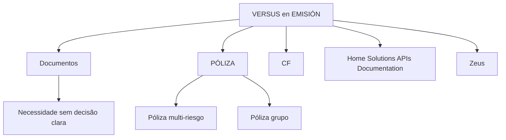

# VERSUS em EMISIÓN — Documentos, Pólizas e Referências de APIs

## 1. Metadados do Documento
- **Arquivo de Origem:** Não identificado
- **Tipo de Documento:** Apresentação Executiva
- **Domínio / Sistema:** Emisión; pólizas; Home Solutions APIs; Zeus
- **Público-Alvo:** Não identificado
- **Data/Versão Identificada:** Não identificada

---

## 2. Resumo Executivo & Contexto de Negócio

O conteúdo apresenta o tema **“VERSUS en EMISIÓN”**, relacionado a documentos orientados a enfrentar diferentes elementos quando não existe uma decisão clara para atender uma necessidade.

O documento cita uma comparação entre **póliza multi-riesgo** e **póliza grupo**, sugerindo que esses tipos de apólice são elementos relevantes no processo de emissão. Entretanto, o conteúdo não descreve critérios, regras ou condições para selecionar uma das modalidades.

Também são mencionados **CF**, **Home Solutions APIs Documentation** e **Zeus**. O trecho não especifica os papéis, integrações, contratos ou responsabilidades desses elementos.

> **Nota de Análise:** O material é extremamente resumido e não detalha fluxos operacionais, arquitetura técnica, métodos de API, regras de emissão ou definições das siglas apresentadas.

---

## 3. Arquitetura, Componentes & Tecnologias Envolvidas

Os componentes e conceitos explicitamente citados são:

| Componente / Termo | Contexto identificado |
| :--- | :--- |
| Emisión | Contexto principal indicado no título. |
| Documentos | Elementos orientados a enfrentar diferentes situações ou necessidades. |
| Póliza multi-riesgo | Modalidade de póliza citada em comparação. |
| Póliza grupo | Modalidade de póliza citada em comparação. |
| CF | Sigla/termo citado sem explicação adicional. |
| Home Solutions APIs Documentation | Referência a documentação de APIs. |
| Zeus | Termo ou sistema citado sem detalhamento. |
| EN | Texto apresentado isoladamente, sem contexto adicional. |



> **Nota de Análise:** O diagrama representa exclusivamente associações textuais presentes no conteúdo. O documento não descreve integrações, fluxos de dados, chamadas de API ou dependências entre Home Solutions APIs Documentation, Zeus, CF e as modalidades de póliza.

---

## 4. Regras de Negócio, Especificações Funcionais & Processos

1. O documento indica que existem **documentos orientados a enfrentar distintos elementos**.
2. Esses documentos são aplicáveis a cenários em que **não há uma decisão clara** para atender uma necessidade.
3. O conteúdo apresenta uma comparação ou contraposição entre:
   - **Póliza multi-riesgo**
   - **Póliza grupo**
4. Não são fornecidos critérios para:
   - escolher entre póliza multi-riesgo e póliza grupo;
   - determinar a elegibilidade de uma póliza;
   - definir documentos obrigatórios;
   - executar a emissão;
   - integrar ou consultar Home Solutions APIs Documentation;
   - utilizar Zeus ou CF no processo.

> **Nota de Análise:** Não há regras condicionais, fórmulas, validações, responsáveis, etapas operacionais ou critérios de exceção documentados no conteúdo bruto.

---

## 5. Tabelas de Parâmetros, Ambientes e Estruturas de Dados

| Item / Parâmetro | Descrição / Função | Tipo / Valores / Formato | Ambiente / Observações |
| :--- | :--- | :--- | :--- |
| VERSUS en EMISIÓN | Título ou tema central do conteúdo. | Texto | Não há versão ou ambiente informado. |
| Documentos | Documentos orientados a enfrentar distintos elementos. | Texto | Associados a situações sem decisão clara diante de uma necessidade. |
| PÓLIZA | Área ou categoria relacionada às modalidades de póliza. | Texto | Não há definição adicional. |
| Póliza multi-riesgo | Modalidade de póliza citada. | Texto | Apresentada em contraste com póliza grupo. |
| Póliza grupo | Modalidade de póliza citada. | Texto | Apresentada em contraste com póliza multi-riesgo. |
| CF | Sigla ou referência citada. | Texto | Significado não informado. |
| Home Solutions APIs Documentation | Referência à documentação de APIs. | Texto | Não há URLs, endpoints, métodos HTTP ou contratos. |
| Zeus | Sistema, componente ou referência citada. | Texto | Papel não detalhado. |
| EN | Texto isolado no conteúdo. | Texto | Contexto não informado. |

---

## 6. Bateria de Perguntas & Respostas para RAG (FAQ Sintético)

### P1: Qual é o tema principal do documento?
**R:** O tema principal é **“VERSUS en EMISIÓN”**, relacionado a documentos e a modalidades de póliza no contexto de emissão.

### P2: Qual problema os documentos mencionados procuram enfrentar?
**R:** Os documentos são descritos como orientados a enfrentar diferentes elementos quando não existe uma decisão clara para atender uma necessidade.

### P3: Quais modalidades de póliza são citadas?
**R:** O conteúdo cita **póliza multi-riesgo** e **póliza grupo**.

### P4: O documento define quando utilizar uma póliza multi-riesgo?
**R:** Não. O documento apenas menciona a póliza multi-riesgo em comparação com a póliza grupo, sem informar critérios de seleção ou regras de elegibilidade.

### P5: O documento define quando utilizar uma póliza grupo?
**R:** Não. A póliza grupo é apenas citada, sem critérios funcionais, operacionais ou técnicos para sua aplicação.

### P6: O que é Home Solutions APIs Documentation no conteúdo?
**R:** Home Solutions APIs Documentation é uma referência explícita a documentação de APIs. O documento não fornece URLs, endpoints, métodos HTTP, autenticação, payloads ou contratos de integração.

### P7: Qual é o papel de Zeus no processo de emissão?
**R:** O conteúdo menciona Zeus, mas não descreve seu papel, funcionalidades, integrações ou relação operacional com a emissão ou as pólizas.

### P8: O que significa a sigla CF?
**R:** O significado de **CF** não é definido no conteúdo original. Não é possível expandir ou interpretar a sigla sem evidência adicional.

### P9: Existem ambientes, servidores ou parâmetros técnicos documentados?
**R:** Não. O conteúdo não informa ambientes, servidores, URLs, portas, variáveis de configuração, estruturas de dados ou parâmetros técnicos.

### P10: O documento apresenta um fluxo completo de emissão?
**R:** Não. O documento identifica o contexto de emissão e referências a documentos e pólizas, mas não descreve etapas, responsáveis, entradas, saídas ou exceções do processo.

---

## 7. Glossário de Termos, Siglas & Conceitos-Chave

- **Emisión:** Termo apresentado no título; o conteúdo não fornece definição adicional.
- **Documentos:** Elementos orientados a enfrentar diferentes situações diante de uma necessidade sem decisão clara.
- **PÓLIZA:** Termo associado às modalidades de póliza multi-riesgo e póliza grupo.
- **Póliza multi-riesgo:** Modalidade de póliza citada sem detalhamento funcional.
- **Póliza grupo:** Modalidade de póliza citada sem detalhamento funcional.
- **CF:** Sigla citada sem expansão ou definição.
- **Home Solutions APIs Documentation:** Referência a documentação de APIs, sem especificação técnica.
- **Zeus:** Termo citado sem definição de função, sistema ou componente.
- **EN:** Texto isolado sem contexto definido.

---

## 8. Notas Críticas, Riscos & Limitações

- O conteúdo não identifica arquivo, autor, data, versão, organização responsável ou público-alvo.
- Não há definição das siglas **CF** e **EN**.
- Não há especificação funcional para póliza multi-riesgo ou póliza grupo.
- Não há critérios de decisão para a necessidade mencionada no documento.
- Não há documentação técnica de APIs, incluindo endpoints, autenticação, formatos de mensagem ou códigos de erro.
- Não há descrição verificável da responsabilidade de Zeus.
- O diagrama apresentado é uma reconstrução semântica das associações textuais, não uma arquitetura confirmada.

---

## 9. Conteúdo Bruto Estruturado (Referência Fiel)

```text
--- [PÁGINA 1 DE 1] ---

VERSUS en EMISIÓN
 Documentos orientados a enfrentar distintos elementos cuando no se tiene
una decisión clara a la hora de afrontar una necesidad
PÓLIZA
 Póliza multi-riesgo vs Póliza grupo
 / 
 CF
Home Solutions APIs Documentation Zeus
EN
```
