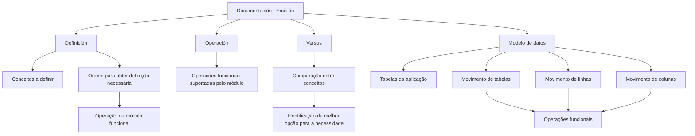

# Documentación – Emisión: Estrutura de Documentação Funcional

## 1. Metadados do Documento
- **Arquivo de Origem:** Não identificado
- **Tipo de Documento:** Manual Operacional
- **Domínio / Sistema:** Documentación – Emisión
- **Público-Alvo:** Usuários funcionais e consumidores da documentação
- **Data/Versão Identificada:** Não identificada

---

## 2. Resumo Executivo & Contexto de Negócio

O documento apresenta a organização da documentação associada à funcionalidade do sistema no contexto de **Emisión**. O conteúdo é dividido em quatro áreas: **Definición**, **Operación**, **Versus** e **Modelo de datos**.

A área **Definición** concentra documentos sobre conceitos que devem ser definidos e sobre a ordem necessária para realizar uma definição que permita operar um módulo funcional. A área **Operación** reúne documentos relativos às operações funcionais suportadas pelo módulo.

A seção **Versus** é apresentada como apoio à comparação entre conceitos, destinada a situações em que o usuário possui dúvidas entre alternativas e precisa identificar a opção mais adequada à sua necessidade. O documento não detalha critérios de comparação, exemplos ou regras de decisão.

A área **Modelo de datos** é orientada às tabelas da aplicação. Além de tratar as tabelas, a documentação descreve detalhadamente a movimentação de elementos como tabelas, linhas e colunas em função das operações funcionais.

---

## 3. Arquitetura, Componentes & Tecnologias Envolvidas

O documento não descreve arquitetura técnica, tecnologias, ambientes, APIs, protocolos, servidores ou integrações. A estrutura identificada é uma arquitetura documental e funcional, formada pelas quatro categorias de conteúdo apresentadas.



**Nota de Análise:** O texto menciona “Home Solutions APIs Documentation Zeus” e “CF”, mas não explica seus significados, papéis, integrações ou relação técnica com o conteúdo de Emisión.

---

## 4. Regras de Negócio, Especificações Funcionais & Processos

### Organização da documentação funcional

1. A documentação relacionada à funcionalidade do sistema é organizada nos apartados **Definición**, **Operación**, **Versus** e **Modelo de datos**.
2. A seção **Definición** contém conceitos que precisam ser definidos.
3. A seção **Definición** também estabelece a ordem que deve ser seguida para obter a definição necessária para operar um módulo funcional.
4. A seção **Operación** contém documentos relacionados às operações funcionais que o módulo suporta.
5. A seção **Versus** é destinada à comparação entre vários conceitos quando existe dúvida sobre qual conceito atende melhor a uma necessidade.
6. A seção **Modelo de datos** é direcionada às tabelas da aplicação.
7. A seção **Modelo de datos** descreve detalhadamente o movimento de tabelas, linhas e colunas em função das operações funcionais.

**Nota de Análise:** O documento não especifica os módulos funcionais existentes, as operações suportadas, as tabelas da aplicação, os conceitos comparados em **Versus** ou a sequência concreta de definição.

---

## 5. Tabelas de Parâmetros, Ambientes e Estruturas de Dados

| Item / Parâmetro | Descrição / Função | Tipo / Valores / Formato | Ambiente / Observações |
| :--- | :--- | :--- | :--- |
| Documentación – Emisión | Área documental relacionada à funcionalidade do sistema. | Estrutura documental. | O arquivo e a versão não foram identificados. |
| Definición | Documentos sobre conceitos que devem ser definidos e sobre a ordem de definição necessária para operar um módulo funcional. | Categoria documental. | Não detalha os conceitos, a sequência ou os módulos. |
| Operación | Documentos relacionados às operações funcionais que o módulo suporta. | Categoria documental. | Não informa quais operações ou módulos são suportados. |
| Versus | Apoio para comparação entre conceitos e identificação da alternativa mais adequada a uma necessidade. | Categoria documental. | Não apresenta critérios, conceitos ou exemplos de comparação. |
| Modelo de datos | Documentação orientada às tabelas da aplicação e à movimentação de elementos associados a operações funcionais. | Categoria documental / dados. | Não lista tabelas, linhas, colunas ou operações específicas. |
| Tabelas | Elementos da aplicação tratados pela seção Modelo de datos. | Estrutura de dados. | Nomes e estruturas não especificados. |
| Linhas | Elementos cujo movimento é descrito no Modelo de datos. | Estrutura de dados. | Sem detalhamento adicional. |
| Colunas | Elementos cujo movimento é descrito no Modelo de datos. | Estrutura de dados. | Sem detalhamento adicional. |
| Home Solutions APIs Documentation Zeus | Texto exibido no conteúdo bruto. | Referência não detalhada. | Relação com Emisión não especificada. |
| CF | Sigla exibida no conteúdo bruto. | Sigla não definida. | Significado não informado. |

---

## 6. Bateria de Perguntas & Respostas para RAG (FAQ Sintético)

### P1: Quais são as áreas em que a documentação de Emisión está dividida?
**R:** A documentação de Emisión está dividida em quatro áreas: **Definición**, **Operación**, **Versus** e **Modelo de datos**.

### P2: Qual é o objetivo da seção Definición?
**R:** A seção **Definición** reúne documentos que detalham conceitos que devem ser definidos e a ordem que deve ser seguida para conseguir a definição necessária para operar um módulo funcional.

### P3: A documentação informa a sequência concreta de definição de um módulo funcional?
**R:** Não. O documento afirma que existe uma ordem a seguir para obter a definição necessária, mas não apresenta as etapas, os conceitos ou os módulos funcionais envolvidos.

### P4: Que tipo de conteúdo é abordado na seção Operación?
**R:** A seção **Operación** contém documentos relacionados às operações funcionais que um módulo suporta. O texto não identifica quais módulos ou operações específicas são suportados.

### P5: Para que serve a seção Versus?
**R:** A seção **Versus** serve para apoiar usuários que possuem dúvidas entre vários conceitos e precisam identificar qual opção é mais adequada à sua necessidade.

### P6: O documento define critérios para decidir entre conceitos na seção Versus?
**R:** Não. O documento apenas indica que a seção ajuda em dúvidas entre conceitos; não detalha critérios de comparação, regras de decisão ou exemplos.

### P7: Qual é o foco da seção Modelo de datos?
**R:** A seção **Modelo de datos** é orientada às tabelas da aplicação e descreve detalhadamente o movimento de tabelas, linhas e colunas de acordo com as operações funcionais.

### P8: Quais elementos de dados são mencionados no Modelo de datos?
**R:** O documento menciona tabelas, linhas e colunas. Não são informados nomes de tabelas, estruturas de colunas, tipos de dados ou regras de movimentação específicas.

### P9: O documento apresenta arquitetura técnica, APIs ou ambientes?
**R:** Não. O texto não descreve tecnologias, URLs, APIs, contratos, ambientes, servidores, protocolos ou arquitetura de software.

### P10: O que significa a sigla CF no documento?
**R:** O significado de **CF** não é definido no conteúdo fornecido. A sigla aparece apenas como parte do texto bruto.

### P11: Qual é a relação entre Home Solutions APIs Documentation Zeus e Documentación – Emisión?
**R:** O conteúdo bruto apresenta a expressão “Home Solutions APIs Documentation Zeus”, mas não explica sua relação com Documentación – Emisión, nem fornece detalhes técnicos ou funcionais adicionais.

---

## 7. Glossário de Termos, Siglas & Conceitos-Chave

- **Definición:** Categoria de documentação voltada aos conceitos a definir e à ordem necessária para obter uma definição que permita operar um módulo funcional.
- **Operación:** Categoria de documentos sobre operações funcionais suportadas pelo módulo.
- **Versus:** Categoria documental para comparação entre conceitos e escolha da opção mais adequada a uma necessidade.
- **Modelo de datos:** Categoria de documentação orientada às tabelas da aplicação e ao movimento de tabelas, linhas e colunas associado às operações funcionais.
- **CF:** Sigla exibida no documento sem definição explícita.
- **Home Solutions APIs Documentation Zeus:** Referência textual exibida no conteúdo bruto sem explicação adicional.

---

## 8. Notas Críticas, Riscos & Limitações

- O documento é resumido e não identifica o arquivo original, a data, a versão, o autor ou o sistema corporativo responsável.
- Não há detalhamento de módulos funcionais, operações, conceitos, tabelas, linhas, colunas ou regras de movimentação.
- Não há arquitetura de software, integrações, APIs, contratos, URLs, ambientes, tecnologias ou parâmetros operacionais.
- A expressão **Home Solutions APIs Documentation Zeus** e a sigla **CF** não possuem definição no conteúdo disponibilizado.
- A seção **Versus** informa a finalidade de comparação entre conceitos, mas não apresenta critérios de decisão, exemplos nem comparativos concretos.

---

## 9. Conteúdo Bruto Estruturado (Referência Fiel)

```text
--- [PÁGINA 1 DE 2] ---

DOCUMENTACIÓN - EMISIÓN
 En este apartado se aborda todo aquello relacionado con la funcionalidad
del sistema. La información se encuentra dividida en los apartados siguientes:
Definición
Operación
Versus
Modelo de datos
DEFINICIÓN
Documentos que detallan aquellos conceptos que se han de definir y el orden que se ha de seguir
para conseguir la definición necesaria con lo que poder operar un módulo funcional.
OPERACIÓN
Documentos relacionados con las operaciones funcionales que el módulo soporta.
VERSUS
¿Tienes dudas entre varios conceptos y no sabes cual es el mejor para tu necesidad?
 /
 CF
Home Solutions APIs Documentation Zeus
EN


--- [PÁGINA 2 DE 2] ---

MODELO DE DATOS
Documentación orientada hacia las tablas de la aplicación. Adicionalmente, se describe con detalle el
movimiento de distintos elementos como tablas, filas y columnas atendiendo a las operaciones
funcionales.
```
