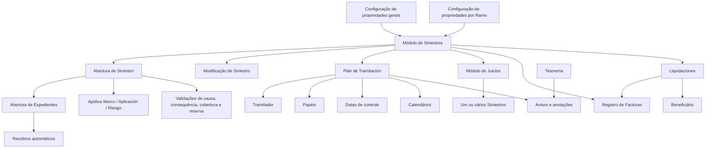
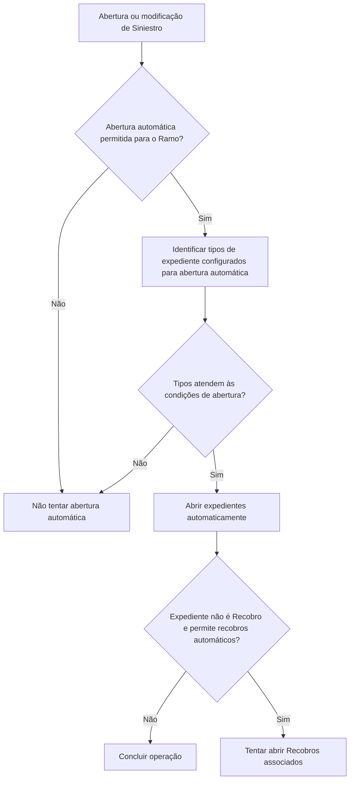

# Definição de Características do Módulo de Sinistros

## 1. Metadados do Documento
- **Arquivo de Origem:** Não identificado no conteúdo fornecido
- **Tipo de Documento:** Especificação Técnica / Manual Funcional
- **Domínio / Sistema:** Módulo de Siniestros (Sinistros), Reef.core
- **Público-Alvo:** Analistas funcionais, desenvolvedores, arquitetos, operação e parametrizadores do módulo de sinistros
- **Data/Versão Identificada:** Não identificada

---

## 2. Resumo Executivo & Contexto de Negócio

O documento define propriedades de configuração para o módulo de **Siniestros**, incluindo características gerais aplicáveis a todos os ramos e características específicas configuráveis por **Ramo**. As propriedades determinam o comportamento operacional durante abertura, modificação, tratamento, julgamento, faturamento e liquidação de sinistros e expedientes.

No contexto do documento, um **Ramo** representa a chave de segmentação para a qual regras e comportamentos podem ser parametrizados. Algumas propriedades possuem abrangência global, enquanto outras regulam somente um Ramo específico. A parametrização busca adequar o funcionamento do módulo de sinistros às necessidades de produtos, processos e modalidades operacionais distintas.

O módulo contempla controles sobre causas de abertura e alteração de valoração, execução de controle técnico, datas de controle, calendários, papéis de usuários, notificações por e-mail, vínculo entre julgamentos e sinistros, distribuição de faturas, conceitos de pagamento e liquidações.

Para operações específicas de abertura de sinistros, o documento prevê tratamento para apólices não fixas, especialmente em contexto de transportes, abertura automática de expedientes, abertura de recobros, validações entre causa, consequência, tipo de expediente, cobertura e conceito de reserva.

> **Nota de Análise:** O documento descreve propriedades e seus efeitos funcionais, mas não detalha interfaces técnicas, métodos HTTP, contratos JSON, banco de dados, APIs, valores padrão, telas específicas ou mecanismos de persistência das configurações.

---

## 3. Arquitetura, Componentes & Tecnologias Envolvidas

### Componentes e módulos identificados

| Componente / Módulo | Papel descrito no documento |
| :--- | :--- |
| Módulo de Siniestros | Módulo principal configurado pelas propriedades gerais e propriedades por Ramo. |
| Ramo | Chave usada para definir características específicas do funcionamento do módulo de sinistros. |
| Expediente | Entidade aberta, modificada, valorada, retida, liquidada ou associada a recobros e julgamentos. |
| Plan de Tramitación | Plano de tramitação no qual usuários ativam, finalizam, atrasam e incluem trâmites, níveis, avisos e anotações. |
| Tramitador | Usuário que executa gestões, trâmites e anotações no Plan de Tramitación. |
| Control Técnico | Controle cujo comportamento pode ser salvo por lógica de negócio e que pode reter sinistros ou conceitos. |
| Módulo de Juicios | Módulo que relaciona pessoas e, dependendo da propriedade configurada, um ou vários sinistros a um julgamento. |
| Registro de Facturas | Registro de faturas consultado ou validado em operações de faturamento e liquidação. |
| Tesorería | Módulo externo que pode enviar avisos ao Plan de Tramitación em eventos relativos a ordens de pagamento. |
| Liquidaciones | Módulo que trata liquidações e ordens de pagamento vinculadas a documentos e beneficiários. |
| Reef.core | Sistema mencionado no contexto da compatibilidade de dados variáveis. |
| Póliza Marco | Apólice marco que pode ou não ser sinistrada conforme configuração aplicável a apólices não fixas. |
| Aplicación / Riesgo | Aplicação ou risco de uma apólice, cuja sinistralidade pode ser permitida mesmo sem vigência em Ramos de transportes. |
| Recobro | Tipo de expediente que pode ser aberto automaticamente a partir da abertura de outro expediente. |
| Home Solutions APIs Documentation Zeus | Texto presente no conteúdo bruto; o documento não explica sua relação técnica com o módulo. |

### Relação funcional entre componentes



### Fluxo funcional de abertura automática de expedientes



> **Nota de Análise:** O fluxo Mermaid representa exclusivamente as relações funcionais declaradas pelo texto. O documento não define serviços, filas, integrações técnicas, persistência, protocolos ou interfaces entre os módulos.

---

## 4. Regras de Negócio, Especificações Funcionais & Processos

### 4.1 Propriedades gerais de sinistros

#### Solicitação de causas na abertura de expedientes
A propriedade **Pedir Causas Apertura de Expedientes** define se, durante a abertura de um expediente, o sistema solicitará as causas que justificam a abertura. A regra se aplica a todos os expedientes, independentemente do Ramo. Quando a solicitação de causas estiver habilitada, as causas de abertura de expedientes deverão estar previamente definidas.

#### Solicitação de causas na alteração de valoração
A propriedade **Pedir Causas Cambio de Valoración** define se o sistema solicitará as causas que justificam uma alteração de valoração de expediente. A regra é global e independe do Ramo. Caso essa solicitação esteja habilitada, as causas de alteração de valoração deverão estar definidas.

#### Solicitação de causas em anulação de liquidação
A propriedade **Pedir Causas Cambio de Valoración en Anulación de liquidación** determina se uma alteração de valoração causada pela anulação de uma liquidação exigirá o registro das causas da alteração. A regra se aplica a todos os expedientes, independentemente do Ramo. Caso seja exigida, a causa de alteração de valoração deverá estar definida.

#### Lógica de negócio para carga de controle técnico
A propriedade **Lógica de Negocio programa de carga control técnico** contém a lógica de negócio que salva o controle técnico de core.

> **Nota de Análise:** O documento não detalha a linguagem, o formato, os critérios, o ponto de execução ou a implementação da lógica de negócio associada ao programa de carga de controle técnico.

#### Uso de datas de controle no Plan de Tramitación
A propriedade **Uso de Fecha de Control en el Plan de Tramitación** habilita ou desabilita o trabalho do Plan de Tramitación com datas de controle.

Quando datas de controle estiverem em uso:
1. A data de controle informa ao tramitador quando a gestão ativada deverá ser finalizada.
2. Cada trâmite deverá ter definido o número de dias dentro do qual deve ser concluído.
3. A data é calculada a partir do instante em que o tramitador ativa o trâmite.

#### Uso de calendários no Plan de Tramitación
A propriedade **Uso de Calendarios en el Plan de Tramitación** determina se o cálculo de datas do Plan de Tramitación considera dias festivos e férias do tramitador.

Quando calendários estiverem em uso:
- Dias festivos são considerados dias não úteis.
- Férias do tramitador são consideradas dias não úteis.

Quando calendários não estiverem em uso:
- Todos os dias são considerados úteis.

A regra afeta, entre outras, as seguintes operações:
- Ativar trâmite com aviso definido.
- Ativar trâmite com data de controle definida.
- Incluir aviso de agenda no plano.
- Modificar aviso.
- Calcular data de controle.

#### Uso de papéis no Plan de Tramitación
A propriedade **Uso de Roles en el Plan de Tramitación** determina se determinados trâmites serão restritos a papéis específicos.

Quando o uso de papéis estiver habilitado:
- Somente determinados papéis podem realizar determinados trâmites.
- A configuração permite especializar tramitadores.
- Colaboradores podem ter acesso somente a trâmites específicos.
- Trâmites críticos ou especializados podem ser executados somente por determinados papéis.

Quando o uso de papéis não estiver habilitado:
- Todos os tramitadores têm acesso a todos os trâmites.

Os papéis afetam as seguintes operações:
- Ativar trâmite.
- Executar programas associados ao trâmite.
- Gerar comunicações associadas ao trâmite.
- Finalizar trâmite.
- Atrasar trâmite.
- Modificar data de controle.
- Incluir trâmite no plano.
- Incluir nível no plano.

#### Notificação de resultado de envio de e-mail
A propriedade **Plan de Tramitación Solicitud de envío de Email** determina se, ao enviar um e-mail pelo Plan de Tramitación, o resultado do envio será informado ao próprio plano.

Os resultados mencionados são:
- Envio de e-mail exitoso.
- Envio de e-mail falho.

#### Associação entre julgamento e sinistros
A propriedade **Un Juicio puede afectar a Varios Siniestros** define se um julgamento pode afetar um ou vários sinistros. De acordo com o valor do atributo, o módulo de julgamentos permitirá associar um único sinistro ou vários sinistros a um julgamento.

#### Distribuição proporcional em faturamento múltiplo
A propriedade **Facturación Múltiple permite distribución Proporcional** define o tratamento de uma fatura que afeta múltiplos expedientes, como uma fatura de profissional que intervém em vários expedientes.

Quando o valor total da fatura for igual para todos os expedientes, a propriedade determina se:
- O sistema poderá realizar automaticamente a distribuição proporcional; ou
- O valor deverá ser informado manualmente para cada expediente.

#### Liquidação em expediente retido
A propriedade **Facturación Múltiple Genera Liquidación con Expediente Retenido** define se conceitos de reserva dos tipos **Honorarios** e **Gastos** podem ser liquidados quando o conceito retido for do tipo **Indemnización**.

A finalidade é permitir o pagamento do profissional que interveio no expediente mesmo que a indenização esteja retida por Controle Técnico.

#### Validação de conceito de pagamento no registro de faturas
A propriedade **Valida Concepto de Pago en el Registro de Facturas** controla a validação de conceitos durante o registro de um documento de pagamento de sinistros no Registro de Facturas.

A propriedade determina se:
- O conceito de cobrança e pagamento diverso informado deve estar definido para a atividade da fatura; ou
- As faturas podem ser registradas com conceitos genéricos.

---

### 4.2 Propriedades por Ramo: processos automáticos

#### Chave de Ramo
A propriedade **Ramo** identifica a chave do Ramo para o qual serão definidas características específicas do módulo de sinistros.

#### Abertura automática de expedientes
A propriedade **Permite Apertura Automática de Expedientes** determina se o Ramo permite abertura automática de expedientes.

Os tipos de expediente passíveis de abertura automática no Ramo devem estar detalhados na definição de tipos de expedientes por Ramo.

#### Abertura automática durante abertura online de sinistro
A propriedade **Permite Apertura Automática de Expedientes desde Apertura de Siniestros on-line** determina se, após o preenchimento manual das informações de um sinistro, o sistema tentará abrir automaticamente os tipos de expediente que:

1. Estão identificados como passíveis de abertura automática.
2. Atendem às condições necessárias para serem abertos.

#### Abertura automática durante modificação de sinistro
A propriedade **Permite Apertura Automática de Expedientes desde Modificación de Siniestro** determina se, após modificar informações de um sinistro, o sistema tentará abrir automaticamente os expedientes configurados que atendam às condições de abertura.

#### Abertura automática de recobros
A propriedade **Permite Aperturar Recobros desde la Apertura de Expedientes on-line** determina se, ao abrir um expediente cujo tipo não é Recobro, o sistema tentará abrir automaticamente os recobros associados.

A tentativa depende de o tipo de expediente aberto possuir configuração que permita abertura automática de seus recobros.

---

### 4.3 Propriedades por Ramo: abertura de sinistro

As propriedades desta seção são aplicáveis somente a apólices que não são fixas, normalmente apólices de transportes. O documento informa que o comportamento também pode ser utilizado por produtos com comportamento de transportes que não sejam necessariamente produtos de transportes.

#### Permitir sinistrar apólice marco
A propriedade **Permite Siniestrar Póliza Marco** determina se, na abertura de sinistros, uma apólice que possui apólice marco poderá ser sinistrada diretamente ou se apenas suas aplicações poderão ser sinistradas.

#### Permitir sinistrar aplicação ou risco sem vigência
A propriedade **Permite Siniestrar Aplicación/Riesgo No Vigente TRANSPORTES** determina se é permitido sinistrar uma aplicação que não está vigente nos Ramos com tratamento de transportes.

Valores permitidos:
- `1`: Sim.
- `2`: Não.
- `3` e `4`: Lógica de Negócio.

#### Lógica de negócio para aplicação ou risco não vigente
A propriedade **Lógica de Negocio que determina si se permite Siniestrar Aplicación / Riesgo No Vigente Transportes** contém uma lógica de negócio obrigatória quando o atributo anterior possui valor `3` ou `4`.

Essa lógica deve ser definida quando a permissão não for sempre “Sim” ou “Não”, mas depender da avaliação de outros fatores.

#### Abertura de sinistro sem tipos obrigatórios de expediente
A propriedade **Aperturar Siniestro sin Tipos de Expedientes Obligatorios** determina se é permitido abrir um sinistro quando os tipos de expediente configurados como obrigatórios para Ramo, causa e consequência ainda não foram abertos.

O documento indica que essa possibilidade é normalmente usada quando se pretende:
1. Criar um controle técnico.
2. Manter o sinistro retido.
3. Evitar impedir a gravação do sinistro.

#### Lógica para abrir sinistro sem tipos obrigatórios
A propriedade **Lógica que determina si se permite Aperturar Siniestro sin Tipos de Expedientes Obligatorios** contém a lógica que decide se o sinistro poderá ser aberto quando nem todos os expedientes de tipos obrigatórios tiverem sido abertos.

Essa lógica deve ser configurada quando a decisão depender de outros fatores, e não for apenas uma decisão fixa de “Sim” ou “Não”.

#### Lógica para obtenção da pessoa de contato
A propriedade **Lógica para obtener la persona de Contacto** contém uma lógica para trazer dados de contato quando esses dados estiverem registrados no sistema.

O documento indica que essa lógica pode ser utilizada porque a abertura do sinistro possui um atributo que solicita a relação da pessoa de contato com o segurado.

#### Validação entre causa, consequência, tipo de expediente, cobertura e conceito de reserva
A propriedade **Valida Causa-Consecuencia-Tipo de Expediente–Cobertura-Concepto de Reserva** é aplicada na abertura, modificação e reabertura de sinistros.

A propriedade define o nível de granularidade para validação de consequências incompatíveis:

- Quando a propriedade for **No**, não é permitido escolher duas consequências que afetem o mesmo:
  - Tipo de expediente;
  - Cobertura.

- Quando a propriedade for **Sí**, o controle considera também o conceito de reserva. Não é permitido selecionar duas consequências que afetem o mesmo:
  - Tipo de expediente;
  - Cobertura;
  - Conceito de reserva.

---

### 4.4 Propriedades por Ramo: modificação de sinistro

#### Permitir modificação da hora do sinistro
A propriedade **Permite Modificar Hora del Siniestro** define se a hora do sinistro pode ser modificada.

Se, no Ramo, o atributo de solicitação da hora de vigência for afirmativo:
1. Após a alteração da hora, o programa de modificação de sinistro verifica se a apólice estava vigente naquela hora.
2. Se a data do sinistro for a data atual, o programa verifica se a hora informada não ultrapassa a hora do dia.

---

### 4.5 Propriedades por Ramo: Plan de Tramitación

#### Tipificação de anotações livres
A propriedade **Se Tipifican las Anotaciones Libres** define se anotações livres devem ser tipificadas.

Anotações livres são registros que o tramitador pode incluir no plano para evidenciar, por exemplo:
- Realização de uma chamada.
- Circunstância que o tramitador deseja deixar registrada no Plan de Tramitación.

Quando a tipificação estiver habilitada:
- As anotações devem ser previamente definidas.
- O objetivo é homogeneizar as anotações livres.

Quando a tipificação não estiver habilitada:
- O tramitador pode escrever livremente o conteúdo desejado.

#### Avisos provenientes de módulos externos
A propriedade **Aviso al Plan Tramitación Desde módulos externos** determina se o Plan de Tramitación receberá avisos oriundos do módulo de Tesorería.

Quando o atributo estiver afirmativo, o sistema registra um aviso no Plan de Tramitación sobre alterações em ordens de pagamento de Sinistro-Expediente, incluindo:
- Pagamento de uma ordem.
- Anulação de uma ordem.
- Outros eventos relativos às ordens de pagamento, indicados pelo documento como “etc.”.

---

### 4.6 Propriedades por Ramo: julgamentos

#### Tipo e código de documento obrigatórios em julgamentos
A propriedade **Tipo y Código de Documento Obligatorio en Juicios** determina se, ao solicitar pessoas relacionadas a um julgamento no módulo de Juicios, o tipo e o código do documento serão obrigatórios.

---

### 4.7 Propriedades por Ramo: liquidações

#### Recuperar dados do registro de fatura
A propriedade **Traer datos Registro Factura** determina se, em uma liquidação ou ordem de pagamento de documento que deve estar registrado no Registro de Facturas, o sistema recuperará os dados registrados após o preenchimento de:
- Fornecedor.
- Número do documento.
- Tipo de documento.

#### Liquidar documento oficial sem registro
A propriedade **Liquidar Documentos Oficial sin Registrar** determina se o sistema permite gerar uma liquidação para um documento de pagamento que deveria estar no Registro de Facturas, mas não está registrado.

A propriedade controla se:
- A liquidação é permitida; ou
- A geração da liquidação é bloqueada e produz erro.

#### Solicitar conta corrente em liquidações
A propriedade **Pedir cuenta Corriente en Liquidaciones** define o tratamento quando não existe uma conta registrada para o beneficiário da liquidação.

A propriedade determina se:
- A conta corrente será solicitada; ou
- O sistema apresentará erro.

#### Exibição de conta formatada
A propriedade **Cuenta Formateada** define se a conta corrente do beneficiário da liquidação será apresentada de forma formatada.

---

### 4.8 Propriedades por Ramo: diversos

#### Compatibilidade de dados variáveis
A propriedade **Datos Variables Compatibles** informa ao sistema se a solicitação de dados variáveis será compatível entre os dois sistemas Reef.core e Reef.core.

O documento declara que essa propriedade é destinada somente a instalações que precisem conviver com os dois sistemas mencionados.

> **Nota de Análise:** O conteúdo fornecido repete o nome `Reef.core` duas vezes e não esclarece se são versões, instâncias ou produtos distintos.

#### Consulta de sinistros com dados adicionais
O documento termina com o tópico **Consulta de siniestros Datos Adicionales**, sem detalhamento adicional.

> **Nota de Análise:** Não foram fornecidas regras, campos, fluxos, parâmetros ou comportamento para o tópico “Consulta de siniestros Datos Adicionales”.

---

## 5. Tabelas de Parâmetros, Ambientes e Estruturas de Dados

### 5.1 Propriedades gerais

| Item / Parâmetro | Descrição / Função | Tipo / Valores / Formato | Ambiente / Observações |
| :--- | :--- | :--- | :--- |
| Pedir Causas Apertura de Expedientes | Solicita as causas da abertura de um expediente. | Habilitado ou desabilitado; valores não explicitados. | Aplica-se a todos os expedientes e Ramos. Se habilitado, as causas devem estar definidas. |
| Pedir Causas Cambio de Valoración | Solicita as causas da alteração de valoração de expediente. | Habilitado ou desabilitado; valores não explicitados. | Aplica-se a todos os expedientes e Ramos. |
| Pedir Causas Cambio de Valoración en Anulación de liquidación | Solicita causas para alteração de valoração provocada por anulação de liquidação. | Habilitado ou desabilitado; valores não explicitados. | Aplica-se a todos os expedientes e Ramos. |
| Lógica de Negocio programa de carga control técnico | Contém a lógica que salva o controle técnico de core. | Lógica de negócio; formato não especificado. | Não há detalhamento de implementação. |
| Uso de Fecha de Control en el Plan de Tramitación | Permite uso de datas de controle para prazo de conclusão de trâmites. | Habilitado ou desabilitado; valores não explicitados. | Requer definição de número de dias por trâmite. |
| Uso de Calendarios en el Plan de Tramitación | Considera feriados e férias no cálculo de datas. | Habilitado ou desabilitado; valores não explicitados. | Se desabilitado, todos os dias são úteis. |
| Uso de Roles en el Plan de Tramitación | Restringe operações do plano conforme papéis. | Habilitado ou desabilitado; valores não explicitados. | Se desabilitado, todos os tramitadores acessam todos os trâmites. |
| Plan de Tramitación Solicitud de envío de Email | Informa ao plano o êxito ou falha de envio de e-mail. | Habilitado ou desabilitado; valores não explicitados. | Relacionado a e-mails enviados pelo Plan de Tramitación. |
| Un Juicio puede afectar a Varios Siniestros | Permite vincular um julgamento a um ou vários sinistros. | Configuração binária inferida pela descrição; valores não explicitados. | Afeta o módulo de Juicios. |
| Facturación Múltiple permite distribución Proporcional | Permite distribuição automática de valor de fatura entre múltiplos expedientes. | Configuração binária inferida pela descrição; valores não explicitados. | Aplicável quando o total é igual para todos os expedientes. |
| Facturación Múltiple Genera Liquidación con Expediente Retenido | Permite liquidar honorários e gastos mesmo com indenização retida. | Configuração binária inferida pela descrição; valores não explicitados. | Retenção relacionada a Control Técnico. |
| Valida Concepto de Pago en el Registro de Facturas | Valida conceito de cobrança/pagamento contra atividade da fatura. | Configuração binária inferida pela descrição; valores não explicitados. | Alternativa é permitir conceitos genéricos. |

### 5.2 Propriedades por Ramo: processos automáticos

| Item / Parâmetro | Descrição / Função | Tipo / Valores / Formato | Ambiente / Observações |
| :--- | :--- | :--- | :--- |
| Ramo | Identifica a chave do Ramo configurado. | Chave de Ramo; formato não informado. | Define o escopo das propriedades por Ramo. |
| Permite Apertura Automática de Expedientes | Permite abertura automática de expedientes no Ramo. | Habilitado ou desabilitado; valores não explicitados. | Tipos elegíveis devem estar definidos por Ramo. |
| Permite Apertura Automática de Expedientes desde Apertura de Siniestros on-line | Tenta abrir expedientes automaticamente após abertura manual do sinistro. | Habilitado ou desabilitado; valores não explicitados. | Exige tipos marcados para abertura automática e condições atendidas. |
| Permite Apertura Automática de Expedientes desde Modificación de Siniestro | Tenta abrir expedientes automaticamente após modificação do sinistro. | Habilitado ou desabilitado; valores não explicitados. | Exige expedientes configurados e condições atendidas. |
| Permite Aperturar Recobros desde la Apertura de Expedientes on-line | Tenta abrir recobros associados a expediente não classificado como Recobro. | Habilitado ou desabilitado; valores não explicitados. | Depende de configuração de abertura automática dos recobros. |

### 5.3 Propriedades por Ramo: abertura de sinistro

| Item / Parâmetro | Descrição / Função | Tipo / Valores / Formato | Ambiente / Observações |
| :--- | :--- | :--- | :--- |
| Permite Siniestrar Póliza Marco | Permite sinistrar apólice marco ou restringe a sinistro de aplicações. | Habilitado ou desabilitado; valores não explicitados. | Aplicável a apólices não fixas, normalmente transportes. |
| Permite Siniestrar Aplicación/Riesgo No Vigente TRANSPORTES | Permite sinistrar aplicação ou risco não vigente. | `1` = Sim; `2` = Não; `3` ou `4` = Lógica de Negócio. | Aplicável a Ramos de tratamento de transportes. |
| Lógica de Negocio que determina si se permite Siniestrar Aplicación / Riesgo No Vigente Transportes | Avalia permissão de sinistrar aplicação ou risco não vigente. | Lógica de negócio; formato não especificado. | Deve ser definida quando o parâmetro anterior for `3` ou `4`. |
| Aperturar Siniestro sin Tipos de Expedientes Obligatorios | Permite abrir sinistro sem abertura de todos os tipos obrigatórios de expediente. | Habilitado ou desabilitado; valores não explicitados. | Pode ser usada para criar controle técnico e reter o sinistro. |
| Lógica que determina si se permite Aperturar Siniestro sin Tipos de Expedientes Obligatorios | Determina a permissão de abertura sem todos os expedientes obrigatórios. | Lógica de negócio; formato não especificado. | Necessária quando a decisão depender de outros fatores. |
| Lógica para obtener la persona de Contacto | Recupera dados de contato registrados no sistema. | Lógica de negócio; formato não especificado. | Baseada no atributo que informa relação do contato com o segurado. |
| Valida Causa-Consecuencia-Tipo de Expediente–Cobertura-Concepto de Reserva | Controla a granularidade da validação de consequências incompatíveis. | `No`: Tipo de Expediente + Cobertura. `Sí`: Tipo de Expediente + Cobertura + Conceito de Reserva. | Aplicável a abertura, modificação e reabertura de sinistros. |

### 5.4 Propriedades por Ramo: modificação, plano, julgamentos e liquidações

| Item / Parâmetro | Descrição / Função | Tipo / Valores / Formato | Ambiente / Observações |
| :--- | :--- | :--- | :--- |
| Permite Modificar Hora del Siniestro | Permite alterar a hora do sinistro. | Habilitado ou desabilitado; valores não explicitados. | Pode validar vigência de apólice e impedir hora futura no dia atual. |
| Se Tipifican las Anotaciones Libres | Exige tipificação prévia de anotações livres do plano. | Habilitado ou desabilitado; valores não explicitados. | Se desabilitado, tramitador escreve livremente. |
| Aviso al Plan Tramitación Desde módulos externos | Registra avisos provenientes de Tesorería no Plan de Tramitación. | Habilitado ou desabilitado; valores não explicitados. | Abrange pagamentos, anulações e mudanças em ordens de pagamento. |
| Tipo y Código de Documento Obligatorio en Juicios | Torna tipo e código de documento obrigatórios para pessoas relacionadas a julgamentos. | Habilitado ou desabilitado; valores não explicitados. | Aplicável ao módulo de Juicios. |
| Traer datos Registro Factura | Recupera dados do Registro de Facturas em liquidação. | Habilitado ou desabilitado; valores não explicitados. | Consulta ocorre após fornecedor, número e tipo de documento. |
| Liquidar Documentos Oficial sin Registrar | Permite ou bloqueia liquidação de documento sem registro obrigatório em faturas. | Permitir ou gerar erro; valores não explicitados. | Aplicável a documentos de pagamento. |
| Pedir cuenta Corriente en Liquidaciones | Solicita conta corrente quando não houver conta cadastrada para beneficiário. | Solicitar conta ou gerar erro; valores não explicitados. | Aplicável à liquidação. |
| Cuenta Formateada | Exibe conta corrente do beneficiário de forma formatada. | Habilitado ou desabilitado; valores não explicitados. | Aplicável à visualização em liquidações. |
| Datos Variables Compatibles | Indica compatibilidade da solicitação de dados variáveis entre sistemas Reef.core. | Habilitado ou desabilitado; valores não explicitados. | Destinado a instalações com convivência entre os sistemas citados. |
| Consulta de siniestros Datos Adicionales | Tópico listado sem descrição funcional. | Não informado. | Sem detalhamento no conteúdo fornecido. |

### 5.5 Operações do Plan de Tramitación afetadas por papéis

| Operação | Efeito da configuração de papéis |
| :--- | :--- |
| Ativar Trámite | Pode ser restrito a determinados papéis. |
| Executar programas associados ao trámite | Pode ser restrito a determinados papéis. |
| Gerar comunicações associadas ao trámite | Pode ser restrito a determinados papéis. |
| Finalizar Trámite | Pode ser restrito a determinados papéis. |
| Retrasar Trámite | Pode ser restrito a determinados papéis. |
| Modificar Fecha control | Pode ser restrito a determinados papéis. |
| Incluir Trámite en el Plan | Pode ser restrito a determinados papéis. |
| Incluir Nivel en el Plan | Pode ser restrito a determinados papéis. |

---

## 6. Bateria de Perguntas & Respostas para RAG (FAQ Sintético)

### P1: Como o módulo de sinistros controla a solicitação de causas durante a abertura de um expediente?
**R:** A propriedade `Pedir Causas Apertura de Expedientes` determina se o sistema solicitará as causas que justificam a abertura de um expediente. Essa regra é global e se aplica a todos os expedientes, independentemente do Ramo. Quando a propriedade estiver habilitada, as causas de abertura deverão estar previamente definidas.

### P2: Quando a data de controle de um trâmite é calculada?
**R:** Quando a propriedade `Uso de Fecha de Control en el Plan de Tramitación` estiver habilitada, cada trâmite deverá possuir um número de dias configurado para sua conclusão. A data de controle será calculada a partir do momento em que o tramitador ativar o trâmite e indicará quando essa gestão deve ser finalizada.

### P3: Qual é o efeito de habilitar calendários no Plan de Tramitación?
**R:** Com `Uso de Calendarios en el Plan de Tramitación` habilitado, o cálculo de datas considera os dias festivos e as férias do tramitador como dias não úteis. Quando a propriedade não é utilizada, todos os dias são tratados como úteis. A regra afeta operações como ativação de trâmite com aviso ou data de controle, inclusão e modificação de avisos e cálculo de data de controle.

### P4: Quais operações podem ser restringidas por papéis no Plan de Tramitación?
**R:** A configuração de papéis pode restringir ativação, finalização e atraso de trâmites, execução de programas associados, geração de comunicações, alteração de data de controle, inclusão de trâmites e inclusão de níveis no plano. Quando o uso de papéis não é habilitado, todos os tramitadores têm acesso a todos os trâmites.

### P5: Como o sistema trata uma fatura que afeta vários expedientes?
**R:** A propriedade `Facturación Múltiple permite distribución Proporcional` define se o sistema pode distribuir automaticamente o valor total de uma fatura entre múltiplos expedientes quando o valor é igual para todos eles. Caso a distribuição automática não seja permitida, o valor deve ser informado manualmente para cada expediente.

### P6: É possível pagar honorários e gastos quando a indenização está retida por Controle Técnico?
**R:** Sim, caso a propriedade `Facturación Múltiple Genera Liquidación con Expediente Retenido` esteja configurada para permitir esse comportamento. Essa propriedade controla a liquidação de conceitos de reserva do tipo Honorarios e Gastos quando o conceito retido é do tipo Indemnización, permitindo o pagamento do profissional mesmo com a indenização retida.

### P7: Quais valores são permitidos para sinistrar uma aplicação ou risco não vigente em transportes?
**R:** A propriedade `Permite Siniestrar Aplicación/Riesgo No Vigente TRANSPORTES` aceita os valores `1` para Sim, `2` para Não e `3` ou `4` para Lógica de Negócio. Quando o valor for `3` ou `4`, deve existir uma lógica de negócio que avalie outros fatores para decidir se a aplicação ou risco não vigente pode ser sinistrado.

### P8: Quando um sinistro pode ser aberto sem todos os tipos obrigatórios de expediente?
**R:** A propriedade `Aperturar Siniestro sin Tipos de Expedientes Obligatorios` define se um sinistro pode ser aberto mesmo quando tipos de expediente obrigatórios para Ramo, causa e consequência ainda não foram abertos. O documento informa que essa possibilidade é normalmente utilizada para criar um controle técnico e deixar o sinistro retido, sem impedir a gravação.

### P9: Como é realizada a validação entre causa, consequência, tipo de expediente, cobertura e conceito de reserva?
**R:** A propriedade `Valida Causa-Consecuencia-Tipo de Expediente–Cobertura-Concepto de Reserva` determina a granularidade da validação de consequências incompatíveis. Com valor `No`, não podem ser escolhidas duas consequências para o mesmo tipo de expediente e cobertura. Com valor `Sí`, a validação inclui também o conceito de reserva, impedindo duplicidade para a mesma combinação de tipo de expediente, cobertura e conceito de reserva.

### P10: O que ocorre quando a hora de um sinistro é modificada?
**R:** A propriedade `Permite Modificar Hora del Siniestro` define se a alteração é permitida. Se o Ramo exigir hora de vigência, o programa de modificação verificará se a apólice estava vigente na hora informada. Quando a data do sinistro for a data atual, o programa também verificará se a hora não ultrapassa a hora do dia.

### P11: Como avisos da Tesorería chegam ao Plan de Tramitación?
**R:** Quando a propriedade `Aviso al Plan Tramitación Desde módulos externos` estiver afirmativa, o sistema registra no Plan de Tramitación avisos enviados pelo módulo de Tesorería. Os avisos notificam alterações nas ordens de pagamento do Sinistro-Expediente, como pagamento ou anulação de uma ordem.

### P12: Quais dados podem ser recuperados do Registro de Facturas durante uma liquidação?
**R:** A propriedade `Traer datos Registro Factura` define se o sistema recuperará os dados registrados no Registro de Facturas para uma liquidação ou ordem de pagamento. A recuperação ocorre após a informação de fornecedor, número e tipo do documento, desde que o documento deva estar registrado no Registro de Facturas.

---

## 7. Glossário de Termos, Siglas & Conceitos-Chave

- **Aplicación:** Aplicação vinculada a uma apólice, mencionada no contexto de abertura de sinistros em produtos de transportes.
- **Apertura:** Abertura de sinistro ou expediente.
- **Aviso:** Notificação registrada no Plan de Tramitación.
- **Cobertura:** Cobertura usada em validações de incompatibilidade de consequências.
- **Concepto de Reserva:** Conceito de reserva usado na validação de consequências e em liquidações.
- **Control Técnico:** Controle que pode reter sinistros ou conceitos e cujo comportamento pode depender de lógica de negócio.
- **Expediente:** Registro relacionado ao sinistro, sujeito a abertura, modificação, valoração, retenção, liquidação e recobro.
- **Facturación Múltiple:** Cenário em que uma fatura afeta múltiplos expedientes.
- **Gastos:** Tipo de conceito de reserva que pode ser liquidado mesmo com indenização retida, conforme configuração.
- **Honorarios:** Tipo de conceito de reserva relacionado ao pagamento de profissional interveniente.
- **Indemnización:** Tipo de conceito de reserva que pode estar retido por Controle Técnico.
- **Juicio:** Julgamento que pode ser associado a um ou vários sinistros, segundo configuração.
- **Liquidación:** Liquidação ou ordem de pagamento vinculada a documentos, beneficiários e Registro de Facturas.
- **Plan de Tramitación:** Plano que organiza trâmites, avisos, datas de controle, níveis, anotações e operações executadas por tramitadores.
- **Póliza Marco:** Apólice marco cuja sinistralidade pode ou não ser permitida diretamente.
- **Ramo:** Chave de configuração que segmenta comportamentos específicos do módulo de sinistros.
- **Recobro:** Tipo de expediente que pode ser aberto automaticamente a partir de outro expediente.
- **Registro de Facturas:** Registro de faturas usado para validação de conceitos e recuperação de dados em liquidações.
- **Reef.core:** Sistema mencionado no contexto de compatibilidade de dados variáveis.
- **Siniestro:** Sinistro tratado pelo módulo; pode ser aberto, modificado, reaberto, associado a julgamento e vinculado a expedientes.
- **Tesorería:** Módulo externo que pode gerar avisos sobre ordens de pagamento.
- **Tramitador:** Usuário responsável por executar gestões e trâmites no Plan de Tramitación.
- **Trámite:** Gestão ou atividade do Plan de Tramitación que pode ser ativada, finalizada, atrasada ou incluída no plano.

---

## 8. Notas Críticas, Riscos & Limitações

- O documento não identifica arquivo de origem, autoria, data, versão, ambiente, produto, cliente ou responsável pela parametrização.
- Não há indicação de valores padrão para as propriedades configuráveis, exceto os valores `1`, `2`, `3` e `4` do parâmetro de aplicação/risco não vigente em transportes.
- Diversas propriedades mencionam “lógica de negócio”, mas não fornecem critérios de decisão, tecnologia, formato, ponto de execução ou mecanismo de manutenção dessa lógica.
- O documento não especifica permissões administrativas, trilha de auditoria, segregação de funções ou procedimento para alteração de propriedades.
- Não foram fornecidos contratos de integração entre Siniestros, Tesorería, Registro de Facturas, Juicios e Reef.core.
- Não há detalhe sobre o tratamento de falhas na abertura automática de expedientes ou recobros.
- O tópico `Consulta de siniestros Datos Adicionales` não possui explicação adicional.
- A propriedade `Datos Variables Compatibles` cita compatibilidade entre “os dois sistemas Reef.core e Reef.core”, sem diferenciar os dois sistemas ou versões.
- Há referências a exemplos no conteúdo original, mas os exemplos visuais ou textuais não foram incluídos no material fornecido.
- O termo `Home Solutions APIs Documentation Zeus` aparece no conteúdo bruto, porém sem explicação de sua relação com o módulo de sinistros.

---

## 9. Conteúdo Bruto Estruturado (Referência Fiel)

```text
--- [PÁGINA 1 DE 8] ---

DEFINICIÓN Características del Módulo de
Siniestros
Objetivo
La finalidad es definir el comportamiento del sistema en los diferentes módulos de siniestros.
Se van a definir características comunes a todos los Ramos y Características específicas para cada
Ramo.
Propiedades Generales
Propiedades Ramo Procesos Automáticos
Propiedades Ramo Apertura de Siniestros
Propiedades Ramo Modificación de Siniestros
Propiedades Ramo Plan Tramitación
Propiedades Ramo Juicios
Propiedades Ramo Liquidaciones
Propiedades Generales de Siniestros
Pedir Causas Apertura de Expedientes
Esta propiedad indicará si cuando se Apertura un expediente, se van a pedir las causas de por qué
se abre el expediente. Este valor aplicará a todos los expedientes independientemente del Ramo. Si
se van a pedir causas de Apertura de Expedientes estas causas deberán estar definidas.
 / 
 CF
Home Solutions APIs Documentation Zeus
EN


--- [PÁGINA 2 DE 8] ---

Pedir Causas Cambio de Valoración
Esta propiedad indicará si cuando se haga un cambio de valoración de un expediente, se van a
pedir las causas de por qué se cambia la valoración. Este valor aplicará a todos los expedientes
independientemente del Ramo. Si se van a pedir causas del Cambio de Valoración de Expedientes
estas deberán estar definidas.
Pedir Causas Cambio de Valoración en Anulación de liquidación
Esta propiedad indicará si cuando se haga un cambio de valoración de un expediente, provocado
por la anulación de una liquidación de ese expediente, se van a las causas de por qué se cambia
la valoración. Este valor aplicará a todos los expedientes independientemente del Ramo. Si se van a
pedir causas del Cambio de Valoración de Expedientes estas deberán estar definidas.
Lógica de Negocio programa de carga control técnico
Esta propiedad contendrá la lógica de negocio que salva el control técnico de core
Uso de Fecha de Control en el Plan de Tramitación
Esta propiedad permitirá o no que el Plan de tramitación trabaje con Fechas de control. Esta fecha
indicará al tramitador cuando debe finalizar la gestión que ha activado. Si se trabaja con Fechas de
Control, se tendrá que definir para cada trámite el número de días en los que se debería completar.
La fecha se calculará desde el momento en el que el tramitador activa el trámite
Uso de Calendarios en el Plan de Tramitación
Esta propiedad indica si en el Plan de Tramitación, al calcular fechas se va a tener en cuenta los
días festivos y vacaciones del tramitador o no. Si se usa los calendarios, cuando se calculen las
fechas, tendrá en cuenta los días festivos y las vacaciones, como días No hábiles. Si no se usa,
todos los días serán hábiles.
Esto afectará a las siguientes operaciones:
Activar tramite con Aviso Definido
Activar trámite con Fecha de control Definida
Incluir aviso agenda en el Plan
Modificar aviso
Cálculo de fecha de control
Etc.
Uso de Roles en el Plan de Tramitación
Ejemplo:


--- [PÁGINA 3 DE 8] ---

Esta propiedad indicará si se va a trabajar con Roles, es decir, que ciertos trámites, sólo los puedan
realizar determinados roles. En caso de que no se desee trabajar con roles, todos los tramitadores
tendrán acceso a todo.
La configuración de roles permite especializar más a los tramitadores y permitir que haya
colaboradores que sólo tengan acceso a determinados trámites y trámites muy específicos que sólo
los pueda ejecutar ciertos roles
Estos roles afectan a estar operaciones del plan de tramitación:
Activar Trámite
Ejecutar programas asociados al trámite
Generar comunicaciones asociadas al trámite
Finalizar Trámite
Retrasar Trámite
Modificar Fecha control
Incluir Trámite en el Plan
Incluir Nivel en el Plan
Plan de Tramitación Solicitud de envío de Email
Esta propiedad indicará, si cuando se envíe un email desde el Plan de Tramitación, se va a Informar
al Plan, si el envío del correo ha sido exitoso o fallido.
Un Juicio puede afectar a Varios Siniestros
Esta propiedad indica si un juicio puede afectar a varios siniestros o no. El módulo de juicios permitirá
asociar un siniestro o varios a un juicio, dependiendo del valor de este atributo.
Facturación Múltiple permite distribución Proporcional
Esta propiedad indica si cuando se está distribuyendo el importe total de una Factura que afecta a
múltiples expedientes (Factura de un profesional que interviene en varios expedientes) y el importe
es igual para todos los expedientes si se va a permitir que eso lo haga automáticamente el sistema o
si, por el contrario, se va tener que introducir manualmente este importe, para cada expediente.
Facturación Múltiple Genera Liquidación con Expediente Retenido
Ejemplo:
Ejemplo:


--- [PÁGINA 4 DE 8] ---

Esta propiedad indica si se va a permitir liquidar los conceptos de reserva del tipo Honorarios y
Gastos, cuando el concepto que esté retenido es de tipo Indemnización. Es decir, permitir que se
pague al profesional que ha intervenido en el Expediente, aunque la Indemnización esté retenida por
Control Técnico.
Valida Concepto de Pago en el Registro de Facturas
Esta propiedad indica si cuando se está registrando un documento de pago de siniestros, en el
Registro de Facturas, se valide que el concepto de cobro y pago vario que se introduce, esté definido
para la actividad de la factura, o por el contrario, se va a registrar las facturas con conceptos
genéricos.
Propiedades de Siniestros por Ramo
Como se ha indicado anteriormente hay propiedades que afectan a todos los ramos y propiedades
que pueden variar su comportamiento por ramo. En este apartado se detallará todos las propiedades
necesarias para el funcionamiento de Siniestros para cada Ramo.
Ramo
Esta propiedad indica la clave del Ramo para el que se va a definir las características del módulo de
Siniestros.
Propiedades Ramo Procesos Automáticos
Estas propiedades se definen por Ramo y son utilizadas en los procesos automáticos
Permite Apertura Automática de Expedientes
Esta propiedad indica si el Ramo va a permitir que se abran expedientes automáticamente.
Los Tipos de Expedientes que se pueden aperturar automáticamente en el Ramo que se está
definiendo, están detallados en la definición de tipos de Expedientes por Ramo.
Permite Apertura Automática de Expedientes desde Apertura de Siniestros on-
line
Esta propiedad indica si el Ramo va a permitir que se abran expedientes automáticamente
cuando estamos abriendo un Siniestro manualmente. Es decir cuando terminamos de introducir
toda la información del siniestro, si se permite que el sistema intente abrir automáticamente todos los
Tipos de Expedientes que se estén identificados como que se puedan abrir automáticamente y
cumplan las condiciones para ser abiertos.
Permite Apertura Automática de Expedientes desde Modificación de Siniestro


--- [PÁGINA 5 DE 8] ---

Esta propiedad indica si el Ramo va a permitir que se abran expedientes automáticamente
cuando estamos modificando un siniestro. Es decir cuando terminamos de modificar la información
del siniestro, si se permite que el sistema intente abrir automáticamente todos los Expedientes que
se así estén definidos y que cumplan con las condiciones para que se puedan abrir.
Permite Aperturar Recobros desde la Apertura de Expedientes on-line
Esta propiedad indica que, si estamos abriendo un Expediente cuyo Tipo de Expediente no es un
Recobro y este, tiene definido que sus recobros se puedan abrir automáticamente si se quiere que
el sistema intente abrir automáticamente los Recobros asociado al Expediente que estamos
abriendo.
Propiedades Ramo Apertura Siniestro
Sólo para póliza que no son Fijas (#transportes)
Las pólizas que no son fijas suelen ser de transportes. Aquí se definen comportamientos para este
tipo de pólizas en las operaciones de siniestros.
Permite Siniestrar Póliza Marco
Esta propiedad indica si en la apertura de siniestros, cuando una póliza tiene póliza Marco, si se
permite que siniestrar dicha póliza Marco o sólo se pueden siniestrar las aplicaciones. Esto se
utiliza para aquellos productos que tienen el comportamiento de transportes, pero no son transportes.
Permite Siniestrar Aplicación/Riesgo No Vigente TRANSPORTES
Esta propiedad le indica a la apertura de siniestros si se permite siniestrar una aplicación que no está
vigente, en los Ramos de tratamiento de Transportes.
Los valores permitidos serán:
1: Si
2: No
3,4: Lógica de Negocio
Lógica de Negocio que determina si se permite Siniestrar Aplicación / Riesgo No
Vigente Transportes
Ejemplo:
Info


--- [PÁGINA 6 DE 8] ---

Esta propiedad contendrá una lógica de negocio, si el anterior atributo tiene un 3 ó 4. Se tendrá que
definir una lógica de Negocio, si no siempre es Si o No, sino que dependa de la evaluación de otros
factores.
Aperturar Siniestro sin Tipos de Expedientes Obligatorios
Esta propiedad le indica a la apertura de siniestros, si se permite abrir un siniestro, si los tipos de
expedientes que se han definido como obligatorios (para el Ramo, causa, consecuencia), no están
abiertos.
Normalmente esto se permite, cuando se quiere crear un control técnico y dejar retenido el siniestro,
en vez de no dejar grabarlo.
Lógica que determina si se permite Aperturar Siniestro sin Tipos de Expedientes
Obligatorios
Esta propiedad contendrá una lógica que determinará si se permite abrir el siniestro, si no se han
abierto todos los Expedientes de los tipos que se han definido como obligatorios.
Esta lógica se tendrá que definir, cuando no sea si o no, si que dependa de otros factores.
Lógica para obtener la persona de Contacto
Esta propiedad contiene una lógica que trata de traer todos los datos del contacto si estos están
registrados en el Sistema.
Esto se puede hacer ya que hay un atributo en la apertura del siniestro que te pide relación de la
persona de Contacto con el Asegurado.
Valida Causa-Consecuencia-Tipo de Expediente–Cobertura-Concepto de
Reserva
Esta propiedad indica a la apertura de siniestros, a la modificación y a la reapertura, si para la
validación de consecuencias incompatibles dentro de un siniestro, se toma en cuenta Causa-
Consecuencia- Tipo de Expediente y Cobertura o se baja esta validación a Causa-Consecuencia-
Tipo de Expediente-Cobertura y Concepto de Reserva.
Es decir, si esta propiedad es No, significa que no se podrá elegir dos consecuencias que afecten
al mismo Tipo de Expediente, Cobertura. Si esta propiedad es SI, significa que el control bajará a
concepto de Reserva, es decir no podrá seleccionarse dos consecuencias que afecten al mismo
Tipo de Expediente, Cobertura, Concepto de Reserva.
Ejemplo:
Ejemplo:
Ejemplo:


--- [PÁGINA 7 DE 8] ---

Propiedades Ramo Modificación del Siniestro
Permite Modificar Hora del Siniestro
Esta propiedad indica si se permite modificar la hora del siniestro.
Si en el ramo, el atributo de si se pide hora de vigencia es afirmativo, el programa de Modificación del
siniestro, una vez modificada la hora, verificará que la póliza esté vigente a esa hora.
Si la fecha del siniestro es la del día, verificará que no supere la hora del día.
Propiedades Ramo Plan de Tramitación
Se Tipifican las Anotaciones Libres
Las Anotaciones Libres, son Anotaciones que puede realizar el tramitador para dejar en el plan
constancia de haber realizado una llamada, de cualquier circunstancia que quiera que quede
reflejado en el Plan de Tramitación.
Esta propiedad indicará al Plan de tramitación si las Anotaciones Libres se van a Tipificar, es decir
que se van a definir previamente. Esto permite homogeneizar las anotaciones Libres. Si no se
parametrizan el Tramitador podrá escribir lo que desee.
Aviso al Plan Tramitación Desde módulos externos
Esta propiedad indica si se quier recibir desde el módulo de tesorería, avisos en el plan de
tramitación. Es decir cuando se pague una orden, se anule, etc, si este atributo es afirmativo,el
sistema registrará un aviso en el Plan de tramitación, notificando de cualquier cambio en las órdenes
de Pago del Siniestro- Expediente.
Propiedades Ramo Juicios
Tipo y Código de Documento Obligatorio en Juicios
Esta propiedad indica si en el módulo de Juicios, cuando se piden las personas relacionadas con el
Juicio, el tipo y el código van a ser obligatorios.
Propiedades Ramo Liquidaciones
Traer datos Registro Factura
Esta propiedad indica que si la liquidación (orden de pago) es de un documento que tiene que estar
registrado en el Registro de Facturas, si al introducir los datos de la factura (proveedor, número y tipo
de documento), se quiere que se traigan todos los datos registrados, a la liquidación.
Liquidar Documentos Oficial sin Registrar


--- [PÁGINA 8 DE 8] ---

Este parámetro indica, si se deja generar la liquidación de un documento de pago tiene que estar en
el registro de facturas y no está, o por el contrario, que no se deje generar la liquidación y de error.
Pedir cuenta Corriente en Liquidaciones
Esta propiedad indica al sistema, si en el caso de no existir una cuenta registrada para el beneficiario
de la liquidación, si se va a pedir la cuenta corriente o se da un error.
Cuenta Formateada
Esta propiedad, indica si se muestra la cuenta corriente del beneficiario de la liquidación, formateada.
Propiedades Ramo Varios
Datos Variables Compatibles
Esta propiedad es para indica al sistema si la petición de datos variables, va a ser compatibles entre
los dos sistemas Reef.core y Reef.core. Esto es sólo para instalaciones que tengan que convivir con
los dos sistemas.
Consulta de siniestros Datos Adicionales
```
